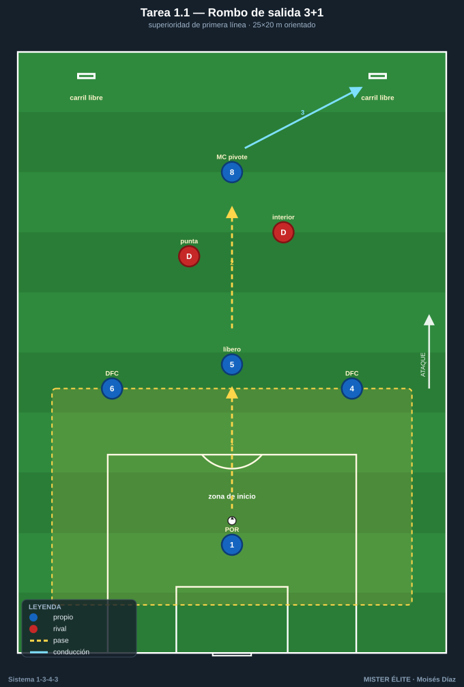
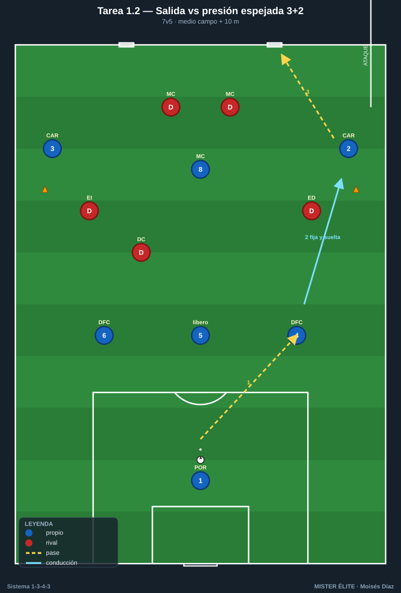
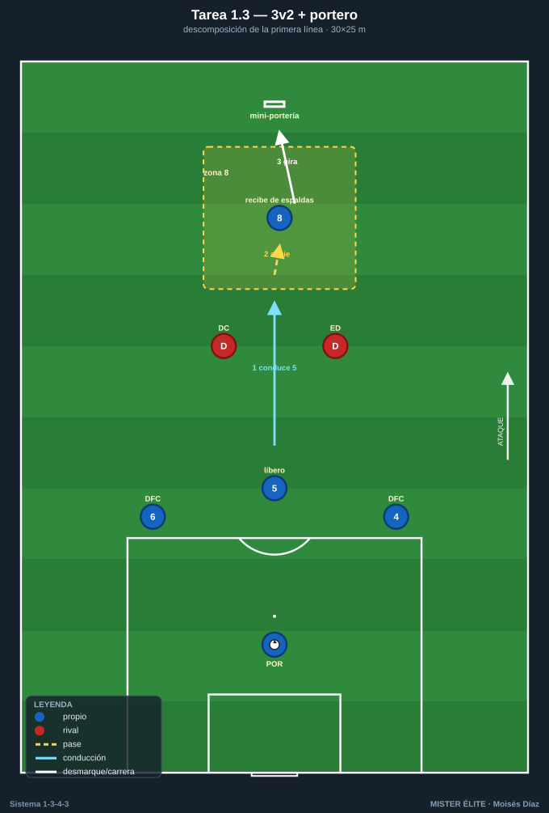
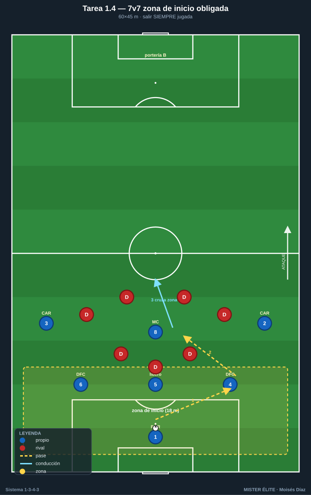
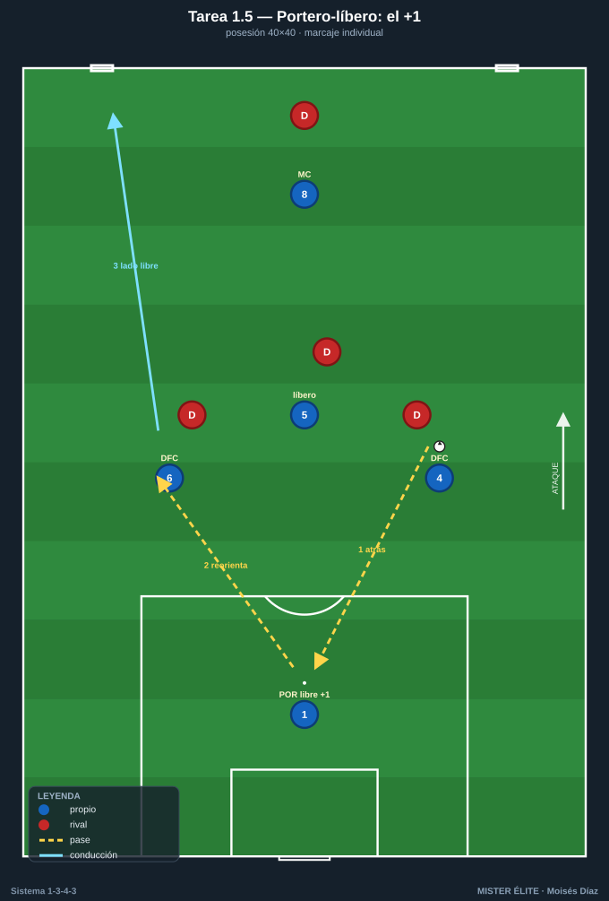

# Bloque 1 · Salida con 3 centrales + pivote

> Superioridad de primera línea. POR 1 + DFC 4-5-6 + MC 8 contra la presión rival.
> **Categorías:** F = Fundamentación · A = Aplicación · S = Específica/competitiva.
> **Leyenda:** ◯ atacante · ✕ defensor · → pase · ⇢ conducción · ⟿ desmarque · ▭ portería · ⬡ mini-portería · ⬛ zona/cono.

---

## Tarea 1.1 — Rombo de salida 3+1 contra primer presionador

- **Objetivo:** Generar y aprovechar la superioridad de la primera línea (DFC 4-5-6 + MC 8) frente al primer presionador rival; orientar al líbero 5 como organizador.
- **Organización:** 25×20 m **orientado**: zona de inicio atrás con **POR 1 detrás de la línea de 3** (no en banda), DFC 4-5-6 abiertos por delante y MC 8 como vértice superior del rombo. Defensores: 2 ✕ (simulan punta + interior/extremo que salta). 2 mini-porterías ⬡ en la línea de fondo contraria (una por carril exterior). Balones en POR 1.

- **Desarrollo:** Salida desde POR 1. Los 3 DFC se abren (4 y 6 a la altura del área, 5 entre ambos); el POR da el +1 por detrás; MC 8 se ofrece como apoyo interior por delante. Hay que progresar superando a los 2 ✕ y meter el balón controlado en una mini-portería (= línea de presión superada hacia el carril libre).
- **Provocaciones (medibles):**
  - Máx. **2 toques** para DFC; MC 8 **libre** (premia recibir entre líneas).
  - Balón a mini-portería **tras pasar por el pie del MC 8** = 2 puntos; directo de DFC a DFC = 1 punto.
  - **Prohibido** que dos pases seguidos vayan en horizontal entre los 3 DFC.
- **Variantes (fácil→difícil):** F1 defensores pasivos / F2 1 defensor → A 2 defensores activos → S añadir 1 MC 10 atacante y un 3er defensor (2v2 + apoyos), gol válido solo si supera presión en <8 s.
- **Coaching:** "Abre el 5 la línea", separación 4-6 amplia, cuerpo del DFC orientado al frente (medio giro), MC 8 perfil abierto para ver las dos bandas. Romper líneas con pase al pie del 8.
- **Duración/Categoría:** 4×4 min, 90 s descanso. **F.**

---

## Tarea 1.2 — Salida 3 centrales + pivote vs presión espejada 3+2

- **Objetivo:** Resolver la salida ante presión alta espejada (3 arriba + 2 medios); decidir entre conducción del DFC libre, pase al pivote o salto al carrilero.
- **Organización:** Medio campo + 10 m. **Atacan 7:** POR 1, DFC 4-5-6, MC 8, CAR 2, CAR 3. **Defienden 5 ✕** en estructura espejada de **tridente (3) + 2 medios** que marcan a los dos pivotes/carrileros. Portería grande ▭ con portero rival simbólico; 2 mini-porterías ⬡ en mediocampo como objetivo de progresión.

- **Desarrollo:** POR 1 inicia. Si el rival presiona con su DC al 5, se libera un DFC lateral (4 o 6) que **conduce** al espacio; los carrileros 2/3 se ofrecen altos por fuera para fijar al medio rival. Objetivo: superar la línea de presión y meter el balón controlado en mini-portería.
- **Provocaciones:**
  - Si presionan al 5, el balón **debe salir por conducción** del DFC libre al menos 5 m antes de pasar.
  - El carrilero solo puede recibir **por fuera de un cono de banda** (amplitud máxima).
  - 6 s para superar la primera línea o el balón vuelve al portero.
- **Variantes:** F sin límite de tiempo → A límite 8 s y defensa semiactiva → S defensa libre y, si recuperan, atacan a portería grande.
- **Coaching:** Conducir contra el presionador para "fijar y soltar"; el carrilero da profundidad y anchura simultánea; el 5 manda la línea con la voz.
- **Duración/Categoría:** 5×5 min. **A.**

---

## Tarea 1.3 — 3 vs 2 + portero: descomposición de la primera línea

- **Objetivo:** Automatizar las 3 salidas básicas de la línea de 3: por dentro (5), por el lado fuerte (4/6 conduce), por encima (al 8 que pivotea).
- **Organización:** 30×25 m. DFC 4-5-6 + POR 1 vs 2 ✕ (ED+DC rival). MC 8 como objetivo móvil en una zona de 6 m al frente. 1 mini-portería ⬡ tras el MC 8.

- **Desarrollo:** Tres rondas de repeticiones, una por cada salida-tipo, antes de jugar libre. Cada repetición termina con el 8 recibiendo de cara y metiendo en la mini-portería.
- **Provocaciones:**
  - Ronda A: obligatorio salir por conducción del DFC central 5.
  - Ronda B: obligatorio que el 8 reciba **de espaldas y gire** (entrena el pivote).
  - Ronda C libre, gol doble si el MC 8 recibe **entre los dos defensores** (entre líneas).
- **Variantes:** F estática con defensa marcando posición → A defensa presiona la salida → S se añade CAR como tercera opción (3v2 pasa a 4v3 con carrilero alto).
- **Coaching:** Cuerpo del 8 medio girado para recibir de cara; timing del apoyo (no antes de tiempo); separar para crear líneas de pase limpias.
- **Duración/Categoría:** 3 rondas de 4 min + 6 min libre. **F.**

---

## Tarea 1.4 — Salida bajo presión con consecuencia: 7v7 con zona de inicio obligada

- **Objetivo:** Salir SIEMPRE jugada desde la línea de 3 + pivote bajo presión real, con castigo si se pierde el balón en zona de inicio.
- **Organización:** 60×45 m, 2 porterías grandes ▭ + porteros. 7v7: equipo A = POR 1, DFC 4-5-6, MC 8, CAR 2, CAR 3. Equipo B = bloque de presión (3 arriba + 4). Zona de inicio = 18 m delante de la portería de A.

- **Desarrollo:** Todo saque (de portería, falta, fuera de banda en propio campo) reinicia desde POR 1. A debe construir desde los 3 centrales + pivote y superar la zona de inicio jugando.
- **Provocaciones:**
  - **Prohibido el pase largo** que salte la primera línea (si lo hace, balón al rival).
  - Si B recupera **dentro de la zona de inicio**, gol/punto inmediato para B.
  - A suma 1 punto extra por cada salida que cruce la zona con **3 pases o menos por dentro**.
- **Variantes:** F zona amplia y B con 3 presionadores → A reducir zona y subir a 4 → S prohibido tocar bandas en la salida (todo por dentro).
- **Coaching:** Paciencia + valentía; primer pase rompe-líneas si está; reconocer el gatillo de presión rival para soltar al carrilero o saltar al pivote.
- **Duración/Categoría:** 3×6 min. **S.**

---

## Tarea 1.5 — Portero-líbero: el +1 que manda la línea de 3

- **Objetivo:** Integrar al POR 1 como hombre libre que da superioridad permanente y reordena la línea de 3 ante presión hombre a hombre.
- **Organización:** 40×40 m con una portería ▭ y POR 1. Equipo A: POR 1 + DFC 4-5-6 + MC 8 (5). Equipo B: 4 ✕ presionando al hombre. 2 mini-porterías ⬡ en la banda opuesta.

- **Desarrollo:** B marca al hombre a los 4 de campo de A; queda el portero libre. A debe usar al POR 1 como apoyo para deshacer el marcaje (pase atrás, el portero reordena y rompe por el lado contrario).
- **Provocaciones:**
  - B en **marcaje individual** estricto (provoca el uso del portero como +1).
  - El POR 1 tiene **máximo 2 toques** y no puede devolver al mismo DFC que le pasó.
  - Gol en mini-portería tras intervención del portero = doble.
- **Variantes:** F portero con pies libres y B pasivo → A B presiona al portero con 1 punta → S si B recupera, transición a la portería grande.
- **Coaching:** Portero perfil abierto, primer toque al espacio libre, comunicación para reorientar; los DFC se separan para abrir líneas hacia el portero.
- **Duración/Categoría:** 4×4 min. **A.**
