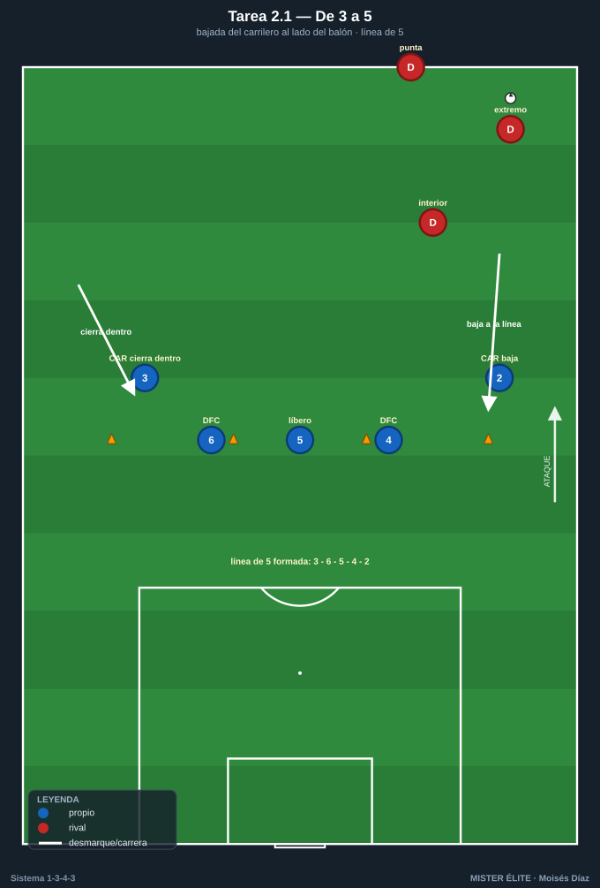
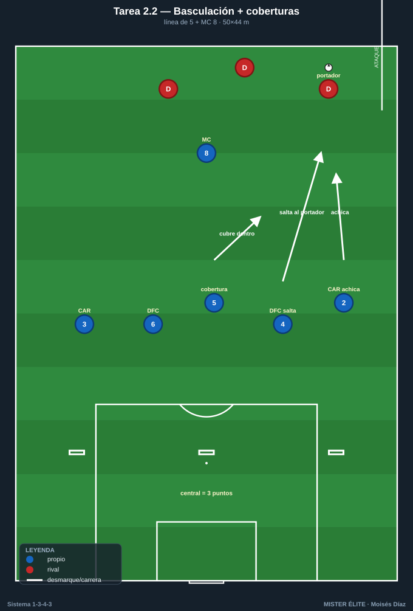
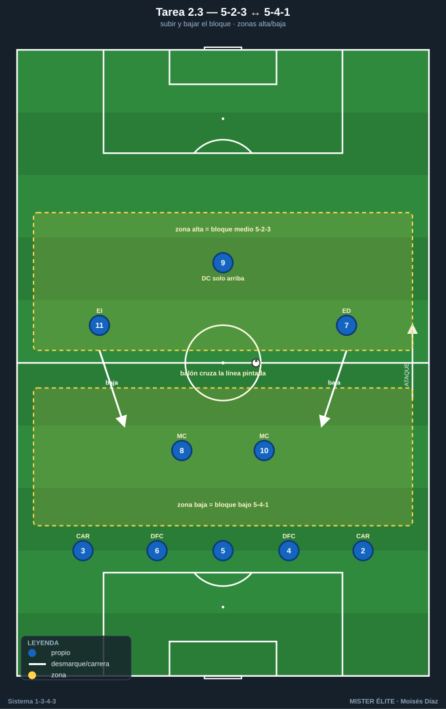
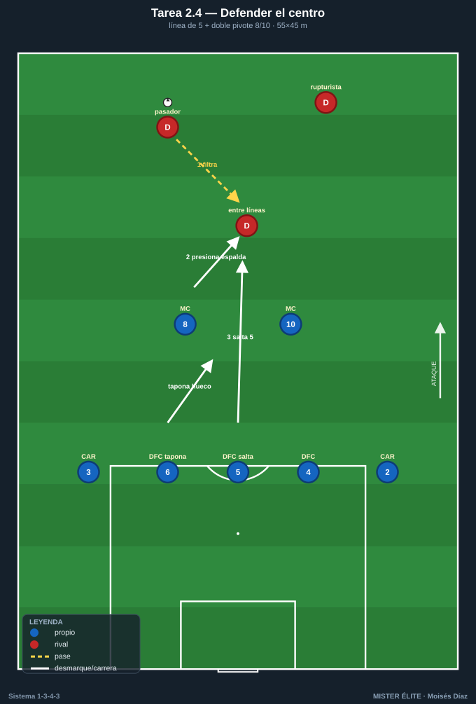

# Bloque 2 · Línea de 3 ↔ línea de 5

> Bajada de carrileros, basculación y coberturas escalonadas. El corazón defensivo del sistema.
> **Categorías:** F = Fundamentación · A = Aplicación · S = Específica/competitiva.
> **Leyenda:** ◯ atacante · ✕ defensor · → pase · ⇢ conducción · ⟿ desmarque · ▭ portería · ⬡ mini-portería · ⬛ zona/cono.

---

## Tarea 2.1 — De 3 a 5: bajada del carrilero al lado del balón

- **Objetivo:** Automatizar la transformación defensiva: cuando el rival ataca una banda, el carrilero de ese lado baja y se forma la línea de 5; el carrilero opuesto (lado débil) se cierra hacia dentro como quinto defensor / falso central interior.
- **Organización:** Ancho completo del campo, profundidad 30 m. Línea de A: DFC 4-5-6 + CAR 2 + CAR 3 (los 5). Entrenador con balón en banda dirige el lado de ataque. 3 ✕ atacantes (extremo + punta + interior) por turnos.

- **Desarrollo:** El técnico mueve el balón de banda a banda; ante cada movimiento, el carrilero del lado baja a la línea, los 3 DFC basculan y el carrilero lejano se cierra hacia dentro como quinto defensor / falso central interior.
- **Provocaciones:**
  - La línea solo puede moverse **en bloque** (si un jugador rompe la distancia >5 m, se repite).
  - Al cambiar de banda, la línea de 5 debe estar formada en **≤3 s** (conteo del técnico).
  - Cono de referencia: el carrilero del lado fuerte debe pisar su cono al bajar.
- **Variantes:** F sin oposición (solo basculación) → A con 3 atacantes pasivos → S 3 atacantes activos que buscan recibir entre carrilero y central.
- **Coaching:** Distancias cortas entre los 5; basculación con paso lateral, no cruzado; "uno baja, cuatro deslizan"; el carrilero lejano achica el ancho.
- **Duración/Categoría:** 4×4 min. **F.**

---

## Tarea 2.2 — Basculación de la línea de 5 + coberturas escalonadas

- **Objetivo:** Coordinar saltos y coberturas dentro de la línea de 5: quién salta al portador, quién cubre por dentro, quién cierra el carril central.
- **Organización:** 50×44 m. A defiende con línea de 5 (DFC 4-5-6 + CAR 2-3) + MC 8 por delante. B ataca con 5 (2 extremos + 2 interiores + punta) + 1 apoyo. 1 portería ▭ con POR 1; B tiene 3 mini-porterías ⬡ en la línea de A (centro y dos bandas).

- **Desarrollo:** B intenta marcar en una de las 3 mini-porterías. A defiende saltando al portador y generando coberturas: el DFC del lado salta, el 5 cubre por dentro, el carrilero achica.
- **Provocaciones:**
  - Gol de B en mini-portería **de banda** = 1; en mini-portería **central** = 3 (premia blindar el carril central).
  - Cada salto al portador debe tener **cobertura visible** (técnico valida; si no, B recibe falta a favor).
  - A solo recupera "limpio" si lo hace con la línea **sin partir** (sin huecos).
- **Variantes:** F B juega lento, 2 toques mínimos → A B a ritmo → S B puede cambiar de banda libre y buscar el tercer hombre.
- **Coaching:** El que salta, salta decidido; el de al lado cubre la diagonal; nunca dos saltan a la vez; proteger primero el centro.
- **Duración/Categoría:** 4×5 min. **A.**

---

## Tarea 2.3 — 5-2-3 ↔ 5-4-1: subir y bajar el bloque

- **Objetivo:** Pasar del bloque medio (5-2-3) al bloque bajo (5-4-1) según altura del balón; carrileros y extremos forman las dos líneas.
- **Organización:** Campo completo a lo ancho, 60 m de fondo. A en 1-5-2-3 defensivo completo (los 11). B ataca con su estructura. Zonas pintadas: zona alta (bloque medio) y zona baja (bloque bajo).

- **Desarrollo:** Mientras B circula en zona alta, A mantiene 5-2-3 (tridente presiona, carrileros en línea de 5). Cuando B entra en zona baja, los extremos 7/11 bajan junto a 8/10 y se forma el 5-4-1 con el 9 solo arriba.
- **Provocaciones:**
  - El paso a 5-4-1 debe ocurrir **en cuanto el balón cruza la línea pintada** (retraso = córner para B).
  - El DC 9 **no baja nunca** de la línea de presión (referencia para la transición).
  - A suma punto por cada recuperación con el 9 disponible arriba.
- **Variantes:** F transiciones marcadas por silbato → A automatizado por la altura del balón → S B con comodines en banda para forzar cambios de altura constantes.
- **Coaching:** Extremos como "carrileros adelantados" al bajar; mantener el 9 alto; bloque compacto en 25-30 m verticales; subir juntos al despejar.
- **Duración/Categoría:** 3×6 min. **A.**

---

## Tarea 2.4 — Defender el centro: línea de 5 vs ataque por dentro

- **Objetivo:** Coberturas de la línea de 5 ante recepciones entre líneas; el carrilero decide si sigue al interior o lo pasa a un mediocentro.
- **Organización:** 55×45 m, portería ▭ + POR 1. A defiende con 5 (DFC 4-5-6 + CAR 2-3) + 2 MC (8-10). B ataca con 6-7 buscando el hombre entre líneas y el desmarque de ruptura.

- **Desarrollo:** B intenta filtrar al pie del hombre entre la línea de 5 y los MC. A coordina: el MC presiona la espalda, el central/carrilero decide saltar o ceder el marcaje, sin abrir el carril.
- **Provocaciones:**
  - B gana punto si recibe **de cara entre líneas** y da pase a la espalda de la línea.
  - Si A salta con un central, **otro debe taponar el hueco** en ≤2 s.
  - Fuera de juego activado: la línea de 5 sube coordinada al despejar.
- **Variantes:** F B sin desmarques de ruptura → A B con un solo rupturista → S B con dos rupturistas y un falso 9 que arrastra.
- **Coaching:** "No te ganen de cara"; pasar marcajes con la voz; el carrilero no se va con el interior si deja el carril; subir la línea tras el despeje.
- **Duración/Categoría:** 4×5 min. **S.**
