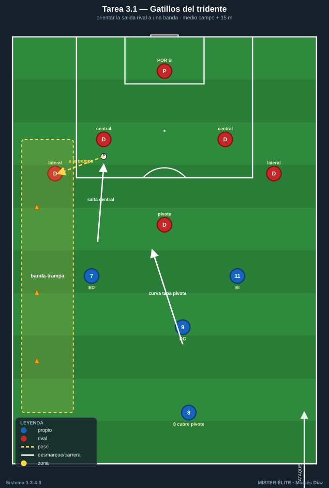
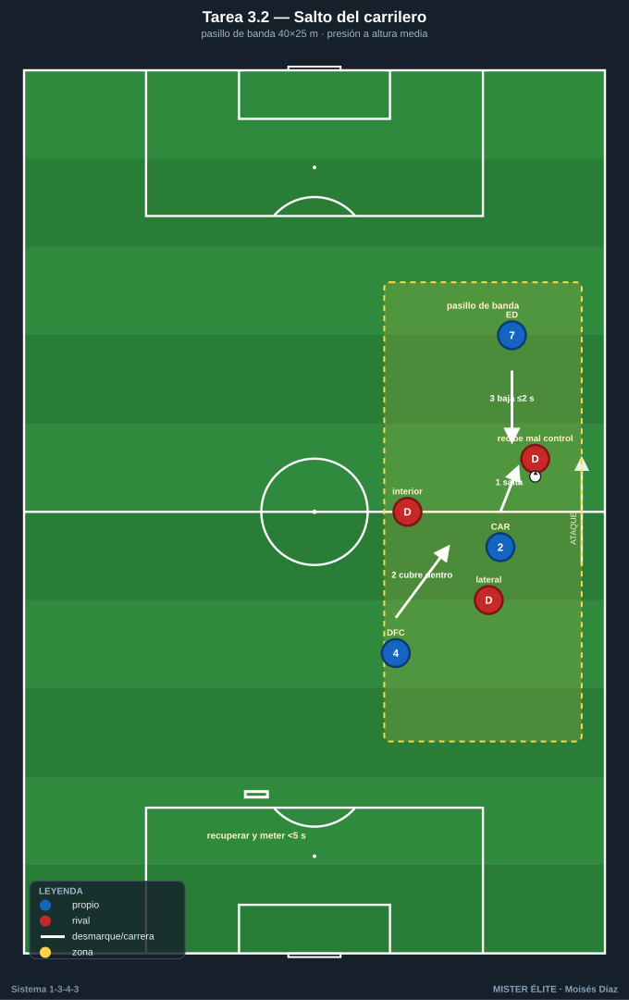
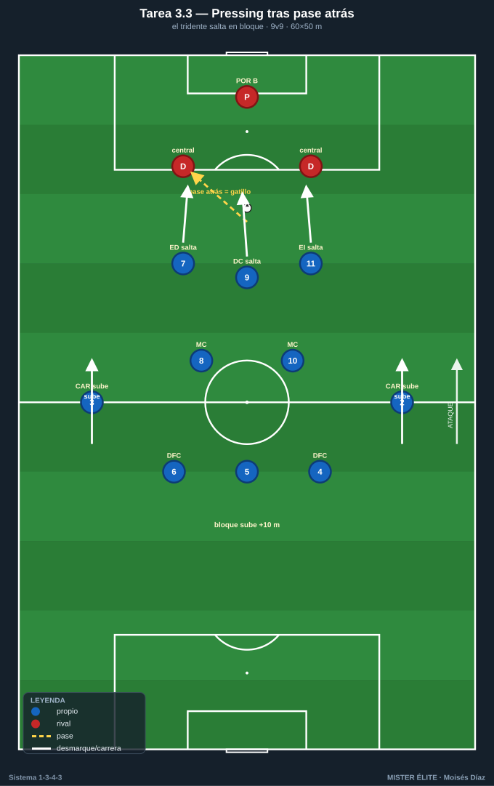
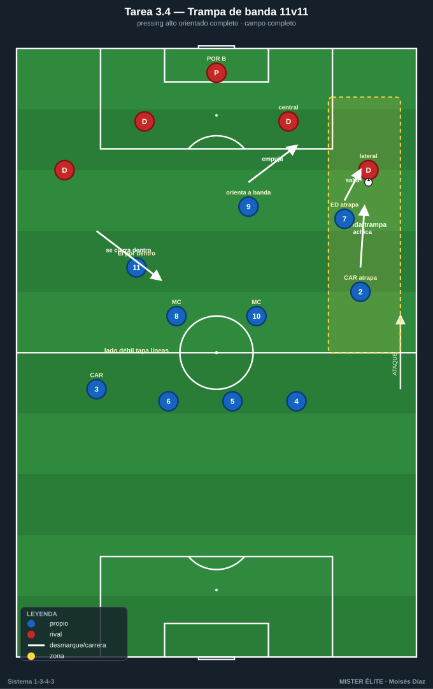

# Bloque 3 · Pressing del tridente + gatillos

> Presión orientada del tridente, salto del extremo/carrilero y banda-trampa.
> **Categorías:** F = Fundamentación · A = Aplicación · S = Específica/competitiva.
> **Leyenda:** ◯ atacante · ✕ defensor · → pase · ⇢ conducción · ⟿ desmarque · ▭ portería · ⬡ mini-portería · ⬛ zona/cono.

---

## Tarea 3.1 — Gatillos del tridente: orientar la salida rival a una banda

- **Objetivo:** Que el tridente ED 7 · DC 9 · EI 11 presione orientando: el 9 tapa al pivote, el extremo del lado salta al central y empuja el balón a una banda-trampa.
- **Organización:** Medio campo + 15 m. B saca jugando con **4 atrás + pivote** (modelo de salida rival más común, p. ej. 4-3-3 / 4-2-3-1). A presiona arriba con tridente 7-9-11 + MC 8 cubriendo el pivote rival. Bandas-trampa marcadas con conos ⬛.

- **Desarrollo:** B inicia desde su portero. A activa el gatillo: el 9 curva su carrera tapando al pivote rival; el extremo del lado salta al central; el equipo orienta el balón a la banda-trampa para recuperar.
- **Provocaciones:**
  - A solo puede presionar **cuando el balón va de central a carrilero/lateral** rival (gatillo medible).
  - Recuperar **en la banda-trampa** = 2 puntos; en otro sitio = 1.
  - El 9 **no puede presionar de frente** al central (siempre curvando para tapar línea interior).
- **Variantes:** F B juega lento, gatillo cantado → A gatillo reconocido por A solo → S B intenta salir por el lado contrario (A reorienta el pressing).
- **Coaching:** Curvar la carrera del 9 (cuerpo tapa interior); el extremo salta a tiempo, no antes; "una banda es trampa, la otra no existe"; intensidad colectiva al gatillo.
- **Duración/Categoría:** 4×4 min. **A.**

---

## Tarea 3.2 — Salto del carrilero: presión a la altura media

- **Objetivo:** Coordinar el salto del CAR 2/3 sobre el extremo/lateral rival cuando el balón llega a banda, con cobertura del central y del extremo propio que baja.
- **Organización:** Pasillo de banda 40×25 m (la franja lateral). A: CAR del lado + DFC lateral + ED/EI del lado. B: lateral + extremo + interior rivales que reciben en banda. Mini-portería ⬡ para A al recuperar; portería ▭ para B.

- **Desarrollo:** B circula hacia la banda. Cuando el balón llega al lateral rival, el CAR de A salta a presionar; el DFC cubre por dentro y el extremo propio baja para no dejar superioridad.
- **Provocaciones:**
  - El CAR salta solo si el receptor rival está **de espaldas o con mal control** (si recibe de cara, no salta y aguanta).
  - Si el CAR salta, el extremo propio debe estar **a la altura de la línea de 5** en ≤2 s.
  - Recuperar y meter en mini-portería en **<5 s** = punto.
- **Variantes:** F B con receptor siempre de espaldas → A receptor mixto (decisión real) → S B con apoyo de tercer hombre para castigar el salto en falso.
- **Coaching:** Leer el cuerpo del receptor antes de saltar; no saltar a ciegas; el extremo baja sí o sí; cobertura del central inmediata; agresividad si el control es malo.
- **Duración/Categoría:** 4×4 min. **A.**

---

## Tarea 3.3 — Pressing tras pase atrás: el tridente salta en bloque

- **Objetivo:** Aprovechar el pase atrás rival como gatillo colectivo: tridente salta, carrileros suben y la línea acompaña para presión alta sostenida.
- **Organización:** 60×50 m, 2 porterías ▭ + porteros. 9v9. A en estructura 1-3-4-3 alta; B obligado a construir desde atrás.

- **Desarrollo:** Juego corriente, pero cada **pase atrás de B hacia su portero/central** dispara el pressing de A: el tridente salta, los carrileros suben a la línea media, el bloque se desplaza arriba 10 m.
- **Provocaciones:**
  - Cada pase atrás de B = **gatillo obligatorio**; si A no salta en 2 s, B suma punto.
  - Si A recupera **arriba** (campo de B) tras el gatillo = 3 puntos.
  - B no puede jugar en largo directo desde portero.
- **Variantes:** F gatillo cantado por el técnico → A reconocido por A → S B con permiso de juego largo (A arriesga el salto sabiendo el riesgo a la espalda).
- **Coaching:** Reconocer el pase atrás como señal; saltar todos juntos o ninguno; carrileros valientes que suben; portero-líbero alto como último seguro.
- **Duración/Categoría:** 4×5 min. **S.**

---

## Tarea 3.4 — Trampa de banda 11v11: pressing alto orientado completo

- **Objetivo:** Integrar todos los gatillos del bloque en contexto real: tridente + carrileros + mediocentros presionan orientando a banda-trampa y recuperan alto.
- **Organización:** Campo completo, 11v11 (o 10v10). A en 1-3-4-3; B en sistema de 4 atrás que construye. Banda derecha pintada como trampa ⬛.

- **Desarrollo:** A presiona alto orientando siempre hacia la banda-trampa; el extremo de ese lado y el carrilero atrapan; el lado contrario se vacía (extremo contrario por dentro tapando líneas).
- **Provocaciones:**
  - Recuperar en la banda-trampa y finalizar en **<8 s** = gol doble.
  - Si B sale limpio por el **lado contrario a la trampa**, suma punto.
  - Pressing solo válido sobre **gatillos definidos** (pase a banda, pase atrás, mal control); presión sin gatillo = falta a favor de B.
- **Variantes:** F sin límite de finalización → A límite 8 s → S B con dos comodines de banda para estresar la orientación.
- **Coaching:** Colectividad del salto; el lado débil tapa por dentro; reconocer y compartir el gatillo con la voz; rematar la recuperación rápido (enlaza con Bloque 6).
- **Duración/Categoría:** 3×8 min. **S.**
