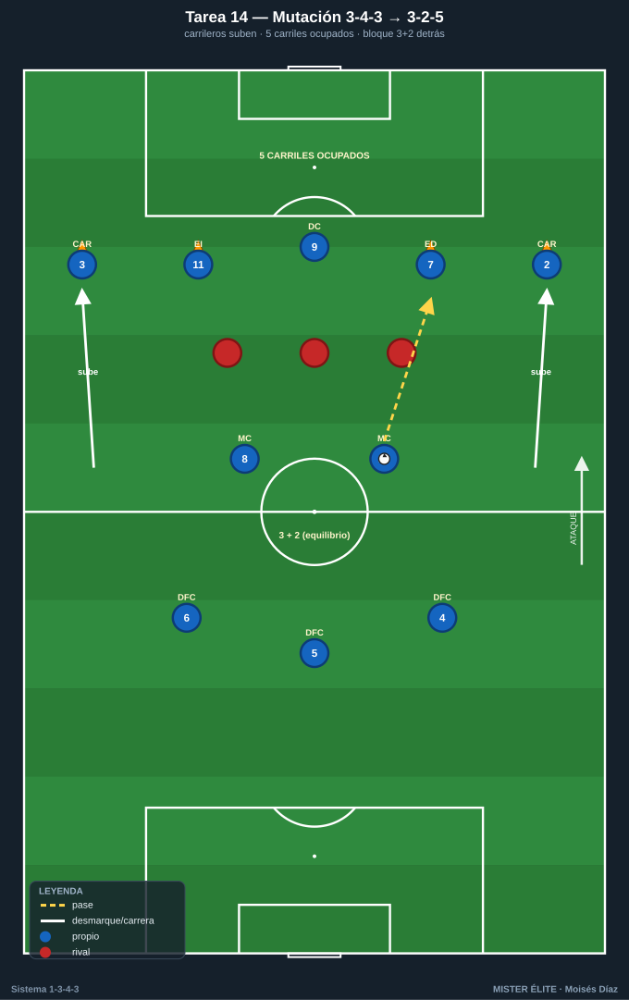
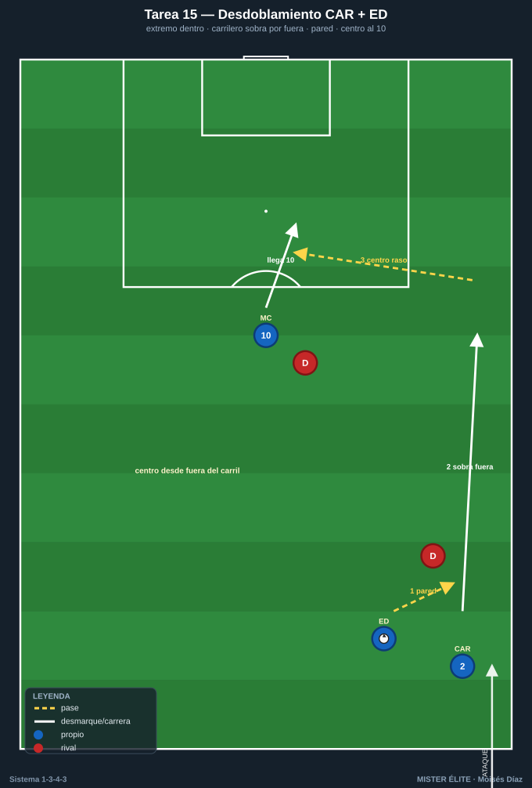
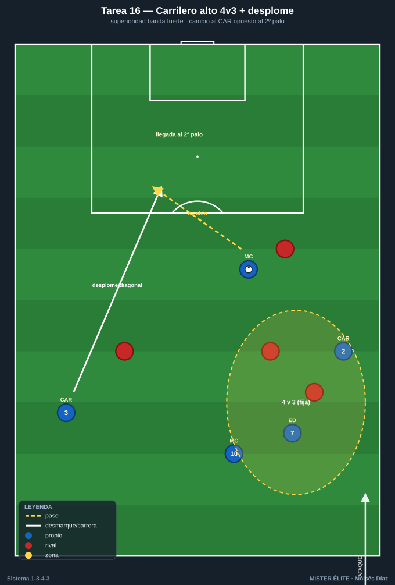
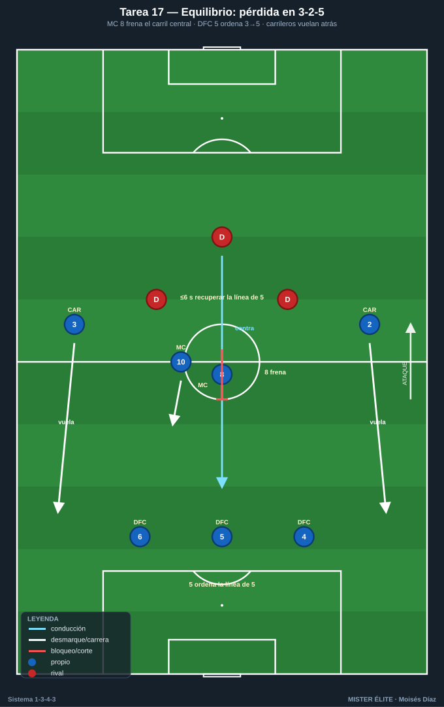
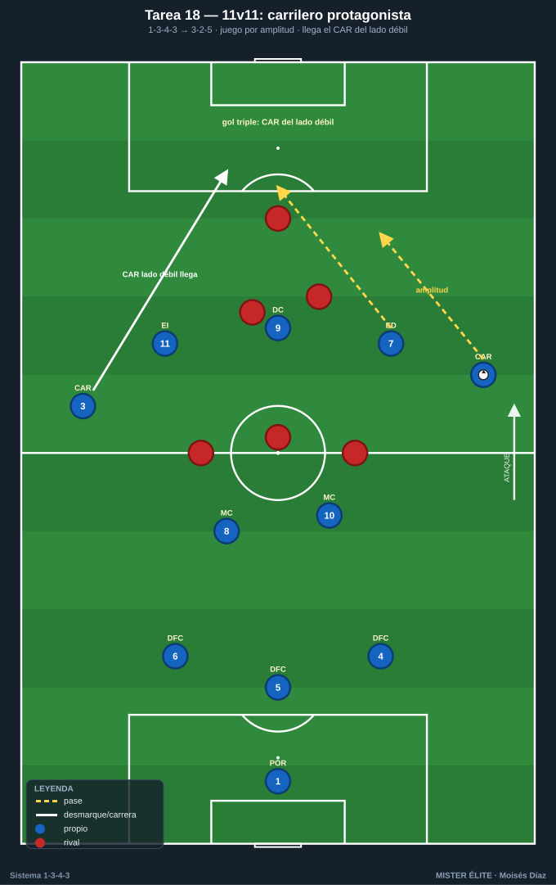

# Bloque 4 · Carrileros y amplitud (mutación 1-3-4-3 ↔ 1-3-2-5)

> El bloque potente. Mutación con balón, desdoblamiento y gestión del riesgo a la espalda.
> **Categorías:** F = Fundamentación · A = Aplicación · S = Específica/competitiva.
> **Leyenda:** ◯ atacante · ✕ defensor · → pase · ⇢ conducción · ⟿ desmarque · ▭ portería · ⬡ mini-portería · ⬛ zona/cono.

---

## Tarea 4.1 — Mutación con balón: de 3-4-3 a 3-2-5

- **Objetivo:** Automatizar la transformación ofensiva: con balón, los carrileros 2/3 suben a la última línea y, con los extremos y el 9, forman una línea de 5; quedan 3 DFC + 2 MC detrás (3-2).
- **Organización:** Campo completo a lo ancho, 60 m fondo. A los 10 de campo en 1-3-4-3. Marcas de suelo: 5 conos ⬛ en la línea de 5 atacante (banda-pasillo-centro-pasillo-banda). B con 4-5 defensores que ocupan zona.

- **Desarrollo:** A circula desde la línea de 3 + 2 MC; al progresar, los carrileros suben a pisar sus conos de la línea de 5 mientras los extremos deciden (abrir o pisar por dentro). Hay que ocupar los **5 carriles** simultáneamente.
- **Provocaciones:**
  - Gol/punto solo válido si, en el momento del último pase, **los 5 carriles están ocupados** (1 jugador por carril).
  - Los carrileros **no pueden recibir por dentro de su carril de banda** (amplitud máxima al subir).
  - El balón debe pasar por la línea de 2 MC antes de llegar a la de 5 (estructura 3-2 detrás).
- **Variantes:** F sin oposición (solo ocupar carriles) → A 4 defensores zona → S 5 defensores activos que intentan robar la altura de los carrileros.
- **Coaching:** "Subir es ataque, ocupar es ataque"; carrileros en la cal; relación carrilero-extremo (uno fuera, uno dentro); los 2 MC dan el equilibrio del 3-2; reconocer el momento de subir (balón controlado en zona media).
- **Duración/Categoría:** 4×5 min. **A.**

---

## Tarea 4.2 — Desdoblamiento carrilero-extremo (par de banda)

- **Objetivo:** Entrenar la sociedad de banda CAR + ED/EI: alternancia interior-exterior, pared, sobra por fuera y centro desde el carril.
- **Organización:** Banda completa, 35×30 m + zona de finalización con portería ▭ y POR 1. Pareja de A: CAR 2 + ED 7 (y en otra banda CAR 3 + EI 11). 2 ✕ defienden (lateral + central rival). 1 MC 10 entra al área.

- **Desarrollo:** El par ataca la banda combinando: el extremo se mete por dentro y el carrilero sobra por fuera (o viceversa); el que queda libre por el carril mete el centro raso/tenso para la llegada del 10.
- **Provocaciones:**
  - El centro solo cuenta si lo da el jugador que ataca **por fuera del carril de banda** (premia la amplitud).
  - Obligatorio **mínimo 1 pared** carrilero-extremo antes del centro.
  - Gol del 10 desde el centro raso/tenso = doble; centro alto al área = simple.
- **Variantes:** F sin defensa, solo coordinación → A 2 defensores pasivos → S 2 defensores activos + portero, y el 10 con un central que le marca.
- **Coaching:** "Si uno entra, el otro sale"; timing de la sobra; cabeza arriba antes del centro; centro raso al primer palo / tenso a la frontal; tercera ola del 10.
- **Duración/Categoría:** 4×5 min por banda. **A.**

---

## Tarea 4.3 — Carrilero alto = superioridad en banda (4v3 con desplome)

- **Objetivo:** Usar la altura del carrilero para generar superioridad en banda y, tras fijar, cambiar el juego al carrilero opuesto que entra al área (desplome diagonal).
- **Organización:** Dos pasillos de banda + zona central. 50×44 m, portería ▭ + POR 1. A: CAR 2, ED 7, MC 10 (banda fuerte) + CAR 3 que entra desde el lado débil. B: 3 ✕ del lado fuerte + 1 que vigila el lado débil.

- **Desarrollo:** A genera 4v3 en banda fuerte (carrilero alto + extremo + interior + apoyo); cuando fija a B, cambia el juego al **carrilero opuesto** que llega en diagonal al segundo palo.
- **Provocaciones:**
  - Punto válido si el remate llega del **carrilero del lado débil** desplomándose al área.
  - El cambio de juego debe ser **antes de 3 pases** tras fijar.
  - El carrilero del lado fuerte debe estar siempre **el más alto** de su pasillo.
- **Variantes:** F sin oposición en lado débil → A 1 defensor lado débil → S defensa completa que bascula al cambio (carrera real del carrilero contra basculación).
- **Coaching:** Fijar de verdad antes de cambiar; cambio tenso y a la carrera del carrilero opuesto; el carrilero ataca el espacio, no el balón; segunda oleada al segundo palo.
- **Duración/Categoría:** 4×5 min. **A.**

---

## Tarea 4.4 — Equilibrio en la mutación: ¿qué pasa si perdemos en 3-2-5?

- **Objetivo:** Que con los carrileros arriba (3-2-5), el equipo gestione el riesgo: MC 8 cubre, DFC 5 manda el repliegue y el carrilero del lado del balón perdido recula.
- **Organización:** Campo completo a lo ancho, 65 m. A ataca en 3-2-5 (carrileros arriba). B defiende y, al robar, contraataca con 3-4 jugadores hacia la portería de A ▭.

- **Desarrollo:** A ataca con carrileros altos. Al perder, se mide la reacción: los 2 MC tapan el carril central, el DFC 5 ordena la línea de 3 a 5 (los carrileros vuelan hacia atrás), y se frena el contra.
- **Provocaciones:**
  - Si B llega a portería **por el carril del carrilero subido**, gol doble.
  - A debe recuperar la **línea de 5** en ≤6 s tras la pérdida o B suma punto.
  - El MC 8 **no puede subir más allá del centro** (ancla del equilibrio).
- **Variantes:** F B contraataca lento → A B a ritmo con 3 → S B contraataca con 4 buscando los pasillos de los carrileros.
- **Coaching:** "Subes con balón, calculas la pérdida"; el 8 ancla; el 5 manda volver; carrilero esprinta al repliegue; primera ayuda del MC, segunda del carrilero.
- **Duración/Categoría:** 4×5 min. **S.**

---

## Tarea 4.5 — 11v11 condicionado: el carrilero como protagonista

- **Objetivo:** Integrar amplitud, mutación y desdoblamiento en juego real, premiando que el ataque pase por los carrileros.
- **Organización:** Campo completo, 11v11. A en 1-3-4-3 con mutación a 3-2-5; B en bloque medio.

- **Desarrollo:** Juego real. Se incentiva con reglas que el ataque de A involucre a los carrileros en amplitud y llegada.
- **Provocaciones:**
  - Gol doble si en la jugada **intervino un carrilero por fuera** (toque previo o asistencia).
  - Gol triple si lo marca o asiste el carrilero del **lado débil** llegando al área.
  - Si A ataca sin que ningún carrilero pase de la línea de medios, el gol **no cuenta**.
- **Variantes:** F B pasivo en bandas → A B normal → S B con dos extremos rápidos para castigar la subida de los carrileros.
- **Coaching:** Carrileros protagonistas; relación con extremos; cambios de orientación para activar la banda débil; equilibrio del 3-2 al subir.
- **Duración/Categoría:** 3×8 min. **S.**
