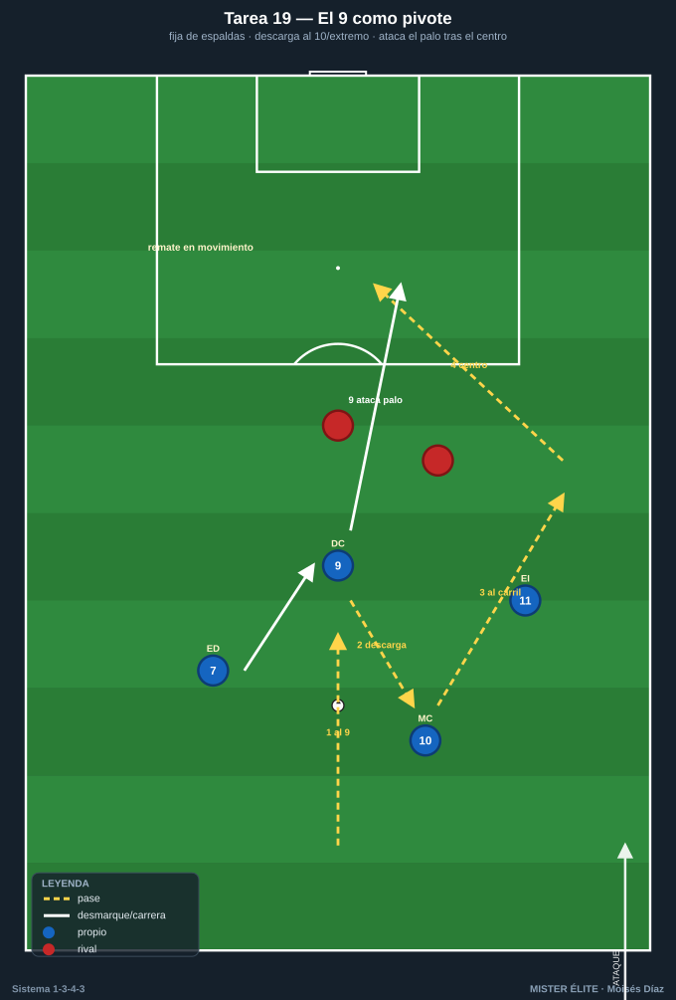
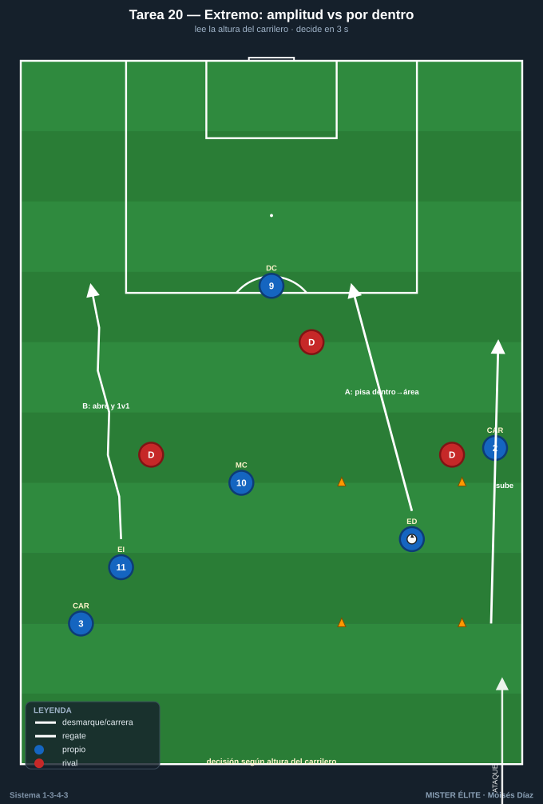
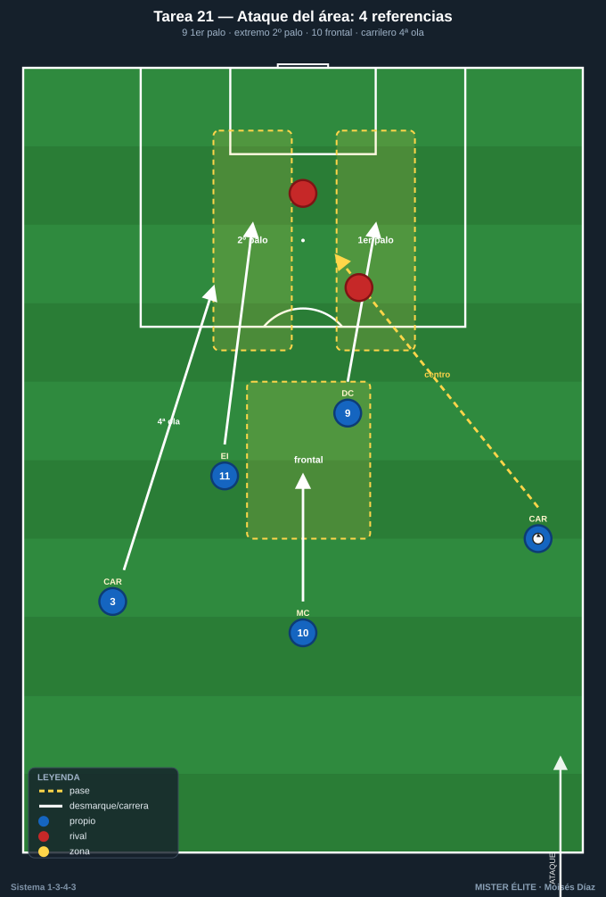
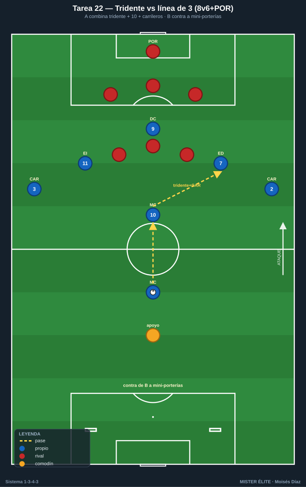

# Bloque 5 · Tridente (9 + extremos + llegada del 10/carrilero)

> Juego del 9, decisión de los extremos y poblar el área con criterio.
> **Categorías:** F = Fundamentación · A = Aplicación · S = Específica/competitiva.
> **Leyenda:** ◯ atacante · ✕ defensor · → pase · ⇢ conducción · ⟿ desmarque · ▭ portería · ⬡ mini-portería · ⬛ zona/cono.

---

## Tarea 5.1 — El 9 como pivote: fijar, descargar y atacar el área

- **Objetivo:** Entrenar las dos funciones del DC 9: pivote de espaldas que descarga para extremos/10, y rematador que ataca el área tras el centro.
- **Organización:** 40×30 m frente a portería ▭ + POR 1. DC 9 + ED 7 + EI 11 + MC 10. 2-3 ✕ defienden (central + ayudas). Servidores en banda con balones.

- **Desarrollo:** Dos fases por repetición: (1) el 9 recibe de espaldas, fija al central y descarga al 10 o al extremo que pisa por dentro; (2) la jugada termina con centro y el 9 ataca el área (primer/segundo palo).
- **Provocaciones:**
  - El 9 **máximo 1 toque** al recibir de espaldas (descarga limpia).
  - El remate del 9 solo cuenta si ataca el palo **en movimiento** (sin pararse).
  - Si el 9 descarga al 10 entre líneas = punto de "asociación".
- **Variantes:** F sin defensa → A 1 central marcando al 9 → S central + ayuda y portero activo.
- **Coaching:** Cuerpo del 9 fuerte para aguantar; descarga al primer toque; ataque del área con desmarque de ruptura cruzado; "fija para que llegue otro, llega cuando fija otro".
- **Duración/Categoría:** 4×5 min. **A.**

---

## Tarea 5.2 — Extremos: amplitud que estira vs pisar por dentro

- **Objetivo:** Que los extremos 7/11 dominen las dos opciones del sistema: abrir para estirar y atacar la espalda (1v1), o pisar por dentro para que suba el carrilero por fuera.
- **Organización:** Banda + área. 35×35 m, portería ▭ + POR 1. ED 7 (o EI 11) + CAR del lado + MC 10 + DC 9. Defensores: lateral + central rival. Conos ⬛ marcan zona exterior y zona interior.

- **Desarrollo:** Según señal/posición del carrilero, el extremo decide: si el carrilero sube por fuera, el extremo pisa por dentro y ataca el área; si el carrilero no sube, el extremo abre, encara 1v1 y centra/desborda.
- **Provocaciones:**
  - Si el carrilero está alto, el extremo **debe** atacar por dentro (si abre, jugada anulada).
  - 1v1 ganado por fuera + centro = punto; ruptura por dentro + remate = punto doble.
  - El extremo tiene **3 s** para decidir tras recibir.
- **Variantes:** F sin lateral rival → A 1v1 real → S 1v1 + cobertura del central (decisión bajo presión).
- **Coaching:** Leer la altura del carrilero antes de recibir; encarar al lateral con balón cubierto; pisar por dentro = ataque a la espalda; no estorbar el carril del carrilero.
- **Duración/Categoría:** 4×5 min por banda. **A.**

---

## Tarea 5.3 — Ataque del área: 9 + 2 extremos + llegada del 10 y carrilero

- **Objetivo:** Poblar el área con criterio tras el centro: 9 al primer palo, extremo lejano al segundo, 10 a la frontal/rechace, carrilero como cuarta ola.
- **Organización:** Última línea + área. Centradores: CAR 2 y CAR 3 (alternan por banda). Rematadores: DC 9, ED 7, EI 11, MC 10. Defensa: 2-3 ✕ + POR 1. Zonas de remate marcadas (1er palo, 2º palo, frontal).

- **Desarrollo:** El carrilero centra desde el carril; los atacantes pueblan el área con las 4 referencias y reparten zonas: 9 primer palo, extremo lejano segundo palo, 10 frontal/rechace, el otro carrilero/extremo cierra.
- **Provocaciones:**
  - Gol válido solo si las **3 zonas (1er palo / 2º palo / frontal)** están atacadas por jugadores distintos.
  - Centro raso/tenso = gol simple; **remate de primera** = doble.
  - El que centra no remata; el remate debe venir de **llegada** (sin estar parado).
- **Variantes:** F sin defensa, centros a ritmo → A 2 defensores + portero → S defensa completa que despeja y A ataca el rechace.
- **Coaching:** Atacar el balón, no esperarlo; cruces de desmarque (9 arrastra, extremo entra); la frontal del 10 para el rechace; cuarta ola del carrilero; timing del centro.
- **Duración/Categoría:** 4×5 min. **A.**

---

## Tarea 5.4 — Tridente vs línea de 3 rival: ataque posicional a portería

- **Objetivo:** Integrar el ataque del tridente con el 10 y los carrileros contra una defensa estructurada, en superioridad/igualdad cercana al partido.
- **Organización:** 3/4 de campo, portería ▭ + POR 1. A (8): DC 9, ED 7, EI 11, MC 10, MC 8, CAR 2, CAR 3 + 1 apoyo. B (6): línea de 3 DFC + 3 MC + portero. 2 mini-porterías ⬡ para B (contra-objetivo).

- **Desarrollo:** A ataca posicionalmente buscando combinar tridente + 10 + carrileros para finalizar; B defiende como línea de 3/5 y, al robar, busca las mini-porterías.
- **Provocaciones:**
  - A debe finalizar en **<12 s** desde que entra en campo de B.
  - Gol que involucre **al menos 2 del tridente + 1 carrilero** = doble.
  - Si B roba y marca en mini-portería = 2 puntos.
- **Variantes:** F B pasivo → A B activo → S igualdad numérica (quitar el apoyo de A).
- **Coaching:** Paciencia para encontrar al hombre libre; el 9 fija la línea de 3; extremos en los carriles; 10 entre líneas; carrileros dan la última anchura; finalizar con criterio de zonas.
- **Duración/Categoría:** 3×7 min. **S.**
