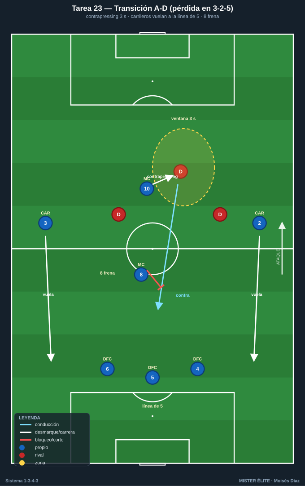
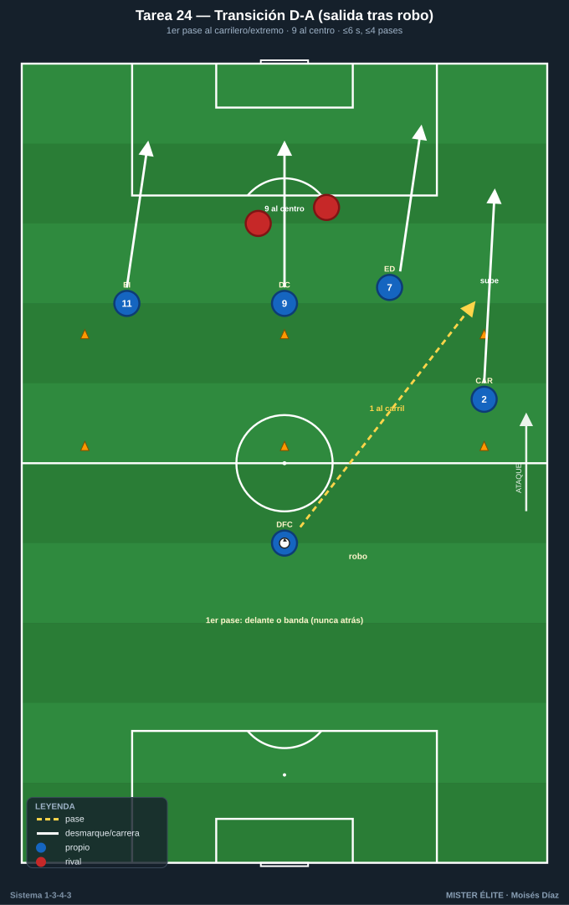
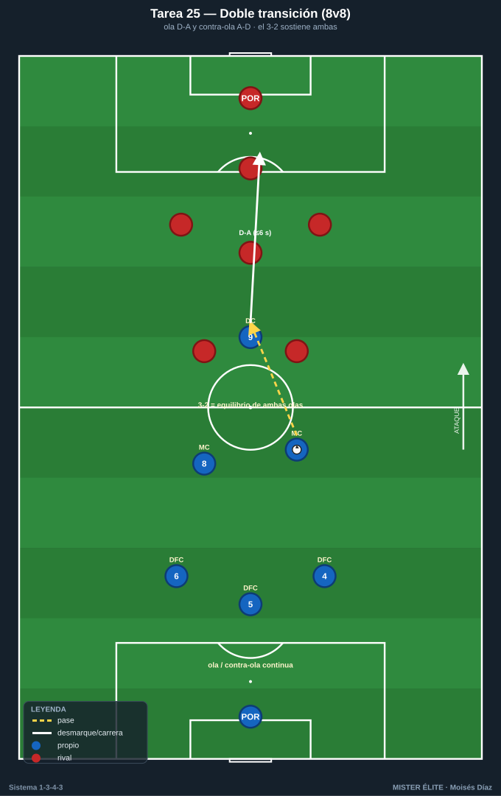
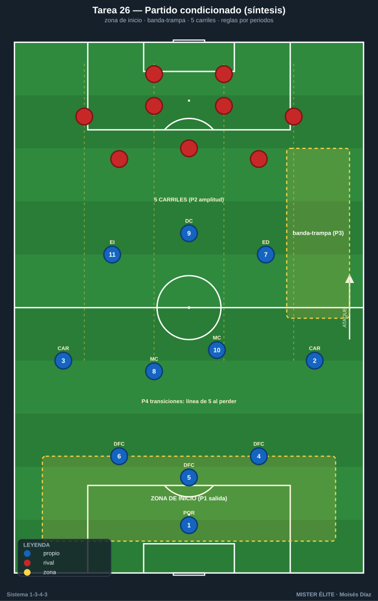

# Bloque 6 · Transiciones + partido condicionado aplicado

> Ola y contra-ola, y la síntesis del curso en 11v11.
> **Categorías:** F = Fundamentación · A = Aplicación · S = Específica/competitiva.
> **Leyenda:** ◯ atacante · ✕ defensor · → pase · ⇢ conducción · ⟿ desmarque · ▭ portería · ⬡ mini-portería · ⬛ zona/cono.

---

## Tarea 6.1 — Transición A-D: reacción a la pérdida con carrileros arriba

- **Objetivo:** Reacción inmediata a la pérdida desde la animación 3-2-5: contrapressing del jugador más cercano + repliegue de carrileros a la línea de 5.
- **Organización:** 55×50 m, portería ▭ + POR 1 (de A) y 2 mini-porterías ⬡ (de A, en campo de B). A ataca en 3-2-5; B defiende y contraataca al robar.

- **Desarrollo:** A ataca buscando las mini-porterías. En cuanto pierde, se mide: el más cercano hace contrapressing 2-3 s; si no recupera, el equipo recula y forma línea de 5 (carrileros vuelan).
- **Provocaciones:**
  - Ventana de contrapressing de **3 s**: si A recupera dentro = punto; si pasa, debe estar replegado en línea de 5.
  - Si B llega a la portería de A por el pasillo de un carrilero subido = gol doble.
  - El MC 8 inicia el freno (primer obstáculo al contra).
- **Variantes:** F B contraataca lento → A B a ritmo → S B con punta rápido a la espalda.
- **Coaching:** Reacción de medio segundo; "presiona o recula, no dudes"; carrilero esprinta atrás; el 8 frena, el 5 ordena la línea de 5.
- **Duración/Categoría:** 4×5 min. **A.**

---

## Tarea 6.2 — Transición D-A: salir del robo por el carril del carrilero

- **Objetivo:** Convertir el robo en ataque rápido aprovechando los carriles de los carrileros y la profundidad de los extremos/9.
- **Organización:** Campo completo a lo ancho, 65 m. A defiende en línea de 5 / bloque medio. Al recuperar, ataca la portería ▭ de B con POR. Conos marcan los carriles de salida rápida.

- **Desarrollo:** B ataca; A defiende y, al robar, busca salida rápida: primer pase al carrilero que sube por su carril o al extremo en profundidad; el 9 ataca el centro; finalización en pocos pases.
- **Provocaciones:**
  - Finalizar en **≤6 s y ≤4 pases** desde el robo.
  - El **primer pase** tras robar debe ir hacia delante o a banda (prohibido el pase atrás).
  - Gol con intervención de un **carrilero o extremo en carrera** = doble.
- **Variantes:** F B no repliega → A B repliega a medias → S B con repliegue completo (A elige contra rápido o pausa).
- **Coaching:** Cabeza levantada al robar; primer pase vertical o a banda; carrileros y extremos rompen al frente; decidir contra o pausa según la defensa rival.
- **Duración/Categoría:** 4×5 min. **A.**

---

## Tarea 6.3 — Doble transición: ola y contra-ola

- **Objetivo:** Encadenar D-A (contraataque) y, si no llega, transición A-D, manteniendo el equilibrio del sistema en ambos sentidos.
- **Organización:** 60×50 m, 2 porterías ▭ + porteros. 8v8 en estructura de 1-3-4-3 reducido. Saques siempre por el portero para forzar construcción y, por tanto, robos y transiciones.

- **Desarrollo:** Juego fluido. Cada robo dispara una transición D-A; si se corta, el equipo que perdió hace transición A-D. Se vive la cadena ola/contra-ola continuamente.
- **Provocaciones:**
  - Tras un robo, **6 s** para finalizar (D-A); si no, balón muerto y se reinicia.
  - El equipo que sufre pérdida debe formar **línea de 5** en ≤6 s o el rival suma punto extra al marcar.
  - Gol en transición (≤6 s tras robo) = doble; gol en ataque posicional = simple.
- **Variantes:** F campo grande → A medidas estándar → S campo reducido (transiciones más rápidas y caóticas).
- **Coaching:** Mentalidad de los dos momentos; roles claros (quién presiona, quién recula, quién rompe); el equilibrio del 3-2 sostiene ambas transiciones.
- **Duración/Categoría:** 4×6 min. **S.**

---

## Tarea 6.4 — Partido condicionado aplicado 1-3-4-3 (síntesis del curso)

- **Objetivo:** Integrar todos los comportamientos del sistema (salida 3+1, línea 3↔5, pressing con gatillos, mutación de carrileros, tridente, transiciones) en un 11v11 con reglas que premien cada uno.
- **Organización:** Campo completo, 11v11. A en 1-3-4-3 completo; B en sistema a elegir (4-4-2 / 4-3-3). Zonas pintadas: zona de inicio, banda-trampa, línea de 5 carriles.

- **Desarrollo:** Partido real con bloques de reglas que rotan cada periodo, cada uno premiando un comportamiento del sistema.
- **Provocaciones (rotan por periodos):**
  - **P1 Salida:** A debe salir jugada desde los 3 DFC + 8; robo de B en zona de inicio = punto para B.
  - **P2 Mutación/amplitud:** gol con carrilero por fuera = doble; sin carrilero pasado de medios, gol no cuenta.
  - **P3 Pressing:** recuperar en banda-trampa y finalizar en <8 s = doble.
  - **P4 Transiciones:** gol en ≤6 s tras robo = doble; obligación de formar línea de 5 al perder.
- **Variantes:** F periodos largos y B pasivo → A periodos estándar → S B de nivel alto sin condiciones (A aplica los comportamientos por iniciativa propia).
- **Coaching:** Recordar el comportamiento de cada periodo; corregir en frío entre periodos; conectar las fases (recupero alto → ataque del tridente → si pierdo, línea de 5); liderazgo del 5 y de los MC.
- **Duración/Categoría:** 4 periodos de 8-10 min. **S.**
