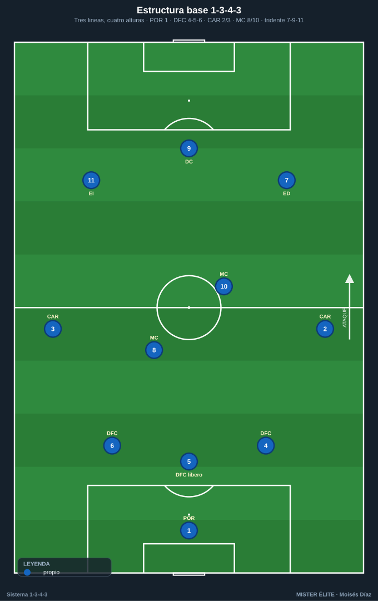
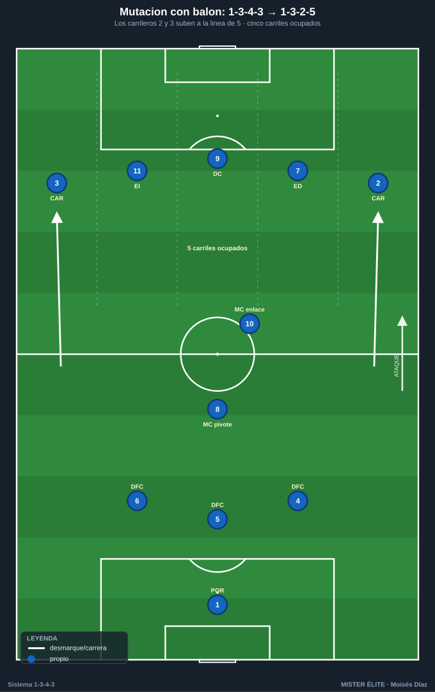
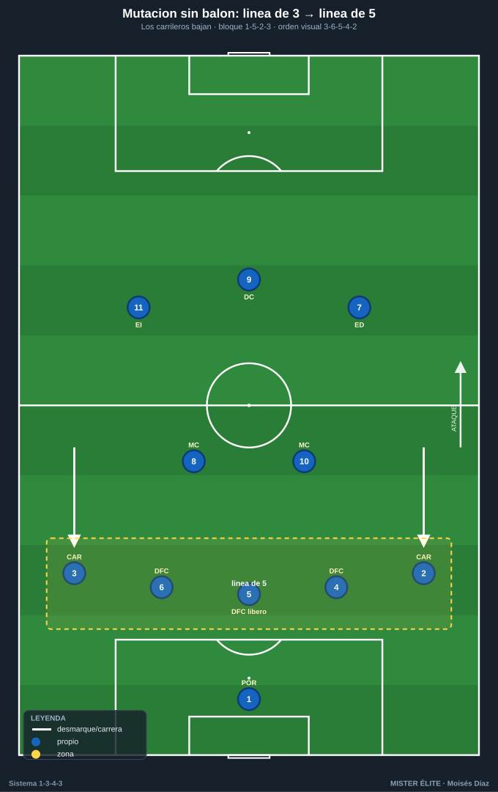
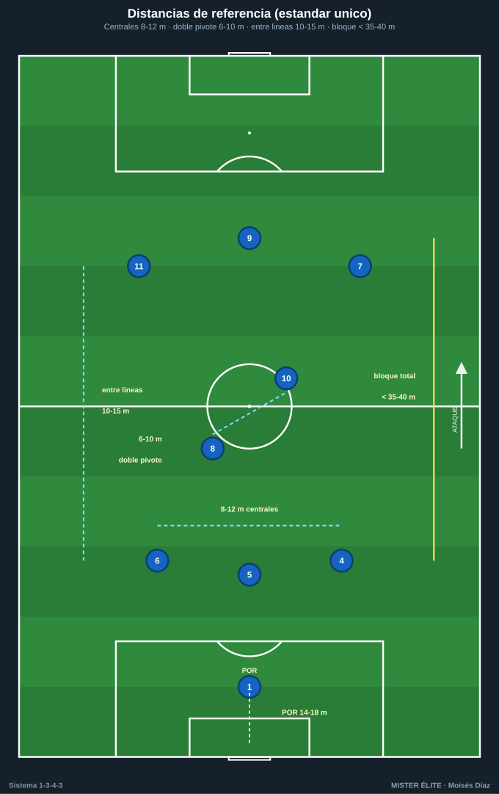
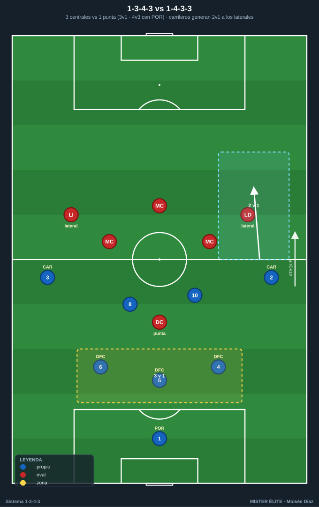

# Módulo 01 · Fundamentos y estructura del 1-3-4-3

> **Convención:** POR 1 · DFC 4-5-6 (5 = central/líbero organizador) · CAR 2/3 · MC 8/10 · tridente ED 7 · DC 9 · EI 11. SÍ hay extremos. **Mutación clave con balón: 1-3-4-3 → 1-3-2-5.**

El 1-3-4-3 no se entiende por su foto estática, sino por **cómo muta**. Es un sistema dinámico: cambia de forma en cada fase del juego. Este módulo te da lo justo de teoría para que el resto del curso (defensa, ataque, transiciones y las 26 tareas) tenga sentido.

---

## 1. La estructura: tres líneas, cuatro alturas

Sobre el papel: **portero + 3 centrales + 4 medios (2 carrileros + 2 mediocentros) + 3 delanteros.** En juego son cuatro alturas reales.

### Línea de 3 centrales (DFC 4-5-6)
- **DFC 5** es el central del medio: **líbero / organizador**. Inicia la circulación, ordena la línea, da coberturas y, si el rival no presiona, **conduce** hacia el medio para generar superioridad.
- **DFC 4 y 6** son los laterales de la línea de 3. Marca + cobertura por su carril, **salen a presionar** al interior/extremo rival que cae a su zona y luego recuperan posición.
- Idea fuerza: defender el centro en bloque y **estar siempre en superioridad o igualdad en la primera fase** (3 centrales vs. 1-2 atacantes rivales → salida limpia).

### Doble medio (MC 8/10) + carrileros (CAR 2/3)
- **MC 8 (pivote):** ancla posicional por delante de los 3 centrales. Equilibrio, primer pase, protección del eje. Cuando los carrileros suben, **él no sube**: se queda para el resto defensivo.
- **MC 10 (ofensivo / box-to-box):** recibe entre líneas, asocia con el tridente y llega al área. Complementario del 8 (uno sostiene, otro progresa).
- **CAR 2/3 (carrileros):** el motor del sistema. **Con balón suben** a dar amplitud; **sin balón bajan** y convierten la línea de 3 en línea de 5.

### Tridente (ED 7 · DC 9 · EI 11)
- **DC 9:** referencia, pivote ofensivo, fija a los centrales y ataca el área.
- **ED 7 / EI 11:** extremos. Dan amplitud arriba **o** pisan por dentro liberando el carril para el carrilero. Primera línea de presión sin balón.

---

## 2. La idea fuerza: la MUTACIÓN

El 1-3-4-3 se reconfigura en cada fase. Memoriza esta tabla: es la columna vertebral de todo el curso.

| Fase | Movimiento | Forma resultante |
|---|---|---|
| **Con balón (ataque)** | Carrileros suben a la línea del tridente; el doble pivote sostiene; los 3 centrales se quedan | **1-3-2-5** — cinco atacantes (CAR 2 · ED 7 · DC 9 · EI 11 · CAR 3) dando amplitud máxima |
| **Sin balón (bloque medio/bajo)** | Carrileros bajan a la línea de centrales | **1-5-2-3** (presión escalonada) o **1-5-4-1** (repliegue: extremos bajan al medio) |
| **Salida en presión alta rival** | Centrales abren y carrileros bajan a su altura | Primera línea de **5** (DFC 4-5-6 + CAR 2-3) + POR como +1 |

Esa **respiración carril-amplitud / carril-línea de 5** es lo que hace al sistema. La misma plantilla **defiende con 5 y ataca con 5** sin cambiar jugadores.

### Ocupación de los cinco carriles (con balón, en 1-3-2-5)

| Carril | Jugador |
|---|---|
| Banda izq. | CAR 3 |
| Interior izq. | EI 11 |
| Centro | DC 9 |
| Interior der. | ED 7 |
| Banda der. | CAR 2 |

Detrás queda el bloque de construcción **3+1 (DFC 4-5-6 + MC 8)**, con el **10** como enlace flotante. Regla: un jugador por carril → siempre hay un hombre libre lejos del balón para el cambio de orientación.

---

## 3. Distancias y alturas de referencia

**Estándar único del curso** (rige en todos los documentos y pizarras):

- Separación entre centrales (DFC 4-5-6): **8-12 m**.
- Doble pivote (8/10): **6-10 m** entre ambos; el 8 más bajo, el 10 más alto.
- Distancia entre líneas: **10-15 m**.
- Bloque total compacto: **< 35-40 m**.
- Línea defensiva: bloque alto **40-45 m** · medio **30-35 m** · bajo **18-22 m** del propio marco.
- POR-líbero adelantado **14-18 m** con bloque medio/alto.
- Profundidad del bloque ofensivo: **~30-35 m** entre el central de inicio y la punta (no se estira más, para mantener distancias de pase y resto defensivo).

---

## 4. Historia y vigencia (lo esencial)

- **Cruyff y el Fútbol Total (Ajax/Países Bajos, años 70).** Posiciones fluidas, el portero como "primer atacante", el delantero como "primer defensor". Ya como técnico del **Dream Team del Barça**, Cruyff construyó un **3-4-3 en rombo** con Koeman de líbero pisando el medio y Guardiola bajando a la defensa al perder: el embrión del líbero/DFC 5 moderno.
- **Bielsa.** Control del espacio, intercambios de posición y presión hombre a hombre. Inspira el componente de **presión a la espalda**.
- **Conte (Chelsea 2016-17).** Empezó con **4-2-3-1**; tras dos derrotas (2-1 ante Liverpool, 3-0 ante Arsenal) **viró al 3-4-3**, lo estrenó con un 2-0 al Hull y encadenó **13 victorias seguidas**, camino del título. Su 3-4-3 con balón mutaba a menudo a **3-4-2-1**. Reactivó el sistema en la élite.
- **Tuchel.** Refinó el back three en transiciones y salidas (Champions 2021 con líneas de 3/5 flexibles). Aporta el matiz **vertical**.
- **Gasperini / Atalanta.** La versión más agresiva: alto tempo, marcajes individuales por todo el campo y carrileros como armas ofensivas. Muta a 3-4-1-2 / 3-4-2-1.
- **De Zerbi.** Aporta la **construcción provocada** (atraer la presión para superarla), que encaja con la superioridad 3v2 de la primera fase.
- **Vigencia.** La popularización del 3-2-5 con balón (Guardiola; Xabi Alonso en el Leverkusen invicto en liga) confirma que la **estructura de ataque del 1-3-4-3 es dominante hoy**.

---

## 5. Variantes (mismo sistema, distintos ajustes)

| Eje de variación | Opción A | Opción B | Implicación |
|---|---|---|---|
| **Forma del frente** | 3-4-3 tridente puro (7-9-11) | 3-4-2-1 (dos mediapuntas tras el 9) | Tridente = más amplitud y profundidad; 3-4-2-1 = más densidad y juego asociativo central (Gasperini/Conte) |
| **Línea de 3** | Con líbero (DFC 5 organizador) que conduce | 3 en línea (reparto simétrico de marcas) | Líbero = más salida; 3 en línea = más marca individual (Bielsa/Gasperini) |
| **Rol de los extremos** | Abiertos (amplitud, 1v1) | Interiores / pisar dentro liberando el carril | Interiores generan el carril para el CAR; abiertos fijan al lateral rival |
| **Doble pivote** | 8 + 10 simétrico | 8 ancla + 10 liberado (sube a mediapunta) | Si el 10 sube, el sistema tiende al 3-4-2-1 |

No son sistemas distintos: son ajustes de la misma estructura según rival y perfil de jugadores.

---

## 6. Ventajas, desventajas y enfrentamientos

### Ventajas
- **Superioridad estructural en salida (3v2)** ante casi todos los bloques con 1-2 puntas.
- **Amplitud y profundidad simultáneas** vía carrileros + tridente (cinco atacantes en 1-3-2-5).
- **Polivalencia de fase:** defiende con 5 y ataca con 5, sin cambiar jugadores.
- **Transiciones más rápidas hacia atrás:** los carrileros reforman la línea de 5 más rápido que un central.

### Desventajas
- **Espacio a la espalda de los carrileros** cuando suben: riesgo en transición.
- **Exigencia física brutal de los carrileros** (recorren toda la banda los 90'): perfil escaso y caro.
- **Vulnerabilidad si el rival fija ambos carrileros abajo:** el sistema pierde amplitud y queda en un 1-5-2-3 pasivo.
- **Centrales expuestos en campo grande:** solo 3 atrás, los duelos individuales se multiplican.

### Enfrentamientos

**vs 1-4-3-3.** En salida, 3 centrales vs 1 punta = **3v1** (o 3v3 si el 4-3-3 presiona con sus extremos saltando a los centrales laterales, pero entonces el **POR da el +1 → 4v3** y se abre la espalda de los laterales rivales). Arriba, los carrileros generan **2v1** contra los laterales si los extremos rivales no repliegan. Riesgo: los extremos del 4-3-3 atacan **la espalda del carrilero**.

**vs 1-4-4-2.** En primera fase, 3 centrales vs 2 puntas = **3v2**: salida casi siempre limpia. Los carrileros encuentran espacio entre el lateral y el volante del 4-4-2. El doble pivote 8/10 puede quedar en 2v2 contra los interiores → clave ganar esa zona.

**vs 1-4-2-3-1.** **3v1 en salida** contra el único punta. Hay que vigilar al **mediapunta rival (10)**, que ataca al doble pivote (lo coge el 8 o un central que salta). La amplitud de los carrileros **desborda a los laterales**, que ya vigilan al extremo.

**Constante:** la superioridad nace en la **primera línea** (3 centrales) y el peligro vive **a la espalda de los carrileros** y en la **transición tras pérdida** con los carrileros subidos.

---

## 7. Perfiles idóneos por línea

- **Portero (POR 1):** portero-líbero. Juego de pies fiable, lectura para salir como hombre libre y mandar la línea de 3. Es el "+1" permanente.
- **DFC 5 (líbero):** el mejor con balón. Saca jugado, conduce, lee coberturas. Cerebro de la línea.
- **DFC 4 y 6:** centrales que saltan/salen a presionar por su lado y conducen al espacio. Agresivos en el duelo, capaces de defender 1v1 al extremo/interior rival.
- **Carrileros (CAR 2/3):** el perfil más exigente. Motor inagotable, velocidad, 1v1 ofensivo y defensivo, buen centro, disciplina táctica. Son el sistema.
- **MC 8 (ancla):** posicional, primer pase, inteligencia defensiva, resto. **MC 10 (llegador):** recibe entre líneas, conduce, llega al área. Nunca dos del mismo perfil.
- **Extremos (ED 7 / EI 11):** verticales, desequilibrio en el 1v1, capaces de jugar abiertos o pisar dentro, con sacrificio defensivo.
- **DC 9 (referencia):** pivote ofensivo, fija centrales, juega de espaldas, ataca el área y remata.

---

## Ideas clave

- El 1-3-4-3 **muta**: con balón **1-3-2-5**, sin balón **línea de 5**. Esa respiración es el sistema.
- La **superioridad nace en la primera línea** (3 centrales + POR + pivote): salida limpia ante 1-2 puntas.
- Los **carrileros son el motor**: dan la primera y la última amplitud.
- El **doble pivote escalonado** (8 ancla, 10 llegador) protege el eje y da el resto defensivo.
- Se **ocupan los 5 carriles** en ataque → siempre hay hombre libre para el cambio de orientación.
- El **peligro vive a la espalda de los carrileros** y en la transición tras pérdida.

## Errores comunes

- **Jugarlo como sistema fijo** (no dejar que mute): pierdes su mayor virtud.
- **Subir los dos carrileros a la vez** en bloque alto sin resto preventivo: banda abierta a la transición.
- **Poner dos pivotes del mismo perfil** (dos ancla o dos llegadores): te quedas sin equilibrio o sin progresión.
- **No usar al portero como +1:** desaprovechas la superioridad permanente en salida.
- **Extremos y carrileros pegados los dos a la cal:** se anula el desdoblamiento y el 2v1 al lateral.
- **Estirar el bloque ofensivo más de 30-35 m:** pierdes distancias de pase y resto defensivo.
