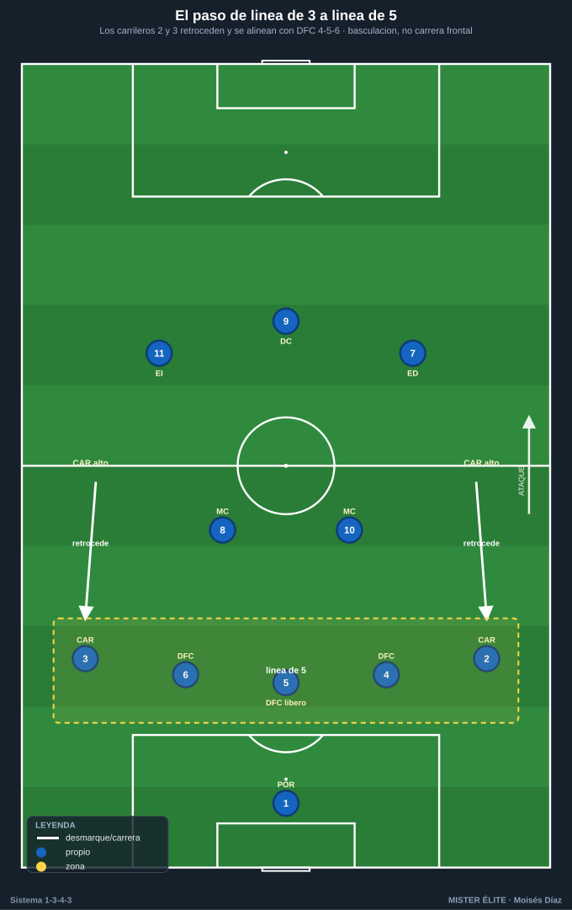
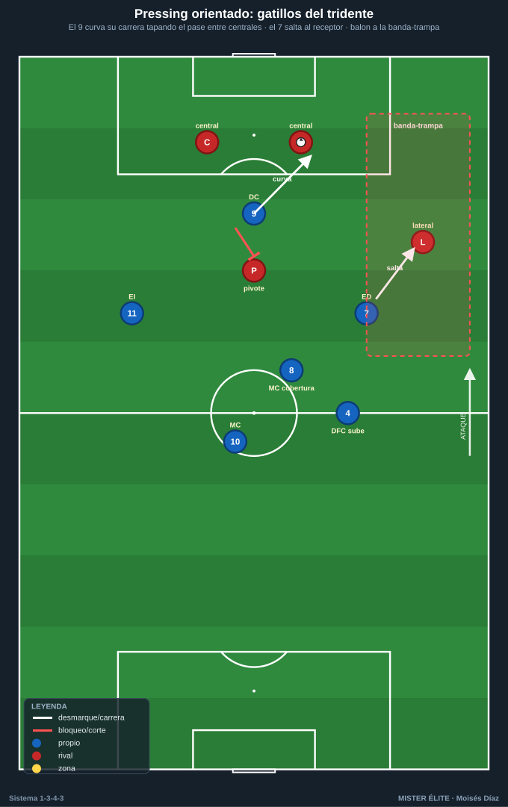
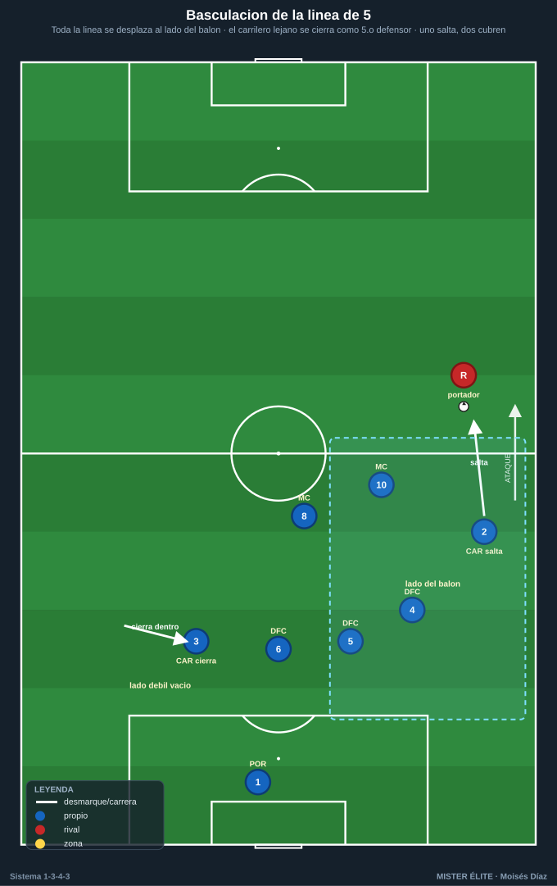

# Módulo 02 · Fase defensiva del 1-3-4-3

> **Convención:** POR 1 · DFC 4-5-6 (5 = líbero) · CAR 2/3 · MC 8/10 · ED 7 · DC 9 · EI 11.
> Estructura sin balón dominante: la línea de **3 (DFC 4-5-6)** se convierte en **línea de 5** cuando los carrileros bajan → **1-5-2-3** (presión media) o **1-5-4-1** (repliegue).

La defensa del 1-3-4-3 vive de un mecanismo central: **pasar de la línea de 3 a la línea de 5** sin romperse, y presionar arriba con el tridente de forma **orientada** (no a ciegas). Todo lo demás (coberturas, fuera de juego, gestión del riesgo a la espalda) se deriva de ahí.

---

## 1. Roles defensivos por demarcación

- **POR 1 — portero-líbero.** Manda la altura de los 3 DFC con la voz, cierra la espalda de la línea (posición adelantada **14-18 m** del marco con bloque medio/alto), barre balones a la espalda como escoba. Marca el fuera de juego junto al 5. Cuando la línea sube para dejar al rival en posición ilegal, **acompaña la subida** como escoba adelantada.
- **DFC 5 — líbero organizador.** El cerebro. **No salta de inicio**: da cobertura permanente a 4 y 6. Cubre el espacio interior y la diagonal a la espalda. Último hombre que decide el fuera de juego.
- **DFC 4 (der) y 6 (izq) — stoppers con cobertura.** Saltan a marcar al delantero/interior rival que cae a su zona; salen a presionar al que recibe de espaldas o conduce por su pasillo. **Siempre cubiertos por el 5** (uno salta, el otro y el 5 cierran).
- **CAR 2/3 — carrileros.** **Bajan para formar la línea de 5.** Marcan al extremo/lateral rival, cierran el carril exterior. Cuando el balón está al lado contrario, basculan hacia dentro y casi forman un quinto central.
- **MC 8 — pivote/ancla.** Delante de la línea de 3/5. Tapa el espacio entre líneas, achica al mediapunta, y **baja a la línea como tercer central momentáneo** cuando un central salta y deja hueco. Primer relevo.
- **MC 10 — ofensivo.** Presiona más arriba, ayuda al tridente en la primera presión y vuelve. Marca al segundo pivote o interior rival.
- **Tridente 7-9-11 — primera presión.** El 9 **orienta** (corta el pase entre centrales rivales para empujar a una banda). El 7/11 saltan al carrilero/lateral rival de su lado: son el gatillo del pressing exterior. En repliegue bajan a la línea del carrilero (1-5-4-1).

---

## 2. El paso de 3 a 5: bloques y alturas

| Bloque | Altura de la 1.ª presión | Estructura sin balón | Idea |
|---|---|---|---|
| **Alto** | Tridente presiona en campo rival (línea def. ~40-45 m) | Carrileros muy arriba, 1-3-2-5 → al perder sigue 3+2 | Robar arriba, fuera de juego adelantado |
| **Medio** | Tridente presiona en el círculo central (~30-35 m) | **1-5-2-3**: línea de 5 (izq→der: 3-6-5-4-2) + pivote 8/10 + tridente | Estructura por defecto. Compacto, espera el gatillo |
| **Bajo** | Repliegue, defender el área (~18-22 m) | **1-5-4-1**: extremos 7/11 bajan al lado de los carrileros (7-8-10-11) + 9 arriba | Cerrar centro y área, resistir y transitar |

**Mecánica del paso de 3 a 5:** sin balón, los carrileros 2 y 3 retroceden y se alinean con 4-5-6. Los 3 DFC ocupan el centro-área; los carrileros tapan los carriles exteriores. Para pasar a **1-5-4-1**, los extremos 7 y 11 caen sobre su carrilero formando una línea de 4 con el doble pivote (7-8-10-11), dejando al 9 de referencia. **Reordenamiento por basculación, nunca por carrera frontal sin cobertura.**

Distancia entre líneas: **10-15 m**. Bloque total **< 35-40 m**.

---

## 3. Pressing del tridente: gatillos y coberturas

**Presión orientada (al espacio, no a la pelota):**
1. El **9** se coloca tapando el pasillo entre los dos centrales rivales y **curva su carrera** para que el balón salga a UNA banda (normalmente la débil del rival).
2. **Gatillos de salto:**
   - **Pase del central al carrilero/lateral rival** → salta el **extremo (7 u 11)** de ese lado.
   - **Salto del carrilero (2/3)** sobre el extremo rival si el balón ya está fijado en banda.
   - **Control orientado a su propia portería** o **pase atrás** → presión colectiva.
   - **Balón en el aire / pase impreciso** → contrapressing inmediato.
3. **Coberturas tras el salto:**
   - Si sube el extremo 7/11, el **carrilero 2/3** empuja o cierra la espalda; el **8** tapa el interior; el **DFC del lado (4/6)** sube un paso.
   - Si salta el carrilero a la banda, el **DFC del lado** desliza a tapar el carril y el **5** bascula al centro: la línea de 5 se vuelve momentáneamente una línea de 4 inclinada al lado del balón.
   - El **10** marca al pivote/mediapunta rival para impedir el pase interior que rompería la presión.

**Contrapressing (tras pérdida en campo rival):** los 3-4 más cercanos (tridente + 10/carrilero del lado) saltan al portador en los **primeros 5-6 segundos**; el 8 cubre por detrás y la línea sube para dejar fuera de juego. Si no se recupera en ~6 s, repliegue ordenado a bloque medio (1-5-2-3).

---

## 4. Basculación, coberturas y permutas

- **Basculación:** la línea de 5 se desplaza en bloque al lado del balón. El carrilero del **lado débil se cierra hacia dentro** y casi se convierte en tercer/cuarto central. Regla: el carrilero lejano nunca queda abierto pegado a su banda cuando el balón está al otro lado.
- **Cobertura del central que salta:** si **4** o **6** salta y deja hueco, el **5** cubre la diagonal y el **8** baja a tapar la línea ("uno salta, dos cubren"). La línea no se rompe: se desliza.
- **Permuta central ↔ carrilero:** si el carrilero es superado o arrastrado fuera de zona, el **DFC del lado sale a la banda** a cubrirlo y el **5 + el carrilero contrario** se reordenan al centro (rotación en cadena). Tras resolver, cada uno recupera su posición.
- **Doble pivote como segunda línea:** 8 fijo (filtra pases interiores), 10 presiona/marca al mediapunta. Juntos forman el escudo que evita la recepción entre la línea de 5 y el tridente.

---

## 5. Riesgo a la espalda de los carrileros y sus soluciones

El punto débil del sistema. Cuando los carrileros suben, esa banda queda abierta. Seis soluciones aplicables:

1. **Los carrileros nunca suben los dos a la vez en bloque alto:** sube el del lado del balón; el del lado débil queda más bajo como cobertura preventiva (asimetría 2/3).
2. **Resto preventivo:** el **MC 8** se queda como ancla, y el **DFC del lado contrario** desliza a cubrir la espalda del carrilero que subió → mini línea de 3 lista para la transición.
3. **Achicar con fuera de juego coordinado:** cuando el carrilero sube, la línea sube con él al unísono (manda 5 y POR) para que la espalda quede en posición ilegal.
4. **Tapar las medias bandas:** el pivote del lado del balón cae al carril entre central y carrilero; el extremo 7/11 repliega a su banda (paso a 1-5-4-1).
5. **Falta táctica / pressing inmediato en la pérdida:** contrapressing de 5-6 s; si no se recupera, falta del más cercano para frenar la transición por el carril abierto.
6. **POR-líbero adelantado** como escoba: barre los balones largos a la espalda de carrileros y centrales.

---

## 6. Fuera de juego, achique y defensa del centro

- **Fuera de juego:** lo marcan **5 y POR**. Subida coordinada de la línea de 5 al unísono cuando el portador no puede dar el pase a la espalda (está presionado o de espaldas). El carrilero que subió a presionar debe volver a la línea para no romper la trampa.
- **Achique:** tras recuperación o despeje, la línea de 5 sube en bloque para comprimir; **siempre con el balón cubierto**, nunca con balón libre.
- **Defensa de los carriles:** carrileros = dueños de los carriles exteriores; el central de lado cubre el carril interior; el carrilero del lado débil cierra el carril contrario.
- **Defensa del centro (la zona que NO se cede):** 3 DFC + doble pivote 8/10 = **5 jugadores** de densidad central. El 5 cubre, el 8 tapa entre líneas, el 10 marca al mediapunta. **Obligar al rival a jugar por fuera.**

### Checklist de campo
- [ ] ¿Sale a presionar UN solo central (4/6) y el 5 cubre siempre?
- [ ] ¿Bajan los carrileros a formar la línea de 5 en bloque medio/bajo?
- [ ] ¿El 9 orienta la presión cerrando el pase entre centrales rivales?
- [ ] ¿Salta el extremo (7/11) al carrilero rival con cobertura del 8 y del DFC?
- [ ] ¿Hay resto preventivo (8 ancla + DFC contrario deslizando) cuando un carrilero sube?
- [ ] ¿Sube la línea al unísono con el carrilero para dejar la espalda en fuera de juego?
- [ ] ¿El carrilero del lado débil se cierra hacia dentro en la basculación?
- [ ] ¿Distancia entre líneas 10-15 m y bloque < 35-40 m?
- [ ] ¿El POR-líbero está adelantado barriendo balones a la espalda?
- [ ] ¿Se tapan las medias bandas y se obliga al rival a jugar por fuera?

---

## Ideas clave

- La defensa es **línea de 5 sin balón**: los carrileros bajan, no se improvisa.
- **"Uno salta, dos cubren":** los centrales nunca defienden en bloque plano.
- El pressing es **orientado**: el 9 elige la banda, el extremo es el gatillo, todos saltan juntos o ninguno.
- El **peligro a la espalda de los carrileros** se gestiona con asimetría, resto preventivo y fuera de juego coordinado.
- El **centro no se cede:** 5 jugadores de densidad central (3 DFC + 8 + 10).

## Errores comunes

- **Dos centrales saltando a la vez:** abres el centro.
- **El carrilero que sube a presionar no vuelve a la línea:** rompes la trampa de fuera de juego.
- **Presionar sin gatillo:** el tridente salta a ciegas y el rival rompe líneas por dentro.
- **Subir los dos carrileros en bloque alto sin cobertura:** banda regalada a la transición.
- **Achicar con balón libre (sin presión al portador):** te ganan a la espalda con el pase filtrado.
- **No bajar a línea de 5 en bloque bajo:** te quedas con 3 atrás defendiendo el área y te superan por fuera.
