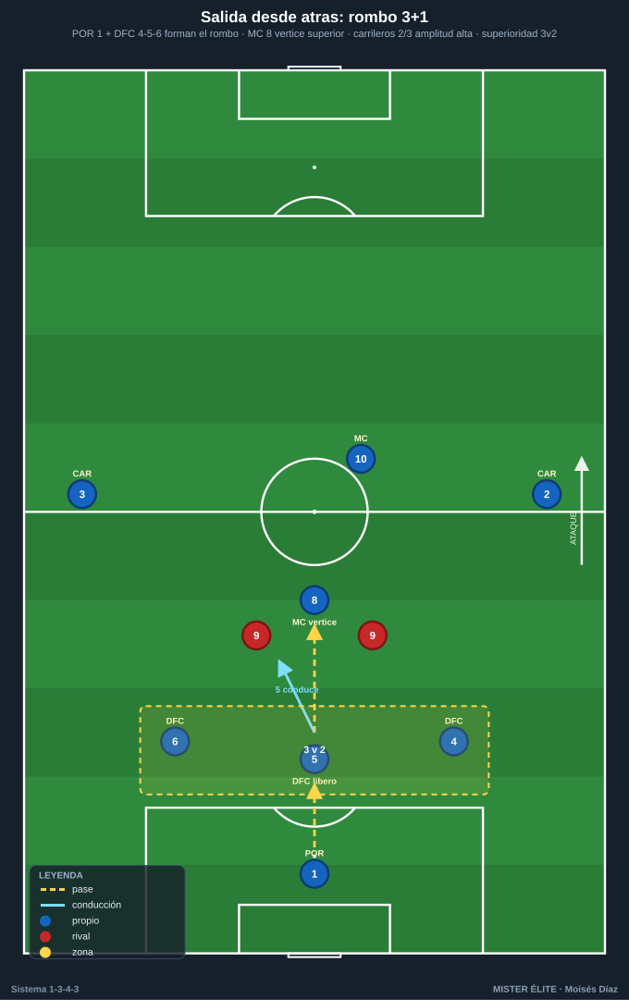
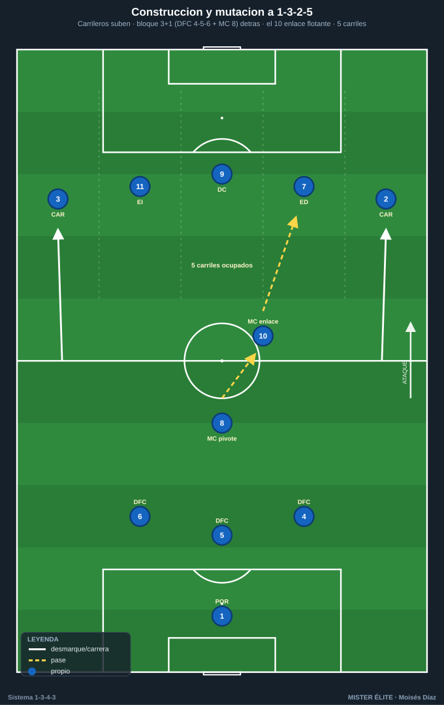
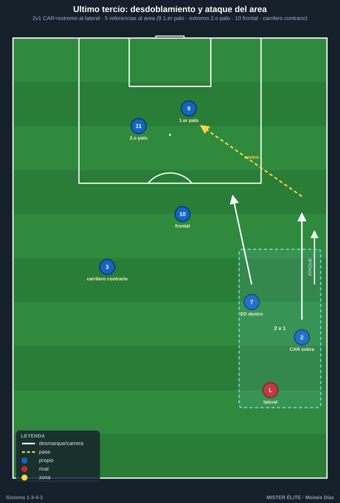

# Módulo 03 · Fase ofensiva del 1-3-4-3

> **Convención:** POR 1 · DFC 4-5-6 (5 = líbero) · CAR 2/3 · MC 8 (pivote) y 10 (ofensivo) · ED 7 · DC 9 · EI 11.
> Idea madre con balón: **el 1-3-4-3 muta a 1-3-2-5.** Carrileros y extremos suben y ocupan los 5 carriles → 5 puntas de ataque, máxima amplitud y profundidad.

El ataque del 1-3-4-3 tiene tres tramos: **salir limpio** desde atrás con superioridad, **construir y mutar** a 1-3-2-5 en zona media, y **finalizar** poblando el área con criterio. Todo lo sostiene un principio: amplitud no negociable de los carrileros.

---

## 1. Salida desde atrás (superioridad de primera línea)

**Estructura base:** el rombo de primera línea lo forman **POR 1 + DFC 4-5-6** (4 jugadores), y el **MC 8** se ofrece como vértice superior por delante de los centrales. Esto genera superioridad ante 1 o 2 puntas rivales:

- **Vs 1 punta:** 3 centrales contra 1 → **+2**. El líbero **5 conduce** hacia el medio para fijar y romper la primera línea (al fijar a un mediocentro rival libera al 8 o al 10).
- **Vs 2 puntas:** 3 contra 2 → **+1**. Salida limpia abriendo a los laterales 4 y 6; el **8 pivota** lateralmente o **baja** entre los centrales (salida en línea de 4 momentánea).

**Mecánica clave:**
1. **5 (líbero) conduce** balón al pie para atraer presión y decidir.
2. **4 y 6** se abren para dar líneas laterales y altura de primer pase.
3. **Carrileros 2/3** dan la primera amplitud: suben para fijar al extremo/lateral rival y abrir el campo.
4. **8 da el apoyo central**; si lo presionan, **baja** como tercera salida o pivota a la espalda del punta.
5. **10 se ofrece entre líneas** como salida directa que salta la primera presión.

**Reglas de salida (coaching):** orientar el cuerpo al frente, primer pase al pie del libre, **no forzar el pase vertical sin tercer hombre**; si no hay salida limpia → pase largo a 9/extremos y disputar la segunda jugada con el bloque ya alto.

---

## 2. Construcción en zona media y la mutación a 1-3-2-5

**Relación del doble pivote 8/10:**
- **8 (ancla)** sostiene la posición delante de los 3 centrales → equilibrio y primer seguro de transición.
- **10 (creador)** se mueve libre, **recibe entre líneas** orientado a portería para conducir, filtrar o asociar.
- **Nunca los dos en la misma altura:** uno baja, otro sube (escalonados) → dos alturas de pase y cobertura del que progresa.

**La mutación 1-3-4-3 → 1-3-2-5 (núcleo del sistema):**
- **Carrileros 2/3 suben muy altos** al último tercio → dejan a los 3 centrales + 8 atrás.
- Con 2/3 arriba + tridente 7-9-11, hay **5 jugadores ocupando los 5 carriles**:

| Carril | Jugador |
|---|---|
| Banda izq. | CAR 3 |
| Interior izq. | EI 11 |
| Centro | DC 9 |
| Interior der. | ED 7 |
| Banda der. | CAR 2 |

- Detrás queda el **bloque de construcción 3+1 (4-5-6 + 8)**, con **10** de enlace flotante.
- Efecto: **máxima amplitud (banda a banda) + profundidad** → estiramos al rival en horizontal y vertical, abrimos pasillos para la recepción del 10 y los extremos.

**Patrón de progresión:** balón por la línea de 3 → buscar al **10/8 libre** o al **carrilero en banda** → si el carrilero recibe con espacio, el extremo de su lado **pisa por dentro** para fijar al lateral y dar opción de pared/tercer hombre.

---

## 3. Último tercio (creación y finalización)

**Amplitud y desdoblamiento:**
- La amplitud la dan **extremo + carrilero del mismo lado** combinados (no los dos pegados a la cal).
- **Desdoblamiento CAR–ED / CAR–EI:** uno ataca el exterior (sobra para centrar), el otro entra por dentro al pasillo interior → **2v1 sistemático sobre el lateral rival**.

**Movimientos del DC 9 (doble desmarque):**
- **Desmarque de apoyo** (viene al pie, abre el espacio a su espalda) **+ desmarque de ruptura** (ataca la espalda de la última línea). Encadena apoyo → ruptura.

**Ocupación del área (regla de 5 referencias ante un centro):**
- **1er palo:** 9 (ataque corto/desvío).
- **Centro/penalti:** extremo del lado contrario pisando dentro.
- **2º palo:** **carrilero del lado contrario** y/o EI/ED contrario (llegada larga).
- **Rechace/borde del área:** **10** llega desde atrás + **8** equilibra por si rechace y transición.

---

## 4. Automatismos ofensivos

1. **Pared (1-2):** central/8 con el 10 o el extremo que pisa dentro para superar la presión.
2. **Tercer hombre:** 5 (líbero) → 8 (apoyo) → 10/extremo que ataca el espacio. El receptor final no es a quien presionan.
3. **Desdoblamiento carrilero-extremo:** uno por fuera, otro por dentro (2v1 al lateral). Alternar quién profundiza.
4. **Llegada desde atrás:** el **10** ataca el área como segundo punta tardío; el **carrilero del lado débil** llega al 2º palo; el **8** se suma al borde para el rechace.
5. **Sobra y centro:** carrilero por fuera, extremo arrastra al lateral hacia dentro → carrilero recibe en carrera y centra raso/tenso.
6. **Cambio de orientación:** circular por la línea de 3 hasta el carrilero del lado contrario aislado (la amplitud de los 5 de arriba garantiza siempre un hombre libre lejos del balón).

---

## Ideas clave

- La salida nace de la **superioridad de la primera línea** (rombo POR + 3 DFC, con el 8 de vértice).
- El **líbero 5 manda la salida:** conduce, fija y decide.
- La **mutación a 1-3-2-5** ocupa los 5 carriles → siempre hay hombre libre y opciones de cambio de orientación.
- **Amplitud no negociable:** sin la altura de los carrileros no existe la mutación.
- **Escalonar el doble pivote:** uno asegura, otro crea/llega.
- El **9 con doble desmarque** (apoyo para abrir, ruptura para finalizar) y el área poblada con **5 referencias**.

## Errores comunes

- **Forzar el pase vertical sin tercer hombre:** pérdida con el bloque subido.
- **El líbero 5 no progresa con criterio:** la salida se atasca.
- **Carrileros y extremos en la misma altura/carril:** se anula el 2v1 al lateral.
- **Doble pivote en la misma línea:** sin cobertura del que progresa.
- **Atacar sin ocupar los 5 carriles:** desaparece el hombre libre y el cambio de orientación.
- **Centrar con el área vacía o con todos esperando parados:** hay que atacar el balón en movimiento, con 5 referencias y zonas repartidas.
