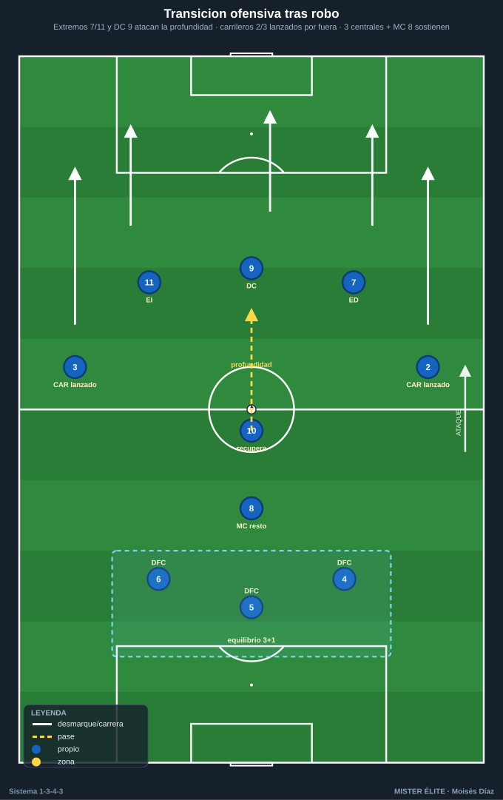
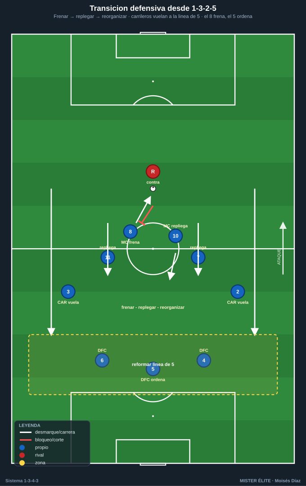
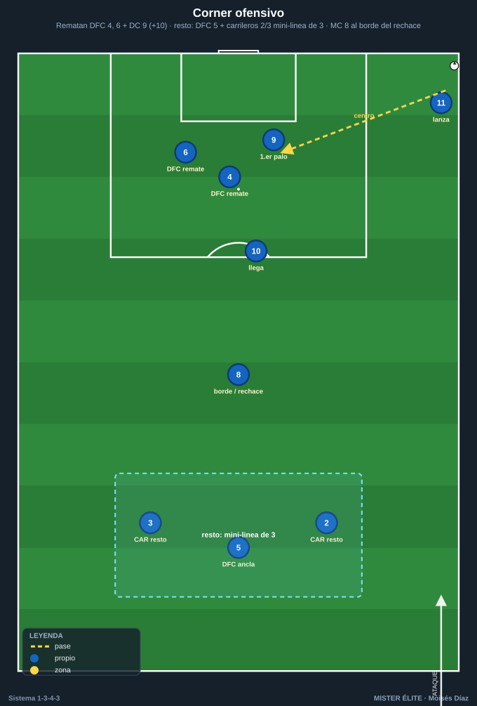

# Módulo 04 · Transiciones y balón parado del 1-3-4-3

> **Convención:** POR 1 · DFC 4-5-6 (5 = líbero) · CAR 2/3 · MC 8/10 · ED 7 · DC 9 · EI 11.
> **La transición defensiva es la fase que define al sistema.** Con los carrileros arriba (1-3-2-5), tras pérdida quedan 3 centrales + 8 ante el contragolpe. Hay que entrenarla más que ninguna otra fase.

---

## 1. Transición ofensiva (recuperación → ataque)

- **Carriles de contraataque: tridente + carrileros lanzados.** Tras robo, salida rápida por los **extremos 7/11** (ya altos en la mutación) y el **9** atacando la profundidad.
- **Carrileros 2/3** se incorporan como **carrileros lanzados** por fuera para dar anchura y centro inmediato (3-4 atacantes en 3-4 segundos).
- **10** acompaña la segunda oleada; **8 y los 3 centrales** sostienen el equilibrio (no todos se lanzan).
- Principio: **profundizar primero** (vertical al espacio), **asociar después** solo si la conducción se frena.

---

## 2. Transición defensiva (pérdida → repliegue)

**El riesgo del 1-3-2-5:** tras pérdida quedan 4-5-6 + 8 ante el contragolpe. Secuencia obligatoria:

1. **Presión inmediata al balón (contrapresión)** con los hombres cercanos (extremo + carrilero del lado de pérdida) durante los primeros segundos → **frenar** y ganar tiempo.
2. **Recuperar la línea de 5:** los **carrileros 2/3 repliegan a toda velocidad** para reformar la línea de 5 (1-5-2-3 / 1-5-4-1) con los 3 centrales.
3. **Extremos 7/11 repliegan** a ayudar a sus carrileros / formar segunda línea.
4. **8** tapa el carril central (espalda de la línea de 3) y orienta el repliegue; **5 (líbero)** organiza coberturas y decide si saltar o esperar.
5. **Frenar–replegar–reorganizar** en ese orden: si no se puede robar de inmediato, **frenar** la conducción rival y dar tiempo a que carrileros y extremos vuelvan.

---

## 3. Balón parado ofensivo

**Córners ofensivos** — aprovechar la altura y número de los centrales + DC 9:
- **3-4 rematadores potentes:** los dos centrales laterales **DFC 4 y 6** + **DC 9** (+ **10** llegando), con bloqueos y movimientos cruzados. El 9 ataca primer palo/penalti; los centrales, el segundo palo.
- **8** al borde del área para el rechace y primer freno de la contra.
- **Vigilancias obligatorias (resto de córner):** **DFC 5 (líbero) + los dos carrileros 2/3** atrás como mini-línea de 3. **El 5 NO sube a rematar:** es el ancla de seguridad; suben 4, 6 y 9.

**Faltas laterales/cercanas:** lanzamiento al área con la altura de los centrales; opción de saque ensayado en corto (carrilero–extremo) para centro de mejor ángulo.

**Saques de banda en campo rival:** aprovechar la amplitud del carrilero + apoyo del extremo/10 (pared para progresar).

---

## 4. Balón parado defensivo

- En córner/falta en contra, **los carrileros vuelven a la línea de 5**.
- **Marcaje mixto:** zona en 1er palo y penalti + hombre a los rematadores peligrosos.
- Un hombre en cada palo.
- **Vigilancia para el contraataque propio:** el **9 + un extremo** quedan arriba como amenaza de contra.

---

## 5. Puntos clave de coaching (transiciones)

- **La transición defensiva define el sistema:** contrapresión inmediata → recuperar la línea de 5 → frenar/replegar. Entrénala más que ninguna otra fase.
- **No lanzar a todos en transición ofensiva:** 3 centrales + 8 sostienen siempre el equilibrio (resto defensivo permanente).
- **ABP = ventaja estructural:** la altura de los 3 centrales es un arma en córners; pero deja siempre vigilancia (5 + carrileros) por el contragolpe.

---

## Ideas clave

- **Profundizar primero, asociar después** en la transición ofensiva.
- **Frenar → replegar → reorganizar** en la transición defensiva (orden fijo).
- Los **carrileros vuelan atrás** a reformar la línea de 5; el **8 frena**, el **5 ordena**.
- En córner ofensivo suben **4, 6, 9 (+10)**; el **5 + carrileros** quedan de resto (el 5 nunca sube).
- En córner defensivo, **carrileros a la línea de 5**, marcaje mixto, y **9 + extremo** arriba para el contra.

## Errores comunes

- **Lanzar a todo el equipo al contraataque:** te quedan 3 atrás contra la contra-contra.
- **Replegar sin frenar antes:** el rival corre en campo abierto por el carril del carrilero.
- **El carrilero no esprinta atrás tras la pérdida:** la línea de 5 no se forma a tiempo.
- **Subir al 5 a rematar el córner:** te quedas sin ancla de seguridad para el contragolpe.
- **No dejar a nadie arriba en el córner defensivo:** renuncias a la amenaza de contra y el rival sale sin riesgo.
