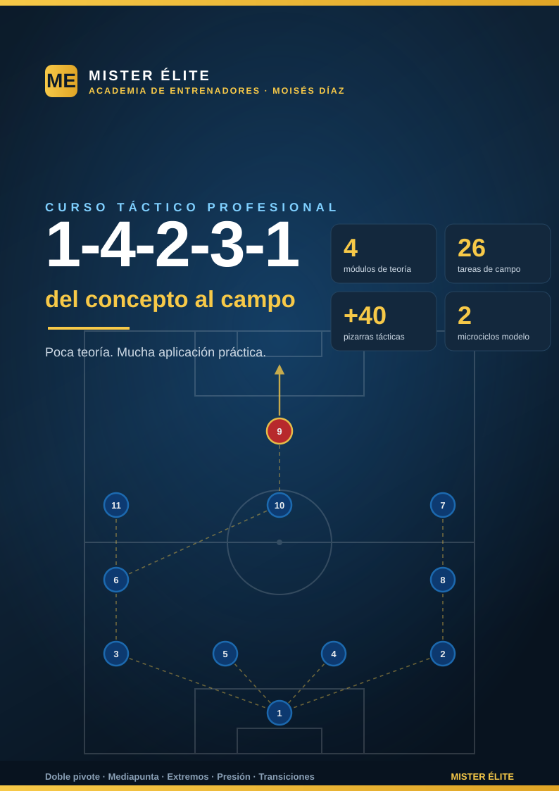

# Sistema 1-4-2-3-1: del concepto al campo

**MISTER ÉLITE — Moisés Díaz**

Curso de formación táctica sobre uno de los sistemas más usados y enseñables del fútbol moderno: el **1-4-2-3-1**. Filosofía del curso: **poca teoría, mucha aplicación práctica**. Cada idea se explica en lo justo y se baja al campo con una tarea concreta y una pizarra.

---

## A quién va dirigido

Entrenadores y segundos entrenadores de fútbol **formativo, amateur y senior** que quieran:

- Entender el 1-4-2-3-1 como **dos estructuras en una** (muta sin balón y con balón) y no como un dibujo rígido.
- Disponer de un **banco de 26 tareas** listas para llevar al campo, con provocaciones medibles y coaching.
- Tener un material coherente de principio a fin: la misma nomenclatura, las mismas distancias y las mismas referencias en teoría y práctica.

No hace falta licencia previa: el lenguaje es claro y los conceptos se construyen de menos a más.

---

## Objetivos del curso

1. **Comprender la estructura** del 1-4-2-3-1: línea de 4, doble pivote, trivote y punta.
2. Dominar la **doble mutación**: a **1-4-4-2 / 1-4-4-1-1** sin balón y a **1-2-3-5 / 1-4-3-3** con balón.
3. Saber **defender** el sistema: bloques, gatillos de presión de la dupla 9+10, regla de oro del doble pivote y basculación.
4. Saber **atacar**: salida en superioridad, la mediapunta entre líneas (zona 14), amplitud de extremos y laterales, y llegada de segunda línea.
5. Entrenar las **transiciones** y el balón parado con los automatismos propios del sistema.
6. Llevarlo todo al campo con un **banco de tareas** y dos **microciclos** de ejemplo.

---

## Cómo está organizado

El curso tiene **teoría breve** (4 módulos) y **práctica extensa** (7 documentos de campo).

### Teoría — `modulos/`
- [Módulo 01 · Fundamentos y estructura](modulos/01-fundamentos.md)
- [Módulo 02 · Fase defensiva](modulos/02-fase-defensiva.md)
- [Módulo 03 · Fase ofensiva](modulos/03-fase-ofensiva.md)
- [Módulo 04 · Transiciones y balón parado](modulos/04-transiciones-y-balon-parado.md)

### Práctica — `ejercicios/`
- [Plan de sesiones (2 microciclos)](ejercicios/00-plan-sesiones.md)
- [Bloque 1 · Salida con 2 centrales + doble pivote (T1–4)](ejercicios/01-salida.md)
- [Bloque 2 · Doble pivote: relación 6/8 y mutación (T5–9)](ejercicios/02-doble-pivote.md)
- [Bloque 3 · Pressing de la dupla 9+10 (T10–13)](ejercicios/03-pressing.md)
- [Bloque 4 · La mediapunta entre líneas / zona 14 (T14–18)](ejercicios/04-mediapunta.md)
- [Bloque 5 · Extremos, laterales y 9: amplitud y centros (T19–22)](ejercicios/05-extremos-laterales.md)
- [Bloque 6 · Transiciones y partido condicionado (T23–26)](ejercicios/06-transiciones-partido.md)

### Recursos — `graficos/`
- [Índice de diagramas (PEDIDOS)](graficos/PEDIDOS.md)

---

## Convención de dorsales y posiciones

Esta nomenclatura es **única** para todo el curso (teoría, ejercicios y pizarras).

| Dorsal | Posición | Abrev. | Matiz de rol |
|---|---|---|---|
| 1 | Portero | POR | Portero-líbero, inicia el juego, cobertura a la espalda de la defensa |
| 2 | Lateral derecho | LD | Defiende el carril derecho y se proyecta dando amplitud |
| 3 | Lateral izquierdo | LI | Defiende el carril izquierdo y se proyecta dando amplitud |
| 4 | Central derecho | DFC | Marca/cobertura; saca el balón por su lado |
| 5 | Central izquierdo | DFC | Marca/cobertura; saca el balón por su lado |
| 6 | Mediocentro defensivo (pivote) | MC | Ancla del doble pivote, protege a la defensa, primera salida |
| 8 | Mediocentro (box-to-box) | MC | El otro pivote: equilibrio, conducción y llegada |
| 7 | Extremo derecho | ED | Amplitud o pisar por dentro; repliega a ayudar al lateral |
| 10 | Mediapunta | MCO | El enganche: recibe entre líneas, crea y llega; cabeza del trivote |
| 11 | Extremo izquierdo | EI | Amplitud o pisar por dentro; repliega a ayudar al lateral |
| 9 | Delantero centro | DC | Referencia ofensiva: fija a los centrales, apoya y ataca el área |

**Reglas de nomenclatura fijas:** EI = extremo izquierdo, ED = extremo derecho (nunca "MI/MD"). El **doble pivote** son los MC 6 (ancla) y 8 (box-to-box); **nunca saltan los dos a la vez** en defensa. El **trivote** es ED 7 · MCO 10 · EI 11. En el plan de sesiones, **MD** = *matchday* (día de partido), nunca una posición.

---

## Distancias de referencia (estándar único del curso)

| Concepto | Medida | Nota |
|---|---|---|
| Anchura entre defensas | 8–12 m | Nunca más de un pasillo de separación entre dos defensas |
| Separación del doble pivote (6 ↔ 8) | 8–15 m | Escalonados, nunca a la misma altura; uno cubre al otro |
| Pivote por delante de los centrales | 8–10 m | El ancla (6) se ofrece sobre la línea de centrales |
| La mediapunta (10) por delante del doble pivote | 10–15 m | En la franja entre la línea de medios y la defensa rival |
| Distancia entre líneas propias (en bloque) | 10–12 m | Sin balón, bloque medio/bajo: nunca más de 12 m |
| Distancia entre líneas (en construcción) | hasta 15 m | Con balón se busca más separación para líneas de pase |
| Longitud del bloque (última línea ↔ 9) | 30–35 m medio · 25–30 m bajo · hasta 40 m alto | Estándar: bloque medio = 30–35 m |

---

## Leyenda de símbolos de las pizarras

| Símbolo | Significado |
|---|---|
| Círculo azul con número | Jugador propio (con su dorsal de la convención) |
| Círculo rojo | Jugador rival |
| Línea continua con flecha | **Conducción / desplazamiento** del jugador con balón |
| Línea discontinua con flecha | **Pase** del balón |
| Línea de puntos | **Desmarque / movimiento sin balón** |
| Línea roja de corte | **Bloqueo / corte real** de una línea de pase |
| Números 1 · 2 · 3 | **Secuencia** ordenada de una jugada |
| Conos / puertas | Mini-porterías, zonas o puertas-meta de la tarea |
| Franjas y carriles | Zonas o pasillos que condicionan la tarea |

> Todas las pizarras se leen **atacando hacia arriba**: el fondo propio está abajo y la portería rival arriba. Cada pizarra lleva al pie la marca **MISTER ÉLITE — Moisés Díaz**.

---

## Glosario rápido

- **Doble pivote**: la pareja de mediocentros (6 + 8) por delante de la defensa. Corazón del sistema.
- **Trivote**: la línea de 3 por detrás del 9 (ED 7 · MCO 10 · EI 11).
- **Zona 14**: franja central justo delante del área rival; la zona de máxima generación de ocasiones, dominio de la mediapunta.
- **Mutación**: cambio de forma según la fase. Sin balón → **1-4-4-2 / 1-4-4-1-1**; con balón → **1-2-3-5 / 1-4-3-3**.
- **Salida en 3**: un pivote (normalmente el 6) baja entre o junto a los centrales para construir en superioridad ante la presión.
- **Gatillo (trigger)**: señal que activa el pressing (p. ej. pase del rival a su lateral → salta el extremo).
- **Curva de presión**: trayectoria curvada del presionador para tapar una línea de pase mientras aprieta al portador.
- **Desdoblamiento**: el lateral sube por fuera cuando el extremo pisa por dentro (o viceversa) para generar 2v1.
- **Tercer hombre**: A pasa a B (de espaldas/marcado), B deja a C que aparece de cara; rompe marcajes orientados.
- **Resto de pérdida (resto defensivo)**: jugadores equilibrados por detrás del balón que permiten contrapresionar o replegar con orden.
- **Half-space / pasillo interior**: carriles entre la banda y el centro; zona de llegada de 10 y 8.
- **Lado fuerte / lado débil**: el lado donde está el balón (se densifica) y el contrario (se cubre por dentro).

---

*Curso "Sistema 1-4-2-3-1: del concepto al campo" · MISTER ÉLITE — Moisés Díaz · Filosofía: poca teoría, mucha aplicación práctica.*
