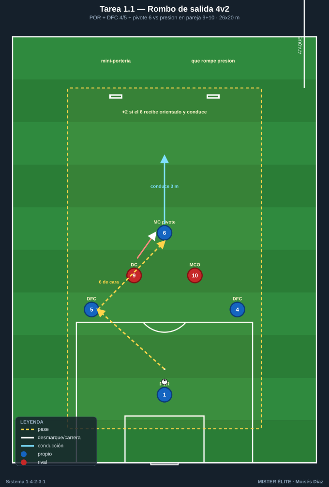
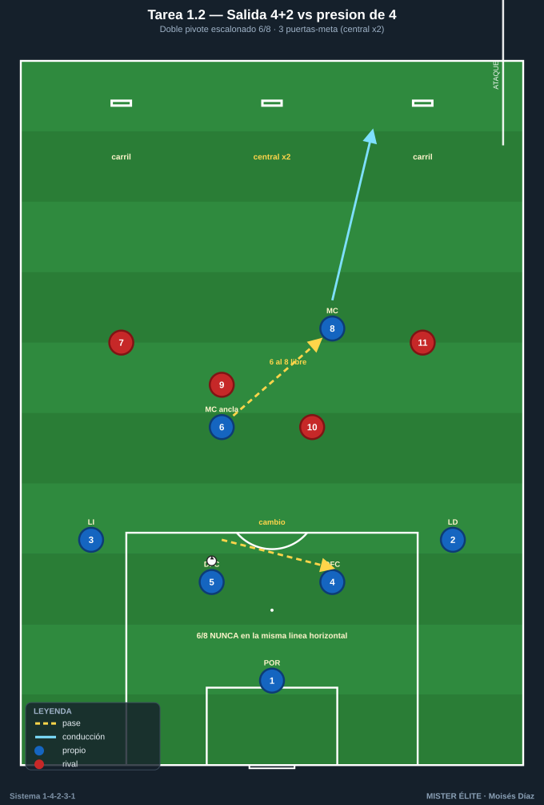
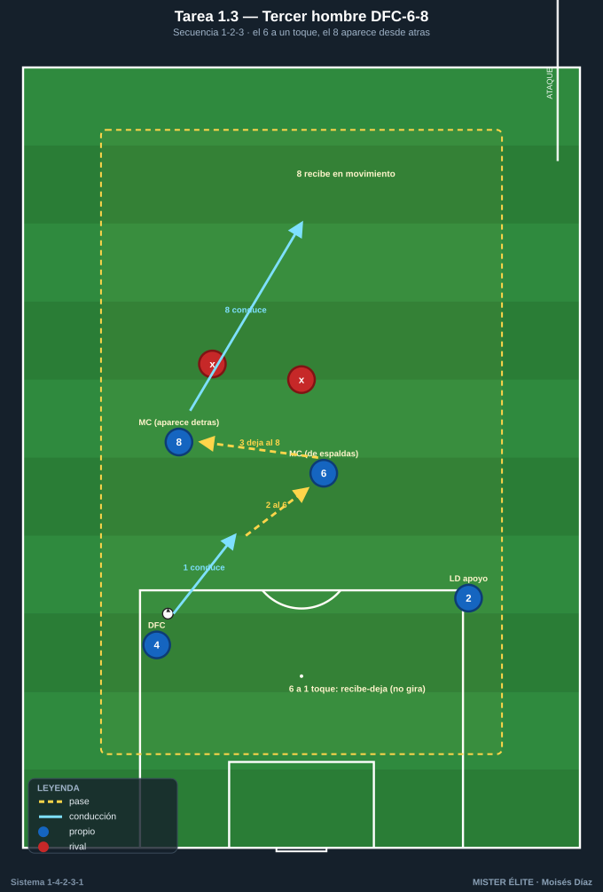
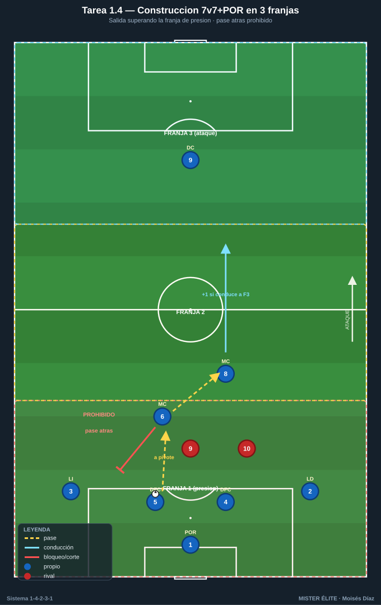

# Bloque 1 · Salida con 2 centrales + doble pivote (T1–4)

> Superar la primera presión. La base real del sistema: **2 centrales + POR como +1 + doble pivote 6/8**. Categorías: **F** fundamentación · **A** aplicación · **S** específica.
> Leyenda de pizarras en el [README](../README.md). Atacar siempre hacia arriba.

---

## Tarea 1.1 — "Rombo de salida": 2 DFC + pivote 6 frente a 2 atacantes

- **Objetivo:** construir la primera fase con DFC 4/5 + MC 6 superando a 2 puntas; fijar el **rombo de inicio** (POR-DFC-DFC-6) y la altura del pivote ancla.
- **Organización:** 26x20 m. Poseedores: POR 1, DFC 4, DFC 5, MC 6. Defensores: DC 9 y MCO 10 rivales presionando en pareja. 2 mini-porterías en la línea de salida del defensor para premiar el pase que rompe presión. Balones en el POR.

- **Desarrollo:** el POR inicia. Los DFC abren a la anchura del área; el 6 se ofrece entre líneas. Objetivo: 6 toques sin pérdida **o** encontrar al 6 entre los dos presionadores y conducir 3 m hacia delante.
- **Provocaciones:** (1) **Si el 6 recibe orientado de cara y conduce la línea del rombo = +2 puntos.** (2) Los presionadores solo defienden en pareja (curva 9+10); si se separan >5 m, balón al poseedor. (3) Máx. 2 toques los DFC.
- **Variantes:** fácil = 4v2 a posesión; medio = añadir 1 portería grande con POR para finalizar la salida; difícil = 4v3 (entra un MC rival) obligando a usar al 8 como tercer hombre.
- **Coaching:** "DFC abre y mira a tu pivote antes de recibir"; "6 perfil abierto, recibe para jugar hacia delante, no hacia atrás"; cuerpo orientado al juego.
- **Duración / Categoría:** 4x4 min, 90 s descanso · **F**

---

## Tarea 1.2 — Salida 4+2 contra primera línea de presión de 4

- **Objetivo:** salir jugada con la base real del sistema (4 defensas + doble pivote 6/8) ante una presión de 4, decidiendo lado fuerte y cambio de orientación.
- **Organización:** medio campo (50x45 m). Azules: POR 1 + LD 2, DFC 4, DFC 5, LI 3 + MC 6 + MC 8. Rojos: 4 presionadores (9, 10, 7, 11) + POR. 3 puertas-meta de 3 m en la línea de medio campo: dos por los carriles laterales, una central.

- **Desarrollo:** salida desde el POR. Superar a los 4 y conducir por cualquiera de las 3 puertas. La puerta central vale doble (premia romper por dentro al encontrar pivote libre).
- **Provocaciones:** (1) **El doble pivote NO puede estar en la misma línea horizontal:** uno se ofrece por delante de la presión y otro por detrás (relación 6/8); si quedan a la misma altura, falta y reinicio rival. (2) Gol válido solo tras un cambio de orientación o un pase interior al pivote libre. (3) Límite 12 s para superar la presión.
- **Variantes:** fácil = rojos a media intensidad; medio = añadir un 5º presionador (un MC rival); difícil = al superar la línea, transición real a portería grande.
- **Coaching:** lado fuerte / lado débil; "el pivote del lado contrario se desmarca a la espalda de la presión"; LD/LI dan amplitud para fijar al extremo rival.
- **Duración / Categoría:** 4x5 min · **A**

---

## Tarea 1.3 — "Saltar la primera presión" con tercer hombre (DFC-6-8)

- **Objetivo:** automatizar el patrón de **tercer hombre** central-pivote ancla-pivote box (DFC→6→8) para batir presión orientada al hombre.
- **Organización:** 30x24 m. 5 azules en estaciones fijas (DFC 4, DFC 5, MC 6, MC 8 y un apoyo de pared = LD 2) + 2 defensores que marcan al hombre sobre el 6 y el 8.

- **Desarrollo:** secuencia obligada: DFC conduce → busca al 6 (marcado, de espaldas) → 6 deja de primeras al 8 que aparece desde atrás (tercer hombre) → 8 conduce a zona de progresión. Repetir alternando lados.
- **Provocaciones:** (1) **El 6 está obligado a jugar a 1 toque** (no puede girar): fuerza el mecanismo. (2) El 8 debe recibir en movimiento, nunca parado (si recibe estático, repetir). (3) Cada secuencia completada sin error = 1 punto; 8 puntos por serie.
- **Variantes:** fácil = sin defensores (mecánica); medio = defensa pasiva al hombre; difícil = defensa activa + opción de que el 6 gire si está libre (lectura).
- **Coaching:** "6 recibe-deja, no recibe-gira si tiene la espalda marcada"; "8 ataca el espacio que deja el rival que salta al 6"; sincronía de apoyo y ruptura.
- **Duración / Categoría:** 3x4 min por lado · **F**

---

## Tarea 1.4 — Construcción condicionada 7v7 (+POR) con retroceso prohibido

- **Objetivo:** jugar la salida bajo presión real evitando la pelota atrás sistemática; valentía del doble pivote para recibir de cara.
- **Organización:** campo de 60x50 m dividido en 3 franjas horizontales. Azules en 1-4-2-3-1 reducido (POR + 4 defensas + 6 + 8 + 9 = 7 de campo +POR). Rojos presionan con bloque equivalente (+POR), saltando con 2 puntas en la franja 1.

- **Desarrollo:** salida desde el POR superando la franja de presión (franja 1). Una vez en la franja 2, ataque libre a portería.
- **Provocaciones:** (1) **Prohibido el pase atrás dentro de la franja 1** una vez el balón pasa de los centrales a los pivotes (solo se permite devolver al POR si está totalmente libre): fuerza la progresión vertical. (2) +1 gol si la salida termina con el 6 u 8 conduciendo a la franja 3. (3) 6 s de posesión máxima por jugador en la franja 1.
- **Variantes:** fácil = se permite 1 pase atrás por posesión; medio = regla estricta; difícil = los pivotes solo reciben de espaldas (giro obligado).
- **Coaching:** oferta permanente del pivote libre; "si te presionan, el otro pivote da la salida"; perfil y primer control hacia delante.
- **Duración / Categoría:** 3x6 min · **A**
