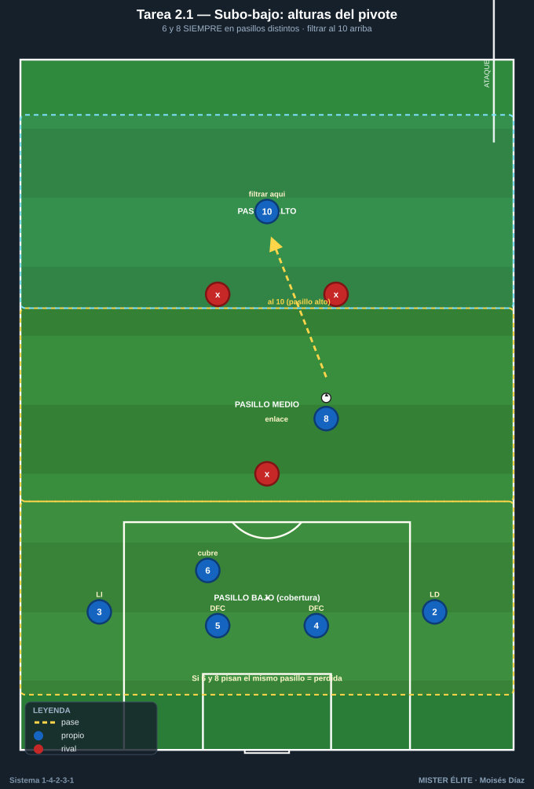
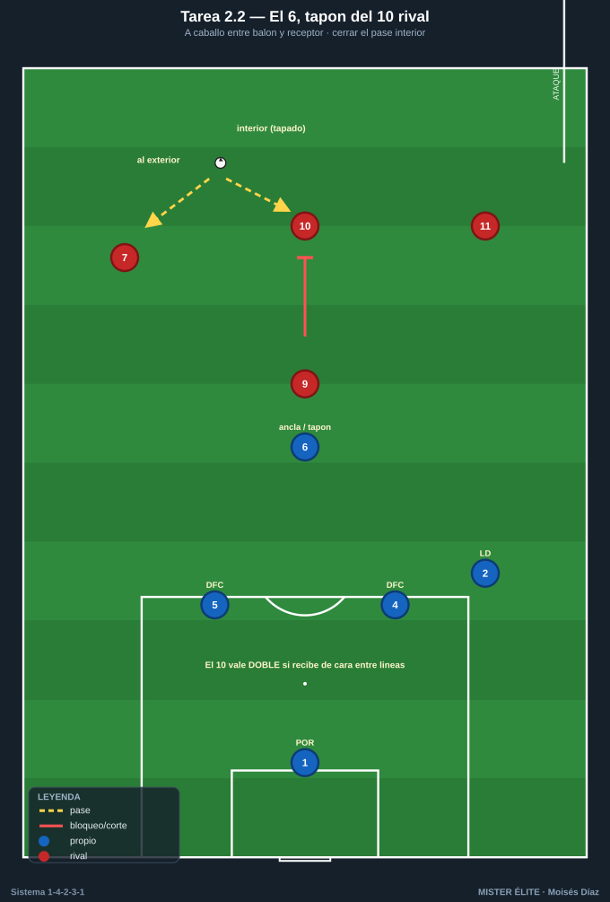
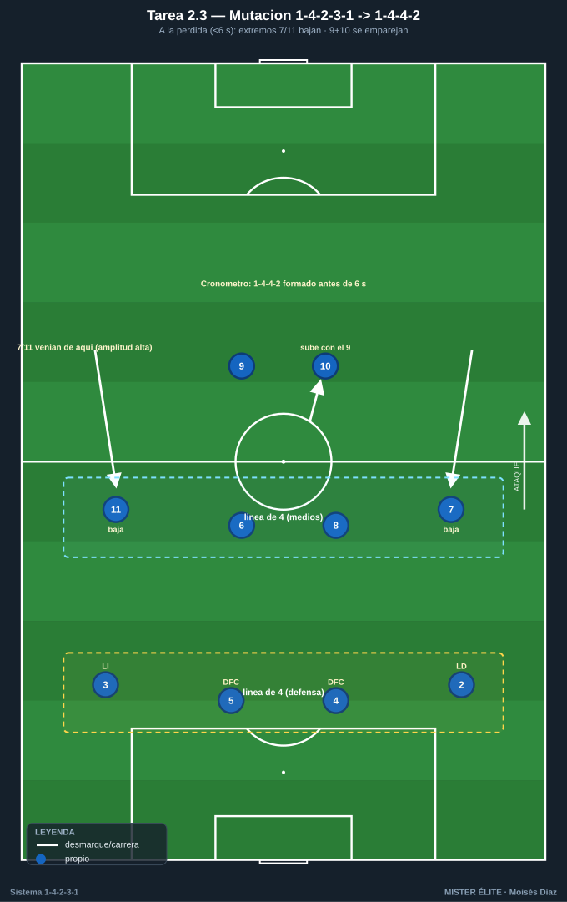
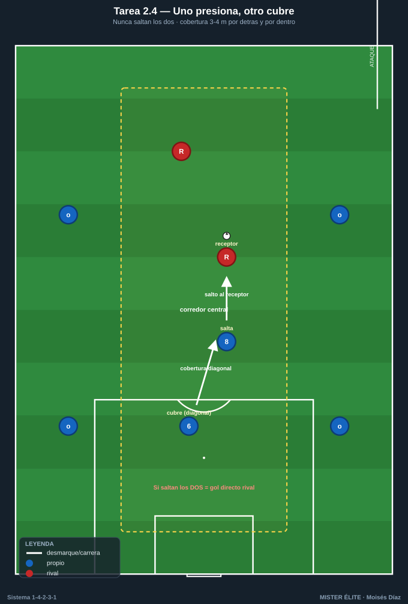
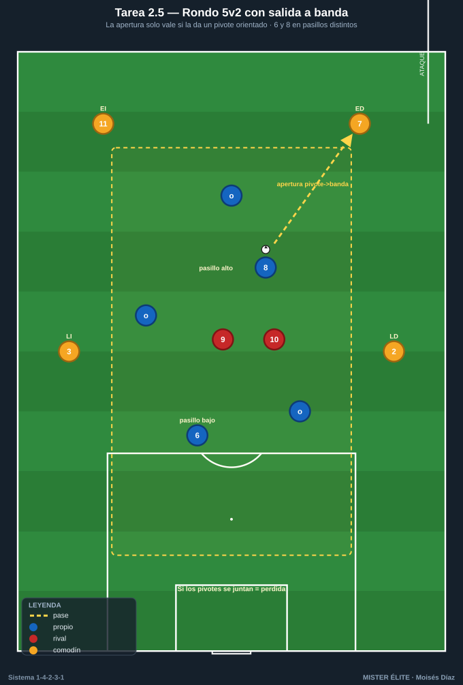

# Bloque 2 · Doble pivote: relación 6/8, protección y mutación (T5–9)

> El corazón del sistema. Que **uno ancla y otro llega**, que **nunca salten los dos a la vez**, que el 6 proteja la zona 14 y que el equipo **mute a 1-4-4-2** a la pérdida. Categorías: **F** · **A** · **S**.
> Leyenda de pizarras en el [README](../README.md). Atacar siempre hacia arriba.

---

## Tarea 2.1 — "Subo-bajo": relación de alturas del doble pivote

- **Objetivo:** interiorizar que **uno ancla y otro llega** (nunca a la misma altura); coordinar el básculo 6/8.
- **Organización:** 40x40 m con dos líneas horizontales que crean tres pasillos (bajo / medio / alto). Azules: 4 defensas + 6 + 8 + 10. Rojos: 5 (presión + un MC que vigila a los pivotes).

- **Desarrollo:** posesión con el objetivo de filtrar al 10 en el pasillo alto. Los pivotes deben ocupar pasillos distintos en todo momento.
- **Provocaciones:** (1) **Regla de altura:** si 6 y 8 pisan el mismo pasillo a la vez = pérdida de posesión. (2) Solo se puede pasar al 10 si al menos un pivote está en el pasillo bajo dando cobertura. (3) +1 punto cada vez que cambian de roles (el de arriba baja y viceversa) manteniendo la regla.
- **Variantes:** fácil = pasillos amplios; medio = pasillos estrechos; difícil = presión a 2 hombres directos sobre los pivotes.
- **Coaching:** comunicación verbal "yo subo / tú cubres"; vigilar la espalda del compañero que llega; "nunca te enganches al balón si tu pareja ya subió".
- **Duración / Categoría:** 4x4 min · **A**

---

## Tarea 2.2 — Protección de la defensa: el 6 como tapón del 10 rival

- **Objetivo:** entrenar el rol defensivo del pivote ancla (6) protegiendo la zona delante de los centrales y vigilando al mediapunta rival entre líneas.
- **Organización:** 36x30 m. Azules defienden con DFC 4, DFC 5, MC 6 (ancla) + LD 2. Rojos atacan con 9 + 10 (entre líneas) + 7 + 11. Portería grande con POR azul.

- **Desarrollo:** los rojos buscan meter el balón al 10 entre líneas para finalizar; los azules con el 6 deben tapar ese pase interior y orientar el juego al exterior.
- **Provocaciones:** (1) **El 10 rival vale doble si recibe de cara entre líneas:** obliga al 6 a no perder esa referencia. (2) El 6 no puede salir más allá de la línea de los centrales (define su zona). (3) Cada balón interceptado por el 6 al 10 = posesión + salida rápida.
- **Variantes:** fácil = 10 rival estático; medio = 10 con movilidad; difícil = añadir un segundo receptor interior (8 rival) para forzar la elección de marca.
- **Coaching:** postura del 6 "a caballo" entre balón y receptor; cerrar el pase interior con el cuerpo; comunicar el achique con los centrales.
- **Duración / Categoría:** 4x4 min · **A**

---

## Tarea 2.3 — Mutación 1-4-2-3-1 → 1-4-4-2 a la pérdida (extremos bajan)

- **Objetivo:** automatizar la **transición de estructura** al perder: extremos 7/11 bajan a la línea de medios formando un 1-4-4-2 compacto, con 9+10 como primera pareja de presión.
- **Organización:** 70x55 m. Azules en 1-4-2-3-1 completo. Rojos: equipo provocador con balón.

- **Desarrollo:** con balón los azules juegan su estructura ofensiva; **al perderla, deben formar el 1-4-4-2 antes de 6 segundos**: 7 y 11 bajan junto a 6 y 8, 9 y 10 se emparejan arriba.
- **Provocaciones:** (1) **Cronómetro de mutación:** el entrenador cuenta hasta 6 tras la pérdida; si las dos líneas de 4 no están formadas, punto para rojos. (2) Solo se recupera válidamente estando ya en 1-4-4-2. (3) Señal acústica define el momento de pérdida para medir la reacción.
- **Variantes:** fácil = señal anticipada de pérdida; medio = mutación en 6 s; difícil = mutación en 4 s y rojos atacan en transición directa.
- **Coaching:** gatillo visual de los extremos ("balón perdido = corro a mi lateral"); referencia de las dos líneas; "el 10 no defiende como medio, presiona con el 9".
- **Duración / Categoría:** 4x5 min · **S**

---

## Tarea 2.4 — "Uno presiona, otro cubre": no salir los dos pivotes a la vez

- **Objetivo:** fijar la regla de oro del doble pivote — **nunca saltan los dos**; coordinación presión-cobertura entre 6 y 8.
- **Organización:** 30x35 m (corredor central). Azules: 6, 8 + 4 apoyos exteriores. Rojos: 6 atacando el espacio entre líneas con 2 receptores interiores.

- **Desarrollo:** cuando un receptor rival recibe en la zona de pivotes, uno de los MC azules salta a presionar y el otro cubre la espalda en diagonal. Si el balón cambia de lado, se invierten roles.
- **Provocaciones:** (1) **Si los dos pivotes saltan al mismo balón = gol directo rival** (espacio liberado). (2) El que cubre debe estar siempre 3-4 m por detrás y por dentro del que presiona. (3) Punto azul por cada recuperación con cobertura correcta verificada.
- **Variantes:** fácil = un solo receptor rival; medio = dos receptores; difícil = receptores con movilidad y un tercer hombre que aparece.
- **Coaching:** "salto yo, cubre tú" verbal; orientación del cuerpo del que cubre; basculación corta y rápida.
- **Duración / Categoría:** 4x4 min · **A**

---

## Tarea 2.5 — Doble pivote en rondo central 5v2 con salida a banda

- **Objetivo:** limpieza técnica y orientación del doble pivote en espacios cortos; vincular protección del balón con apertura a los carriles de extremos.
- **Organización:** 18x18 m con 4 comodines exteriores (LD 2, LI 3, ED 7, EI 11). Dentro: 6 y 8 + 3 apoyos. 2 defensores (presión 9+10 rival).

- **Desarrollo:** rondo manteniendo posesión; cada 5 pases internos hay que sacar a un comodín de banda (extremo o lateral) simulando la apertura a carril.
- **Provocaciones:** (1) **La salida a banda solo vale si el último pase interior lo da un pivote (6 u 8) recibiendo de perfil/orientado;** si la abre un apoyo que no es pivote, no cuenta. (2) Los **dos pivotes siempre en pasillos distintos;** si se juntan, pérdida. (3) Medible: **aperturas válidas pivote→banda por serie** (objetivo ≥6) y pérdidas por juntarse los pivotes (objetivo 0).
- **Variantes:** fácil = 5v2 amplio; medio = reducir a 14x14; difícil = 5v3 (obliga a leer qué pivote sale del marcaje).
- **Coaching:** ventana de pase, cuerpo abierto, recibir en el lado contrario a la presión; "el pivote conecta interior con exterior y nunca pisa el pasillo de su pareja".
- **Duración / Categoría:** 4x3 min · **F**
