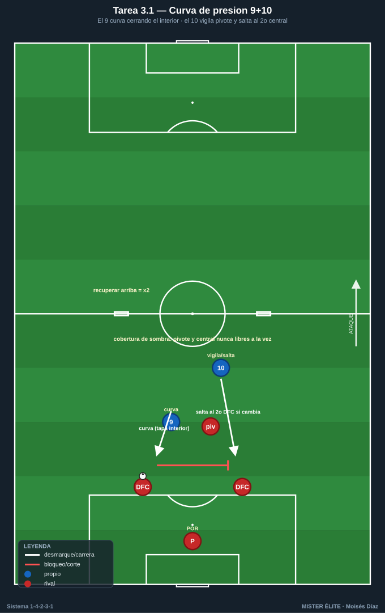
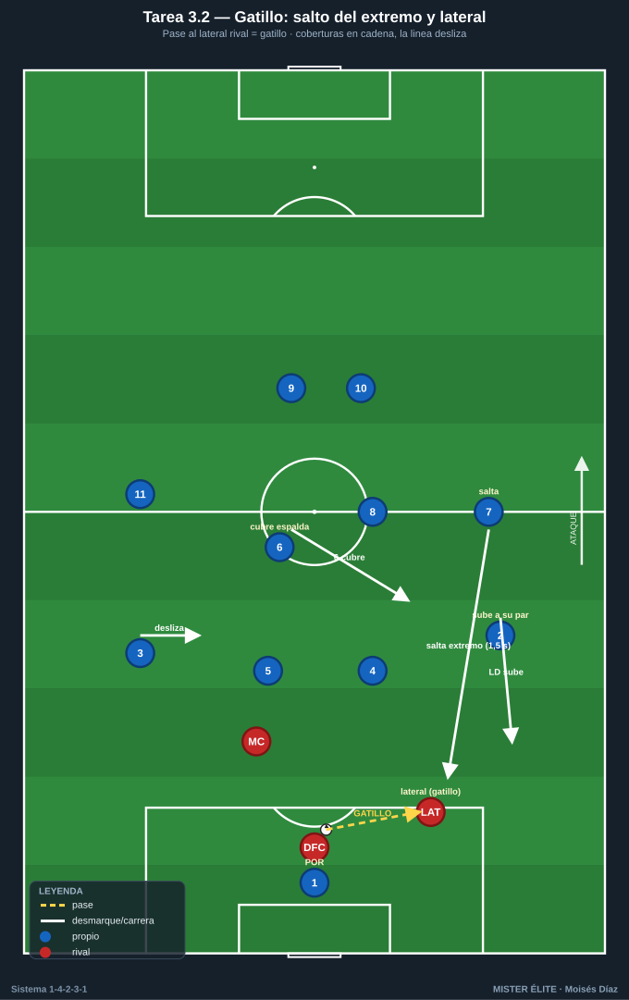
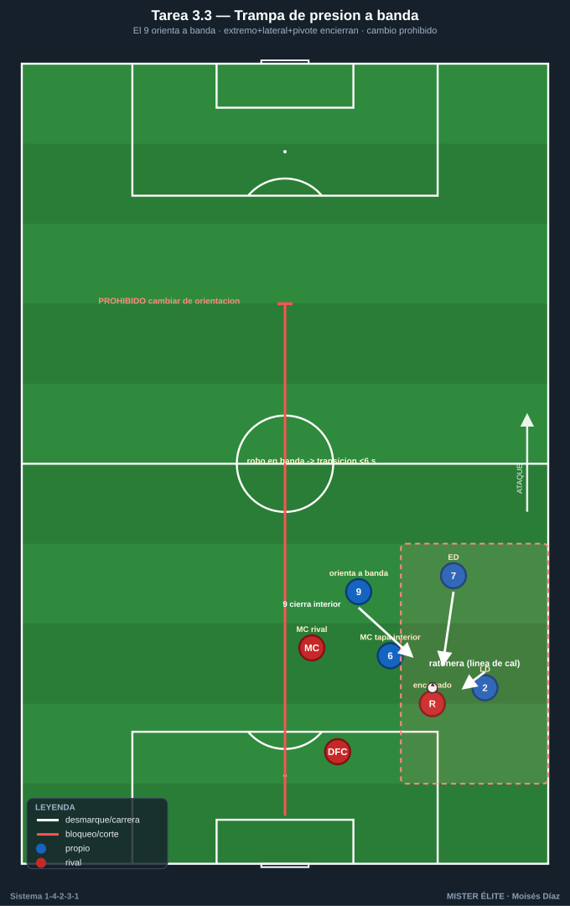
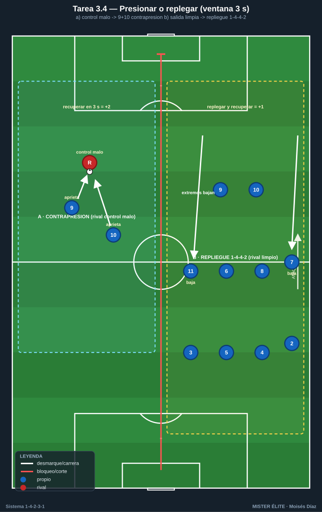

# Bloque 3 · Pressing de la dupla 9+10 + gatillos y coberturas (T10–13)

> Presión coordinada arriba: el **9 orienta con curva**, el **10 aprieta y vigila**, y el equipo salta por **gatillos** con coberturas en cadena. Categorías: **F** · **A** · **S**.
> Leyenda de pizarras en el [README](../README.md). Atacar siempre hacia arriba.

---

## Tarea 3.1 — Curva de presión 9+10 sobre salida de 2 centrales

- **Objetivo:** entrenar la presión coordinada de DC 9 + MCO 10 sobre los 2 centrales rivales, orientando la salida a un lado (presión por curva).
- **Organización:** 40x44 m. Rojos salen con POR + 2 centrales + 1 pivote. Azules presionan solo con 9 y 10. Mini-porterías para azules a la altura del medio campo (premia recuperar arriba).

- **Desarrollo:** el 9 presiona al central con balón cerrando un interior con su carrera curva; el 10 vigila al pivote rival y salta al segundo central si el balón cambia. Recuperar y marcar en las mini-porterías.
- **Provocaciones:** (1) **El 9 presiona SIEMPRE con trayectoria curva** que tapa el pase al pivote (no recta); si presiona recto y el rival juega interior = punto rival. (2) El 10 nunca deja libre al pivote y al central a la vez (cobertura de sombra). (3) Recuperación en campo rival = doble punto.
- **Variantes:** fácil = rivales a media intensidad; medio = añadir un lateral rival como salida; difícil = salida rival 4+1 y la dupla orienta a banda + salta el extremo.
- **Coaching:** "presiona el pase, no al hombre"; curva que orienta a banda; sincronía 9-10 ("yo voy, tú tapas").
- **Duración / Categoría:** 4x4 min · **A**

---

## Tarea 3.2 — Gatillos de presión: salto del extremo y del lateral con coberturas

- **Objetivo:** definir los **gatillos** que activan el pressing (pase al lateral rival, control malo, pase aéreo) y las coberturas en cadena al saltar extremo 7/11 o lateral 2/3.
- **Organización:** 65x55 m. Rojos salen jugados; azules en 1-4-2-3-1, presión media-alta.

- **Desarrollo:** el pase del rival a su lateral es el **gatillo principal:** el extremo azul de ese lado salta a presionar; el lateral azul sube a su par, el pivote del lado bascula, y la línea desliza. La pareja 9+10 cierra interiores.
- **Provocaciones:** (1) **Gatillo obligado:** cuando el rival da el balón a su lateral, el extremo azul tiene 1,5 s para llegar a presionar (medido). Si no salta, ventaja rival. (2) Al saltar el extremo, el pivote más cercano DEBE cubrir su espalda (si no, punto rival). (3) Recuperación tras gatillo válido = +2.
- **Variantes:** fácil = solo gatillo del lateral; medio = añadir gatillo "control malo"; difícil = presión a todo el campo con salto de lateral incluido.
- **Coaching:** leer el momento de saltar (cuando el balón viaja, no después); coberturas en cadena; "la presión la activa el equipo, no un individuo".
- **Duración / Categoría:** 4x5 min · **S**

---

## Tarea 3.3 — Trampa de presión orientada a banda

- **Objetivo:** orientar la salida rival a la banda y cerrar la ratonera con extremo + lateral + pivote, usando la **línea de cal como defensor extra**.
- **Organización:** medio campo, foco en banda (35x40 m). Rojos intentan salir por la banda; azules: ED/EI 7-11, LD/LI 2-3, MC 6 u 8 + DC 9 que orienta.

- **Desarrollo:** el 9 cierra el interior y orienta a banda; cuando el balón llega ahí, salto coordinado para robar contra la línea.
- **Provocaciones:** (1) **El rival no puede cambiar de orientación al carril contrario una vez orientado a banda** (campo dividido: prohibido el pase que cruza el medio): fuerza resolver la trampa donde se generó. (2) Robo en banda = transición a portería en menos de 6 s. (3) Si el rival escapa por dentro, el azul pierde 1 punto (penaliza no cerrar interior).
- **Variantes:** fácil = sin pivote rival; medio = con pivote; difícil = liberar la regla del cambio de orientación (lectura real).
- **Coaching:** "orienta y encierra"; distancias para no dejar pase interior; temporización del salto del lateral.
- **Duración / Categoría:** 4x4 min por banda · **A**

---

## Tarea 3.4 — Pressing tras pérdida vs repliegue: decisión de la dupla

- **Objetivo:** que 9 y 10 decidan en 2-3 s entre **contrapresión inmediata** (recuperar arriba) o iniciar el **repliegue a 1-4-4-2**, según el contexto.
- **Organización:** 60x50 m, dos porterías con POR. Posesión que rota; pérdidas provocadas.

- **Desarrollo:** a la pérdida, si el rival no controla limpio, la dupla 9+10 contrapresiona; si el rival sale limpio, 9+10 comandan el repliegue y los extremos bajan a 1-4-4-2.
- **Provocaciones:** (1) **Ventana de 3 s:** la contrapresión solo vale en los primeros 3 s tras la pérdida; pasados, obligatorio replegar (medido por el cuerpo técnico). (2) Recuperar en 3 s = +2; replegar bien y recuperar después = +1. (3) Si dudan (ni presionan ni replegar) y conceden progresión = punto rival.
- **Variantes:** fácil = señal del entrenador de qué hacer; medio = decisión libre; difícil = rival con superioridad numérica momentánea.
- **Coaching:** criterios de decisión (control del rival, apoyos cercanos, número); liderazgo del 9 en la voz; "presionamos juntos o replegamos juntos".
- **Duración / Categoría:** 4x5 min · **S**
