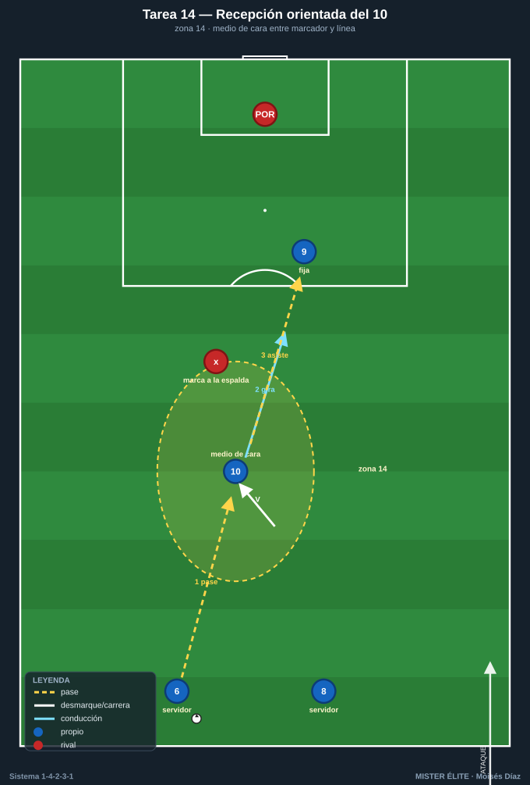
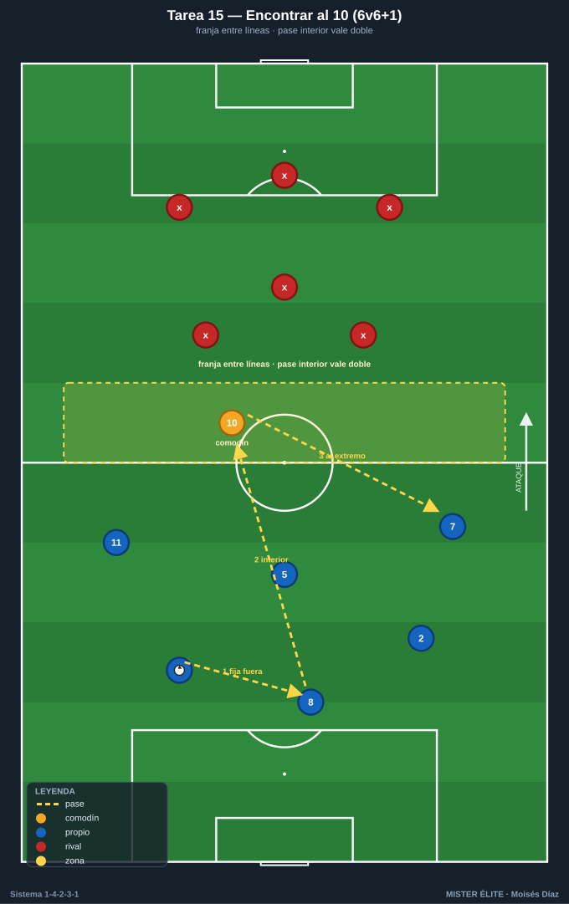
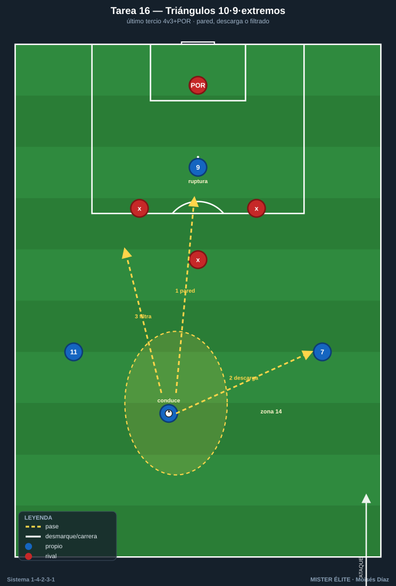
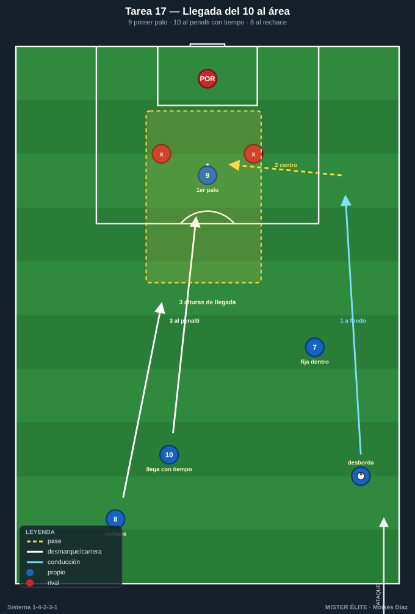
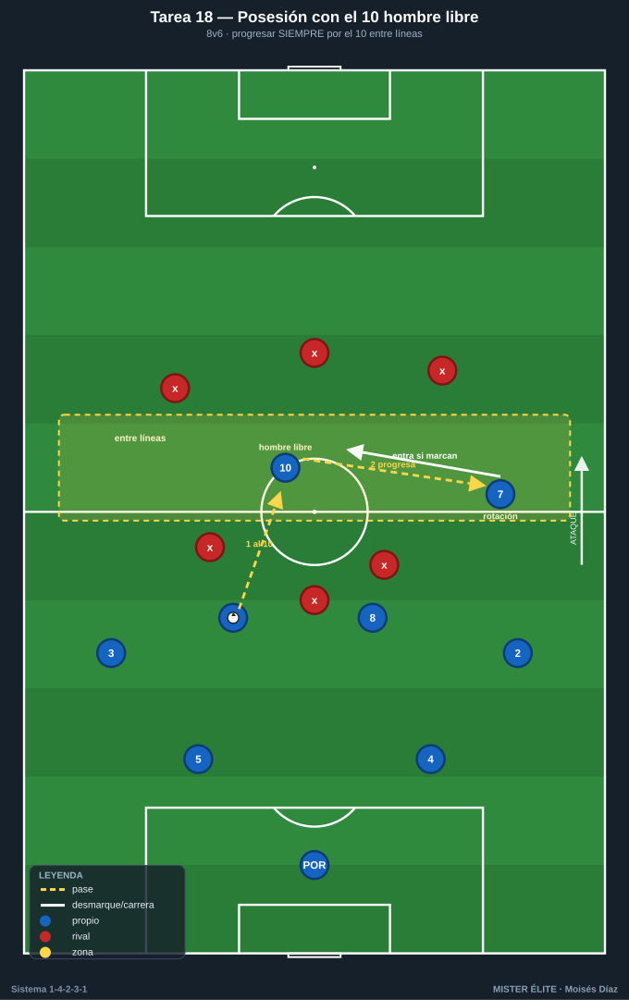

# Bloque 4 · La mediapunta (10) entre líneas / zona 14 (T14–18)

> El bloque clave. La **zona 14** es la zona de más valor y el **MCO 10** vive ahí: recibe medio de cara, asocia, llega al área y dirige la última fase. Categorías: **F** · **A** · **S**.
> Leyenda de pizarras en el [README](../README.md). Atacar siempre hacia arriba.

---

## Tarea 4.1 — Recepción orientada del 10 en zona 14

- **Objetivo:** entrenar la recepción **de cara / de perfil** del mediapunta entre líneas, con primer control orientado a portería.
- **Organización:** 30x25 m frente a portería con POR. El 10 ocupa la zona 14. Servidores: 6 y 8 detrás; 9 fija arriba; un marcador (pivote rival) a la espalda del 10.

- **Desarrollo:** el pivote pasa al 10; este se perfila y recibe orientado entre el marcador y la línea, gira y conduce/finaliza o asiste al 9.
- **Provocaciones:** (1) **El 10 recibe SIEMPRE de cara o medio perfil; prohibido de espaldas** (si recibe de espaldas con el marcador encima, repetir): fuerza el desmarque previo en V. (2) Solo 2 toques: control orientado + acción. (3) Antes de recibir, un movimiento de engaño (mirar y arrancar al hueco contrario).
- **Variantes:** fácil = sin marcador; medio = marcador pasivo; difícil = marcador activo + opción de pared con el 9.
- **Coaching:** chequeo de hombro antes de recibir; perfil semiabierto; "recibe ya orientado, no controles y luego te giras".
- **Duración / Categoría:** 4x4 min · **F**

---

## Tarea 4.2 — "Encontrar al 10": ventanas de pase entre líneas 6v6+1

- **Objetivo:** que el equipo genere y reconozca las **ventanas de pase interior** al mediapunta entre la línea de medios y la defensa rival.
- **Organización:** 40x36 m con una franja central "entre líneas" de 8 m de ancho. El 10 (comodín) solo juega dentro de esa franja. Azules atacan; rojos defienden con una línea de medios y una de defensa.

- **Desarrollo:** los azules circulan para abrir una ventana y filtrar al 10 en la franja; cuando recibe, juega a un toque para progresar.
- **Provocaciones:** (1) **El pase interior al 10 vale doble** y solo cuenta si llega a la franja entre líneas (no por fuera). (2) El 10 obligado a 1-2 toques (no se estanca). (3) +1 si tras recibir el 10 conecta con el 9 o un extremo en ruptura.
- **Variantes:** fácil = franja ancha; medio = franja estrecha; difícil = añadir un segundo defensor que vigile la franja.
- **Coaching:** "antes del pase interior, fija con un pase exterior"; timing = cuando el 10 está libre y la línea rival abierta; cuerpo del pasador.
- **Duración / Categoría:** 4x4 min · **A**

---

## Tarea 4.3 — Asociación 10-9-extremos: triángulos en el último tercio

- **Objetivo:** combinaciones de toque en zona de finalización entre 10, 9 y extremos 7/11 (paredes, terceros hombres, ruptura del 9).
- **Organización:** último tercio, 35x40 m. Azules: 10, 9, 7, 11 vs 3 defensas rojos + POR.

- **Desarrollo:** el 10 conduce a zona 14 y combina: pared con el 9, descarga al extremo o filtra a la ruptura del 9. Finalizar en 3 acciones máximo.
- **Provocaciones:** (1) **El gol solo vale si el balón pasa por el 10** en la jugada (director de la última fase). (2) Obligatorio un pase de ruptura (vertical entre defensas) antes del remate. (3) Máx. 8 s desde que el 10 recibe hasta el remate.
- **Variantes:** fácil = 4v2; medio = 4v3; difícil = 4v4 con un pivote rival que protege.
- **Coaching:** "el 10 fija y suelta"; sincronía de la ruptura del 9 (arranca cuando el 10 levanta la cabeza); ataque del segundo palo de los extremos.
- **Duración / Categoría:** 4x4 min · **A**

---

## Tarea 4.4 — Llegada del 10 al área desde segunda línea

- **Objetivo:** entrenar la **llegada al área del mediapunta** desde segunda línea para rematar centros/descargas, aprovechando que el 9 fija a los centrales.
- **Organización:** ataque sobre portería con POR. Carril de centro (extremo + lateral en desdoblamiento), 9 fijando el primer palo, 10 llegando desde fuera del área al punto de penalti, 8 como segunda llegada.

- **Desarrollo:** centro desde banda; el 9 arrastra al primer palo, el 10 ataca el espacio de penalti, el 8 va al rechace. Repetir por ambos lados.
- **Provocaciones:** (1) **El 10 no puede entrar al área antes del centro** (llegada con tiempo desde atrás, no esperando dentro): si entra antes, gol anulado. (2) Remate del 10 vale doble. (3) Obligatorio 3 alturas de llegada (9 primer palo, 10 penalti, 8 rechace).
- **Variantes:** fácil = sin defensa; medio = con 2 defensas; difícil = defensa completa + POR y oposición al timing.
- **Coaching:** "llega, no estés"; lectura del momento de arrancar; ataque del espacio, no del balón.
- **Duración / Categoría:** 4x4 min (alternar bandas) · **A**

---

## Tarea 4.5 — Posesión posicional con el 10 como hombre libre permanente

- **Objetivo:** que todo el equipo juegue "buscando al 10" como referencia entre líneas para progresar; jerarquía del mediapunta en la circulación.
- **Organización:** 50x40 m. Azules 8 (estructura 1-4-2-3-1 reducida) buscan progresar; rojos 6 defienden en bloque medio. El 10 ocupa la zona de enganche.

- **Desarrollo:** posesión para progresar de campo; cada vez que se encuentra al 10 entre líneas y este sostiene/gira, suma progresión.
- **Provocaciones:** (1) **Para pasar de campo defensivo a ofensivo, el balón debe haber pasado por el 10 al menos una vez** (no se progresa saltándolo). (2) El 10 que recibe y pierde de cara no penaliza; recibir de espaldas y perder, sí (premia la orientación). (3) Si el 10 está marcado, un extremo entra al espacio (rotación).
- **Variantes:** fácil = rojos pasivos; medio = bloque medio activo; difícil = marca individual al 10.
- **Coaching:** reconocer cuándo el 10 está libre; "si tapan al 10, alguien ocupa su espacio"; orientación y protección de balón del enganche.
- **Duración / Categoría:** 4x5 min · **A**
