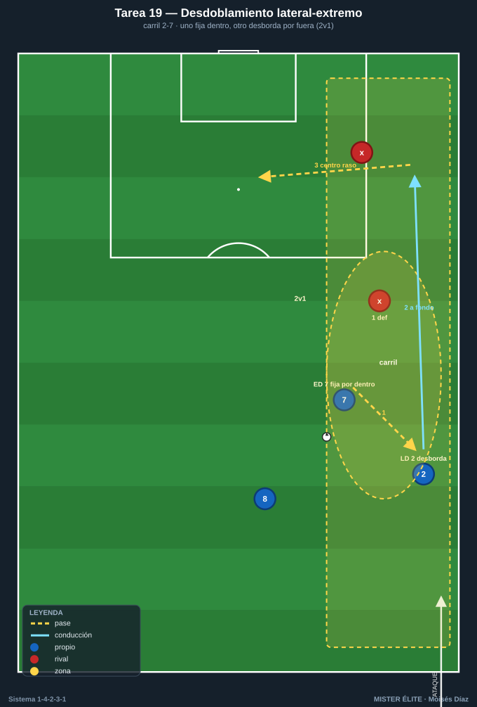
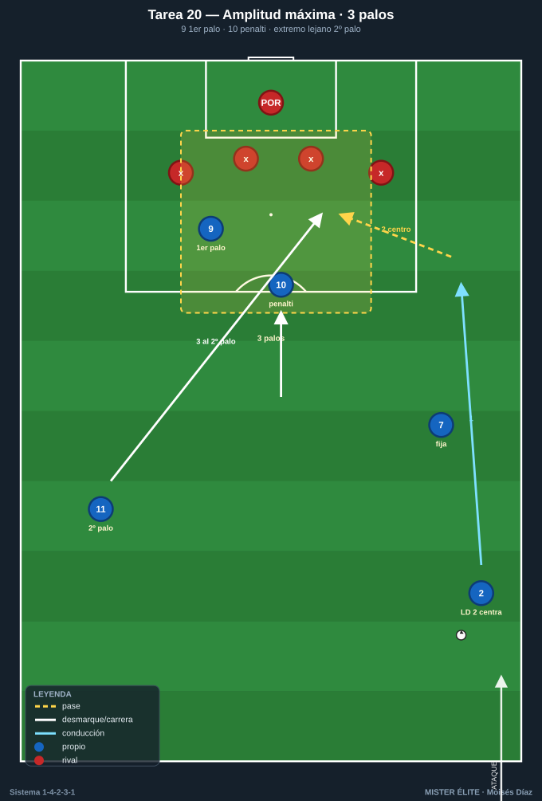
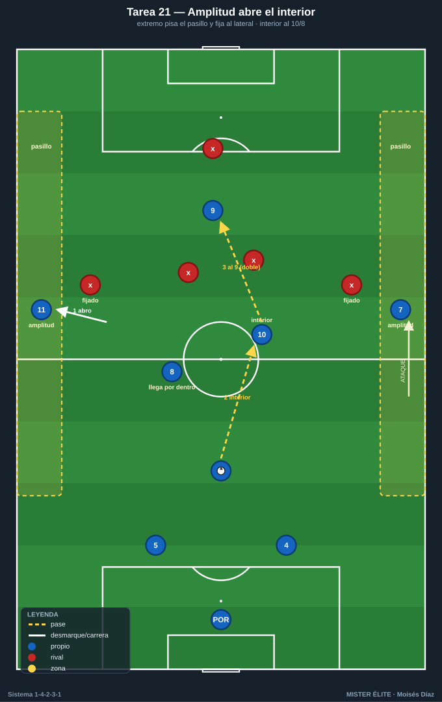
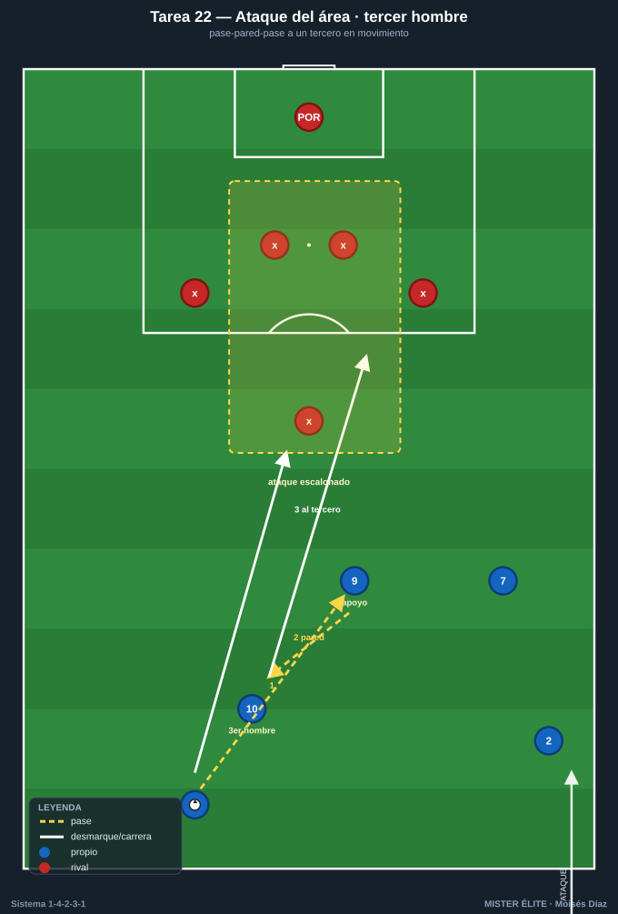

# Bloque 5 · Extremos + laterales + 9: amplitud, desdoblamiento y centros (T19–22)

> El frente ofensivo. **Amplitud** que estira a la defensa, **desdoblamiento** lateral-extremo y **ataque del área** con varias alturas. Categorías: **F** · **A** · **S**.
> Leyenda de pizarras en el [README](../README.md). Atacar siempre hacia arriba.

---

## Tarea 5.1 — Desdoblamiento lateral-extremo por carril

- **Objetivo:** automatizar el **desdoblamiento** LD-ED (2-7) / LI-EI (3-11): si el extremo pisa por dentro, el lateral da amplitud y desborda; y viceversa.
- **Organización:** un carril lateral, 25x35 m hasta línea de fondo. Azules: extremo 7/11, lateral 2/3 y un apoyo interior (8). Rojos: lateral + un apoyo defensivo.

- **Desarrollo:** combinación en el carril para llegar a la línea de fondo y centrar: el extremo fija dentro, el lateral aparece por fuera (o al revés). Centro al área.
- **Provocaciones:** (1) **Solo vale llegar a fondo con desdoblamiento real:** el que centra debe ser distinto del que recibió primero en el carril (uno fija, otro desborda). (2) Centro raso/tenso obligatorio (no globo). (3) +1 si el desdoblamiento crea un 2v1 claro sobre el lateral rival.
- **Variantes:** fácil = 3v1; medio = 3v2; difícil = 4v3 con cobertura rival.
- **Coaching:** comunicación extremo-lateral ("dentro/fuera"); timing de la sobremarcha del lateral; calidad y altura del centro.
- **Duración / Categoría:** 4x4 min por carril · **A**

---

## Tarea 5.2 — Amplitud máxima: 9 + 2 extremos atacando el área

- **Objetivo:** ocupar el área con la referencia 9 + el extremo lejano + la llegada, atacando los **tres palos** en los centros laterales.
- **Organización:** zona de ataque, 50x44 m. Azules: extremo del lado del centro, lateral que desdobla, 9, extremo contrario y 10. Rojos: 4 defensas + POR.

- **Desarrollo:** ataque por banda y centro; ocupación del área con 9 al primer palo, extremo lejano al segundo palo, 10 al punto de penalti.
- **Provocaciones:** (1) **Obligatorio ocupar los 3 palos antes del centro** (primer palo, penalti, segundo palo); si falta una referencia, gol anulado. (2) El extremo del lado contrario DEBE entrar al segundo palo (no quedarse abierto). (3) Remate de primera = doble.
- **Variantes:** fácil = 5v3; medio = 5v4; difícil = 5v5 con marca al hombre en el área.
- **Coaching:** "el extremo del lado lejano es un rematador"; ataque del espacio entre central y lateral; tipos de centro según la posición de la defensa.
- **Duración / Categoría:** 4x4 min (alternar bandas) · **A**

---

## Tarea 5.3 — Amplitud para abrir el interior: el extremo fija al lateral rival

- **Objetivo:** usar la amplitud de los extremos para estirar la defensa y abrir el carril interior al 10 y al pivote que llega.
- **Organización:** 65x55 m con dos pasillos exteriores de 6 m. Azules en 1-4-2-3-1; rojos en bloque.

- **Desarrollo:** progresar buscando jugar por dentro (al 10 / 8 que llega), pero solo posible si los extremos mantienen la anchura para fijar a los laterales rivales.
- **Provocaciones:** (1) **Al menos un extremo siempre pisando el pasillo exterior** (si los dos se cierran, pérdida): garantiza la amplitud que abre el interior. (2) El gol por dentro (asistencia del 10 u 8) vale doble. (3) Cambio de orientación de banda a banda = +1.
- **Variantes:** fácil = pasillos anchos; medio = estrechos; difícil = los extremos pisan por dentro solo si el lateral ocupa su amplitud (rotación de carril).
- **Coaching:** "abro yo para que entre el 10"; relación amplitud-profundidad; cuándo pisar por dentro y cuándo abrir.
- **Duración / Categoría:** 4x5 min · **A**

---

## Tarea 5.4 — Ataque del área con tercer hombre: extremo-lateral-9-10

- **Objetivo:** combinar en zona de finalización con tercer hombre para generar el último pase y el ataque del área coordinado.
- **Organización:** último tercio, 45x44 m. Azules: 7/11, 2/3, 9, 10, 8. Rojos: 5 + POR.

- **Desarrollo:** combinación rápida en el último tercio (paredes, terceros hombres) para asistir desde fondo o desde dentro, con ataque escalonado del área.
- **Provocaciones:** (1) **Antes del remate, una combinación de tercer hombre obligatoria** (pase-pared-pase a un tercero en movimiento). (2) Máx. 3 toques por jugador en el último tercio. (3) Gol tras llegada de segunda línea (10 u 8) = doble.
- **Variantes:** fácil = 6v3; medio = 6v5; difícil = 6v6 con un pivote rival que protege el área.
- **Coaching:** sincronía de los movimientos de ruptura; "el último pase es el que rompe la última línea"; ataque de los espacios entre defensas.
- **Duración / Categoría:** 4x4 min · **A**
