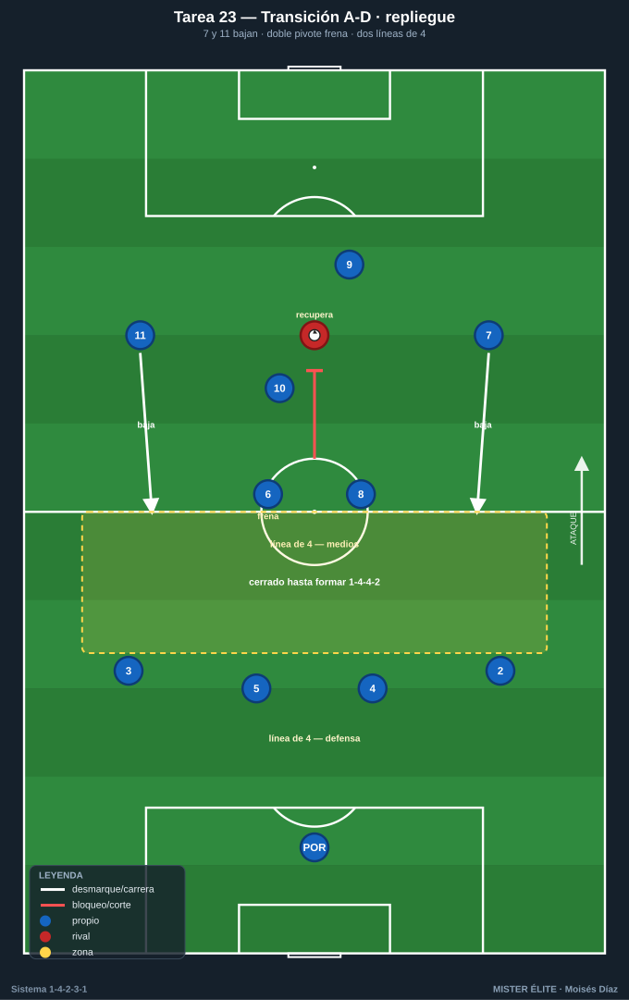
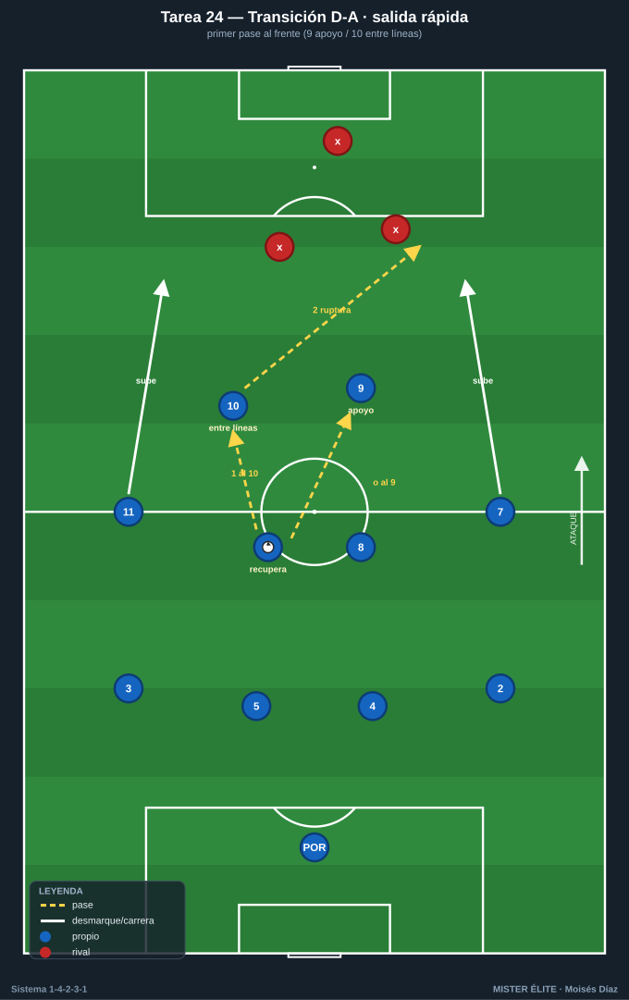
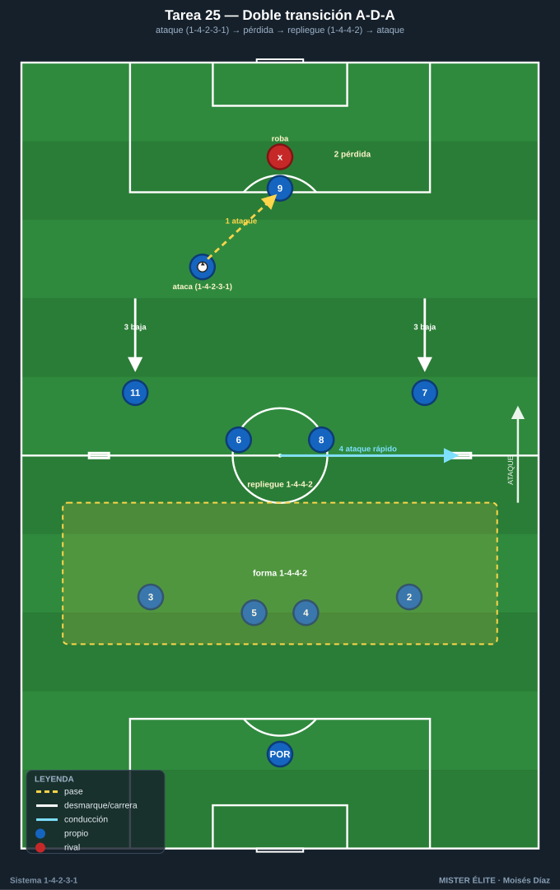
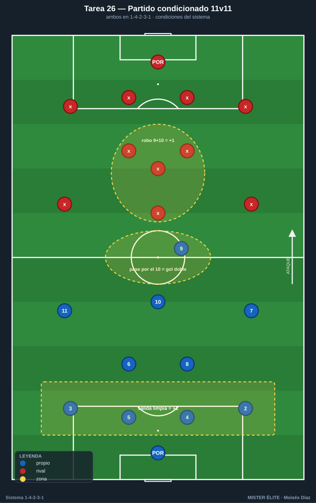

# Bloque 6 · Transiciones (A-D, D-A) + partido condicionado (T23–26)

> El cierre integrador. Encadenar las **dos transiciones** y los **dos cambios de forma** (1-4-2-3-1 ↔ 1-4-4-2) y llevarlo todo a un partido real con reglas del sistema. Categorías mayoritariamente **S**.
> Leyenda de pizarras en el [README](../README.md). Atacar siempre hacia arriba.

---

## Tarea 6.1 — Transición A-D: repliegue ordenado a 1-4-4-2 tras pérdida

- **Objetivo:** ejecutar la transición ataque-defensa replegando la estructura a 1-4-4-2 con los extremos bajando, frenando la contra rival.
- **Organización:** 70x55 m, 2 porterías con POR. Azules atacan en 1-4-2-3-1; al perder deben replegar.

- **Desarrollo:** ataque azul; al perder, repliegue inmediato a 1-4-4-2 (7 y 11 bajan), frenar la contra y reorganizar el bloque medio.
- **Provocaciones:** (1) **Tras la pérdida, ningún rival puede progresar entre las dos líneas de 4 hasta que estén formadas;** si el rival mete un pase interior antes de formarse el 1-4-4-2 = punto. (2) Recuperar y volver a 1-4-2-3-1 ofensivo = +1. (3) El primer jugador en frenar debe ser el más cercano, no siempre el pivote.
- **Variantes:** fácil = rival contra controlado; medio = contra a 2 toques; difícil = contra libre y rápida.
- **Coaching:** "frena-cae-forma"; el balón se presiona, el resto cae a su línea; comunicación de los extremos al bajar.
- **Duración / Categoría:** 4x5 min · **S**

---

## Tarea 6.2 — Transición D-A: salida rápida desde el 1-4-4-2 buscando al 9 y al 10

- **Objetivo:** tras recuperar en bloque 1-4-4-2, lanzar la transición ofensiva veloz reactivando al 9 (referencia) y al 10 (entre líneas), con los extremos volviendo a subir.
- **Organización:** 70x55 m, 2 porterías con POR. Recuperaciones provocadas en bloque medio.

- **Desarrollo:** al recuperar, primer pase al 9 (que se apoya) o al 10 (entre líneas); los extremos 7/11 vuelven a la altura de ataque y se ataca con verticalidad.
- **Provocaciones:** (1) **El primer pase tras recuperar debe ir hacia delante (al 9 o al 10);** prohibido el primer pase hacia atrás. (2) Finalizar la transición en menos de 8 s = doble. (3) Si el 10 recibe de cara en la transición y conecta con ruptura = +1.
- **Variantes:** fácil = rival repliega lento; medio = rival repliega normal; difícil = rival contrapresiona la recuperación.
- **Coaching:** "recuperar = mirar al frente"; apoyo y ruptura simultáneos (9 baja, extremo rompe); decisión rápida del primer pase.
- **Duración / Categoría:** 4x5 min · **S**

---

## Tarea 6.3 — Doble transición: ciclo A-D-A con cambio de estructura

- **Objetivo:** encadenar las dos transiciones y los dos cambios de forma (1-4-2-3-1 ↔ 1-4-4-2) en un mismo ciclo, bajo fatiga y decisión.
- **Organización:** 75x60 m, 2 porterías con POR + 2 mini-porterías de contra. Posesión que cambia de manos por reglas de pérdida forzada.

- **Desarrollo:** ciclo continuo: ataque (1-4-2-3-1) → pérdida → repliegue (1-4-4-2) → recuperación → ataque rápido. El cuerpo técnico provoca pérdidas para encadenar.
- **Provocaciones:** (1) **Cada equipo debe verbalizar y ejecutar el cambio de forma** en cada cambio de posesión (un evaluador valida que los extremos suben/bajan correctamente). (2) Gol en transición (menos de 10 s tras recuperar) = doble. (3) No formar la estructura correcta dos veces seguidas = posesión al rival.
- **Variantes:** fácil = pausas entre ciclos; medio = ciclo continuo; difícil = inferioridad temporal del que recupera.
- **Coaching:** liderazgo en los cambios de fase; economía de esfuerzo en el repliegue, explosividad en la salida; "la forma se cambia corriendo, no andando".
- **Duración / Categoría:** 4x4 min, descansos amplios · **S**

---

## Tarea 6.4 — Partido condicionado 11v11: 1-4-2-3-1 con reglas del sistema

- **Objetivo:** integrar todos los comportamientos del sistema (salida, doble pivote, 10 entre líneas, presión 9+10, amplitud, mutación) en formato real competitivo.
- **Organización:** campo completo, 2 porterías con POR. Ambos equipos en 1-4-2-3-1; el cuerpo técnico aplica las condiciones.

- **Desarrollo:** partido con marcador y condiciones acumulativas que premian los comportamientos del sistema.
- **Provocaciones:** (1) **Gol tras pasar por el 10 entre líneas = doble.** (2) Gol tras salida limpia superando la primera presión = +1 extra. (3) Recuperar ya formados en 1-4-4-2 = se conserva la posesión con ventaja; conceder progresión central por no proteger con el doble pivote = el rival saca con ventaja. (4) Presión válida de la dupla 9+10 que provoca pérdida rival en su campo = +1.
- **Variantes:** fácil = 1 sola condición activa; medio = 2-3 condiciones; difícil = todas las condiciones + tiempo reducido.
- **Coaching:** feedback por fases; congelar imagen en errores de estructura; reforzar las referencias del sistema más que el resultado.
- **Duración / Categoría:** 2-3 x 8-10 min · **S**
