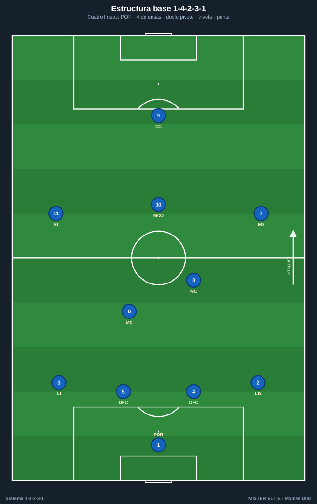
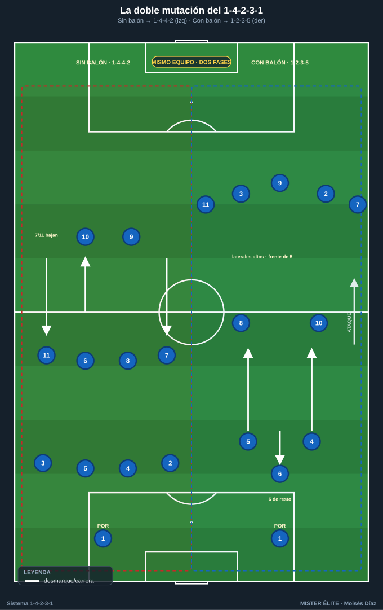
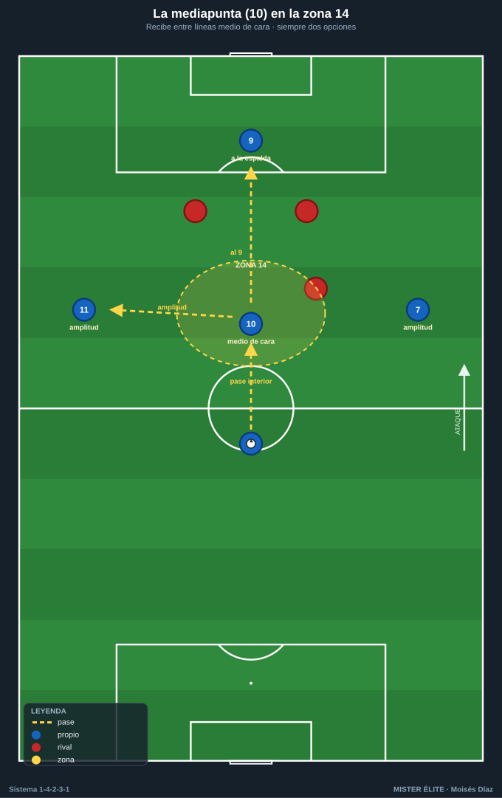
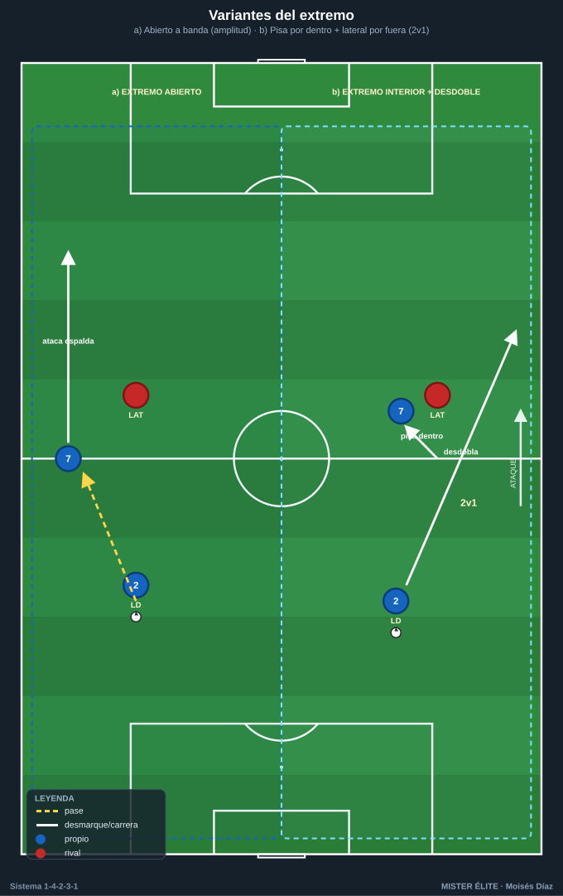
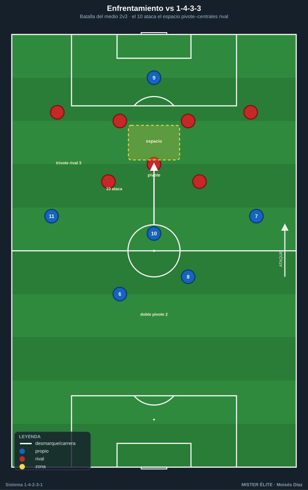
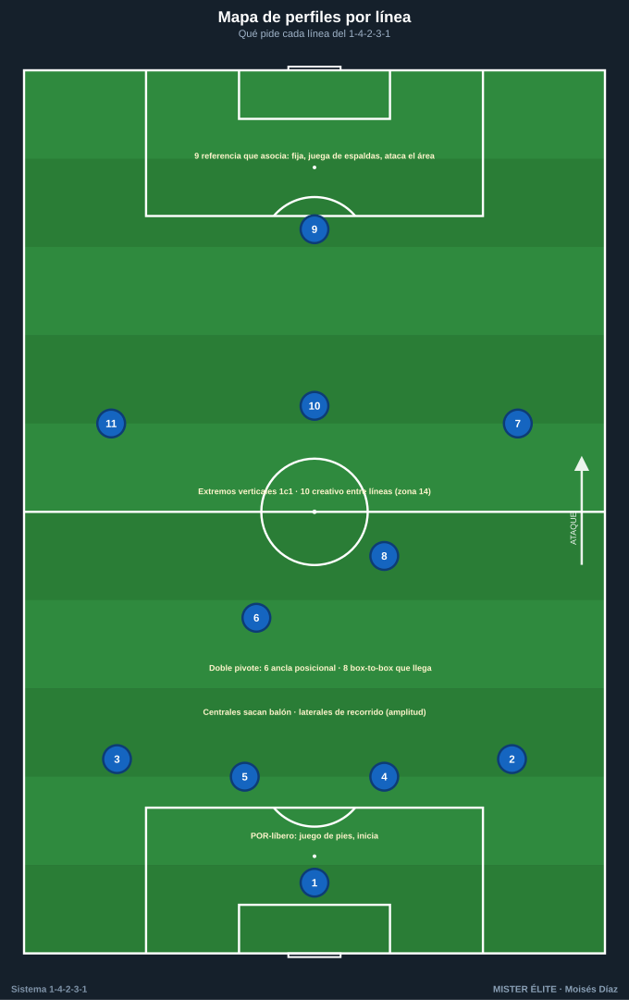

# Módulo 01 · Fundamentos y estructura del 1-4-2-3-1

> Nomenclatura del curso: POR 1 · línea de 4 (LD 2 · DFC 4 · DFC 5 · LI 3) · doble pivote MC 6 (ancla) + MC 8 (box-to-box) · trivote ED 7 · MCO 10 (mediapunta) · EI 11 · DC 9.

El 1-4-2-3-1 no es un dibujo rígido: es **una estructura clara que muta según la fase de juego**. Este módulo explica de qué piezas se compone, cómo cambia de forma sin balón y con balón, y qué perfil de jugador pide cada línea. Es teoría breve: lo justo para entender lo que luego se entrena en el campo.

---

## 1. La estructura: cuatro líneas claras

El 1-4-2-3-1 reparte a los diez jugadores de campo en **cuatro líneas**, y ese reparto limpio es su gran virtud: equilibrio y compartimentación.

- **Línea defensiva (4):** dos centrales (DFC 4 y 5) y dos laterales (LD 2, LI 3). Defensa de cuatro clásica con coberturas y basculaciones. Los laterales son la **fuente principal de amplitud** en ataque.
- **Doble pivote (2):** MC 6 y MC 8 por delante de los centrales. Es el **corazón del sistema**: tapa el espacio entre líneas, protege el carril central y arranca la construcción.
- **Línea de 3 (3):** dos extremos (ED 7, EI 11) abriendo el campo y una **mediapunta (MCO 10)** por dentro, jugando entre líneas.
- **Punta (1):** DC 9, referencia única que fija a los centrales y asocia hacia atrás.

### Distancias de referencia
- **Anchura defensiva:** separaciones de **8–12 m** entre defensas; nunca más de un pasillo de distancia.
- **Doble pivote:** separados **8–15 m** entre sí, ~**8–10 m** por delante de los centrales. No se juntan ni se alinean; uno cubre la espalda del otro.
- **Línea de 3:** extremos a la máxima anchura; el 10 en el centro, **10–15 m** por delante del doble pivote, en la franja entre la línea de medios y la defensa rival.
- **Longitud del bloque (última línea ↔ 9):** bloque medio = **30–35 m** (estándar del curso); bajo 25–30 m; alto hasta 40 m.
- **Distancia entre líneas propias:** **10–12 m** en bloque compacto sin balón; hasta **15 m** en construcción/ataque para tener líneas de pase. Nunca más de 12 m sin balón en bloque medio/bajo.

---

## 2. La idea fuerza: la DOBLE estructura

El 1-4-2-3-1 son, en realidad, **dos sistemas en uno** según la fase:

- **Sin balón → se repliega a 1-4-4-2 / 1-4-4-1-1.** Los extremos 7/11 bajan a formar una línea de 4 medios junto al doble pivote; el 10 sube junto al 9 (1-4-4-2) o queda medio escalón por detrás vigilando al pivote rival (1-4-4-1-1). Dos líneas de cuatro muy compactas, difíciles de penetrar.
- **Con balón → se estira a 1-2-3-5 / 1-4-3-3.** Suben los dos laterales (2 y 3) hasta dar amplitud alta, un pivote (normalmente el 6) **baja entre o junto a los centrales** (salida en 3 tipo Lavolpe), el otro pivote (8) y el 10 forman la línea de creación, y arriba se dibuja un **frente de cinco** que ocupa los cinco carriles. Ese "5" lo forman los **dos extremos + los dos laterales altos + el 9**: dos quedan en banda y tres pueblan los carriles interiores y el central.

**La transición fluida entre esas dos formas es lo que hace moderno y vigente al sistema.** Entrenarla es el objetivo central del curso.

---

## 3. La mediapunta (10) y la zona 14

La **zona 14** es la franja central justo delante del área rival (centro del último tercio). Es la zona de máxima generación de ocasiones, y el MCO 10 vive ahí:

- Recibe **de espaldas o de perfil entre líneas**, gira y filtra el último pase.
- Llega a rematar de **segunda línea**.
- Defensivamente, es el **primer puente** entre el bloque de medios y el 9.

Es el jugador con más libertad del equipo: se asocia con ambos extremos y descarga sobre el 9. Cuando recibe, debe tener **siempre dos opciones**: el 9 a la espalda de la defensa (para soltar de primeras) y un extremo o lateral en amplitud (para cambiar de orientación).

---

## 4. Variantes del sistema

### Doble pivote: 6 + 8 vs 6 + 10 más bajo
- **6 + 8 (clásico):** ancla posicional (6) + box-to-box (8) que conduce, equilibra y llega. Más recorrido y verticalidad; el 10 queda muy alto.
- **6 + 10 más bajo (doble seis creativo):** dos mediocentros de inicio, uno destructor y otro organizador que baja a recibir; el "10" nominal juega más cerca del medio. Da más control y dominio del balón a costa de menos llegada al área. Útil contra rivales que aprietan la salida.

### Extremos: abiertos vs interiores
- **Extremos abiertos (verticales):** pegados a banda, atacan el espacio a la espalda del lateral; dan amplitud pura, centros y uno-contra-uno.
- **Extremos interiores (que pisan por dentro):** entran al carril interior para combinar y rematar, **liberando la banda al lateral** que sube por fuera (mecanismo lateral-extremo). Genera superioridad interior y sobrecargas en zona 14.

### Cuándo y cómo muta defensivamente
- **A 1-4-4-2 sin balón:** el 10 sube junto al 9 para **presionar arriba a dos centrales** o igualar a un rival con doble pivote.
- **A 1-4-4-1-1 sin balón:** el 10 queda medio escalón por detrás del 9 para **tapar al pivote/organizador rival**; preferido en bloque medio-bajo.
- En ambos, los extremos 7/11 bajan a la línea de 4 medios. La mutación es **dinámica y por fase**, no un cambio de jugadores.

---

## 5. Ventajas, desventajas y enfrentamientos

### Ventajas
- Equilibrio defensa-ataque y **control del centro** (doble pivote = superioridad ante un punta solo).
- Estructura clara y **fácil de enseñar**; roles definidos por carril.
- **Flexibilidad de fase** (muta sin cambiar de jugadores).
- Un **creador libre (10)** en la zona de más valor.

### Desventajas
- Puede quedar **aislado el 9** si la línea de 3 no acompaña.
- Si los dos pivotes son ofensivos, se **descubre el eje** ante la contra.
- Exige **laterales de mucho recorrido** (sostienen toda la banda en ataque y defensa).
- El 10 que no repliega genera **inferioridad en el medio** contra trivotes (2 vs 3).

### Enfrentamientos rápidos
- **vs 1-4-3-3:** la batalla del medio es **2 vs 3**. Solución: el 10 baja a igualar (3 vs 3) o presión orientada a banda. A favor: el 10 ataca el espacio entre el pivote y los centrales rivales.
- **vs 1-4-4-2:** ventaja estructural típica: la **zona 14 queda libre** y el 10 encuentra espacio entre líneas. Riesgo: si los mediocentros del 4-4-2 son agresivos pueden incomodar al 10 — no es ventaja automática.
- **vs 1-3-5-2:** posible **inferioridad central** (2 vs 3 mediocentros). Los extremos deben replegar mucho para no dejar solos a los laterales ante los carrileros. Bascular rápido y castigar el **lado débil** que deja el carrilero al subir.

---

## 6. Perfiles idóneos por línea

| Línea | Dorsal | Perfil ideal |
|---|---|---|
| Portero | POR 1 | Juego de pies, valiente fuera del área, inicia la construcción (portero-líbero). |
| Centrales | DFC 4 / 5 | **Sacan el balón** (uno más zurdo para abrir por su perfil), buen 1c1, lectura y cobertura. |
| Laterales | LD 2 / LI 3 | **Recorrido y fondo físico**: defienden su carril y dan toda la amplitud; capaces de jugar de extremos altos. |
| Pivote ancla | MC 6 | **Posicional**, inteligencia táctica, primera salida limpia, protege a los centrales; rara vez abandona el eje. |
| Pivote box-to-box | MC 8 | **Recorrido vertical**, conducción, equilibrio y **llegada** al área de segunda línea. |
| Mediapunta | MCO 10 | **Creativa**: recibe entre líneas, gira bajo presión, último pase y gol; el cerebro del ataque en la zona 14. |
| Extremos | ED 7 / EI 11 | **Verticales y desequilibrantes** en el 1c1; dan amplitud o pisan por dentro; **disciplina defensiva** para replegar. |
| Delantero | DC 9 | **Referencia que asocia**: fija a los centrales, juega de espaldas, ataca el área y abre espacio para 10 y 8. |

---

## Ideas clave
- El 1-4-2-3-1 son **dos estructuras en una**: muta a 1-4-4-2 / 1-4-4-1-1 sin balón y a 1-2-3-5 / 1-4-3-3 con balón, **sin cambiar de jugadores**.
- El **doble pivote (6 ancla + 8 box-to-box)** es el corazón: da control del centro y superioridad ante un punta solo.
- La **mediapunta (10)** en la **zona 14** es la pieza más valiosa: recibe entre líneas con dos opciones siempre.
- Los **extremos 7/11** son la bisagra de la mutación: dan amplitud con balón y bajan a la línea de 4 sin balón.
- Pide **laterales de mucho recorrido** y un central que saque el balón.

## Errores comunes
- Tratar el dibujo como **fijo**: si no se entrena la mutación, el equipo defiende mal y ataca corto.
- Dejar a los **dos pivotes a la misma altura** (sin escalonar): se pierde cobertura y líneas de pase.
- Subir los **dos laterales a la vez** sin tapar la espalda: el agujero estructural más explotado del sistema.
- Que el **10 no repliegue**: inferioridad numérica en el medio contra trivotes.
- **Aislar al 9** arriba: sin acompañamiento de la línea de 3, la referencia se queda sola.
