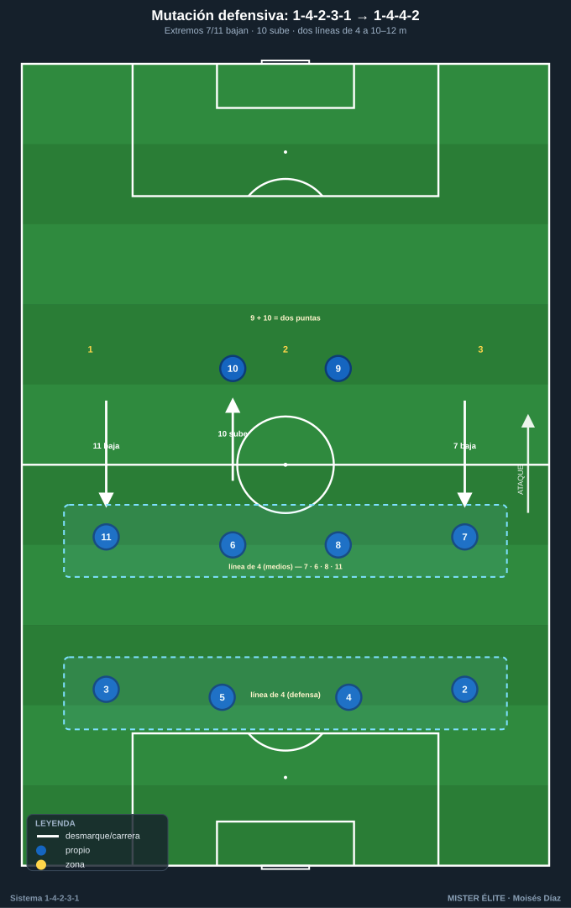
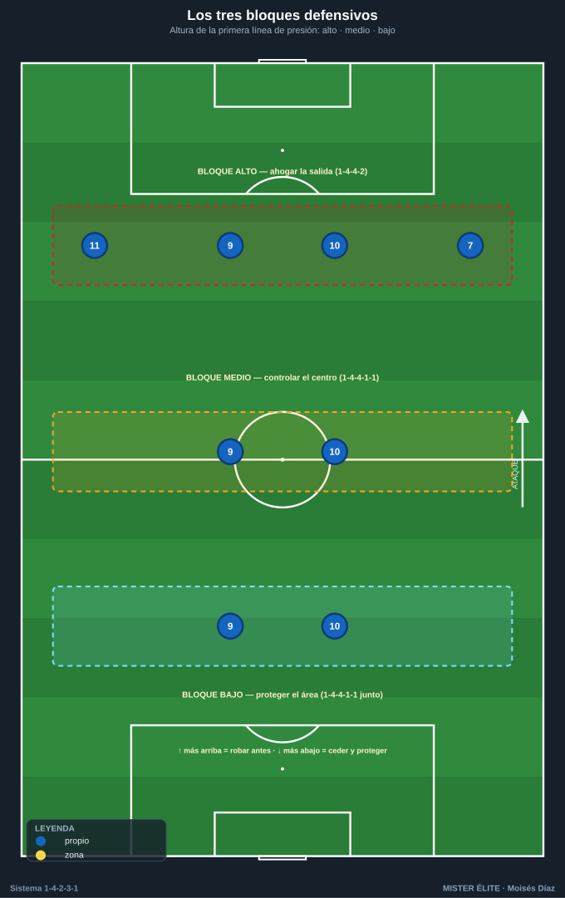
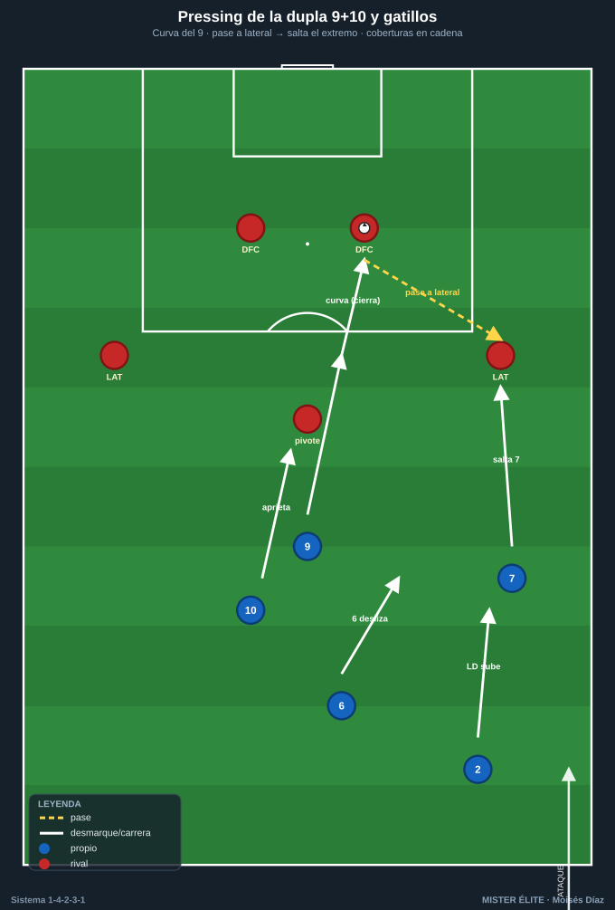
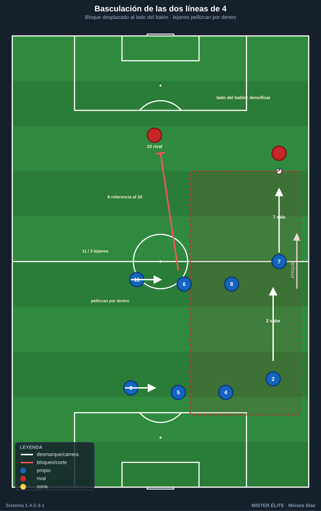

# Módulo 02 · Fase defensiva del 1-4-2-3-1

> Idea matriz: **sin balón el 1-4-2-3-1 NO defiende como un 1-4-2-3-1**. Muta a **1-4-4-2** (el 10 sube con el 9) o a **1-4-4-1-1** (el 10 engancha al pivote rival). Los extremos 7/11 son la bisagra de esa mutación.

Defender bien este sistema es, sobre todo, **cambiar de forma con orden**. Este módulo recorre los roles defensivos, cómo se muta a dos líneas de 4, los bloques y alturas, el pressing de la dupla 9+10 con sus gatillos, la basculación y, lo más importante, **el punto débil y sus soluciones**.

---

## 1. Roles defensivos por demarcación

- **POR 1 — portero-líbero:** última cobertura a la espalda de la línea de 4. Cuando el bloque sube, se adelanta a la frontal del área (10–16 m de la portería) para barrer pelotazos al espacio. Manda la línea de fuera de juego con la voz.
- **DFC 4 / 5 — los dos centrales:** pareja de **marca + cobertura permanente**. El central del lado del balón aprieta al DC rival; el del lado contrario baja medio cuerpo y **cubre** (diagonal). Ganan el duelo, mandan el fuera de juego y vigilan las llegadas de segunda línea (8/10 rival).
- **LD 2 / LI 3 — los dos laterales:** su duelo de referencia es el **1v1 con el extremo rival**, orientándolo hacia fuera. Deben cerrar el **intervalo lateral-central** (el espacio más sensible). Su proyección en ataque deja la **espalda** (ver punto 5).
- **Doble pivote 6 / 8:** el **6 (ancla)** tapa la zona 14 y es el seguro delante de los centrales; no salta salvo gatillo claro. El **8 (box-to-box)** sí puede saltar a presionar al pivote/interior rival. **Regla de oro: no salen los dos a la vez.**
- **Extremos 7 / 11 — el repliegue:** son la pieza que **transforma el dibujo**. Sin balón bajan a la línea de medios formando la segunda línea de 4. El del lado fuerte aprieta; el del lado débil **pellizca hacia dentro** para no dejar la línea abierta.
- **MCO 10 — mediapunta:** en presión **sube con el 9** (→ 1-4-4-2); si el plan es replegar, queda como enganche en **1-4-4-1-1 vigilando al pivote ancla rival**. Es el primer filtro del centro.

---

## 2. La mutación: de 1-4-2-3-1 a dos líneas de 4

Este es el mecanismo central de la fase defensiva. Tres pasos:

1. Los **extremos 7/11 bajan** a la altura del doble pivote → se forma la **segunda línea de 4** (7 – 6 – 8 – 11 o intercalados según lado).
2. El **10 sube con el 9** (→ 1-4-4-2 con dos puntas) **o** queda medio escalón por detrás enganchando al pivote rival (→ 1-4-4-1-1).
3. Resultado: **dos líneas de 4 + 2 (o 1+1)** puntas. Compacto, distancias de 10–12 m entre líneas.

---

## 3. Bloques y alturas

| Bloque | Altura 1ª línea de presión | Dibujo defensivo | Objetivo |
|---|---|---|---|
| **Alto** | Campo rival (~10–15 m de su área) | 1-4-4-2 (9+10 a los DFC; 7/11 saltan a laterales) | Robo arriba, ahogar la salida |
| **Medio** | Línea del medio campo | 1-4-4-1-1 / 1-4-4-2 | Controlar el centro, esperar el pase a zona 14 para saltar |
| **Bajo** | Borde de la propia área (~25–30 m de la portería) | 1-4-4-1-1 muy junto, líneas a 8–10 m | Cerrar espacios, proteger área, salir a la contra |

---

## 4. Pressing de la dupla 9 + 10

### Cómo presiona la dupla
- El **9 orienta**: presiona a un DFC rival con una **carrera curva** que cierra el pase al otro central, forzando la salida hacia una banda (el lado trampa).
- El **10 aprieta** al segundo central o al pivote ancla rival que cae a recibir. Entre los dos cortan la circulación y obligan a jugar al lateral → **gatillo de presión**.

### Gatillos (triggers)
- **Pase del central a su lateral → salta el extremo (7/11)** sobre ese lateral; detrás, el lateral propio sube a referenciar al extremo rival y el pivote desliza.
- **Pase al extremo rival → salta el lateral (2/3)** al duelo; el extremo propio repliega para tapar el interior y el central desliza a cubrir la espalda.
- **Pase interior al pivote rival → salta el 8** (o el 10 baja), el 6 tapa por detrás.
- **Control orientado malo / pase hacia atrás → presión colectiva** (señal de que se puede robar).
- **Balón en banda = trampa**: se cierra el pasillo de vuelta y se ahoga (la línea lateral defiende como un jugador más).

### Coberturas del doble pivote durante el pressing
- Cuando el 8 salta arriba, **el 6 cubre la zona 14** y referencia al 10/mediapunta rival.
- Cuando extremo y lateral suben a una banda, el pivote de ese lado **desliza a cubrir la espalda del lateral** y el central desliza con él. **Nunca saltan 6 y 8 juntos.**

---

## 5. Basculación de las dos líneas de 4

- Las dos líneas de 4 **basculan juntas y en bloque** hacia el lado del balón, como un acordeón. Distancia entre líneas 10–12 m; entre jugadores de la misma línea 8–10 m.
- **Lado del balón:** se densifica (lateral + extremo + pivote + central) para robar.
- **Lado contrario:** el **extremo lejano se mete por dentro** para no dejar abierta la línea de medios; el **lateral lejano pellizca hacia el central** dejando el carril muerto de su banda (se concede el cambio largo, no el centro).
- **Vigilancia de la mediapunta rival:** por defecto la coge el **MC 6 (ancla)**; si el 10 rival se desliza a banda, lo "pasa" al lateral/central de esa zona (entregas claras, no perseguir hasta romper el bloque).

---

## 6. Punto fuerte, punto débil y soluciones

### Punto fuerte
**Equilibrio y densidad central** gracias al doble pivote: dos jugadores protegen la zona 14 y la frontal del área, dan superioridad en el centro y permiten presionar sin desproteger la espalda. La mutación a dos líneas de 4 es de las estructuras más sólidas sin balón.

### Puntos débiles
- **(a) Lado débil / cambios de orientación:** al bascular y meter al extremo lejano por dentro, el carril contrario queda **momentáneamente solo**.
- **(b) Espalda de los laterales cuando suben:** si LD 2 / LI 3 se proyectan, dejan un **espacio enorme** que el extremo rival ataca en transición. Es el agujero estructural más explotado.
- **(c) Transición defensiva** tras pérdida con laterales arriba: 1v1 / 2v2 contra defensa desorganizada.

### Soluciones aplicables
1. **Subidas alternas (regla lateral-pivote):** nunca suben los dos laterales a la vez; cuando uno se proyecta, el **pivote de ese lado (6) cae a la línea** formando una defensa de 3 temporal que tapa la espalda. El otro pivote (8) sostiene el centro.
2. **Repliegue obligatorio del extremo del lado del lateral que sube:** si sube LD 2, el ED 7 es **el primero en volver**. Su carrera de regreso es innegociable.
3. **Extremo lejano "a media banda":** no se mete del todo dentro; queda en posición intermedia para salir al cambio de orientación en 2–3 toques.
4. **Central deslizando + portero líbero:** ante el balón largo a la espalda del lateral subido, el DFC de ese lado **cubre en diagonal** y el POR 1 adelanta su posición para barrer el espacio.
5. **Falta táctica / freno del 6:** ante pérdida peligrosa con el bloque partido, el pivote ancla **frena la primera transición** en zona segura para dar tiempo a recolocar las líneas.
6. **Contrapressing inmediato:** aprovechar la densidad central para **robar en 5" tras la pérdida** antes de que el rival ataque la espalda; si falla, repliegue ordenado.

---

## Checklist de campo (defensa 1-4-2-3-1)
- [ ] ¿Mutó el dibujo? Extremos 7/11 abajo → 1-4-4-2 / 1-4-4-1-1.
- [ ] ¿El 10 bien posicionado (sube con el 9 en presión / engancha al 6 rival en repliegue)?
- [ ] **¿Hay SIEMPRE un pivote por delante de la defensa?** (6 y 8 nunca juntos).
- [ ] ¿Gatillos claros y compartidos (pase a lateral → salta extremo; pase a extremo → salta lateral)?
- [ ] ¿Las dos líneas de 4 bascular juntas, 10–12 m, hacia el lado del balón?
- [ ] **¿Tapada la espalda de los laterales cuando suben?** (pivote cae / extremo repliega).
- [ ] ¿Quién referencia a la mediapunta rival en cada zona? (por defecto el 6).
- [ ] ¿Plan de transición claro? Contrapressing 5" → si falla, repliegue + freno del pivote.
- [ ] ¿Centro/zona 14 cerrada? Se concede banda, nunca interior.

---

## Ideas clave
- Sin balón el sistema **muta a dos líneas de 4**; los extremos bajan y el 10 sube (4-4-2) o engancha (4-4-1-1).
- **Regla de oro:** 6 y 8 **nunca saltan a la vez**; siempre uno por delante de la defensa.
- La dupla **9+10 presiona con curva** y orienta a banda; los gatillos los ejecuta todo el equipo en cadena.
- Se **concede la banda, nunca el interior**: la zona 14 es intocable.
- El **punto débil es la espalda de los laterales**: se cubre con subidas alternas y repliegue del extremo.

## Errores comunes
- **No mutar:** quedarse en 1-4-2-3-1 sin balón deja huecos entre las tres líneas ofensivas.
- **Saltar los dos pivotes** al mismo balón: se abre la zona 14 — pecado capital del sistema.
- **Presión recta del 9** (no curva): el rival escapa por el interior que debió taparse.
- **Bascular tarde** o dejar la línea de medios abierta por el lado débil.
- **Subir el lateral sin cobertura:** transición defensiva perdida antes de empezar.
