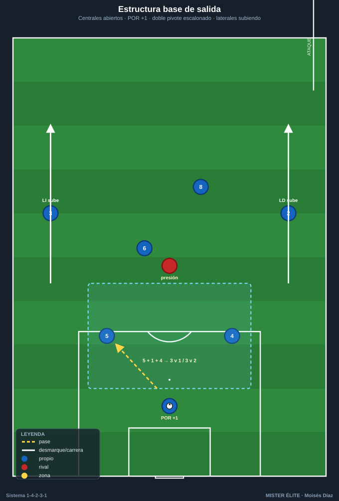
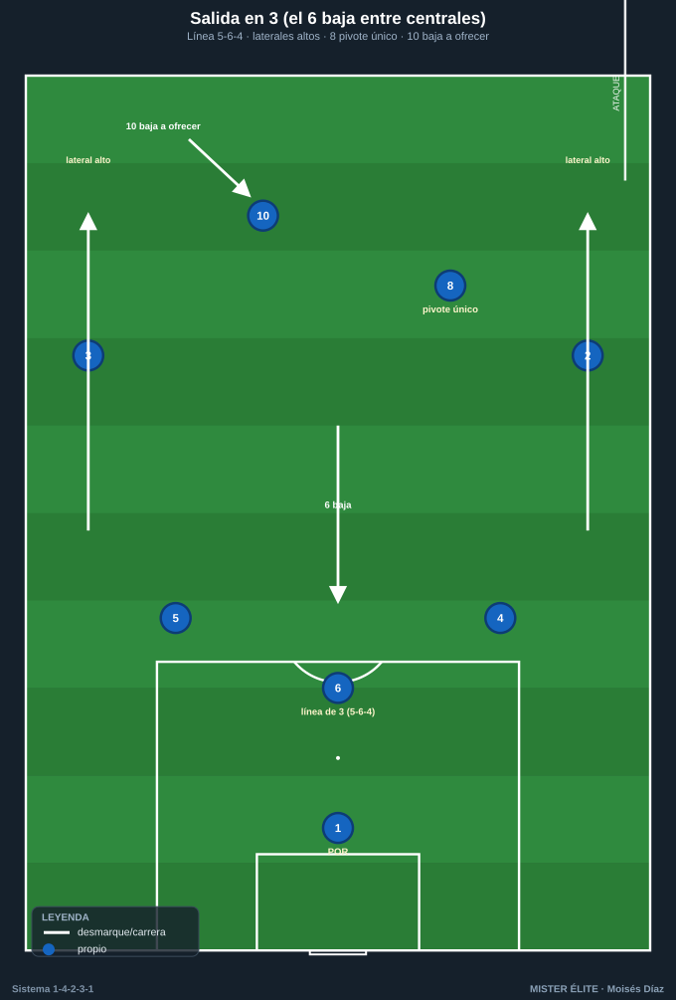
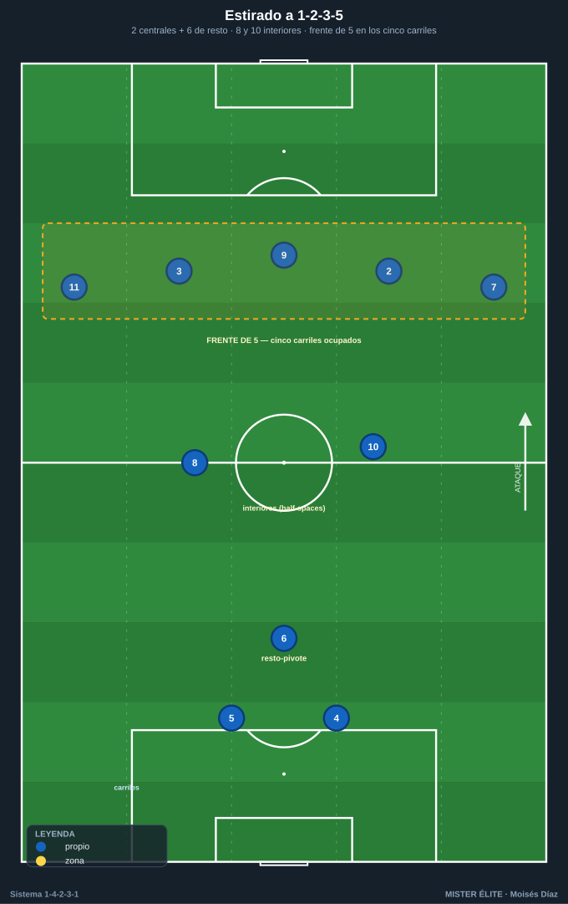
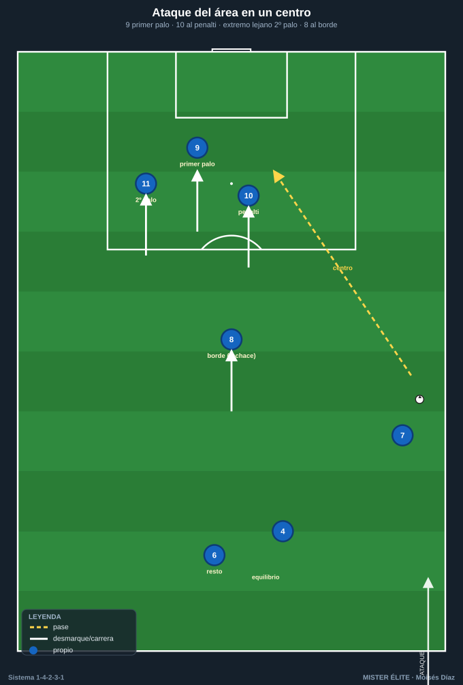

# Módulo 03 · Fase ofensiva del 1-4-2-3-1

> Con balón el sistema se **estira a 1-2-3-5 / 1-4-3-3**: suben los laterales, un pivote baja a construir y arriba se dibuja un frente de cinco. El destino preferente del pase que rompe líneas es siempre el mismo: **la mediapunta (10) en la zona 14**.

Atacar con el 1-4-2-3-1 es **salir en superioridad, encontrar al hombre libre entre líneas y poblar el área desde varias alturas**. Este módulo recorre el inicio de juego, la construcción, el último tercio y los automatismos que lo hacen repetible.

---

## 1. Inicio de juego — superar la primera presión

### Estructura base de salida
Salida con los **2 centrales (4 y 5) abiertos** a la anchura del área, el **POR 1 como +1** (se ofrece y permite jugar en superioridad), y el **doble pivote (6/8)** por delante. Los **laterales (2 y 3) abren y suben** para alargar al rival en anchura y profundidad.

- **Superioridad garantizada:** 2 centrales + portero = **3 contra el primer punta** (3v1) o contra dos puntas (3v2).
- **El 6 es la primera referencia:** se ofrece entre o por delante de los centrales para recibir de cara. Si lo marcan, **arrastra** y libera la línea de pase al 8.
- **Regla del +1:** el portero solo entra en la cadena cuando crea superioridad real: recibe, fija al punta y descarga al hombre libre.

### Salida en 3 (un pivote baja entre centrales)
Cuando el rival presiona con **dos o tres puntas**:
- El **MC 6 baja entre los centrales 4 y 5** (línea de 3: 5–6–4) o a un costado (salida en 3 asimétrica, tipo Lavolpe).
- Los **centrales se abren** más y los **laterales (2/3) suben** a la línea del 8 → línea de 3 atrás (4–6–5) + el 8 de pivote. Si ambos laterales se proyectan alto, la estructura ofensiva resultante es el **1-2-3-5**.
- El **8 queda como pivote único receptor** y el **10 baja** un escalón para dar dos alturas de pase tras la salida.

### Mecanismos para superar la presión alta
1. **Fijar para liberar:** el central conduce hacia el punta y, al saltar el rival, libera al pivote o al lateral.
2. **Tercer hombre desde el portero:** POR → central → pivote de espaldas → descarga al 8 que aparece de cara.
3. **Cambio de orientación:** si presionan un lado, al **lateral del lado contrario** que queda libre.
4. **Pase a romper líneas hacia el 10:** si queda libre entre líneas, central o pivote filtran directo.
5. **Balón largo al 9 como recurso:** si la presión asfixia, el 9 fija y prolonga; el 8 y el 10 cazan segundas jugadas.

> **Coaching salida:** nunca los **dos pivotes a la misma altura** — siempre escalonados (6 bajo / 8 alto) para dar dos alturas de pase y mantener resto ante pérdida.

---

## 2. Construcción en zona media

### Relación de los dos pivotes (6/8)
- **6 (ancla):** juega más bajo, organiza, da el primer pase de progresión y queda como **seguro** ante pérdida.
- **8 (box-to-box):** medio escalón por delante, conduce, recibe entre líneas y es el que **llega** a finalización.
- **Escalonamiento permanente:** cuando 6 recibe abajo, 8 sube; cuando 8 baja, 6 cubre. Nunca planos; **uno siempre protege** la línea de centrales.

### La mediapunta (10) entre líneas — zona 14
- El **10 ocupa la zona 14**: el destino preferente del pase que rompe líneas.
- **Cómo recibe:** **medio de cara**, con un hombro abierto al campo contrario, en el carril interior o en los half-spaces; juega en el **punto ciego** entre el pivote rival y su línea de centrales.
- **Movilidad:** si lo marcan al hombre, **se va para arrastrar** y libera el espacio para el 8 o el 9.
- **Apoyo al 10:** siempre **dos opciones** al recibir — el 9 a la espalda (soltar de primeras) y un extremo o lateral en amplitud (cambiar de orientación).

### Cómo se estira el sistema (→ 1-2-3-5 / 1-4-3-3)
- **Laterales (2/3) altos** dan la amplitud.
- **Extremos (7/11)** abiertos o pisando por dentro.
- **Un pivote sube (8)** y el otro (6) queda de **resto-pivote** → estructura **1-2-3-5**: 2 centrales + 1 pivote / línea de creación / **5 en la última línea**.

> **Coaching construcción:** **ocupación de carriles** — los cinco carriles (2 bandas, 2 interiores, central) ocupados, y **dos jugadores nunca en el mismo carril a la misma altura**. Si el extremo pisa dentro, el lateral da la amplitud; si el extremo abre, el lateral entra por dentro.

---

## 3. Último tercio — finalización

### El delantero (9): apoyo + ruptura + fijar
- **Fija a los dos centrales** rivales: ancla la última línea y abre los espacios interiores para 10 y 8.
- **Doble movimiento:** amaga al pie (apoyo, recibe y descarga al 10) y rompe a la espalda. El 8 y el 10 leen ese movimiento para ocupar el espacio que libera.
- **Ataque del área:** primer rematador; primer palo o punto de penalti según el centro.

### Llegada de segunda línea (10 y 8)
- El **10**, tras combinar, **ataca el área** por el carril interior — la llegada sorpresa al borde.
- El **8** llega **desde atrás** sin balón a rematar o a recoger el rechace. Es la "llegada desde atrás" que sorprende a la defensa orientada al balón.

### Centros y ataque del área (referencia de ocupación)
Patrón de **3 dentro + 1 al borde + 1 retrasado**:
- **9** → primer palo / punto de penalti.
- **10** → segundo palo / zona de remate central.
- **Extremo del lado contrario (7 u 11)** → segundo palo.
- **8** → borde del área (rechaces).
- **Pivote de resto (6)** + central que sube → **equilibrio** ante la transición.

### Desdoblamiento: extremo dentro + lateral fuera
- El **extremo pisa por dentro** (al half-space), atrae al lateral rival y libera la banda.
- El **lateral desdobla por fuera** → **2v1** sobre el lateral rival.
- Triángulo de banda: **extremo (interior) – lateral (fuera) – pivote/10 (apoyo)** → pared, conducción o centro raso/tenso.
- Variante inversa: extremo abre, lateral **entra por dentro** (lateral invertido) para reforzar el centro y dar el resto.

---

## 4. Automatismos ofensivos

1. **Pared (one-two):** 8/10 al 9 que devuelve de primeras a la carrera del que la dio. Patrón estrella para entrar por el interior tras fijar al pivote rival.
2. **Tercer hombre:** A pasa a B (de espaldas) → B descarga rápido a C que llega de cara. Típico: central → 9 (espaldas) → 10 que aparece.
3. **Triángulo de banda:** el 10 bascula al carril del balón para el apoyo interior; combinan en corto para **fijar y soltar** al hombre libre (lateral desdoblado o extremo a la espalda).
4. **Llegada desde atrás del 8:** cuando el balón está en banda y la defensa se cierra, el 8 ataca el borde/área sin balón. Arranca **cuando el extremo encara**.
5. **Rotaciones de carril:** extremo dentro → lateral fuera; o 10 cae y 8 pisa la zona 14. Se rotan **las piezas, no las zonas**.
6. **Cambio de orientación rápido:** 6/10 cambian de banda de un toque cuando la presión se ha cargado a un lado → el lado débil ataca en 1v1 / 2v1.

---

## Ideas clave
- Salir en **superioridad** (centrales + POR como +1) y **escalonar** siempre el doble pivote.
- Con balón el sistema **se estira a 1-2-3-5**: laterales altos, un pivote baja, frente de cinco arriba.
- El **10 en la zona 14** es el destino del pase que rompe líneas: recibe medio de cara con **dos opciones**.
- **Ocupar los cinco carriles** sin duplicar carril a la misma altura (desdoblamiento extremo-lateral).
- El **9 fija para liberar** a 10 y 8; la **llegada de segunda línea** decide partidos.

## Errores comunes
- **Pivotes planos** o ambos pegados a los centrales: sin alturas de pase ni resto de pérdida.
- Buscar al 10 con el cuerpo **mal perfilado**: recibe de espaldas y no puede girar.
- **Saltarse al 10** en la progresión: se pierde al hombre libre de la zona de más valor.
- **Dos jugadores en el mismo carril** a la misma altura: se anula la amplitud y el interior.
- Centrar **sin poblar el área** con las tres alturas (9, 10, extremo lejano + 8 al borde).
