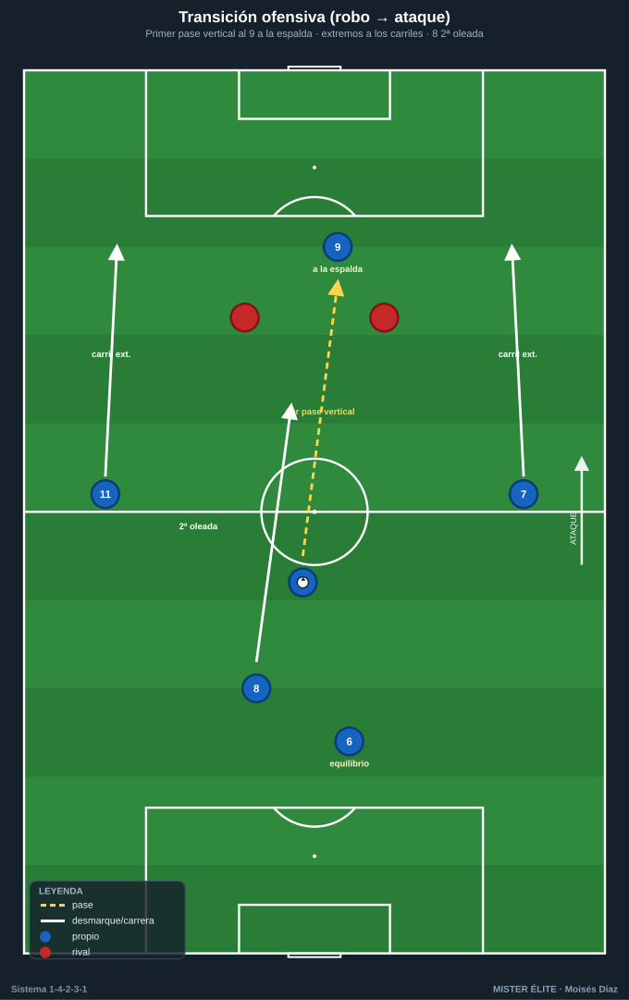
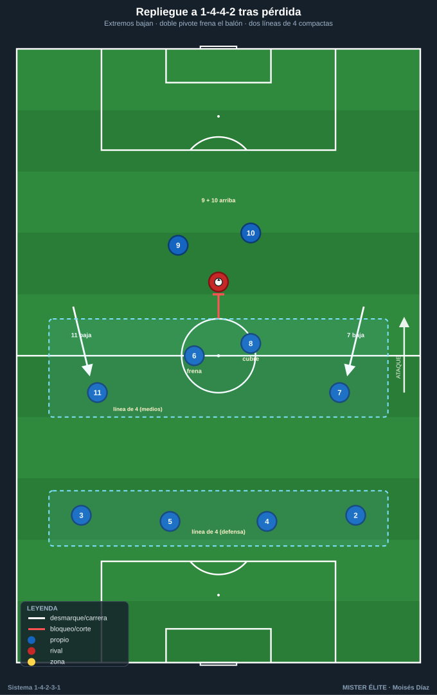
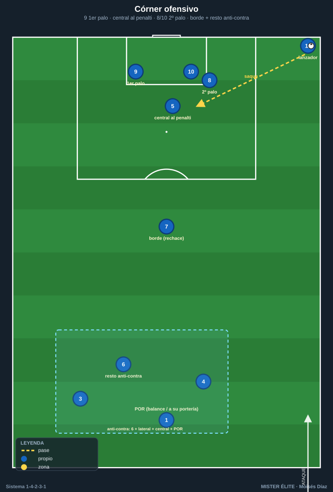

# Módulo 04 · Transiciones y balón parado

> Las dos transiciones se deciden por la **estructura previa**. Un buen **resto de pérdida** (el 6 de pivote + central + lateral del lado contrario equilibrados) es lo que permite contrapresionar o replegar con orden. Mala ocupación de carriles en ataque = transición defensiva mal cubierta.

Los partidos se ganan en los **momentos de cambio de posesión**. Este módulo cierra la teoría con las dos transiciones (ofensiva y defensiva), el repliegue a 1-4-4-2 y un protocolo de balón parado con roles fijos.

---

## 1. Transición ofensiva (robo → ataque) — contraataque

### Vías de ataque rápido
- El **9** ataca la profundidad a la espalda de la defensa (primera opción).
- Los **extremos (7/11)** corren los carriles exteriores en carrera.
- El **10** conduce o da el último pase desde el carril interior.

### Principios
- **Primer pase hacia adelante** buscando al 9 o al extremo en carrera antes de que el rival se reorganice. Si no hay vía directa, el 10 conduce para fijar y abrir la contra a banda.
- **Apoyos:** el 8 acompaña por dentro como segunda oleada y para el remate de segunda línea; el 6 y la línea controlan el equilibrio.
- **Regla de los 3-5 segundos:** aprovechar la desorganización inmediata; si no hay ventaja clara en pocos segundos, **asegurar** y pasar a construcción.

---

## 2. Transición defensiva (pérdida → repliegue) — 1-4-2-3-1 → 1-4-4-2

### Reacción inmediata (contrapresión)
Los jugadores cercanos al balón (a menudo 8, 10, 9 y el extremo del lado) **presionan al portador en bloque** durante los primeros segundos para recuperar arriba o forzar el pase malo. La densidad central del sistema favorece este robo inmediato.

### Si no se recupera → repliegue ordenado a 1-4-4-2
- Los **extremos (7 y 11) bajan** a formar la línea de **4 del medio** junto al doble pivote.
- El **doble pivote (6/8) frena** el balón en el centro (uno retrasa al portador, el otro cubre el carril central).
- El **9 y el 10 forman la primera línea de 2** (1-4-4-2) o **el 10 baja** junto al 6/8 → **1-4-4-1-1** (tapando al pivote rival).
- **Laterales (2/3)** recuperan su altura; la línea de 4 atrás se mantiene compacta.

### Prioridades del repliegue
1. **Proteger el carril central** y la zona delante del área.
2. **Achicar y juntar líneas** (no más de ~10–12 m entre líneas).
3. **Orientar el juego rival a la banda** para presionar donde la línea de cal ayuda como defensor extra.

> **Coaching transiciones:** el **resto de pérdida** preparado en ataque (6 + central + lateral del lado contrario) es lo que permite elegir entre contrapresionar o replegar con orden. La forma se cambia **corriendo, no andando**.

---

## 3. Balón parado (ABP)

### Córners ofensivos
- **Lanzador:** extremo o mediapunta con buen golpeo (saque cerrado al primer palo o abierto a penalti).
- **Bloque de remate (3-4):** **9 al primer palo · central que sube (4/5) al punto de penalti · 8/10 al segundo palo**. Bloqueos/cortinas para liberar al rematador principal; arranque desde fuera del área hacia dentro.
- **Rechace:** 1 jugador (10 u 8) al **borde del área**.
- **Resto defensivo (anti-contra):** el **6**, un lateral y un central atrás (mínimo 2-3 + portero).
- **Variante:** córner en corto (extremo + lateral) para cambiar el ángulo y desordenar el marcaje zonal.

### Córners defensivos
- **Mixto (zona + hombre):** 2-3 en **zona** (primer palo, corazón del área, segundo palo) + marcajes **al hombre** sobre los rematadores peligrosos.
- **Postes** según plan; **9 arriba** como referencia para la salida en contra.
- Tras despejar, **9 + un extremo** son la vía de contraataque inmediato.

### Faltas
- **Laterales (centros):** misma estructura de ocupación que el córner.
- **Directas a portería:** barrera según distancia (POR organiza); rematadores y lanzador definidos; **resto de equilibrio** siempre.
- **Faltas cercanas en ataque:** jugadas ensayadas (pared, pase a la espalda de la barrera para el 9/extremo).

### Saques
- **De banda en campo propio:** apoyar para mantener (pivote 6 o central); nunca forzar en zona de riesgo.
- **De banda en campo rival:** lanzamiento largo al área (si hay rematador) o combinación banda (extremo-lateral-10).
- **De puerta (POR):** salida en 2/3, jugada en corto preferente; largo al 9 como recurso.

> **Coaching ABP:** definir **roles fijos** (lanzador, rematadores, jugadores de rechace, resto anti-contra) y ensayar 2-3 jugadas por situación. **El resto defensivo en ABP ofensivo no es negociable** — es la principal fuente de goles en contra.

---

## Ideas clave
- **Transición ofensiva en 3-5 s:** profundidad por el 9/extremos o asegurar; el 10 conduce si no hay vía directa.
- **Transición defensiva:** contrapresión 5" y, si falla, **repliegue a 1-4-4-2** (extremos bajan, doble pivote frena).
- El **resto de pérdida** decide qué transición se puede ejecutar: se prepara en ataque, no en la pérdida.
- **ABP con roles fijos** y **resto anti-contra obligatorio** en todo balón parado ofensivo.

## Errores comunes
- **Primer pase atrás** tras recuperar: ralentiza la contra y se pierde la desorganización rival.
- **No frenar el balón** en la pérdida: el rival progresa por el centro antes de que se forme el bloque.
- **Extremos que no bajan** al replegar: la línea de medios queda de 2, no de 4.
- **ABP sin resto defensivo:** conceder la contra es la forma más cara de encajar.
