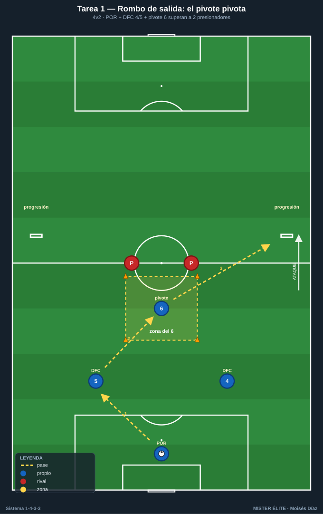
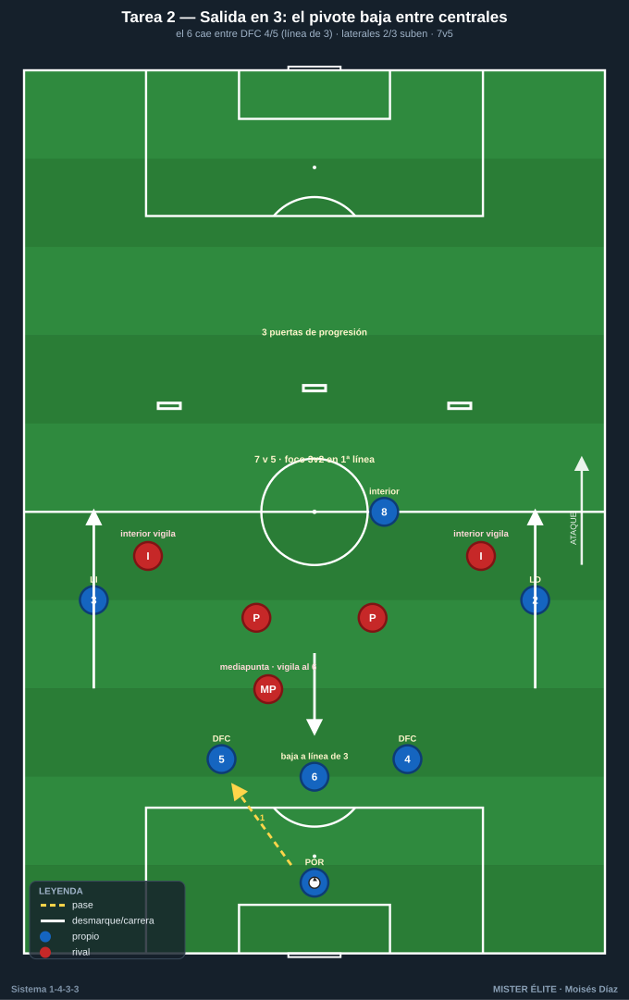
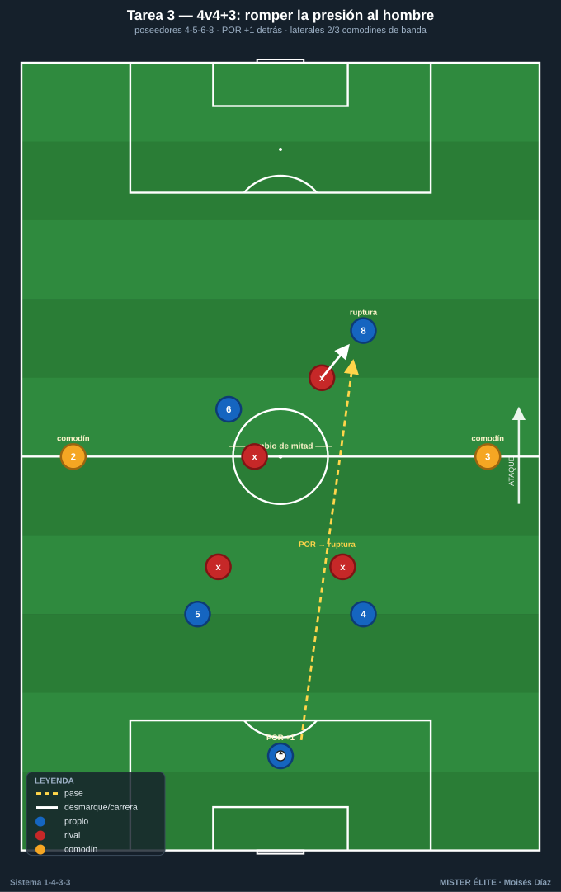
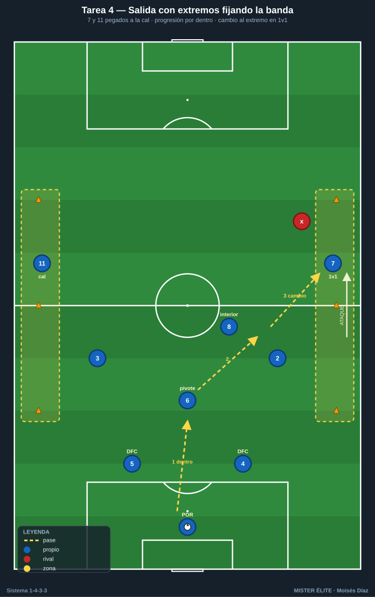
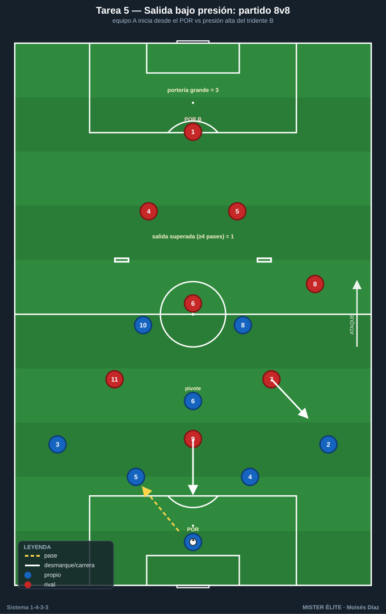

# Bloque 1 · Salida con 2 centrales + pivote (T1–T5)

> Superar la primera presión con estructura: rombo de salida, salida en 3 (lavolpiana), uso del portero como +1 y anchura del tridente. Dorsales según la convención del curso.

---

## T1 — Rombo de salida: el pivote pivota

- **Objetivo (1-4-3-3):** construir el primer rombo de salida POR 1 + DFC 4-5 + pivote 6; que el 6 reciba de perfil entre los puntas rivales y oriente la salida hacia el lado libre.
- **Tipo:** Analítica + posicional (4v2).
- **Organización:** Medio campo de portería a línea de medios, 40×30 m. Jugadores: **1** (POR), **4** y **5** (centrales abiertos a la altura del área), **6** (pivote) frente a 2 atacantes neutros con peto que presionan. 2 mini-porterías en banda a la altura del medio campo (representan a los laterales/lado libre). Balones en portería, 4 conos para marcar la zona del pivote.

- **Desarrollo:** El POR 1 inicia. Los centrales 4-5 abren al ancho del área, el 6 se ofrece en el eje. Circulación 1-4-5-6 buscando que el 6 reciba de cara o que, si le marcan, libere al central del lado contrario para progresar a la mini-portería. Objetivo: superar a los 2 presionadores y conducir/pasar más allá de la línea de medios.
- **Provocaciones (medibles):** salida superada = punto cuando el balón cruza la línea de medios controlado tras pasar por **3 jugadores distintos**. El 6 solo recibe **dentro de su zona de conos**. Máx. **2 toques** centrales; 6 libre. Si los 2 puntas roban → +1 para ellos y reinicio.
- **Variantes:** *(fácil)* presionadores pasivos al 70%; *(media)* el 6 no puede recibir de espaldas (obliga a perfil abierto); *(difícil)* 4v3 añadiendo un mediapunta que vigila al 6 → obliga a salir en 3 por fuera con los centrales.
- **Coaching:** orientación corporal del 6 (recibir abierto, ver las dos bandas); altura y separación de centrales para abrir líneas de pase; timing del apoyo del pivote tras el primer toque del POR.
- **Duración/Categoría:** 4 series × 4 min, 90 s descanso. **F.**

---

## T2 — Salida en 3: el pivote baja entre centrales (1-3-2)

- **Objetivo (1-4-3-3):** entrenar la salida en 3 con el 6 cayendo entre los centrales (línea de 3 atrás) para que los laterales 2-3 suban y se rompa la primera línea de presión rival.
- **Tipo:** Situacional S>D (7v5).
- **Organización:** 3/4 de campo, 60×45 m. **1, 4, 5, 6, 2, 3** + un interior **8**. Rivales: 5 con peto (2 puntas + 1 mediapunta + 2 interiores que vigilan). 1 portería grande defendida + 3 puertas a la altura de la línea de medios para puntuar la progresión.

- **Desarrollo:** Ante presión a 2 centrales, el **6 desciende** entre 4 y 5 formando línea de 3; los laterales **2-3 ganan altura** por fuera. La salida progresa hasta superar la línea de medios atravesando una de las 3 puertas en conducción o pase.
- **Provocaciones (medibles):** punto si se atraviesa una puerta tras la bajada del 6 (verificable). El 6 debe descender **antes** de que el POR ejecute (gatillo: 2º punta rival presiona a un central). Prohibido pase largo del POR. Rival recupera → transición a portería en **6 s**.
- **Variantes:** *(fácil)* sin mediapunta rival (5v4); *(media)* obligar a que el lateral receptor juegue a 1 toque hacia el interior 8; *(difícil)* añadir 6º rival presionando al lateral → obliga a alternar salida en 3 con pivote alto.
- **Coaching:** lectura del gatillo para bajar; los centrales abren al recibir al 6 (no quedarse juntos); el lateral receptor cara al juego.
- **Duración/Categoría:** 4 series × 5 min. **A.**

---

## T3 — 4v4+3 de construcción: romper la presión al hombre

- **Objetivo (1-4-3-3):** resolver presión hombre a hombre en zona de inicio usando al portero como +1 y el desmarque de ruptura del 6 o de un interior que baja a apoyar (rotación 6↔8).
- **Tipo:** Rondo posicional de construcción (4v4 + 3 comodines).
- **Organización:** Cuadro 30×25 m dividido en 2 mitades. Equipo poseedor: **4, 5, 6, 8**. Comodines: **1** (POR, fija detrás) + **2** y **3** en las bandas (no defendibles). Rival: 4 que presionan al hombre. Conos.

- **Desarrollo:** Construcción 4v4 con apoyos. Cuando el rival marca al hombre, el equipo busca al POR para generar superioridad o provoca que el 6/8 atraiga y deje libre al compañero (3er hombre). Objetivo: 8 pases o cambio de mitad controlado.
- **Provocaciones (medibles):** punto por **completar pase del POR a un jugador desmarcado de ruptura** y mantener. Marcaje obligatorio al hombre en campo propio. Cambio de banda 2↔3 = 2 puntos. Pérdida → 30 s sin balón.
- **Variantes:** *(fácil)* comodines de banda juegan libres a 1 toque; *(media)* limitar a 6 segundos para superar la primera mitad; *(difícil)* el rival puede presionar al POR (5º hombre) → fuerza salida rápida en 3.
- **Coaching:** cuándo usar al portero; desmarque de ruptura vs apoyo; fijar para liberar (el que recibe la presión no es siempre el que sale jugando).
- **Duración/Categoría:** 5 × 3 min. **A.**

---

## T4 — Salida con extremos fijando: anchura máxima desde atrás

- **Objetivo (1-4-3-3):** que en la salida los extremos 7-11 den anchura máxima y profundidad para estirar al rival, abriendo el carril interior para que el 6 reciba o para la conducción del central.
- **Tipo:** Situacional S>D (9v7) en campo completo a lo ancho.
- **Organización:** Campo entero o 3/4, ancho completo. **1, 4, 5, 6, 2, 3, 8, 7, 11.** Rival: 7 (bloque medio 1-4-3 que presiona en zona de inicio). 2 porterías grandes.

- **Desarrollo:** Salida con centrales abiertos, 6 de referencia; **7 y 11 pegados a banda al máximo** (pie en la cal). El objetivo es progresar por dentro porque la anchura de los extremos arrastra a los laterales rivales. Conexión central/6 → interior → cambio de orientación al extremo en 1v1.
- **Provocaciones (medibles):** los extremos no pueden separarse de la banda más de 3 m hasta superar el medio campo (zona marcada con conos). Punto por superar la línea de medios + 2 puntos si se finaliza tras desborde de extremo. El balón debe pasar por el carril interior antes del cambio a banda.
- **Variantes:** *(fácil)* rival pasivo en la primera línea; *(media)* prohibir el pase directo a extremo hasta 3 pases; *(difícil)* el rival defiende con 8 (1-4-4) cerrando el interior → obliga a usar al portero y al 6 bajando.
- **Coaching:** disciplina de banda de los extremos; el 6 lee si recibe o se aparta para abrir línea al central; timing del cambio de orientación.
- **Duración/Categoría:** 4 × 6 min. **S.**

---

## T5 — Salida bajo presión total con porterías invertidas

- **Objetivo (1-4-3-3):** competir la salida 1-4-3-3 contra pressing alto real, decidiendo entre salir corto en rombo/3 o saltar la presión, manteniendo estructura.
- **Tipo:** Partido condicionado de construcción (8v8) en campo reducido.
- **Organización:** 3/4 de campo, 65×50 m. Equipo A en 1-4-3-3 parcial: **1, 4, 5, 2, 3, 6, 8, 10**. Equipo B presiona alto con tridente. 2 porterías grandes + 2 mini-porterías en la línea de medios del equipo que sale ("salida superada").

- **Desarrollo:** Partido normal, pero el equipo A puntúa también superando la presión. Se evalúa el patrón: rombo, salida en 3, o uso del 9/punta saltado solo si está justificado.
- **Provocaciones (medibles):** gol en mini-portería (salida superada limpia con ≥4 pases) = 1; gol en portería grande = 3. Equipo A obligado a iniciar **siempre** desde el POR con saque corto. Si pierden en su tercio → gol rival vale doble.
- **Variantes:** *(fácil)* B presiona solo con 2 puntas; *(media)* prohibir el balón largo de A; *(difícil)* B presiona 5 jugadores y marca al 6 (obliga rotaciones).
- **Coaching:** decisión salir vs saltar; mantener la estructura aun bajo presión; valentía del POR y centrales.
- **Duración/Categoría:** 3 × 8 min con cambio de roles. **S.**
