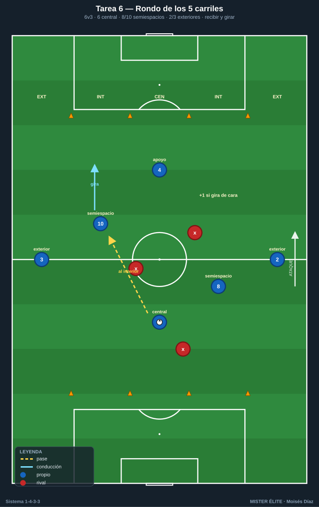
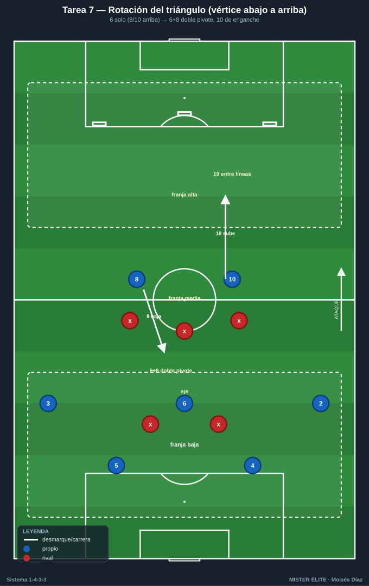
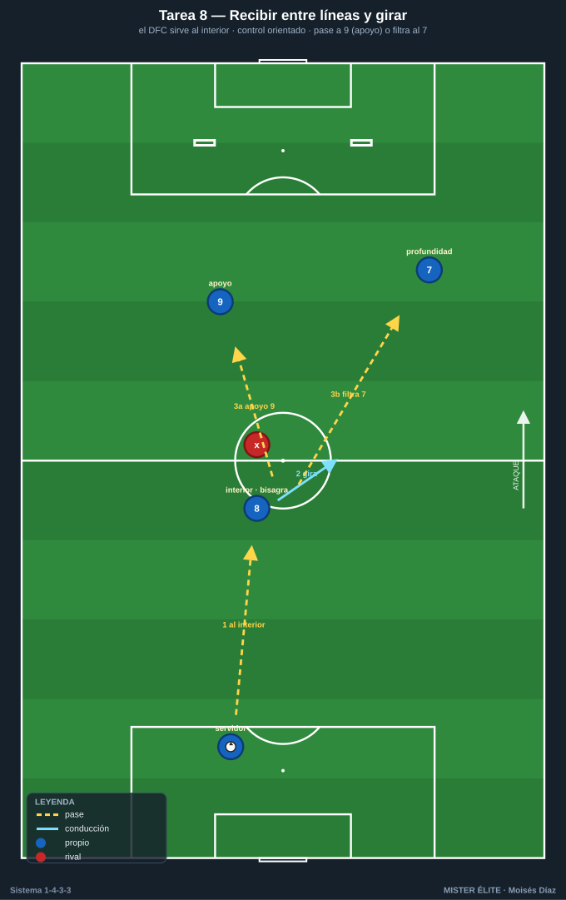
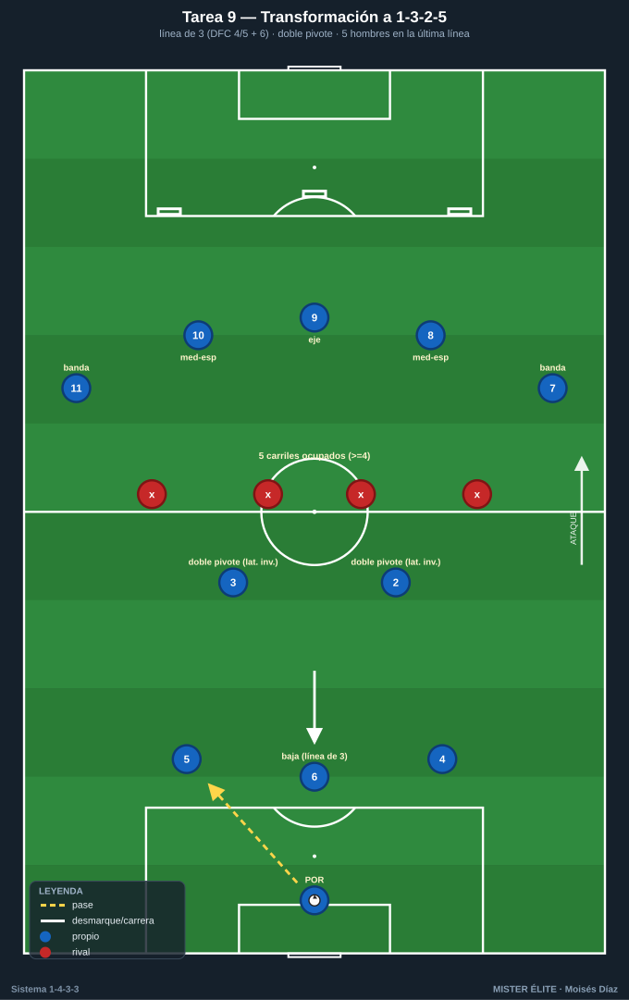

# Bloque 2 · Mediocampo de 3 (T6–T9)

> Relación pivote-interiores, juego entre líneas, ocupación de carriles y transformación a 1-3-2-5. Dorsales según la convención del curso.

---

## T6 — Rondo de los carriles: ocupar los 5 pasillos

- **Objetivo (1-4-3-3):** que el mediocampo de 3 (6-8-10) reparta los carriles y reciba entre líneas, fundamentando la transformación hacia 1-3-2-5 (interiores subiendo a media-punta).
- **Tipo:** Juego de posición 6v3 sobre cuadrícula de carriles.
- **Organización:** 36×24 m dividido en **5 carriles verticales** con conos. Poseedores: **6, 8, 10, 2, 3** + 1 apoyo (**4**). Defensores: 3 con peto.

- **Desarrollo:** Mantener posesión respetando que el 6 ocupe el carril central, 8 y 10 los interiores y 2-3 los exteriores. Cada interior debe **recibir entre líneas** (en carril interior, de espaldas o de perfil) para sumar.
- **Provocaciones (medibles):** punto cada vez que el 8 o el 10 reciba en carril interior y gire de cara. No puede haber 2 poseedores en el mismo carril (penaliza con pérdida). 10 pases = +1. Verificable por conos.
- **Variantes:** *(fácil)* 6v3 con 2 toques libres; *(media)* obligar a que tras recepción entrelíneas haya pase de progresión; *(difícil)* 6v4 → fuerza precisión y movilidad del 3.
- **Coaching:** escalonamiento (no jugar a la misma altura); cuerpo abierto del interior; el 6 como salida segura y referencia de los carriles.
- **Duración/Categoría:** 5 × 3 min. **F.**

---

## T7 — Pivote-interiores: la rotación del triángulo (▽ a △)

- **Objetivo (1-4-3-3):** entrenar la relación pivote-interiores alternando triángulo con vértice abajo (6 solo) y vértice arriba (doble pivote 6+8, enganche 10), según la presión.
- **Tipo:** Juego de posición 7v5 con zonas.
- **Organización:** 50×40 m, 3 franjas horizontales (zona baja, media, alta). **4, 5, 6, 8, 10, 2, 3** vs 5 (2 puntas + 3 medios). 3 puertas en la franja alta.

- **Desarrollo:** Según dónde presione el rival, el medio rota: si presionan al 6, el **8 baja** (doble pivote) y el **10 se va arriba** entre líneas (vértice arriba); si dejan libre al 6, vértice abajo clásico. Objetivo: progresar a la franja alta y meter el balón en una puerta.
- **Provocaciones (medibles):** punto por puerta superada con el 10 habiendo recibido entre líneas previamente. La rotación debe ejecutarse en **≤3 s** tras el gatillo de presión al 6. Solo 1 jugador del medio puede estar en franja baja a la vez (obliga a escalonar).
- **Variantes:** *(fácil)* rotaciones guiadas por señal del míster; *(media)* libre lectura; *(difícil)* rival manda 2 al 6 → obliga a usar al lateral como salida.
- **Coaching:** lectura del gatillo; sincronía bajada del 8 con subida del 10; el 6 nunca abandona el eje sin cobertura.
- **Duración/Categoría:** 4 × 5 min. **A.**

---

## T8 — Recibir entre líneas y girar: el interior como bisagra

- **Objetivo (1-4-3-3):** que 8 y 10 reciban a la espalda del medio rival, protejan el balón y giren de cara para encarar o filtrar al tridente.
- **Tipo:** Situacional analítica 3+1 con oposición (recepción orientada).
- **Organización:** Pasillo de 25×20 m. Servidor **4/5** detrás, **8** o **10** en zona central con un defensor a su espalda, **9** y **7** como receptores en profundidad. 2 mini-porterías al fondo.

- **Desarrollo:** El central pasa al interior entre líneas; este controla orientado evitando al marcador y conecta con 9 (apoyo) o filtra a la profundidad del 7. Repetir alternando 8 (banda derecha) y 10 (banda izquierda).
- **Provocaciones (medibles):** punto por girar de cara y dar pase de progresión en **≤2 toques**. Si el defensor toca el balón en la recepción → 0. Control orientado obligatorio (no jugar de espaldas hacia atrás).
- **Variantes:** *(fácil)* defensor pasivo; *(media)* defensor activo al 80%; *(difícil)* 2 defensores (uno cierra el giro) → obliga a usar el apoyo de 3er hombre.
- **Coaching:** check de hombro antes de recibir; primer toque al espacio libre; perfil de recepción según de dónde venga el balón.
- **Duración/Categoría:** 5 × 3 min (alternando interiores). **F.**

---

## T9 — Transformación a 1-3-2-5 en fase de progresión

- **Objetivo (1-4-3-3):** materializar la estructura de ataque 1-3-2-5: 3 atrás (2 DFC + un lateral o el 6), 2 interiores como enlace y 5 arriba (extremos abiertos + interiores/9 ocupando el área).
- **Tipo:** Juego de posición 10v8 en campo grande.
- **Organización:** 3/4 de campo a lo ancho completo. **1, 4, 5, 2, 3, 6, 8, 10, 7, 11** (+9 si hay número). Rival en bloque medio 1-4-4-1. 1 portería grande + 3 puertas en el último tercio.

- **Desarrollo:** El equipo construye y se transforma a 1-3-2-5: línea de **3 atrás = 4 + 5 + un tercer hombre** (el **6 que baja** o un **lateral que invierte**); **doble pivote** con los dos restantes de ese trío (p. ej. 6 + 8, o lateral invertido + 6); arriba, **5 ocupando los 5 carriles** (7 y 11 en banda, 8/10 en medio-espacios, 9 en eje). Objetivo: meter el balón en una puerta del último tercio con la estructura desplegada.
- **Provocaciones (medibles):** punto solo si en el momento del pase a puerta hay **5 jugadores en la última línea ocupando ≥4 carriles** (verificable por conos). Cambio de orientación obligatorio antes de finalizar. Pérdida → contra rival vale doble.
- **Variantes:** *(fácil)* rival pasivo, foco en ocupar carriles; *(media)* exigir velocidad de circulación; *(difícil)* rival sube a 1-4-3-3 y presiona → obliga a transformar bajo presión.
- **Coaching:** quién baja y quién sube (automatismos); ocupar los 5 carriles sin amontonarse; los interiores como pulmón entre las dos estructuras.
- **Duración/Categoría:** 4 × 6 min. **S.**
