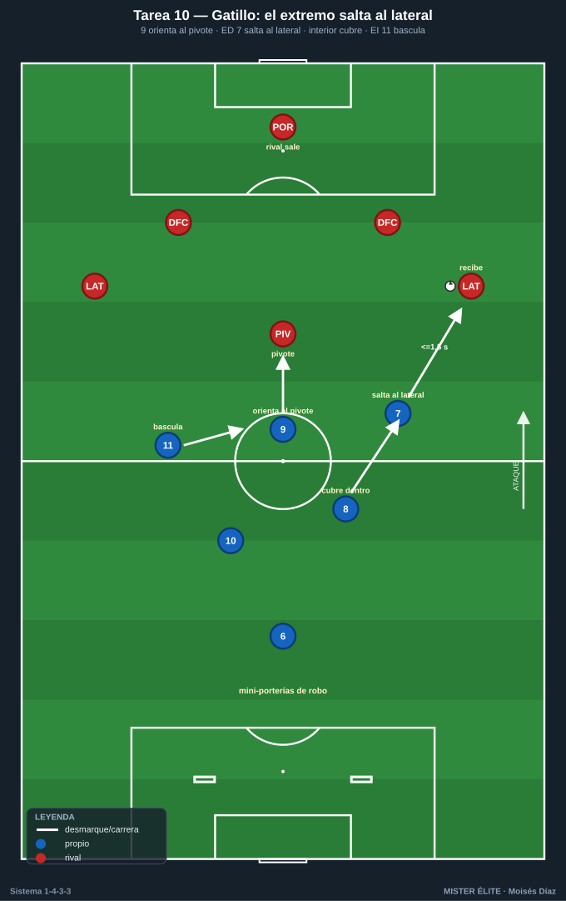
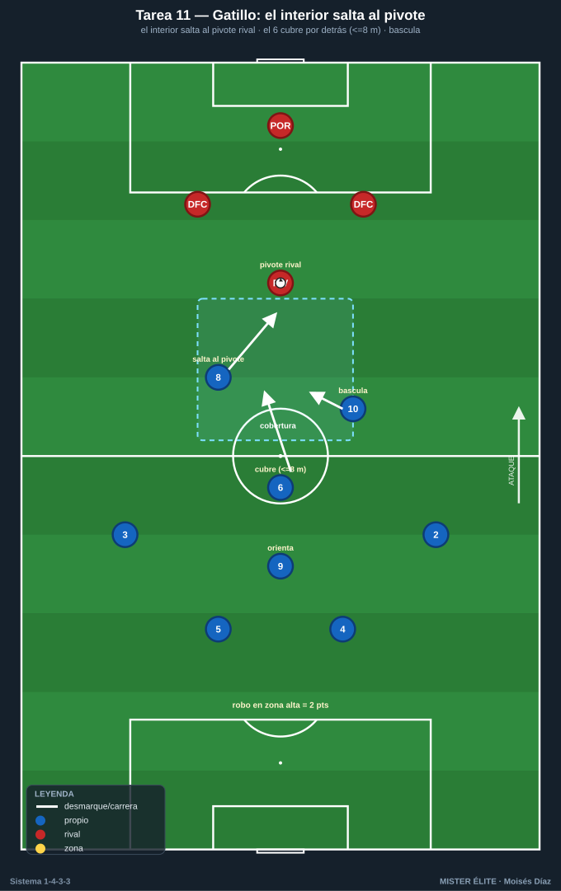
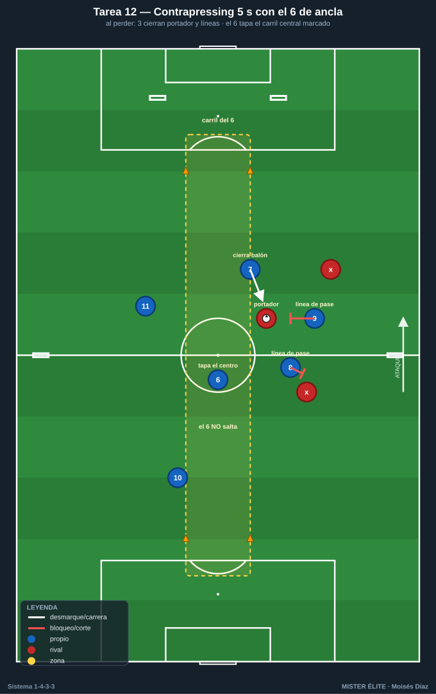
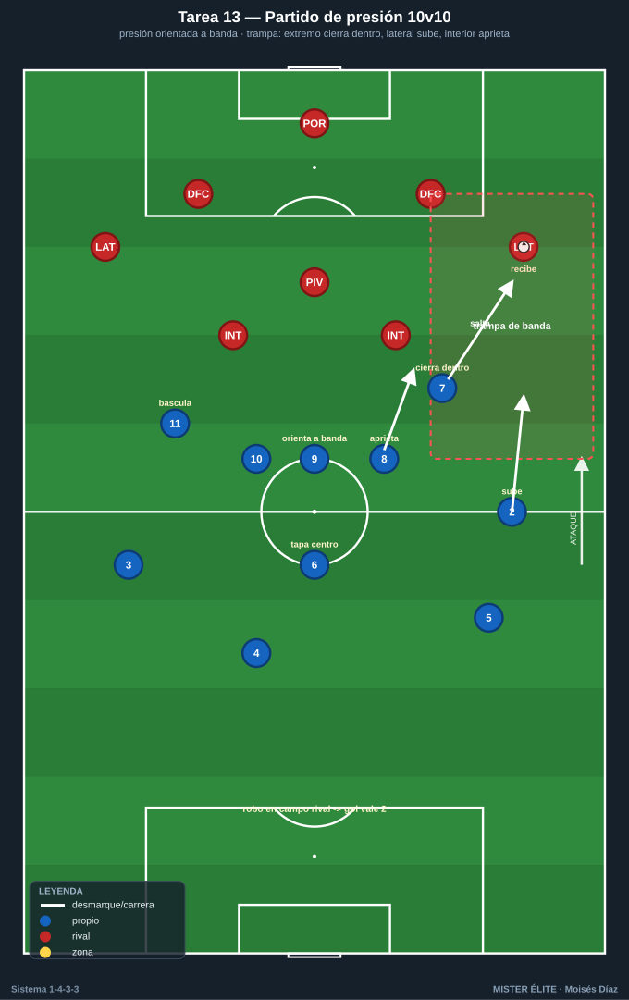

# Bloque 3 · Pressing del tridente + gatillos y contrapressing (T10–T13)

> Presión alta orientada con gatillos (extremo→lateral, interior→pivote, 9 orienta), coberturas y contrapressing de 5 s. Dorsales según la convención del curso.

---

## T10 — Gatillos del tridente: el extremo salta al lateral

- **Objetivo (1-4-3-3):** entrenar el gatillo principal de presión alta: el extremo (7/11) salta al lateral rival mientras el 9 orienta cerrando al pivote y el otro extremo bascula.
- **Tipo:** Situacional defensiva D>S (presión sobre salida rival).
- **Organización:** Medio campo 50×45 m. Equipo presionante: **9, 7, 11, 8, 10, 6** (tridente + medio). Equipo que sale: POR + 4 defensas + pivote (6 atacantes neutros). 1 portería grande + 2 mini-porterías al fondo del presionante para premiar robos.

- **Desarrollo:** El equipo rival inicia. **Gatillo:** cuando el balón va al lateral, el extremo de ese lado salta a presionar de fuera hacia dentro; el 9 cierra la línea al pivote; el interior de ese lado sube al lateral si el extremo es superado. Robo → finalizar rápido.
- **Provocaciones (medibles):** el extremo debe llegar al lateral en **≤1,5 s** desde que recibe (medible). Robo en campo rival + gol = 3 puntos; el rival puntúa si supera la presión y mete en mini-portería. Presión siempre orientada a banda (prohibido dejar el centro abierto).
- **Variantes:** *(fácil)* salida rival lenta y guiada; *(media)* a ritmo real; *(difícil)* el rival añade un mediocentro que cae → obliga a saltar del interior.
- **Coaching:** curva de carrera del extremo (tapar la línea interior); coordinación 9-extremo; señal verbal para activar; basculación del extremo lejano.
- **Duración/Categoría:** 5 × 4 min. **S.**

---

## T11 — Presión orientada y el interior salta al pivote

- **Objetivo (1-4-3-3):** segundo gatillo del bloque: el interior (8/10) salta al pivote rival cuando el balón entra al medio, manteniendo el 6 la cobertura central.
- **Tipo:** Juego de posición defensivo 8v8 con zona de presión.
- **Organización:** 60×45 m. Equipo presionante en 1-4-3-3 (parcial: 4 def + 6, 8, 10 + 9). Rival construye en 1-4-3-3. Líneas marcadas para definir la zona alta de presión.

- **Desarrollo:** Presión alta; cuando el rival mete al pivote, el **interior cercano salta** y el **6 cubre por detrás** al jugador liberado; el resto bascula al lado del balón. Si no hay opción de robo limpio, se contiene y se repliega ordenado.
- **Provocaciones (medibles):** el interior salta al pivote solo si el 6 puede cubrir (verificable: el 6 no debe quedar a más de 8 m). Robo en zona alta = 2 puntos; cada vez que el rival juega entre líneas por mal salto → punto rival. Prohibido saltar 8 y 10 a la vez (deja hueco).
- **Variantes:** *(fácil)* sin tridente rival (más fácil cubrir); *(media)* real; *(difícil)* rival con doble pivote → obliga a coordinar saltos alternos.
- **Coaching:** decisión de saltar (con cobertura sí, sin cobertura no); el 6 como red de seguridad; cierre de la espalda del interior que sube.
- **Duración/Categoría:** 4 × 5 min. **A.**

---

## T12 — Contrapressing 5 segundos con el 6 como ancla

- **Objetivo (1-4-3-3):** entrenar la reacción inmediata a la pérdida (contrapressing) con los roles del sistema: el portador más cercano y los dos siguientes (tridente/interior) cierran al balón y las líneas de pase, mientras el **6 tapa el carril central** (pase de progresión) y orienta la reacción al lado del balón.
- **Tipo:** Juego en espacio reducido (JER) 7v7 con roles fijos y regla de 5 s.
- **Organización:** 45×40 m. Equipo en foco con roles asignados: 7-9-11 (tridente) + 8/10 (interiores) + 6 (ancla) + 1 fijo de salida. 4 mini-porterías: 2 en la línea de fondo rival (premian robo arriba) y 2 en bandas a media altura. Zona central de 8 m marcada con conos = "carril del 6".

- **Desarrollo:** Juego dirigido a posesión; **al perder, 5 s de presión inmediata de los 3 más cercanos** mientras el **6 NO salta**: se queda tapando el carril central marcado para impedir el pase de progresión interior. Recuperación arriba → atacar mini-portería de fondo.
- **Provocaciones (medibles):** recuperación en **≤5 s** = 2 puntos (cronometrado). Punto válido **solo si en el momento del robo el 6 estaba dentro del carril central** marcado. Si el rival juega un pase limpio por ese carril durante la presión → punto rival (penaliza al 6 por saltar). Gol tras robo arriba = doble.
- **Variantes:** *(fácil)* 6 s y rival a 1 toque obligado tras robar; *(media)* 5 s a ritmo real; *(difícil)* 4 s + mínimo 3 presores y prohibido que el 6 abandone su carril.
- **Coaching:** los 3 más cercanos cierran balón + líneas; el 6 es la red que tapa el centro (no persigue); postura preventiva del resto antes de perder; orientar la presión al lado donde se pierde.
- **Duración/Categoría:** 5 × 3 min. **S.**

---

## T13 — Bloque alto vs bloque alto: partido de presión

- **Objetivo (1-4-3-3):** competir el pressing alto del 1-4-3-3 completo con todos los gatillos integrados (extremo→lateral, interior→pivote, 9→cierre) y la trampa de banda.
- **Tipo:** Partido condicionado 10v10 (o 9v9) campo grande.
- **Organización:** 3/4 de campo. Ambos equipos en 1-4-3-3. 2 porterías grandes con portero.

- **Desarrollo:** Partido. El equipo en foco debe presionar alto y orientado a banda creando la trampa (extremo cierra hacia dentro, lateral sube, interior aprieta). Robo arriba → finalizar.
- **Provocaciones (medibles):** gol tras robo en campo contrario = 2 goles; gol en jugada normal = 1. La presión debe activarse en **≤2 s** tras el gatillo definido en pizarra. Si el rival supera la línea de medios con pase interior limpio → falta defensiva (se anota).
- **Variantes:** *(fácil)* presión a partir del medio campo; *(media)* presión alta a la salida; *(difícil)* presión al portero rival con marca al hombre en toda la primera línea.
- **Coaching:** señales de activación; sincronía de la línea; momento de abortar y replegar a 1-4-5-1; comunicación.
- **Duración/Categoría:** 3 × 8 min. **S.**
