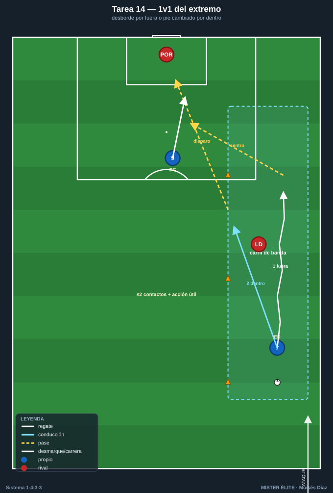
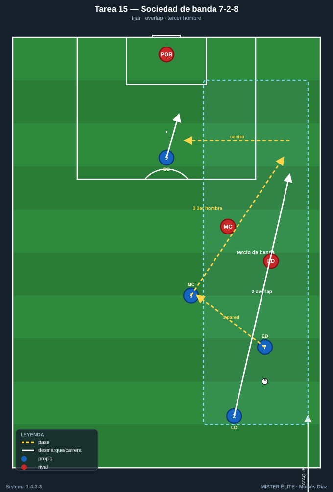
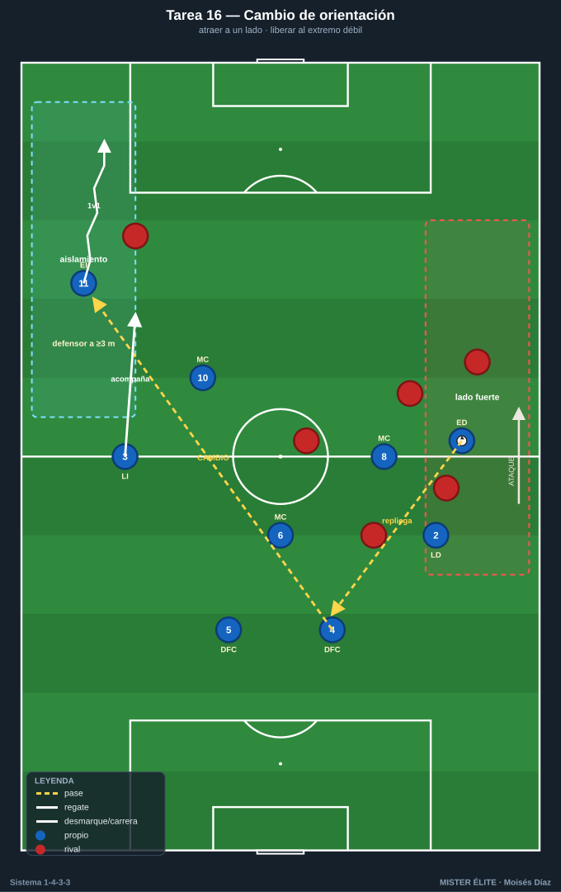
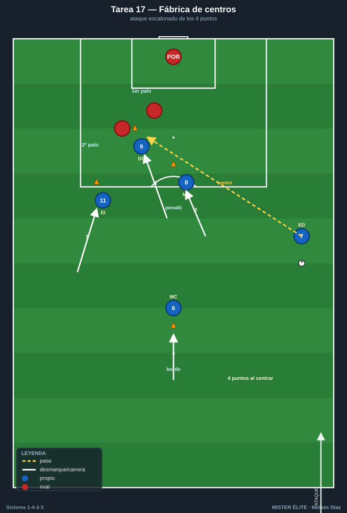
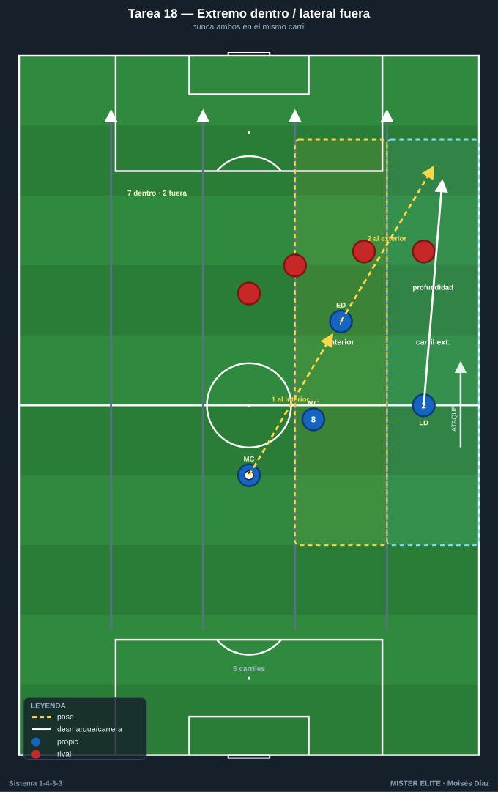

# Bloque 4 · Tridente y amplitud (T14–T18)

> 1v1 del extremo, sociedad de banda (extremo-lateral-interior), cambio de orientación al lado débil, centros y la rotación extremo-dentro / lateral-fuera. Dorsales según la convención del curso.

---

## T14 — 1v1 del extremo: desborde y pie cambiado

- **Objetivo (1-4-3-3):** que el extremo (7 a pierna cambiada por dentro / 11 igual) resuelva el 1v1 contra el lateral, alternando desborde por fuera para centrar y conducción hacia dentro para disparar/asociar.
- **Tipo:** Analítica situacional 1v1 + finalización.
- **Organización:** Carril de banda 25×18 m por lado. **7** (der) y **11** (izq) parten desde banda con balón; un lateral rival defiende. 1 portería con POR + zona de centro marcada.

- **Desarrollo:** Servicio al extremo, que ataca el 1v1. Dos salidas: **por fuera** → centro raso/al área; **por dentro (pie cambiado)** → disparo o pase. Alternar lado y receptor (9 entra a rematar).
- **Provocaciones (medibles):** punto por superar al lateral con **≤2 contactos** de regate + acción útil (centro al área marcada o disparo a portería). Pie cambiado debe finalizar por dentro; pie natural por fuera. Verificable por zona.
- **Variantes:** *(fácil)* lateral pasivo, foco técnico; *(media)* lateral activo; *(difícil)* lateral + cobertura del central → obliga a decidir desborde vs asociación con el interior.
- **Coaching:** primer apoyo orientado a la portería; cambio de ritmo; uso del cuerpo; lectura de la cadera del defensor.
- **Duración/Categoría:** 5 × 4 min (alternando bandas). **A.**

---

## T15 — Sociedad extremo-lateral-interior por el tercio de banda

- **Objetivo (1-4-3-3):** automatizar la relación por la banda derecha (7-2-8) e izquierda (11-3-10): pared, sobreposición (overlap), tercer hombre y desmarque de ruptura para progresar y centrar.
- **Tipo:** Situacional S>D por carril de banda (3v2 / 3v3).
- **Organización:** Carril de 30×24 m. Banda derecha: **7, 2, 8** vs 2-3 defensores (lateral + interior + ayuda). Banda izquierda análoga con **11, 3, 10**. 1 portería con POR + zona de remate con un punta (9).

- **Desarrollo:** El trío de banda combina para llegar al fondo: extremo fija, lateral hace overlap por fuera o underlap por dentro, interior aparece de tercer hombre. Finaliza con centro o pase atrás.
- **Provocaciones (medibles):** punto por llegar a la línea de fondo y centrar/pasar atrás tras **≥1 combinación de 2 jugadores** (pared o sobreposición real). El interior debe tocar el balón antes del centro en el 50% de las acciones (provocación de tercer hombre).
- **Variantes:** *(fácil)* 3v2; *(media)* 3v3; *(difícil)* 3v3 + central de cobertura → obliga a variar el patrón (overlap vs underlap).
- **Coaching:** timing de la sobreposición; el extremo fija al lateral antes de soltar; comunicación lateral-extremo (fuera/dentro); ataque del espacio del interior.
- **Duración/Categoría:** 5 × 4 min. **S.**

---

## T16 — Cambio de orientación y extremo en aislamiento (1v1 al lado débil)

- **Objetivo (1-4-3-3):** usar el cambio de orientación largo para encontrar al extremo del lado débil aislado en 1v1 con campo para encarar — patrón clave de generación del 1-4-3-3.
- **Tipo:** Juego de posición 9v8 con cambio obligatorio.
- **Organización:** Campo a lo ancho completo, 65×60 m. **4, 5, 6, 2, 3, 8, 10, 7, 11.** Rival en bloque que se desplaza al balón. Carriles de banda marcados como "zona de aislamiento". 2 porterías.

- **Desarrollo:** El equipo atrae al rival a un lado y ejecuta cambio de orientación para que el **extremo del lado contrario reciba aislado** y ataque el 1v1, con el lateral acompañando.
- **Provocaciones (medibles):** punto por cambio de orientación que llega al extremo del lado débil con **espacio (defensor a ≥3 m)** y desencadena 1v1. Gol tras desborde del extremo aislado = doble. El cambio debe darse tras ≥5 pases del mismo lado (provoca atraer primero).
- **Variantes:** *(fácil)* cambio con pase aéreo permitido y rival pasivo; *(media)* real; *(difícil)* limitar tiempo en posesión a 8 s antes del cambio.
- **Coaching:** atraer para liberar; calidad del pase de cambio (al pie lejano del extremo); el extremo lejano se mantiene abierto y alto esperando.
- **Duración/Categoría:** 4 × 5 min. **S.**

---

## T17 — Fábrica de centros: ataque de los 3 puntos del área

- **Objetivo (1-4-3-3):** entrenar el centro desde banda (tras desborde del extremo/lateral) y el ataque coordinado del área por el tridente + interior: primer palo (9), segundo palo (extremo lejano 11/7), zona de penalti (interior 8/10) y rechace al borde (6).
- **Tipo:** Tarea integrada de centros y remates con oposición parcial.
- **Organización:** Último tercio, área completa. Centradores por banda (**7/2** der, **11/3** izq). Rematadores: **9, 8, 10** + extremo lejano. Defensa: 2-3 centrales rivales + POR. Conos marcando 1er palo / 2º palo / penalti / borde.

- **Desarrollo:** Secuencia de centro desde una banda; los atacantes atacan los 4 puntos con timing escalonado. Alternar banda y tipo de centro (raso, tenso, atrás).
- **Provocaciones (medibles):** gol válido solo si los **4 puntos están ocupados** en el momento del centro (verificable por conos/observación). Centro raso al primer palo = remate a 1 toque obligatorio. Punto extra por gol del extremo lejano al segundo palo.
- **Variantes:** *(fácil)* sin defensa central; *(media)* 2 centrales; *(difícil)* defensa completa + presión al centrador.
- **Coaching:** timing de ataque del área (no llegar antes que el balón); ocupar los espacios, no amontonarse; el 6 al borde para el rechace; tipo de centro según la posición del defensa.
- **Duración/Categoría:** 5 × 4 min. **A.**

---

## T18 — Extremo que pisa por dentro y lateral que da la amplitud

- **Objetivo (1-4-3-3):** entrenar la rotación moderna del 1-4-3-3: el extremo a pie cambiado pisa el carril interior (entre líneas) y el lateral asume la amplitud y la profundidad por fuera.
- **Tipo:** Juego de posición 8v8 con zonas de carril.
- **Organización:** 60×50 m con 5 carriles. Foco banda derecha: **7** pisa interior, **2** sube por fuera, **8** y **6** detrás; análogo izquierda con 11-3-10. Rival en bloque medio. 1 portería + 3 puertas.

- **Desarrollo:** Cuando el extremo recibe entre líneas en el carril interior, el lateral ataca el espacio exterior dejado libre. Se busca filtrar al lateral en profundidad o que el extremo (de cara) combine y dispare.
- **Provocaciones (medibles):** punto si el lateral recibe en profundidad por fuera tras el extremo haber pisado dentro (verificable por carriles). Prohibido extremo y lateral en el mismo carril a la vez. El extremo debe recibir de cara para puntuar.
- **Variantes:** *(fácil)* sin oposición en el carril; *(media)* real; *(difícil)* el rival cierra el interior → obliga a alternar (extremo abre y lateral entra por dentro, underlap).
- **Coaching:** coordinación extremo-lateral (uno dentro, otro fuera, nunca ambos igual); el interior cubre la espalda del lateral; el 6 vigila la transición.
- **Duración/Categoría:** 4 × 5 min. **S.**
