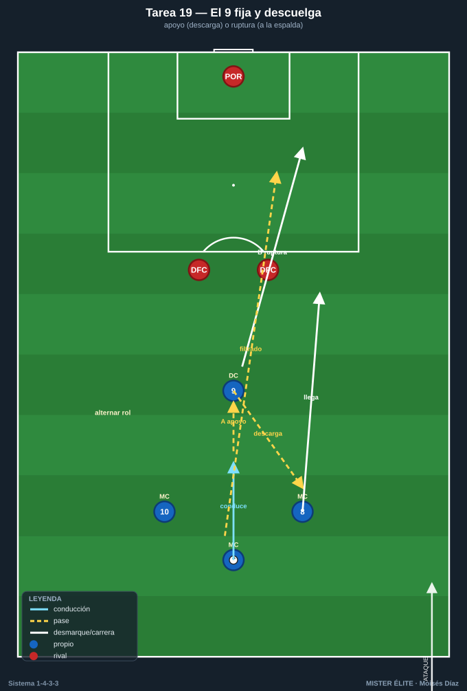
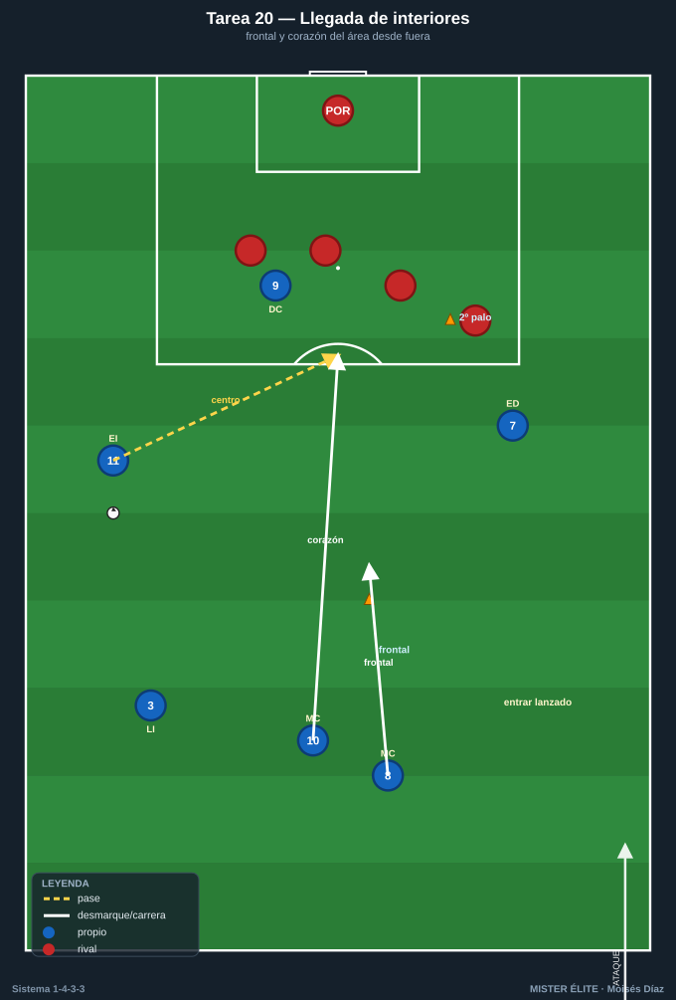
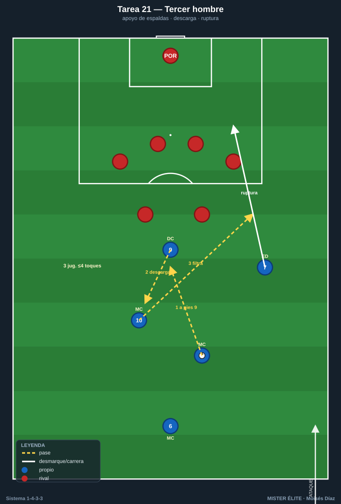
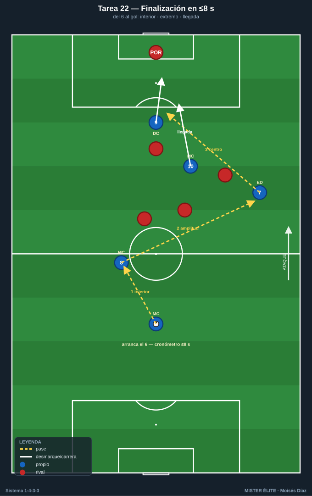

# Bloque 5 · Llegada e interiorización / finalización (T19–T22)

> El 9 (apoyo y ruptura), la llegada de los interiores desde segunda línea, el tercer hombre en el último tercio y la finalización integrada. Dorsales según la convención del curso.

---

## T19 — El 9 fija y descuelga: apoyo y ruptura

- **Objetivo (1-4-3-3):** que el 9 use los dos movimientos clave: venir al apoyo para fijar/soltar al tercer hombre, y atacar la profundidad a la espalda de los centrales, coordinado con la llegada de los interiores.
- **Tipo:** Situacional analítica 4v2+POR.
- **Organización:** Último tercio, 40×40 m. **9** + **8** + **10** + un servidor (**6** o central). 2 centrales rivales + POR. Portería grande.

- **Desarrollo:** El 6 conduce; el **9 elige**: apoyo (recibe, descarga al interior que llega) o ruptura (ataca la espalda para recibir filtrado). Los interiores 8/10 llegan desde segunda línea para rematar o recibir el descuento.
- **Provocaciones (medibles):** punto por gol tras descuento del 9 a interior que llega (apoyo) **o** por gol del 9 en ruptura tras filtrado. El 9 no puede rematar dos secuencias seguidas en el mismo rol (obliga a alternar apoyo/ruptura). Remate en ≤3 s desde la última recepción.
- **Variantes:** *(fácil)* centrales pasivos; *(media)* activos; *(difícil)* 3 centrales → obliga a mejor timing y desmarque.
- **Coaching:** timing del desmarque del 9 respecto al portador; señales (cuándo pie / cuándo espalda); llegada de los interiores desde atrás (segunda línea, difícil de marcar).
- **Duración/Categoría:** 5 × 3 min. **A.**

---

## T20 — Llegada de los interiores al área desde segunda línea

- **Objetivo (1-4-3-3):** automatizar la llegada de 8 y 10 al área (box-to-box) sincronizada con el centro o el pase del extremo/9, atacando la frontal y el segundo palo.
- **Tipo:** Tarea integrada de ataque posicional + finalización (situación de 6-8 atacantes).
- **Organización:** Último tercio completo. Atacan: **7, 9, 11, 8, 10** (+ lateral que centra). Defienden: 4 defensas + POR. Conos en frontal y segundo palo.

- **Desarrollo:** Ataque que termina por banda; los **interiores llegan desde atrás** al área: uno a la frontal (rechace/disparo), otro al corazón del área. Alternar quién llega (8/10) según el lado del ataque.
- **Provocaciones (medibles):** gol válido solo si **al menos un interior remata o dispara dentro del área** habiendo entrado desde fuera del área en los últimos 2 s (verificable). Disparo de primera desde la frontal del interior = doble.
- **Variantes:** *(fácil)* defensa pasiva; *(media)* real; *(difícil)* añadir que un interior debe quedar de equilibrio (no llegan los dos) → entrena la decisión de quién sube.
- **Coaching:** timing (llegar lanzado, no esperar en el área); lectura de la trayectoria del centro; el otro interior cubre por si transición; ataque de espacios libres.
- **Duración/Categoría:** 5 × 4 min. **S.**

---

## T21 — Combinación de tercer hombre en el último tercio

- **Objetivo (1-4-3-3):** romper bloques replegados con la combinación de tercer hombre entre 9, interior y extremo, para finalizar dentro del área frente a defensa cerrada.
- **Tipo:** Juego de posición ofensivo 7v6 en zona de finalización.
- **Organización:** 45×40 m en el último tercio. Atacan **9, 7, 11, 8, 10** + 2 apoyos (6, lateral). Defienden 5-6 en bloque bajo + POR. 1 portería.

- **Desarrollo:** Frente a bloque bajo, generar el tercer hombre: el portador juega al 9 (apoyo de espaldas) que descarga al interior, que filtra al extremo / al desmarque de ruptura. Finalizar dentro del área.
- **Provocaciones (medibles):** gol válido solo tras **secuencia de 3 jugadores en ≤4 toques totales** (combinación de tercer hombre verificable). Pase de espaldas del 9 obligatorio en el 50% de las jugadas. Disparo desde fuera del área no puntúa.
- **Variantes:** *(fácil)* bloque pasivo; *(media)* activo; *(difícil)* reducir toques a 3 totales y meter presión tras pérdida.
- **Coaching:** apoyo-descarga-profundidad (los 3 tiempos); el que da el primer pase ataca el espacio; velocidad de ejecución para que el bloque no recomponga.
- **Duración/Categoría:** 5 × 3 min. **S.**

---

## T22 — Finalización integrada: del 6 al gol en 8 segundos

- **Objetivo (1-4-3-3):** integrar la fase ofensiva completa (salida del 6 → progresión interiores → amplitud extremos → llegada al área) en una secuencia rápida con finalización, comprimiendo el patrón del 1-4-3-3.
- **Tipo:** Tarea integrada / oleadas (waves) con oposición decreciente.
- **Organización:** Campo de 70×60 m. Equipo completo en 1-4-3-3 (11 o 9). Defensa rival en bloque medio. 1 portería con POR; el ataque parte desde 3/4 de campo.

- **Desarrollo:** Oleada que arranca con el 6; debe encadenar progresión interior, dar amplitud al extremo, centro o pase interior, y llegada de interiores/9 al área. Cronometrado.
- **Provocaciones (medibles):** finalizar en **≤8 s** desde el primer toque del 6 = válido; gol = punto. Debe pasar el balón por **un interior y un extremo** antes del remate (verificable). Si tardan >8 s, la jugada no cuenta.
- **Variantes:** *(fácil)* sin defensa; *(media)* 4 defensas + POR; *(difícil)* bloque de 6 + límite de 6 s.
- **Coaching:** velocidad de decisión; encadenar fases sin pausa; ocupar el área a tiempo; finalizar con criterio (no precipitar).
- **Duración/Categoría:** 4 × 5 min (oleadas continuas). **S.**
