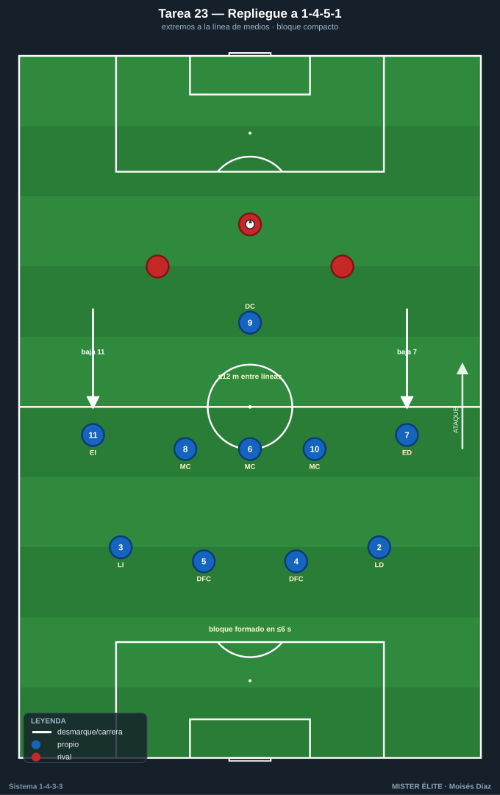
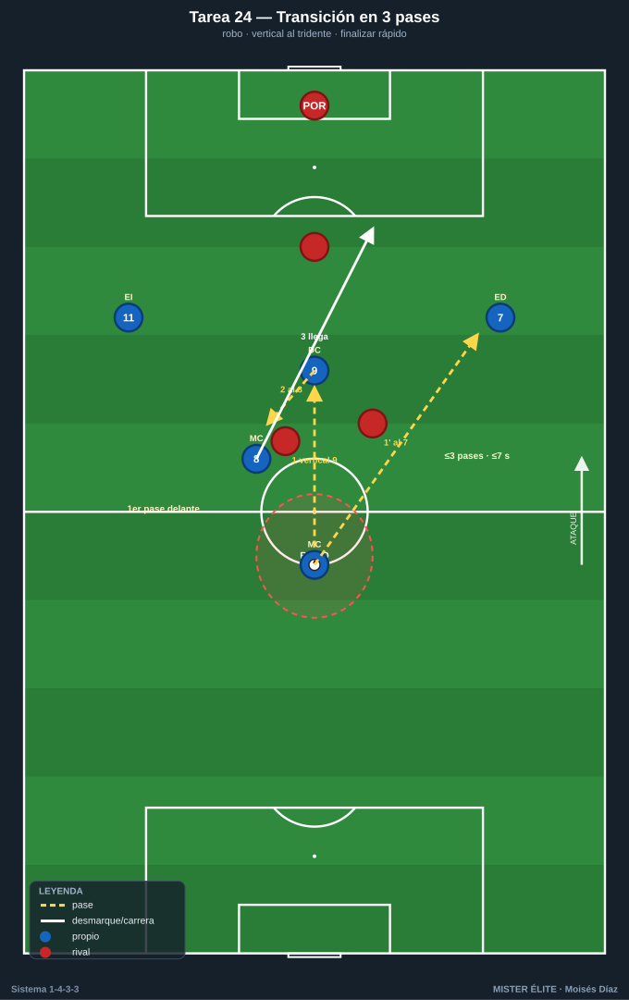
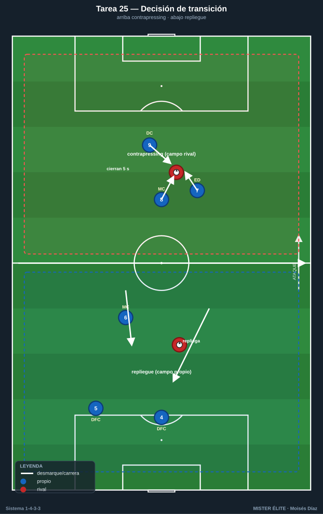
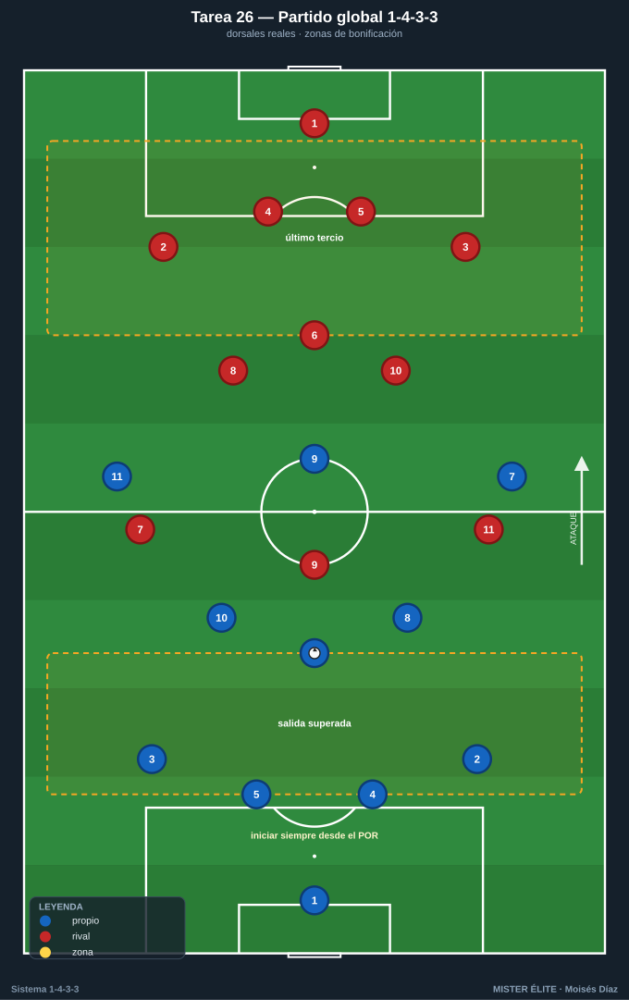

# Bloque 6 · Transiciones + partido condicionado (T23–T26)

> Repliegue a 1-4-5-1, transición ofensiva tras robo, decisión contrapressing vs repliegue y partido condicionado global. Dorsales según la convención del curso.

---

## T23 — Repliegue ordenado a 1-4-5-1: los extremos bajan

- **Objetivo (1-4-3-3):** entrenar el repliegue defensivo del 1-4-3-3 a 1-4-5-1 / 1-4-1-4-1: cuando no hay presión, los extremos 7-11 bajan a la línea de 5 medios y el 9 queda de referencia.
- **Tipo:** Situacional defensiva D>S (transición defensiva tras pérdida sin contrapressing posible).
- **Organización:** Campo a lo ancho, 70×60 m. Equipo en foco: 11 o 9 jugadores en 1-4-3-3. Rival con balón ataca posicionalmente. 2 porterías.

- **Desarrollo:** Tras pérdida sin opción de robo inmediato, el equipo **repliega**: extremos a la línea de medios (1-4-5-1), interiores y pivote forman la línea de 5, defensa de 4 compacta. Recuperar la forma y defender el bloque medio.
- **Provocaciones (medibles):** el bloque debe estar formado (4-5-1 con extremos en línea de medios) en **≤6 s** tras la pérdida (verificable). Si el rival progresa por dentro mientras se repliega → punto rival. Distancia entre líneas ≤12 m.
- **Variantes:** *(fácil)* repliegue guiado y rival lento; *(media)* real; *(difícil)* el rival ataca rápido la transición → obliga a frenar primero (un jugador) y replegar el resto.
- **Coaching:** quién frena y quién recupera la posición; los extremos bajan disciplinados; compactar líneas; comunicación para reorganizar.
- **Duración/Categoría:** 4 × 5 min. **A.**

---

## T24 — Transición ofensiva: del robo al tridente en 3 pases

- **Objetivo (1-4-3-3):** explotar la transición defensa-ataque del 1-4-3-3 tras robar, aprovechando que el tridente queda alto: pase rápido al 9/extremo y ataque de la espalda con interiores.
- **Tipo:** Situacional D-A / contraataque 6v6 con porterías.
- **Organización:** Campo medio-largo, 60×50 m. 6v6 con porteros. Estructura: al robar, los 3 de arriba (tridente) buscan profundidad.

- **Desarrollo:** Juego de presión; **al robar, transición rápida**: primer pase vertical al 9 (apoyo) o al extremo (profundidad), llegada de un interior. Finalizar antes de que el rival se reorganice.
- **Provocaciones (medibles):** gol en transición con **≤3 pases y en ≤7 s** desde el robo = doble. El primer pase tras robar debe ir hacia delante (vertical). Si se juega hacia atrás tras robar → la jugada no puntúa en transición.
- **Variantes:** *(fácil)* superioridad para el que roba (6v5); *(media)* 6v6; *(difícil)* obligar a finalizar en ≤5 s.
- **Coaching:** primer pase vertical y limpio; el tridente ataca la profundidad de inmediato; decisión rápida conducir vs pasar; sostener el equilibrio por si fallo.
- **Duración/Categoría:** 5 × 4 min. **S.**

---

## T25 — Contrapressing vs repliegue: decisión de transición

- **Objetivo (1-4-3-3):** entrenar la decisión colectiva tras la pérdida entre contrapressing (recuperar arriba) y repliegue ordenado a 1-4-5-1, según la posición del balón y el número de jugadores por delante.
- **Tipo:** Juego en espacio reducido (JER) 8v8 con doble condición.
- **Organización:** 55×45 m, 2 porterías grandes + 2 mini-porterías en banda. Línea central marcada que divide "zona de contrapressing" (campo rival) de "zona de repliegue" (campo propio).

- **Desarrollo:** Juego libre; **si se pierde en campo rival → contrapressing 5 s; si se pierde en campo propio → repliegue inmediato a bloque**. El equipo debe leer correctamente qué hacer según dónde y cómo pierde.
- **Provocaciones (medibles):** decisión correcta (contrapressing arriba / repliegue abajo) verificada por el míster = punto de equipo. Recuperación arriba en ≤5 s = doble. Repliegue formado en ≤6 s evita el punto rival. Decisión errónea (presionar mal abajo dejando espacios) = punto rival.
- **Variantes:** *(fácil)* zonas amplias y señal del míster; *(media)* lectura libre; *(difícil)* añadir comodín al equipo rival en transición (les da superioridad).
- **Coaching:** leer el momento (¿tengo gente delante del balón? presiono; ¿estoy superado? repliego); liderazgo y comunicación del 6 organizando; coherencia colectiva (todos la misma decisión).
- **Duración/Categoría:** 4 × 5 min. **S.**

---

## T26 — Partido condicionado global 1-4-3-3

- **Objetivo (1-4-3-3):** integrar y competir todos los principios del sistema (salida con pivote, mediocampo de 3, presión del tridente, amplitud de extremos, llegada, transiciones) en un partido con reglas que premian el modelo.
- **Tipo:** Partido condicionado 11v11 (o 9v9 / 10v10) campo completo.
- **Organización:** Campo completo. Ambos equipos en 1-4-3-3 con dorsales reales (1-2-3-4-5-6-8-10-7-9-11). 2 porterías con porteros. Conos para zonas de bonificación (salida superada, último tercio).

- **Desarrollo:** Partido dirigido. El míster congela jugadas para corregir el patrón del 1-4-3-3 en sus 4 fases. Se compite con marcador.
- **Provocaciones (medibles):** gol tras **salida construida desde el POR superando la 1ª presión** = doble. Gol tras **desborde de extremo o llegada de interior** = doble. Gol tras **robo en presión alta** = triple. Iniciar siempre desde el portero; balón fuera → saque rápido manteniendo el sistema.
- **Variantes:** *(fácil)* condiciones de 1 sola fase por bloque; *(media)* todas las bonificaciones activas; *(difícil)* superioridad numérica al rival y/o porterías pequeñas extra para premiar la amplitud.
- **Coaching:** congelar para corregir posición y decisión; conectar lo entrenado con el partido real; refuerzo de los comportamientos clave del sistema; liderazgo del 6 y del 9.
- **Duración/Categoría:** 3 × 10 min (o 2 × 15). **S.**
