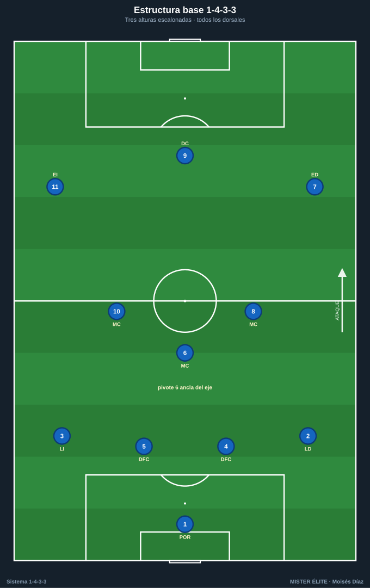
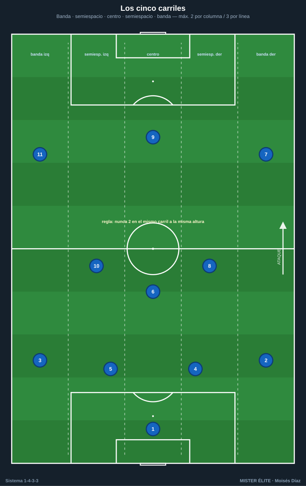
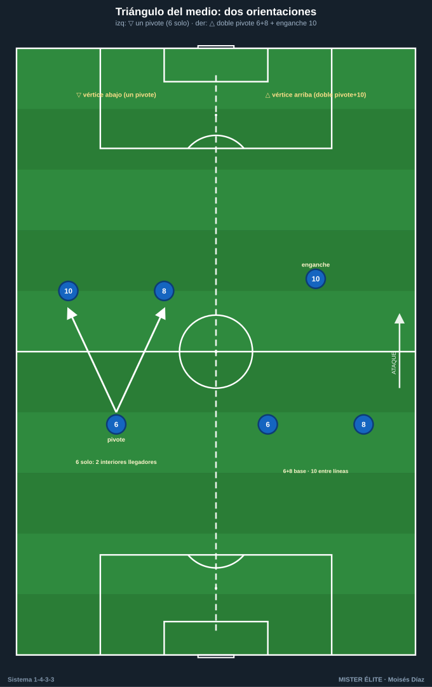
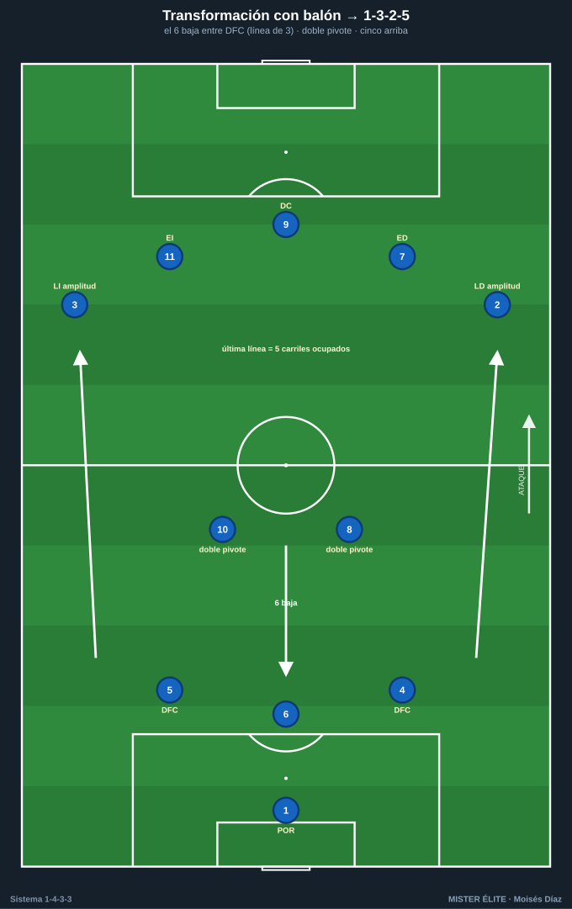
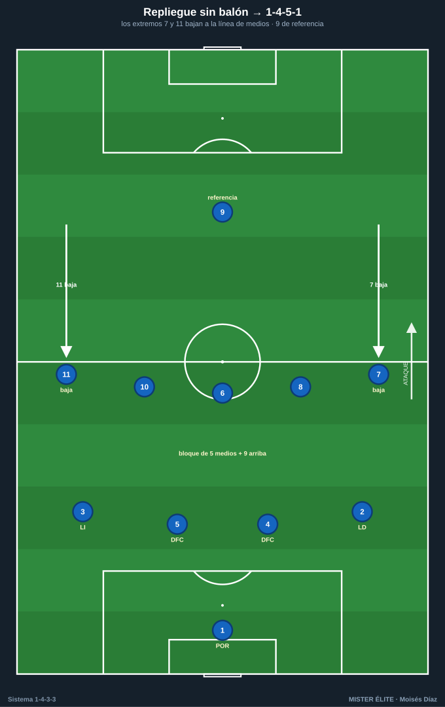
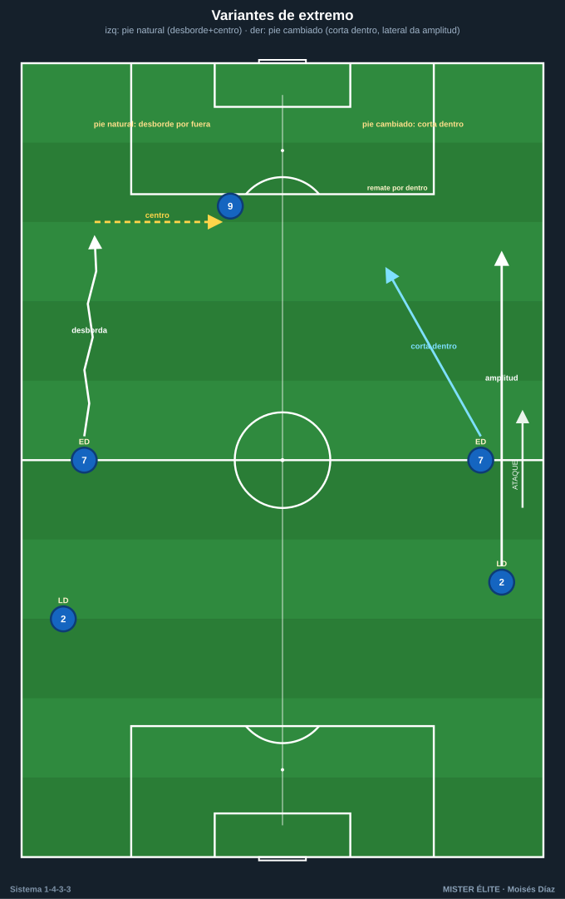

# Módulo 01 · Fundamentos y estructura del 1-4-3-3

> Nomenclatura del curso: POR 1 · LD 2 · LI 3 · DFC 4/5 · pivote 6 · interiores 8/10 · ED 7 · DC 9 · EI 11. Línea de 4 (2 DFC + LD/LI). Mediocampo de 3 = 1 pivote + 2 interiores. Tridente = 2 extremos + 1 delantero. **SÍ hay extremos.**

El 1-4-3-3 reparte 11 jugadores en cuatro bloques: portero, línea de cuatro, triángulo de tres en el medio y tridente arriba. Su seña de identidad es **ocupar los cinco carriles** y mantener tres alturas escalonadas: eso da líneas de pase cortas en diagonal y permite progresar por dentro o por fuera.

---

## 1. Estructura base y alturas de referencia

- **Línea defensiva (4):** DFC 4 y 5 por dentro, LD 2 y LI 3 abriendo el campo. Altura de partida en posesión propia: 25–35 m desde portería; con bloque alto, sobre el círculo central.
- **Mediocampo (3):** pivote 6 por delante de los centrales (35–45 m); interiores 8/10 en los medio-espacios, 10–12 m por delante del 6.
- **Tridente (3):** ED 7 y EI 11 pegados a la cal (amplitud máxima), DC 9 como referencia central fijando a los DFC rivales.

### Distancias de referencia (estándar único — idea fuerza, no dogma)
- **Entre líneas (vertical): 10–12 m** (techo de referencia, defensa↔medio y medio↔ataque). Más cerca = más control y rondos; si se supera, aparece el espacio entre líneas que el sistema quiere proteger.
- **Compactación vertical del bloque: < 30–35 m.**
- **Anchura con balón:** extremos en banda → ancho máximo de campo.
- **Triángulo interior–pivote–interior:** lados de **8–12 m**.

## 2. Los cinco carriles

Regla de oro de ocupación: **nunca dos jugadores en el mismo carril a la misma altura**; máximo **2 por columna vertical** y **3 por línea horizontal**. Los extremos sostienen la anchura máxima; cuando un extremo pisa por dentro, el lateral de ese lado da la amplitud (y viceversa).

## 3. Orientación del triángulo del medio (clave del sistema)

> Convención: el **vértice** es el jugador solitario; los otros dos forman la base. El triángulo se nombra por dónde queda ese vértice respecto a la portería rival.

- **Vértice abajo ▽ (un pivote):** 6 solo por delante de la defensa (vértice atrasado), 8 y 10 más adelantados formando la base alta. Da dos interiores llegadores y un medio más ofensivo; deja al 6 más expuesto.
- **Vértice arriba △ (doble pivote + enganche):** 6 y 8 forman el doble pivote (base atrasada), 10 como enganche entre líneas (vértice adelantado). Más solidez y dos jugadores de equilibrio; emparenta con el 1-4-2-3-1. Es el **"4-3-3 falso"**.

## 4. Transformación con balón (1-3-2-5 / 1-2-3-5)

> Notación coherente: el "1" es el portero. La última línea SIEMPRE ocupa los **cinco carriles** (ED + EI en banda, 8 + 10 en medio-espacios, 9 en eje).

- **1-3-2-5 (la más usada):** línea de **3 atrás = 2 DFC + un tercer hombre** (el **pivote 6 que baja** entre los centrales, o un **lateral que invierte** hacia dentro). Por delante, **doble pivote** con los dos restantes de ese trío (p. ej. 6 + interior, o lateral invertido + 6). Arriba, los cinco.
- **1-2-3-5:** los **dos DFC** quedan de salida (línea de 2); el medio de 3 lo forman **6 + dos laterales invertidos** (o 6 + interior + lateral). Más agresiva; exige cobertura del 6. Variante de laterales invertidos asociada a Guardiola.

## 5. Repliegue sin balón (1-4-5-1 / 1-4-1-4-1)

- **1-4-5-1:** los extremos 7 y 11 bajan a la línea de medios → cinco en el medio + 9 como única referencia arriba. Bloque medio/bajo que cierra el centro; ideal contra equipos de banda.
- **1-4-1-4-1:** el 6 anclado por delante de la defensa y 8-10-7-11 en la línea de cuatro medios. Útil para defender por delante del área.

## 6. Variantes y perfiles

| Eje | Opción A | Opción B |
|---|---|---|
| **Pivote** | Un pivote (▽): más ataque, más riesgo al lado del 6. | Doble pivote + enganche (△): el "4-3-3 falso", más control. |
| **Interiores** | Dos llegadores (box-to-box) en alternancia. | Uno posicional (sostén) + uno llegador: equilibrio en transición. |
| **Extremos** | Abiertos a pie natural: desbordan por fuera y centran. | A pie cambiado (interiores): cortan dentro a rematar; el lateral da la amplitud (modelo Klopp). |
| **Delantero** | 9 referencia: fija centrales, juego de espaldas, remate. | Falso 9 / asociativo: baja a generar superioridad y libera los carriles para los extremos. |

El **4-3-3 ↔ 4-2-3-1** es un continuo: con el 10 muy adelantado y 6+8 fijos, el 4-3-3 △ "es" un 4-2-3-1.

### Perfiles idóneos por línea
- **POR 1:** portero-líbero; inicia con los pies, cubre la espalda de la línea alta.
- **DFC 4/5:** centrales que **sacan el balón** con criterio (pase y conducción para romper presión), fuertes en duelo. Uno preferiblemente zurdo (5) para equilibrar la salida.
- **LD/LI 2/3:** laterales con **recorrido** (subir y bajar 90'), capaces de dar amplitud por fuera o **invertir** hacia dentro. Buen centro y 1v1 defensivo.
- **Pivote 6:** **ancla** posicional, lectura de coberturas, orientación para girar, primera salida limpia. No abandona el eje.
- **Interior 8:** **box-to-box**: recibe entre líneas, conduce, llega al área y ayuda en el repliegue.
- **Interior 10:** **creativo/posicional**: juega entre líneas, asocia, asiste y administra el ritmo.
- **ED 7 / EI 11:** **verticales y desequilibrantes** en el 1v1; a pie natural para desborde y centro, a pie cambiado para remate por dentro. Ayudan al lateral en defensa.
- **DC 9:** **referencia** (fija centrales, juego de espaldas, remate) o **asociativo / falso 9** (baja a generar superioridad).

## 7. Ventajas, desventajas y enfrentamientos

**Ventajas:** superioridad en el medio (3) frente a sistemas de dos centrales puros; amplitud natural del tridente; plasticidad para mutar a 1-3-2-5/1-2-3-5 con balón y a 1-4-5-1/1-4-1-4-1 sin balón; triángulos por todo el campo.

**Desventajas:** el **espacio al lado del 6** aislado es vulnerable a overloads; la **espalda de los laterales** proyectados queda expuesta al contraataque; exige perfiles muy específicos.

**Enfrentamientos:**
- **vs 1-4-4-2:** 3v2 en el medio → controlas el centro y sacas a un interior libre entre líneas; cuida las dos puntas atacando la espalda de los laterales.
- **vs 1-4-2-3-1:** medio igualado; gana el duelo de pivotes y ataca al 10 rival cuando defiende.
- **vs 1-3-5-2:** el rival iguala/supera en el centro; explota la **amplitud del tridente** (extremos atacan a los carrileros y la espalda de los centrales laterales del 3). Riesgo: sus dos puntas fijan a tus DFC y el espacio al lado del 6.

---

## Ideas clave
- El 1-4-3-3 vive de **ocupar los cinco carriles** con tres alturas escalonadas y triángulos cortos.
- Es la **misma plantilla** que muta a **1-3-2-5/1-2-3-5** con balón y a **1-4-5-1/1-4-1-4-1** sin balón.
- La orientación del triángulo (▽ un pivote / △ doble pivote + enganche) define cuán ofensivo o controlador es el medio.
- El **6 es innegociable**: no abandona el eje sin cobertura.
- Distancia entre líneas **10–12 m**; bloque vertical **< 30–35 m**.

## Errores comunes
- Confundir el sistema con un 4-4-2 sin extremos: aquí **hay extremos** (7 y 11), que dan la anchura.
- Subir los dos interiores a la vez y dejar al 6 en 1v1 (regla: uno arriba, uno abajo).
- Amontonar extremo y lateral en el mismo carril (rompe la regla de los cinco carriles).
- Estirar el bloque más de 30–35 m y regalar el espacio entre líneas.
- Usar la salida en 3 bajando los dos laterales y el pivote a la vez: el equipo se alarga y se expone.
