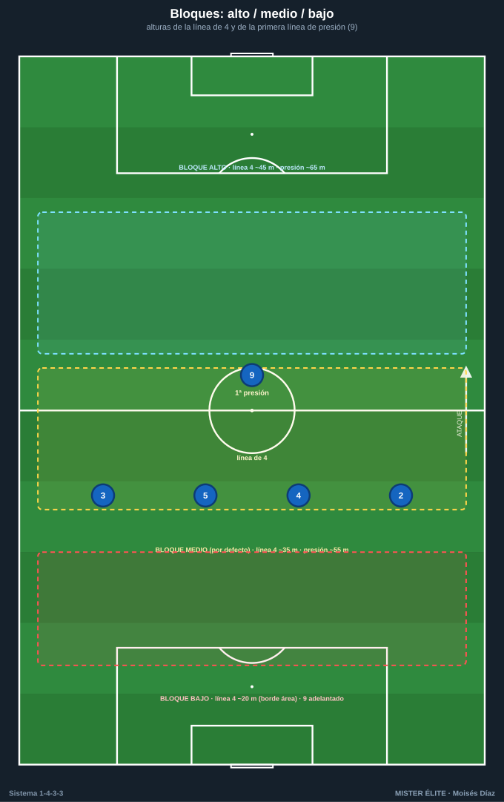
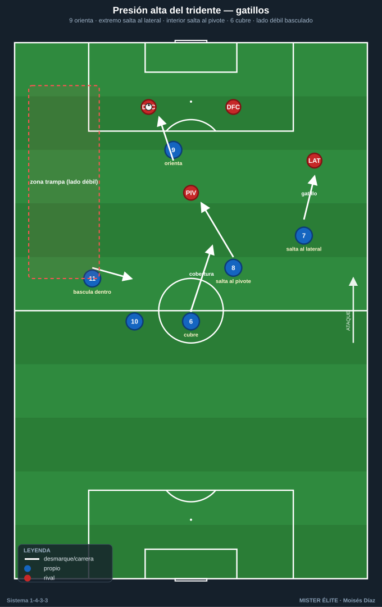
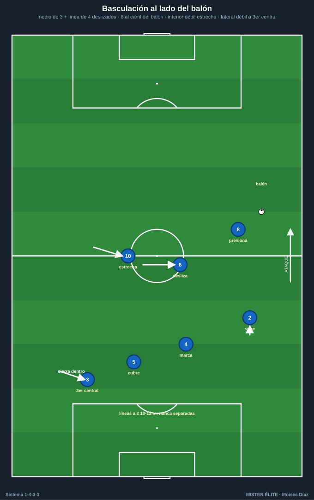
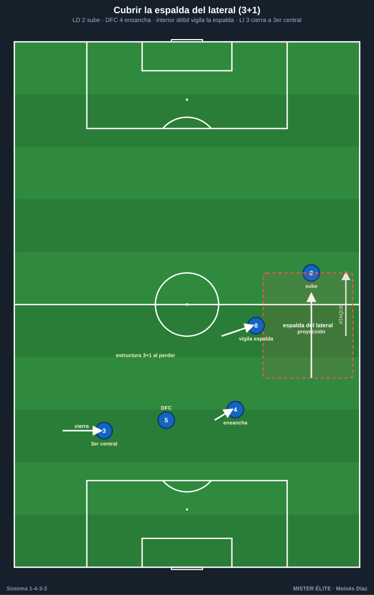

# Módulo 02 · Fase defensiva del 1-4-3-3

> Nomenclatura: POR 1 · LD 2 · LI 3 · DFC 4/5 · pivote 6 · interiores 8/10 · ED 7 · DC 9 · EI 11.

El 1-4-3-3 defiende con **tres líneas horizontales** que, al replegar, se convierten en **dos líneas cerradas** (1-4-5-1 / 1-4-1-4-1) bajando los extremos 7 y 11. Es un sistema de **densidad central** (medio de 3 + 9) y **presión orientada**. Sus dos talones de Aquiles: el **espacio a la espalda de los laterales** y el **1v1 del pivote 6** cuando los interiores abandonan el eje.

---

## 1. Roles defensivos por demarcación

- **POR 1:** defiende el espacio a la espalda de la línea de 4 (segunda barrida) con bloque alto/medio; manda el achique y el fuera de juego con la voz; 1v1 si se filtra la espalda de los laterales.
- **DFC 4 y 5:** pareja de **marca/cobertura** (uno sale al 9 rival, el otro cae en diagonal); defienden el centro y la zona de remate; coordinan achique y fuera de juego con el POR. El del lado fuerte sigue al delantero, el del lado débil vigila el segundo atacante y el balón filtrado.
- **LD 2 / LI 3:** **1v1 contra el extremo rival** (defender de costado, orientar a la línea); vigilan el intervalo lateral-central; saltan al lateral rival como gatillo cuando el tridente bascula; repliegan a la línea de 4 cerrada (el lado débil cierra a "tercer central").
- **MC 6:** **tapa el espacio entre líneas** (en la sombra del 9 rival); **cobertura permanente** de la defensa (si un lateral salta o un central se rompe, baja a tapar como tercer central temporal); ancla del contrapressing. No abandona el eje sin relevo de un interior.
- **MC 8 / 10:** **doble esfuerzo** (saltan al pivote/central rival arriba y basculan atrás a defender el ancho); cierran carril interior y semiespacio; **relevan al 6** si este sale; al replegar forman la línea de 5.
- **Tridente 7-9-11:** el **9** es primer presor y **orienta** la salida tapando el pase al pivote rival; los **extremos** parten cerrando el interior y **saltan al lateral** (gatillo). Al perder la posición alta, **bajan a la línea de medios** (1-4-5-1) y ayudan al lateral. Primer eslabón del contrapressing.

---

## 2. Bloques: alto / medio / bajo

| Bloque | Línea de 4 | Primera línea de presión | Idea |
|---|---|---|---|
| **Alto** | ~40-50 m | ~60-75 m (campo rival) | Robar arriba, achicar el campo; exige fuera de juego y POR-líbero. |
| **Medio** | ~30-40 m | ~50-60 m (centro del campo) | Replegado pero activo; invita a la salida y activa gatillos al pasar el medio. **Bloque por defecto del 4-3-3.** |
| **Bajo** | ~18-25 m (borde del área) | 9 adelantado; resto muy junto, ~30-40 m | Defender el área y la profundidad, salir al contragolpe. Entre líneas ≤ 10-12 m. |

### Repliegue a 1-4-5-1 / 1-4-1-4-1
Cuando no hay opción de robo arriba, los extremos 7 y 11 **bajan a la línea de medios**:
- **1-4-1-4-1:** el 6 queda como único pivote por delante de la defensa; 8-7 y 10-11 forman la línea de 4 medios. Protege el centro y filtra al área.
- **1-4-5-1:** los cinco medios juntos en un bloque plano; el 9 queda arriba como salida.
- **Regla:** nunca repliegan ambos extremos a la vez si solo hay un foco de balón; primero baja el del lado fuerte; el del lado débil cierra el carril central.

---

## 3. Pressing y contrapressing

### Presión alta del tridente — gatillos
Estructura: el **9** presiona a la pareja de centrales; los **extremos 7/11** cubren a los laterales rivales; el **6** vigila al pivote contrario; los **interiores 8/10** vigilan a los interiores rivales (emparejamiento casi hombre a hombre con coberturas escalonadas).

1. **9 orienta:** el 9 ataca a un central tapando con su cuerpo el pase al pivote rival → cierra un lado (presión **orientada**, no frontal).
2. **Extremo salta al lateral:** cuando el central juega a su lateral, el extremo de ese lado salta a presionar; señal de "lado fuerte".
3. **Interior salta al pivote:** si el balón llega al pivote rival, el interior del lado del balón salta; el **6 cubre** el hueco.
4. **Pase a presión:** cualquier pase lento, atrás o de espaldas → todo el bloque aprieta una línea.

**Coberturas durante la presión:** cuando el extremo salta al lateral, el **lateral propio** sube un peldaño a vigilar al extremo rival y el **interior** cubre por dentro. Cuando el interior salta al pivote, el **6 baja al eje** y el otro interior estrecha. El **lado débil bascula hacia dentro** (extremo + interior + lateral cerrados) dejando el flanco lejano como "zona trampa".

### Contrapressing (presión tras pérdida)
- **5 segundos:** los más cercanos (tridente + interior) cierran al portador y las líneas de pase cortas; el resto sube para comprimir.
- El **6** orienta la reacción y tapa el pase de salida al centro; los **interiores** saltan a los apoyos próximos.
- La **línea de 4 sube** sincronizada (no se repliega: presiona) para dejar al rival en fuera de juego.
- Si no se recupera en la ventana → **falta táctica** o repliegue ordenado al bloque medio.

---

## 4. Basculación

**Mediocampo de 3:** bascula en bloque hacia el lado del balón formando un triángulo móvil. El interior del lado del balón sale/presiona; el **6 se desliza** al carril central-lado del balón; el interior del lado débil se estrecha hacia el centro (no se queda en su banda). Distancias internas cortas (8-12 m).

**Línea de 4:** bascula en diagonal (escalera). El lateral del lado del balón sube; los dos centrales se deslizan (uno marca, otro cubre); el **lateral del lado débil cierra hacia dentro** casi como tercer central.

**Sincronía:** ambas líneas se mueven juntas; nunca se separan más de **10-12 m** (si no, aparece el espacio entre líneas).

---

## 5. Espalda de los laterales — el punto débil y sus soluciones

El espacio a la espalda del lateral que sube y el 1v1 del 6 son las dos zonas a proteger:

1. **Cobertura escalonada del lado contrario:** cuando un lateral sube, el central de ese lado ensancha, el interior del lado débil vigila la espalda y el lateral contrario cierra a tercer central (defensa en 3+1 al perder).
2. **Subida alterna de interiores:** regla "**un interior arriba, un interior abajo**" — solo uno llega al área; el otro queda al lado del 6.
3. **Pivote que cae a tercer central** en salida y, al perder, **repliegue del 6** a proteger la espalda del lateral subido.
4. **Repliegue inmediato del extremo** sobre su lateral (regla del 1-4-5-1): gatillo = pérdida o rival superando la primera línea.
5. **Falta táctica / temporización** del 6 o del interior en el carril central tras la pérdida.
6. **Bloque medio por defecto** (no alto permanente) contra rivales verticales con extremos rápidos.

---

## 6. Achique, fuera de juego y defensa de carriles

- **Achique:** cuando el balón va atrás/de costado, **toda la línea sube** con la presión; cuando el rival progresa o juega largo, **cae junta y compacta** (bloque < 30-35 m).
- **Fuera de juego:** trampa coordinada por el central del lado del balón con voz; subida en bloque al pase atrás/lateral. Requiere **línea recta** y **POR-líbero**. No abusar contra equipos que atacan la profundidad con timing.
- **Defensa de carriles:** densidad central (cierra los 3 carriles interiores con el medio de 3 + 9) e **invita por fuera**; al llegar el balón a banda, salta el extremo/lateral y se cierra el semiespacio.
- **Defensa del centro:** prioridad absoluta — el eje (6 + centrales + 9) protege la zona de remate. El pase interior solo se concede como "trampa" para robar en la siguiente acción.

---

## Ideas clave
- El 1-4-3-3 defiende por **densidad central** e invita por fuera; presión **orientada**, no frontal.
- Gatillos: **extremo→lateral**, **interior→pivote**, **9 orienta**; cada salto lleva su cobertura.
- Repliegue a **1-4-5-1 / 1-4-1-4-1** con los extremos bajando.
- Proteger siempre **la espalda del lateral** y el **1v1 del 6** (subida alterna de interiores).
- Líneas a ≤ **10-12 m**; reacción al perder en la ventana de **5 s** o repliegue/falta.

## Errores comunes
- Presionar de frente sin orientar: el rival cambia de banda y rompe la presión.
- Saltar 8 y 10 al pivote a la vez y dejar el eje abierto.
- Que los extremos no bajen a tiempo: el lateral defiende 2v1.
- Línea de fuera de juego rota (escalera) que regala la espalda.
- Mantener bloque alto permanente contra extremos rápidos en vez del bloque medio por defecto.
