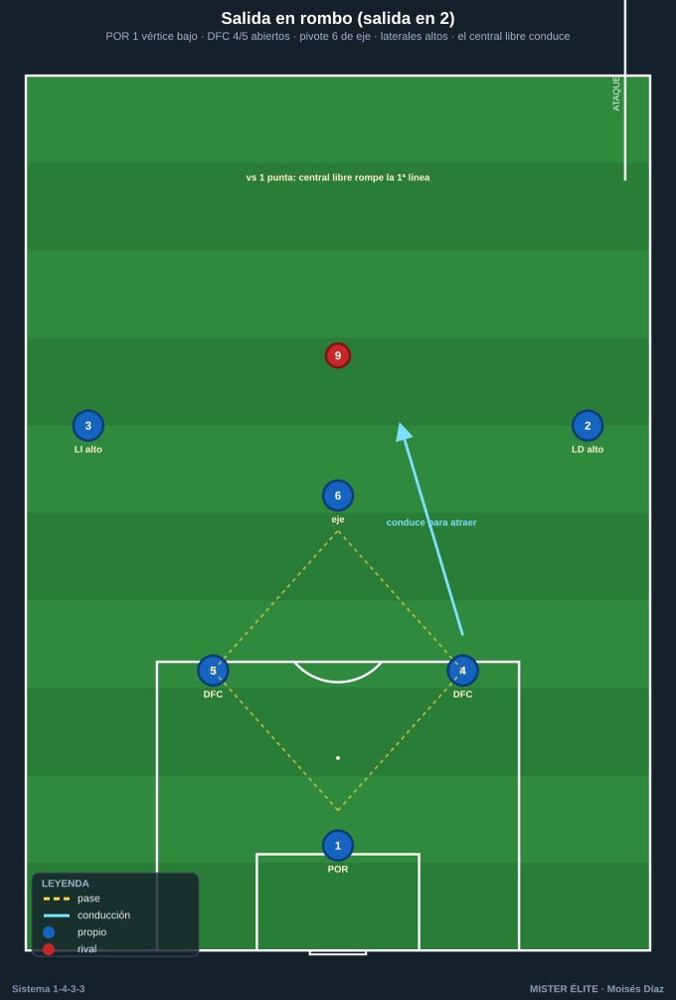
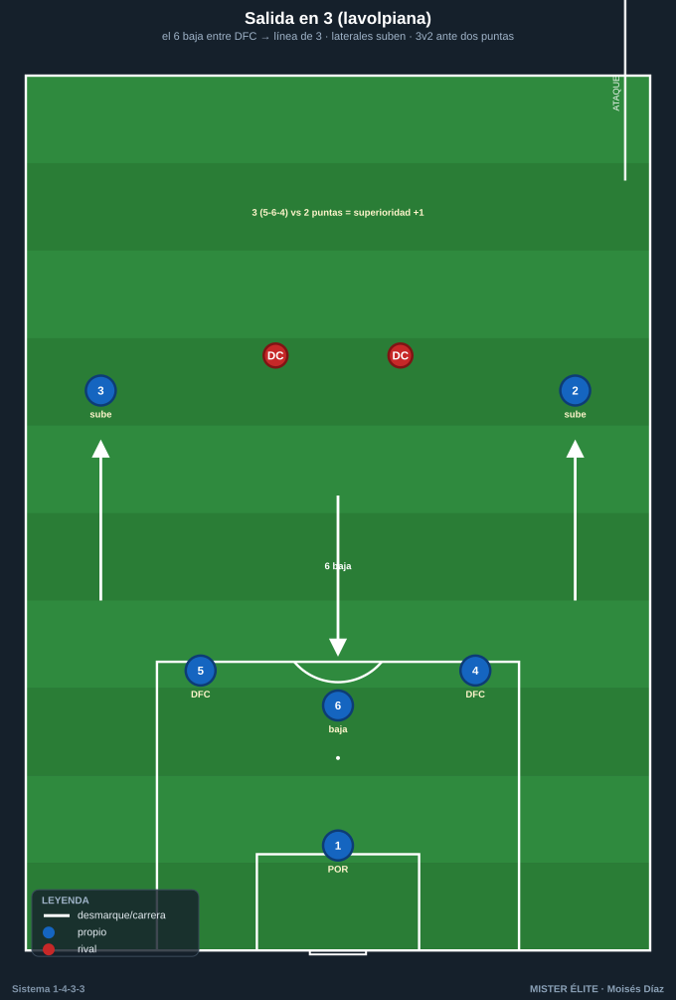
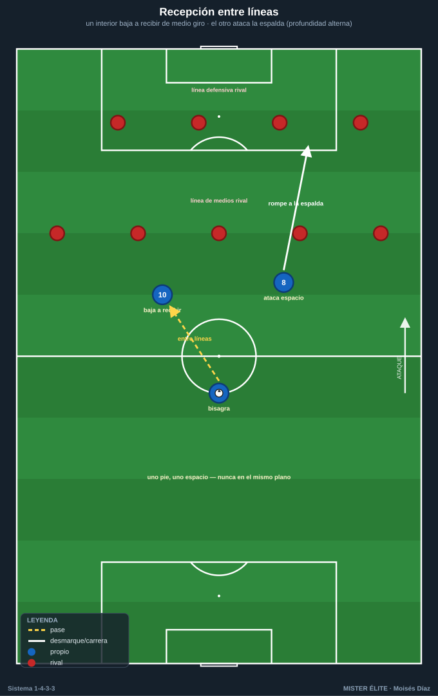
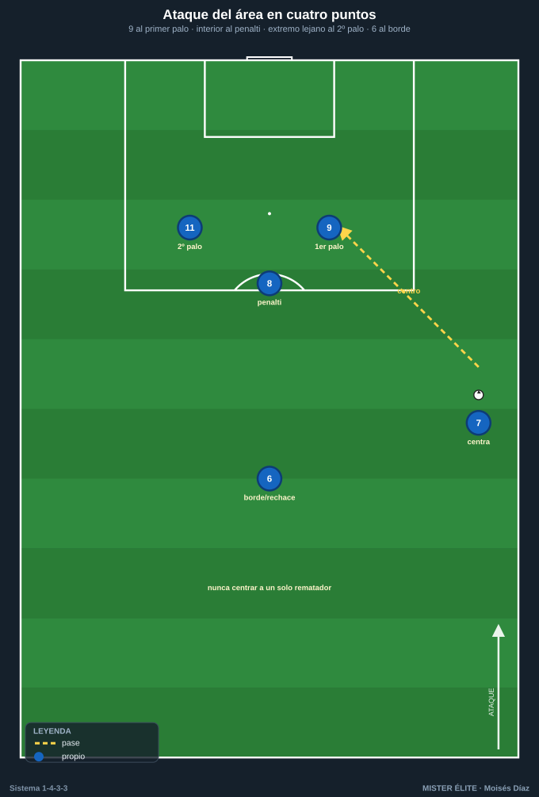

# Módulo 03 · Fase ofensiva del 1-4-3-3

> Nomenclatura: línea de 4 (LD 2 / LI 3 + DFC 4 y 5); mediocampo de 3 (pivote 6 + interiores 8/10); tridente (ED 7 · DC 9 · EI 11). **El 6 nunca abandona el eje sin cobertura.**

---

## 1. Inicio de juego — superar la primera presión

Objetivo: sacar el balón jugado, atraer la presión y, al superarla, generar superioridad por delante del balón. Dos estructuras base según cómo presione el rival.

### A) Salida en 2 (rombo con el portero)
- **Estructura:** DFC 4 + DFC 5 abiertos a la anchura del área, pivote 6 entre líneas por delante de los centrales, POR 1 como vértice bajo del rombo. Laterales 2/3 altos, pegados a la cal.
- **Cuándo:** rival que presiona con **1 punta** o con un 9 que no llega a tapar a los dos centrales.
- **Mecánica:** el central libre **conduce hacia dentro** para atraer y romper la primera línea. El 6 se ofrece en el eje; si lo marcan al hombre, **rotación**: el 6 se descuelga y un interior baja a recibir.

### B) Salida en 3 — "salida lavolpiana"
- **Estructura:** el pivote 6 **baja entre los dos DFC** → línea de 3 (5-6-4). Los laterales 2/3 **suben** a la altura del medio; los interiores se elevan y el tridente fija la última línea.
- **Cuándo:** rival que presiona con **2 puntas**. Genera **3 vs 2** en primera fase y libera a un central para conducir.
- **Corrección:** solo baja **un** lateral o **el** pivote, no ambos a la vez (si no, el equipo se alarga y se expone).

**Puntos de superación:** (1) crear siempre **+1** sobre el número de presionadores; (2) **central que conduce** para fijar y liberar; (3) **tercer hombre** (el presionado descarga al libre); (4) si todo se cierra, **bola a la espalda** hacia el espacio del extremo/9.

---

## 2. Construcción en zona media — pivote e interiores

Superada la primera línea, el objetivo es **progresar entre líneas** y transformar la estructura para ocupar los cinco carriles.

- **Pivote 6:** se ofrece de cara, orienta el juego, da el pase entre líneas o lo limpia al lateral. Es la **bisagra** entre fases.
- **Interiores 8/10 entre líneas:** se posicionan en los **intervalos** entre el medio y la defensa rival, perfilados para jugar de cara. El 10 (asociativo) suele caer al carril interior izquierdo; el 8 (box-to-box) alterna recibir y atacar el espacio.
- **Recepción entre líneas:** uno baja a recibir (atrae al medio rival) y el otro **ataca el espacio** que deja → **profundidad alterna** (uno pie, uno espacio). Nunca los dos en el mismo plano.

### Transformación 1-3-2-5 / 1-2-3-5
- **1-3-2-5:** línea de **3 atrás = 2 DFC + un tercer hombre** (el 6 que baja o un lateral que invierte); **doble pivote** con los dos restantes; **5 en la última línea** (7 y 11 en banda, 8/10 en medio-espacios, 9 en eje, laterales dando amplitud o entrando por dentro).
- **1-2-3-5:** 2 DFC atrás, 6 + 2 interiores (o 6 + interior + lateral invertido) en el medio, 5 arriba. Más agresiva.
- **Regla de oro:** máximo **3 por línea** y **2 por carril**. Cuando el extremo pisa por dentro, el lateral da la amplitud (y viceversa).

---

## 3. Último tercio — generación y finalización

- **Extremos (7/11):** fijan a los laterales rivales contra la cal, generan **1 vs 1** para desbordar o atraen para liberar el carril interior.
- **Laterales (2/3):** **desdoble por fuera** (overlap) cuando el extremo está por dentro, o **juego por dentro** (underlap / falso lateral) cuando el extremo mantiene la banda.
- **Delantero 9:** doble función — **apoyo** (cae a recibir de espaldas) y **ruptura** (ataca la profundidad fijando a los centrales). Su movimiento de fijar centrales libera la llegada de los interiores.
- **Interiores (8/10):** llegan **desde atrás** en segunda línea, atacando el punto de penalti y la frontal (mayor xG por sorpresa).
- **Extremos a pie cambiado:** conducen hacia dentro y rematan; el lateral que desdobla aporta amplitud y centro.

### Ataque del área (referencias de centro)
Tres alturas obligatorias al centro lateral:
1. **Primer palo** → DC 9 (ataque tenso/desvío).
2. **Punto de penalti** → interior que llega (8 o 10).
3. **Segundo palo** → el extremo del lado contrario (11 o 7).
4. **Rechace en la frontal** → pivote 6 o interior restante (remate de segunda jugada y equilibrio).

---

## 4. Automatismos colectivos

- **Pared (uno-dos):** interior/9 que descarga de primeras y devuelve al espacio. Clave para superar al medio que presiona.
- **Tercer hombre:** A pasa a B (de espaldas/presionado), B descarga a C que llega de cara al espacio. Patrón típico: **6 → 9 (apoyo) → 8/10 llegando** entre líneas.
- **Tercio de banda (extremo-lateral-interior):** triángulo en el carril lateral con pared, sobreposición o tercer hombre. La superioridad **3 vs 2** es el detonante del desborde.
- **Llegada desde atrás:** interiores y laterales aparecen en el último instante para no ser referenciados; el 9 y los extremos fijan, los de segunda línea finalizan.

---

## Ideas clave
- **Siempre +1 en la salida**; salida lavolpiana solo contra 2 puntas y bajando **uno**, no todos.
- **Anchura y profundidad simultáneas**: extremos al máximo y 9 amenazando la espalda abren los intervalos de los interiores.
- **Regla de carriles**: 2 por carril / 3 por línea; extremo dentro → lateral fuera.
- **El pivote 6 es la bisagra**; recepción entre líneas **perfilada** (uno baja, otro rompe).
- **Tres alturas al centro + frontal**: nunca centrar a un solo rematador.

## Errores comunes
- Sacar largo sin necesidad teniendo +1 en la salida.
- Bajar los dos laterales y el pivote a la vez en la salida en 3.
- Dos interiores recibiendo en el mismo plano (sin profundidad alterna).
- Solapar extremo y lateral en el mismo carril.
- Centrar con el área vacía o con un único rematador; llegar antes que el balón.
- Proyectar a todos y no dejar resto defensivo (6 + 2 DFC + 1 lateral).
