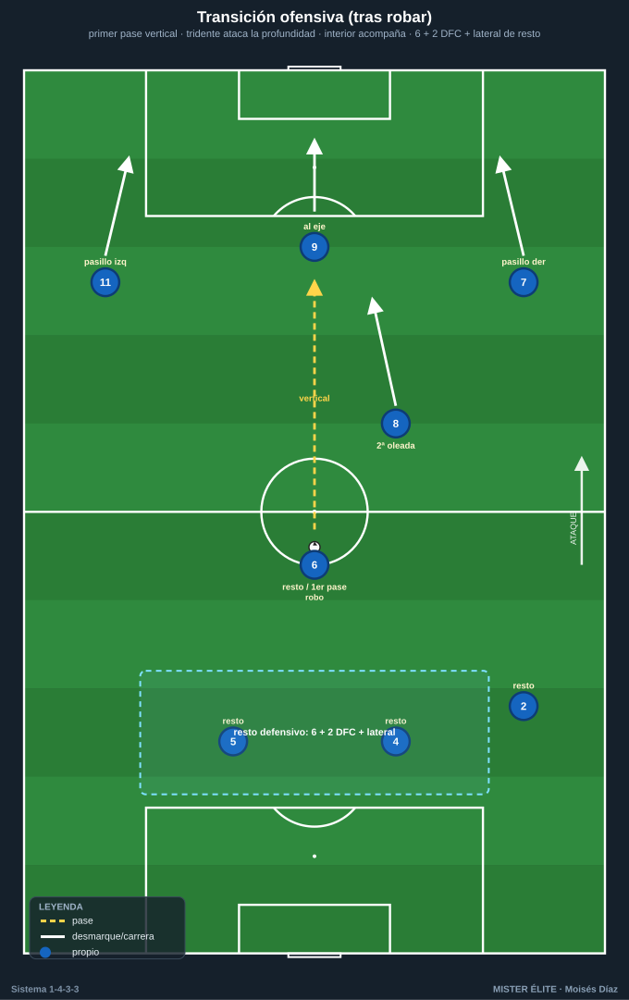
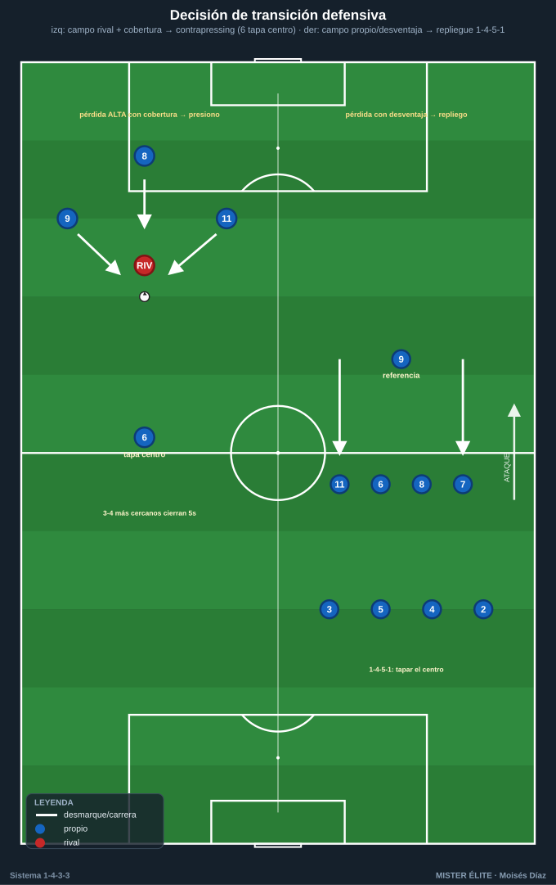
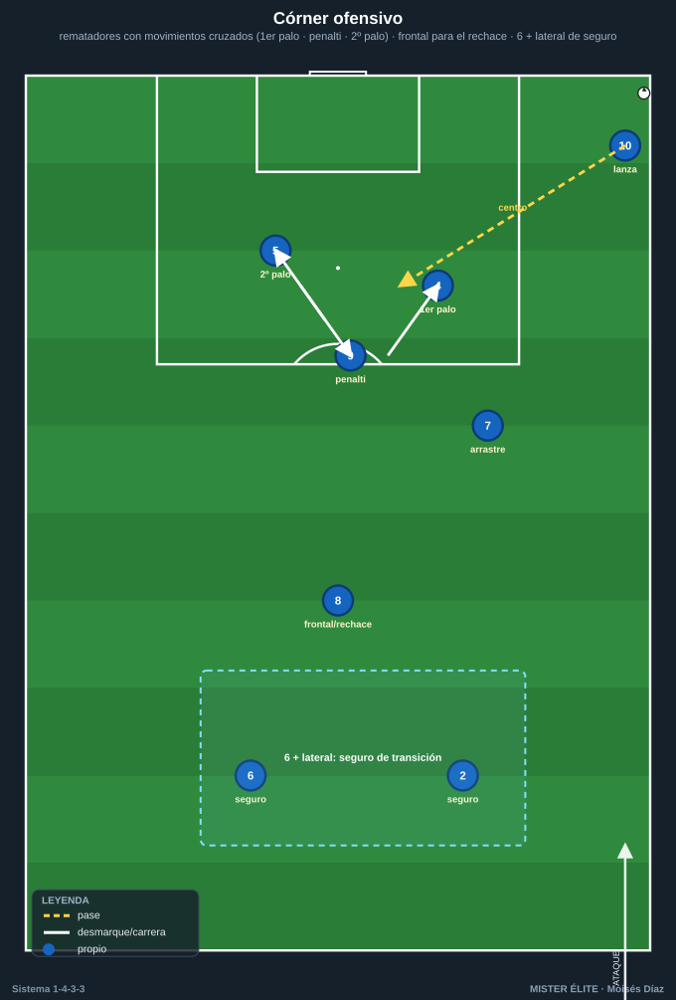

# Módulo 04 · Transiciones y balón parado del 1-4-3-3

> Nomenclatura: POR 1 · LD 2 · LI 3 · DFC 4/5 · pivote 6 · interiores 8/10 · ED 7 · DC 9 · EI 11.

Las transiciones deciden partidos. El 1-4-3-3 está entre las mejores estructuras para ellas por su **densidad central y triángulos cortos** (mucha gente cerca del balón al ganarlo o perderlo). La clave es **decidir bien en 3-5 segundos**.

---

## 1. Transición ofensiva (tras recuperar)

- **Verticalidad inmediata:** primer pase hacia delante para atacar la **defensa rival desorganizada** antes de que se reordene.
- **Salidas de contraataque:** el **tridente (7-9-11)** corre los espacios — el 9 ataca la profundidad central, los extremos los pasillos exteriores. Los **interiores (8/10)** acompañan como segunda oleada y como apoyo si el contra se frena.
- **Regla de equilibrio:** 3-4 jugadores se proyectan; el **6 + 2 centrales + 1 lateral** quedan como **resto defensivo** por si se pierde.

---

## 2. Transición defensiva (tras perder)

Dos respuestas según zona de pérdida y número de jugadores adelantados:

- **Contrapressing inmediato (gegenpressing):** si se pierde en campo rival con muchos efectivos arriba, **presión de los 3-4 más cercanos** durante los primeros segundos para recuperar o forzar pase malo. El **6 cubre el carril central** evitando el pase de progresión.
- **Repliegue a 1-4-5-1:** si no hay opción de robo inmediato, **los extremos 7/11 bajan** a la línea de medios (1-4-5-1 / 1-4-1-4-1), el **6 frena el balón en el eje** y la línea de 4 se reordena compacta. Prioridad: **tapar el centro** y obligar a jugar por fuera.
- **Disparador de elección:** posición del balón + jugadores por detrás del balón. Pérdida alta con cobertura → **presiono**; pérdida con desequilibrio numérico → **repliego**.

---

## 3. Balón parado

### Ofensivo
- **Córners:** rematadores altos (DFC 4/5, DC 9) con **movimientos cruzados** (bloqueos legales); uno al primer palo (desvío), otro al segundo; **arrastre** al primer palo para liberar el penalti. **Resto en la frontal** (interior/extremo) para el rechace y **dos atrás** (6 + lateral) como seguro de transición.
- **Faltas laterales:** mismo principio de centro que el juego abierto (primer palo / penalti / segundo palo).
- **Faltas directas frontales:** lanzador zurdo/diestro según el palo; muro de 4-5; acecho al rechace.
- **Saques de banda en campo rival:** triángulos de apoyo en el tercio de banda (extremo-lateral-interior) para mantener posesión y evitar la pérdida que genera transición.

### Defensivo
- **Sistema mixto:** zona en el primer palo + marca al hombre a los rematadores.
- El **6** defiende la frontal / rechace.
- **Dos arriba** (9 + extremo) como referencia de contra al despejar.

---

## Ideas clave
- **Decidir la transición en 3-5 s:** cobertura presente → contrapressing; desequilibrio → repliegue a 1-4-5-1.
- En transición ofensiva, **primer pase vertical** y el **tridente** ataca de inmediato; conserva el resto defensivo.
- El **6** es el primer freno en transición defensiva: tapa el centro, no persigue.
- En ABP ofensivo, **ocupar tres alturas** + frontal y dejar **dos atrás** de seguro.

## Errores comunes
- Jugar hacia atrás tras robar y perder la ventaja de la transición.
- Proyectar a todos sin resto defensivo y morir en la contra rival.
- Que el 6 salte a presionar en la transición defensiva en vez de tapar el centro.
- Contrapressing mal elegido (presionar en desventaja numérica dejando espacios atrás).
- Atacar el córner sin seguro de transición (6 + lateral): contras letales tras el despeje.
