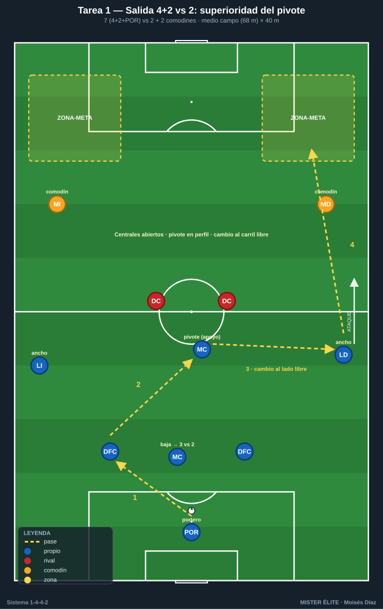
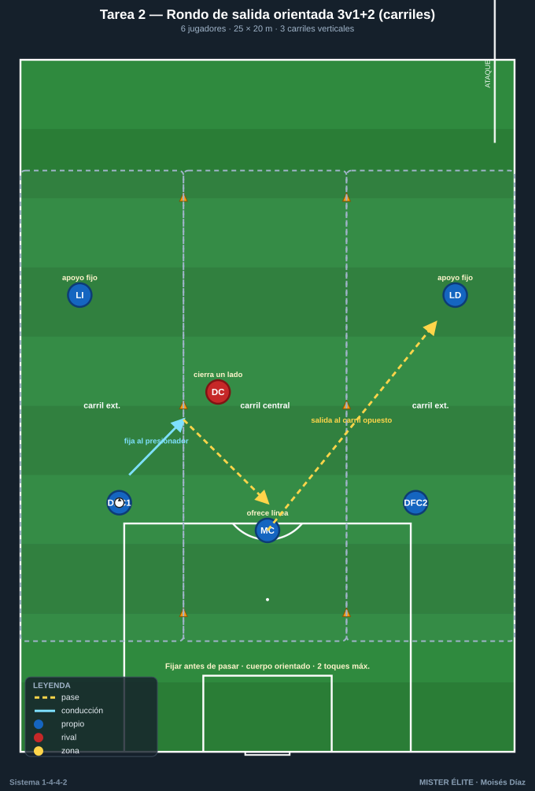
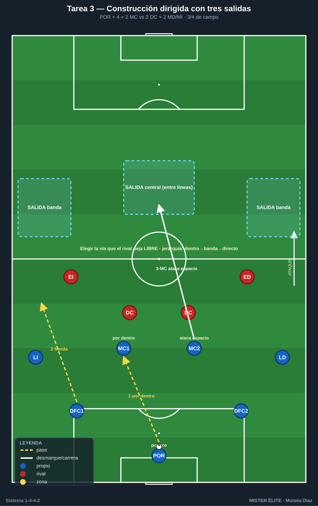
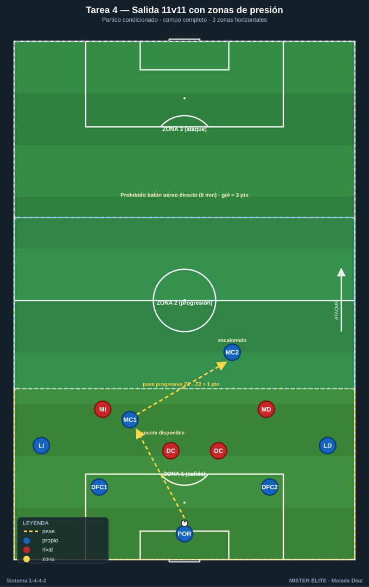

# Bloque 1 — Salida de balón / construcción (Tareas 1–4)

> Marco teórico: [Módulo 03 — Fase ofensiva](../modulos/03-fase-ofensiva.md). Convención de posiciones y distancias en el [README](../README.md).

En el 1-4-4-2 la salida limpia tiene un reto estructural: con dos delanteros rivales presionando a dos centrales, el equilibrio inicial es 2 vs 2 + portero. La clave es **generar superioridad** bajando un MC (pivote) entre/junto a los centrales, abrir laterales y **orientar el balón al carril libre**. Estas tareas entrenan ese mecanismo, no una "posesión genérica".

> **Cómo leer las fichas.** Cada tarea sigue el mismo orden: Objetivo · Organización · Desarrollo · Provocaciones · Variantes · Coaching · Duración / Categoría. Categorías: **F** formativo (sub-12 a sub-16), **A** amateur/juvenil-sénior aficionado, **S** sénior/competición. "Provocación" = regla artificial que penaliza el comportamiento incorrecto y premia el deseado.

---

## TAREA 1 — Salida 4+2 vs 2: superioridad del pivote

- **Objetivo (comportamiento 1-4-4-2):** construir desde atrás venciendo la presión de los 2 DC rivales mediante la bajada de un MC para crear el 3 vs 2 en primera línea y orientar la salida al lateral libre.
- **Tipo de tarea:** juego de posición (posicional con orientación de portería).
- **Organización:**
  - **Jugadores:** 7 atacan (POR + LD + DFC1 + DFC2 + LI + 1 MC) vs 2 DC presionadores + 2 comodines de banda neutrales (los MD/MI rivales que pueden saltar). Mínimo 9; ideal 11 con 2 MC rivales que cierran.
  - **Espacio:** medio campo de ancho completo (68 m) × 40 m de fondo desde portería.
  - **Material:** 1 portería grande con portero; 2 mini-porterías o "líneas de pase" a 40 m (zonas de progresión donde reciben los interiores); petos; balones repartidos en la portería.

- **Desarrollo:** El equipo de construcción inicia siempre con balón en el POR. Los 2 DC presionan. Un MC baja para formar línea de 3 (DFC1 - MC - DFC2) o se sitúa entre líneas. Objetivo: progresar el balón controlado a una de las dos zonas de superación (representan a los interiores recibiendo en banda). Si los presionadores roban, finalizan a la portería grande.
- **Provocaciones:**
  - Prohibido el pase largo del portero (obliga a construir).
  - Punto solo si la superación llega por el **lateral del lado contrario** al inicio de la presión (provoca el cambio de orientación).
  - 2 toques máximo para centrales (acelera la circulación bajo presión).
  - Si el pivote recibe de espaldas y **gira hacia adelante con control = 2 puntos** (premia el perfil orientado).
- **Variantes (fácil → difícil):**
  1. *Fácil:* 4+2 vs 2 sin medios rivales que salten.
  2. *Medio:* añadir 2 MC rivales que pueden presionar al pivote (4+2 vs 4).
  3. *Difícil:* presión rival completa (2 DC + 2 medios + saltos de lateral); construcción a 1-2 toques.
  4. *Difícil+:* portero obligado a participar en cada secuencia (mínimo 1 contacto).
- **Coaching:**
  - Centrales abiertos a la altura del área grande, NO juntos.
  - Pivote en perfil (medio cuerpo abierto) para recibir orientado, nunca de espaldas plano.
  - Laterales altos y abiertos pegados a banda (anchura máxima).
  - Primer pase que rompa una línea, no pase lateral cómodo.
  - Portero como jugador-más: orienta y libera al lado débil.
- **Duración / categoría:** 4 series de 4 min, 90 s de descanso (16–20 min). **A / S** (versión fácil válida para F sub-14).

---

## TAREA 2 — Rondo de salida orientada 3v1+2 (carriles)

- **Objetivo:** automatizar el primer pase de central a pivote o lateral bajo presión de un DC, con cambio de carril (interior → exterior) propio del inicio del 1-4-4-2.
- **Tipo de tarea:** rondo posicional con orientación.
- **Organización:**
  - **Jugadores:** 6 (3 en línea de salida: DFC1-MC-DFC2 + 2 laterales en banda + 1 presionador); o 3v1 con 2 apoyos exteriores.
  - **Espacio:** 25×20 m dividido en 3 carriles verticales (cinta o conos).
  - **Material:** conos de carriles, petos, balones.

- **Desarrollo:** Los 3 interiores conservan ante 1 presionador. Los apoyos en carriles exteriores (laterales) son receptores fijos. El balón debe pasar de carril central a carril exterior y volver, simulando la apertura del juego. Cada 4 pases conseguidos, "salida liberada": el balón sale al lateral y se reinicia.
- **Provocaciones:**
  - El presionador define qué lado cerrar; el equipo debe salir por el carril opuesto (lectura de orientación).
  - El pase al lateral solo vale si el central ha **fijado** antes al presionador (lo ha atraído con conducción corta).
  - Máximo 2 toques.
- **Variantes:**
  1. *Fácil:* 3v1, apoyos libres.
  2. *Medio:* 4v2, presión a dos.
  3. *Difícil:* el lateral que recibe debe progresar a una zona-meta (suma fase de progresión).
- **Coaching:** fijar antes de pasar; cuerpo orientado al carril de salida; ritmo de balón alto; el pivote ofrece línea de pase constantemente reposicionándose.
- **Duración / categoría:** 3 bloques de 3 min por lado (12 min). **F / A**.

---

## TAREA 3 — Construcción dirigida con tres salidas (analítica-situacional)

- **Objetivo:** entrenar las 3 vías de salida del 1-4-4-2 (corta por dentro al pivote, lateral abierto y salto directo al delantero que baja) eligiendo según la presión.
- **Tipo de tarea:** situacional (semi-analítica con oposición pasiva → activa).
- **Organización:**
  - **Jugadores:** bloque de construcción (POR + 4 + 2 MC) + 2 DC + 2 MD/MI rivales (10–11).
  - **Espacio:** 3/4 de campo a lo ancho completo.
  - **Material:** portería grande; 3 zonas-meta (banda derecha, banda izquierda, zona central entre líneas).

- **Desarrollo:** El entrenador (o un servidor) condiciona la presión rival con una señal (presión al central derecho, al pivote o bloque medio). El equipo elige la salida correcta y conduce/pasa a la zona-meta libre. Reinicio constante desde el POR.
- **Provocaciones:**
  - Cada secuencia debe resolverse por la vía que el rival deja libre; usar la vía cerrada = secuencia anulada (entrena lectura, no fórmula).
  - Si el delantero baja a recibir (salida directa), uno de los MC debe atacar el espacio que él deja (automatismo asociado).
- **Variantes:** pasiva → semiactiva → activa con presión real y posibilidad de robo y finalización rival.
- **Coaching:** ver antes de recibir; jerarquía de decisión (primero por dentro; si no, banda; si no, directo); el segundo delantero referencia la profundidad mientras uno baja.
- **Duración / categoría:** 20 min (bloques de 5 min cambiando la condición de presión). **A / S**.

---

## TAREA 4 — Salida 11v11 con zonas de presión (partido condicionado de construcción)

- **Objetivo:** transferir la salida a contexto real, superando la primera línea de presión y conectando con la línea de 4 de medios en progresión.
- **Tipo de tarea:** partido condicionado.
- **Organización:**
  - **Jugadores:** 10–11 vs 10–11.
  - **Espacio:** campo completo, dividido en 3 zonas horizontales (defensa-medio-ataque) por líneas de cal.
  - **Material:** 2 porterías; balones en cada portería para reinicios rápidos.

- **Desarrollo:** Partido normal, pero el equipo en posesión suma 1 punto cada vez que **supera la primera línea de presión con balón controlado** pasando de zona 1 a zona 2 mediante pase progresivo (no despeje). Gol vale 3.
- **Provocaciones:**
  - El equipo sin balón solo puede presionar con 2 + 2 en zona 1 (replica la presión típica del 1-4-4-2 en salida).
  - Prohibido superar la primera línea con pase aéreo directo a delantero (obliga a construir por suelo) durante los primeros 6 min de cada bloque; luego se libera.
- **Variantes:** reducir la zona de salida; obligar a un mínimo de pases antes de progresar; permitir presión de 3 en zona 1 (mayor exigencia).
- **Coaching:** amplitud máxima de laterales; pivote siempre disponible y orientado; segundo MC escalonado para recibir tras superar la primera línea.
- **Duración / categoría:** 3 bloques de 8 min (24–28 min). **A / S**.
