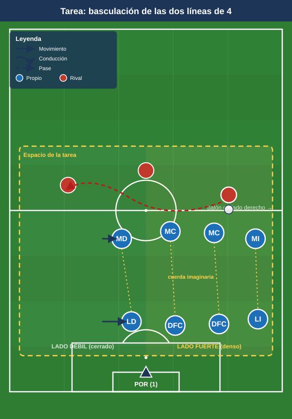

# Bloque 2 — Organización y basculación defensiva (Tareas 5–9)

> Marco teórico: [Módulo 02 — Fase defensiva](../modulos/02-fase-defensiva.md). Convención de posiciones y distancias en el [README](../README.md).

El 1-4-4-2 defiende con dos bloques compactos de 4 que se desplazan en paralelo (basculación lateral), cerrando el lado del balón y dejando el lado débil cubierto por la distancia. Claves: distancias entre líneas (≈8–12 m), entre jugadores (≈8–10 m), achique y desplazamiento **como bloque**, no individual. Estas tareas entrenan el movimiento de las dos líneas como una unidad.

> **Cómo leer las fichas.** Objetivo · Organización · Desarrollo · Provocaciones · Variantes · Coaching · Duración / Categoría. Categorías: **F / A / S**. "Provocación" = regla artificial que penaliza lo incorrecto y premia lo deseado.

---

## TAREA 5 — Las dos líneas de 4: basculación guiada por el balón (analítica de bloque)

- **Objetivo:** sincronizar el desplazamiento lateral de las dos líneas de 4 manteniendo distancias y orientación, cerrando el lado fuerte.
- **Tipo de tarea:** analítica de bloque (sin oposición o con balón guía).
- **Organización:**
  - **Jugadores:** las 8 piezas defensivas (4 defensas + 4 medios) + 4–6 atacantes que circulan el balón sin finalizar.
  - **Espacio:** medio campo a lo ancho (68×45 m).
  - **Material:** cuerdas o gomas elásticas (opcional) uniendo a los 4 de cada línea para feedback visual de distancias; conos de carriles.
- **Desarrollo:** Un grupo de atacantes circula el balón en U (lateral-central-lateral) por delante del bloque. Las dos líneas basculan lateralmente según dónde está el balón, manteniéndose compactas. Sin robar al inicio: el foco es el movimiento sincronizado.
- **Provocaciones:**
  - La cuerda/goma no puede destensarse (obliga a mantener distancias entre compañeros de línea).
  - El jugador del lado del balón "marca" referencia; el del lado débil entra al carril central (pinzamiento), nunca queda abierto pegado a su banda.
  - Cada cambio de orientación del balón debe corresponderse con un reajuste completo de las 8 piezas **antes de 3 segundos**.
- **Variantes:**
  1. *Fácil:* balón guiado lento por el entrenador, sin presión de tiempo.
  2. *Medio:* circulación a ritmo real; las líneas roban si hay pase malo.
  3. *Difícil:* cambio de orientación largo (basculación rápida total) + un atacante interior entre líneas (obliga a vigilar el espacio).
- **Coaching:** mover el bloque "con un hilo invisible"; el lado débil cierra hacia dentro; nunca correr de forma individual hacia el balón rompiendo la línea; ojos en balón y referencias.
- **Duración / categoría:** 4 series de 3 min, cambiando el lado de inicio (14 min). **F / A / S** (base imprescindible).

---

## TAREA 6 — Distancia entre líneas: el espacio intermedio (situacional)

- **Objetivo:** mantener la distancia correcta entre la línea de medios y la de defensas para anular el juego entre líneas rival (el espacio que más castiga al 1-4-4-2).
- **Tipo de tarea:** situacional.
- **Organización:**
  - **Jugadores:** línea de 4 defensas + 4 medios + 2 "enganches" rivales que buscan recibir entre líneas + 4 exteriores que dan el balón.
  - **Espacio:** 60×45 m.
  - **Material:** una franja central pintada (la "zona prohibida" entre líneas), ~10 m de fondo.
- **Desarrollo:** Los exteriores circulan e intentan filtrar al jugador entre líneas dentro de la franja. La línea de medios achica hacia atrás o el MC más cercano bascula a tapar; los defensas suben coordinados para reducir esa franja.
- **Provocaciones:**
  - Cada vez que un rival recibe **orientado** dentro de la franja = 2 puntos para atacantes (penaliza la línea rota).
  - Si medios y defensas mantienen <12 m durante toda una secuencia = punto defensivo.
  - El MC pivote no puede salir de la zona central (vigila el corazón del campo).
- **Variantes:** ampliar la franja (más difícil cerrar) → añadir un delantero que se apoya y descarga al jugador entre líneas.
- **Coaching:** "achicar o tapar" como decisión binaria; comunicación de la línea de medios ("¡atrás, atrás!" / "¡cierro!"); el MC del lado vigila la espalda; subir la defensa cuando el balón va atrás/lateral.
- **Duración / categoría:** 4 series de 4 min (16–18 min). **A / S**.

---

## TAREA 7 — 8v8 en bloque medio: defender por zonas (juego condicionado defensivo)

- **Objetivo:** mantener el bloque medio compacto, desplazarse por zonas y forzar al rival al lado del campo donde queremos.
- **Tipo de tarea:** juego condicionado / situacional reducido.
- **Organización:**
  - **Jugadores:** 8 defienden (4+4) vs 8–9 atacan.
  - **Espacio:** 60×60 m con 3 carriles verticales.
  - **Material:** conos de carriles; 2 mini-porterías para que el bloque defensivo contraataque.
- **Desarrollo:** El equipo atacante intenta llegar a la línea de fondo del bloque defensivo. El bloque defiende manteniendo la forma 4+4 y basculando por carriles. Al robar, busca las mini-porterías (premia robo + salida).
- **Provocaciones:**
  - El atacante no puede cambiar de carril con conducción más de una vez por posesión (favorece que el balón circule por fuera, donde el bloque quiere llevarlo).
  - Defensa: si dos jugadores de la misma línea salen a la vez al balón = falta táctica (rompe la línea) y posesión rival.
  - Robo en el carril donde el bloque ha "encerrado" = 2 puntos (premia la inducción).
- **Variantes:** reducir el espacio (más compacidad) → permitir un comodín atacante en banda (estira el bloque).
- **Coaching:** uno presiona, el resto cubre y bascula; cerrar el lado fuerte; orientar al rival a banda; nunca dos a por el balón.
- **Duración / categoría:** 4 series de 4 min (18 min). **A / S**.

---

## TAREA 8 — Defensa del centro lateral: repliegue y vigilancia del área (situacional)

- **Objetivo:** organizar el bloque ante el balón en banda y el centro, con la línea de 4 ocupando los puntos del área y los medios replegando a la segunda jugada.
- **Tipo de tarea:** situacional defensiva.
- **Organización:**
  - **Jugadores:** 4 defensas + 2 MC que repliegan + POR vs 2 DC + 2 bandas rivales que centran.
  - **Espacio:** zona de finalización (área grande + 25 m).
  - **Material:** portería grande; balones en las dos bandas; conos marcando primer palo / segundo palo / punto de penalti / frontal.
- **Desarrollo:** Balón en banda rival que llega al fondo y centra. La defensa de 4 ocupa: primer palo (lateral), centro del área (centrales 1 y 2); un MC vigila la frontal para el rechace y el otro MC marca al que llega al segundo palo.
- **Provocaciones:**
  - Gol de rechace en frontal sin vigilancia = vale doble (penaliza no proteger la segunda jugada).
  - El central que no va al balón no puede dejar de marcar a un atacante (provoca el reparto correcto de marcas).
  - La defensa gana punto si despeja fuera del área grande (despeje útil, no corto).
- **Variantes:** centro raso vs centro al área vs centro atrás → añadir un tercer atacante que ataca el área.
- **Coaching:** reparto de zonas del área; nadie mira el balón sin sentir a su rival; MC a la frontal SIEMPRE; lateral del lado contrario cierra segundo palo; portero manda en su zona.
- **Duración / categoría:** 20 repeticiones (10 por banda) en bloques (15–18 min). **A / S**.

---

## TAREA 9 — Línea de 4: subir, bajar y trampa de fuera de juego (analítica)

- **Objetivo:** coordinar el ascenso/descenso de la línea de 4 defensiva y la temporización del fuera de juego, clave del bloque del 1-4-4-2.
- **Tipo de tarea:** analítica con oposición dirigida.
- **Organización:**
  - **Jugadores:** 4 defensas + POR vs 4 atacantes (2 DC + 2 que llegan) + 1–2 pasadores.
  - **Espacio:** medio campo, anchura completa, con línea de fuera de juego de referencia pintada.
  - **Material:** línea pintada móvil (conos); banderines.
- **Desarrollo:** Los pasadores buscan el pase al espacio a la espalda. La línea de 4 sube al unísono al señalar el central de referencia, dejando en fuera de juego, o baja temporizando si el balón va a la espalda con ventaja del atacante.
- **Provocaciones:**
  - La línea debe subir/bajar "como una persiana": si un defensa queda 1 m descolocado y deja activo a un atacante = punto atacante.
  - El central de referencia (DFC del lado del balón) ordena con voz "¡arriba!" o "¡basta!".
- **Variantes:** ritmo lento → ritmo real → añadir conducción del pasador (decisión de subir o aguantar).
- **Coaching:** un líder de la línea manda; subir cuando el rival no puede pasar al espacio (balón controlado de espaldas / atrás); bajar y temporizar cuando el rival encara con campo; mirada dividida balón-línea.
- **Duración / categoría:** 4 series de 3 min (14 min). **A / S** (con cuidado en F).
