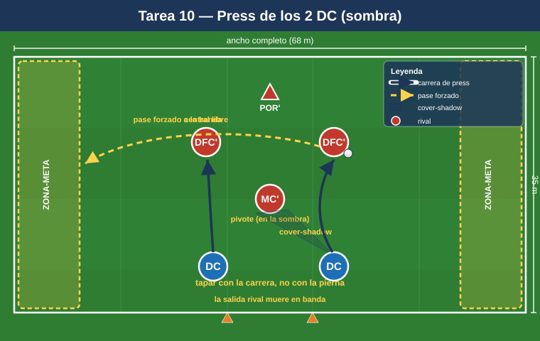
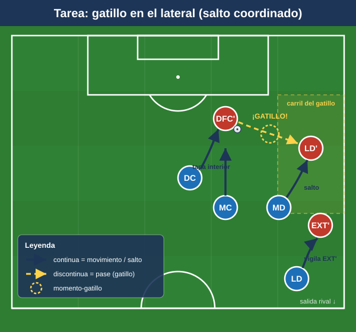

# Bloque 3 — Pressing de los 2 delanteros y de las líneas (Tareas 10–13)

> Marco teórico: [Módulo 02 — Fase defensiva §3](../modulos/02-fase-defensiva.md). Convención de posiciones y distancias en el [README](../README.md).

El 1-4-4-2 presiona arriba con sus 2 DC **orientando la salida rival** (curvando la carrera para tapar al pivote y obligar al pase al lateral, que es la señal de salto), y con los MD/MI **saltando al lateral** en cuanto llega el balón, mientras el bloque sube detrás. Estas tareas entrenan los gatillos (triggers) y las coberturas del press.

> **Cómo leer las fichas.** Objetivo · Organización · Desarrollo · Provocaciones · Variantes · Coaching · Duración / Categoría. Categorías: **F / A / S**. "Provocación" = regla artificial que penaliza lo incorrecto y premia lo deseado.

---

## TAREA 10 — Press de los 2 delanteros: curvar carrera y tapar pivote (analítica)

- **Objetivo:** que los 2 DC presionen en pareja curvando la carrera para tapar la línea de pase al pivote y orientar la salida rival a un solo lado.
- **Tipo de tarea:** analítica / situacional.
- **Organización:**
  - **Jugadores:** 2 DC presionan vs 2 centrales + 1 pivote + portero rivales (salida 3+POR).
  - **Espacio:** ancho completo × 35 m de fondo.
  - **Material:** portería; 2 zonas-meta en bandas (donde "muere" la salida rival).
- **Desarrollo:** El rival inicia desde el portero. Los 2 DC deben impedir que la salida progrese por dentro (al pivote) y forzarla a banda. Si el rival llega a la banda donde el delantero ha orientado = éxito del press.
- **Provocaciones:**
  - El primer DC que presiona debe correr en curva tapando con su cuerpo la sombra de pase al pivote (si presiona en recta dejando el carril interior = secuencia anulada).
  - El segundo DC marca al pivote o al central libre según la orientación (saltos alternos).
  - Pase rival al pivote orientado = punto rival (castiga el press mal hecho).
- **Variantes:** rival pasivo → activo → con un lateral añadido (3+1) que obliga a coordinar el salto del medio.
- **Coaching:** "tapar con la carrera, no con la pierna"; presionar en pareja, nunca uno suelto; señal común para saltar; cuerpo orientado para que el rival solo pueda jugar al lado que queremos.
- **Duración / categoría:** 4 series de 3 min (14 min). **A / S**.

---

## TAREA 11 — El gatillo del lateral: salto del MD/MI (situacional)

- **Objetivo:** entrenar el gatillo de presión más típico del 1-4-4-2: cuando el balón va del central rival al lateral, el medio de banda salta a presionar y el bloque se desplaza y sube.
- **Tipo de tarea:** situacional de bloque parcial.
- **Organización:**
  - **Jugadores:** medio bloque (2 DC + MD + MI + 1 MC + 1 lateral del lado) vs línea de salida rival (2 centrales + 2 laterales + 1 pivote).
  - **Espacio:** ancho completo × 45 m.
  - **Material:** zonas-meta en banda y centro.
- **Desarrollo:** El rival circula entre centrales y laterales. En cuanto el balón llega al lateral rival, el MD/MI de ese lado salta a presionar agresivo; el delantero cierra la vuelta atrás al central; el MC bascula a tapar el interior; el lateral propio sube a vigilar al extremo rival.
- **Provocaciones:**
  - El MD/MI debe llegar al lateral rival antes de su segundo toque (gatillo veloz).
  - Tras el salto, prohibido al rival jugar de vuelta al central libremente: si lo consigue 3 veces, gana posesión (obliga al delantero a cerrar la vuelta).
  - Robo en banda tras el salto = 2 puntos.
- **Variantes:** un lado solo → ambos lados (el rival cambia de orientación y obliga a saltar al otro medio) → cambio de orientación largo que pone a prueba la basculación.
- **Coaching:** saltar a la señal (pase al lateral), no antes; presionar el cuerpo del lateral por dentro para cerrar el centro; el delantero "borra" la vuelta atrás; coberturas en cadena detrás del que salta.
- **Duración / categoría:** 4 series de 4 min, alternando lados (18 min). **A / S**.

---

## TAREA 12 — Press alto 8v8+POR con gatillos (juego condicionado)

- **Objetivo:** integrar el press alto completo del 1-4-4-2 (2 DC + 2 bandas + 2 MC) con sus gatillos y recuperar arriba para finalizar rápido.
- **Tipo de tarea:** juego condicionado.
- **Organización:**
  - **Jugadores:** 8 presionan (sin laterales y sin un central, para foco en bloque alto) vs 8 + portero que intentan salir.
  - **Espacio:** 2/3 de campo, ancho completo.
  - **Material:** portería grande (que defiende el rival que sale) + 2 mini-porterías en el centro del campo (meta del equipo que sale: superar la presión).
- **Desarrollo:** El rival intenta superar la presión y llegar a las mini-porterías. El equipo que presiona intenta robar y finalizar en la portería grande. Trabajo claro de robar arriba.
- **Provocaciones:**
  - Gol del equipo que presiona en <8 segundos tras el robo = vale doble (premia finalizar la recuperación alta rápido).
  - Si el rival supera la presión y marca en una mini-portería, suma 2 puntos y reinicia con superioridad temporal (consecuencia de juego que castiga ceder el campo). Opcionalmente puede añadirse un sprint corto del equipo de press para elevar la intensidad del salto.
  - Activación del press solo cuando el portero rival juega corto (gatillo de inicio).
- **Variantes:** reducir el tiempo de finalización; permitir al rival un comodín en salida; ampliar el espacio (más exigencia física).
- **Coaching:** presionar en bloque, todos a una; señal común; no presionar en desorden; tras robar, atacar la portería de inmediato (la mejor cobertura es el siguiente robo + ataque rápido).
- **Duración / categoría:** 4 series de 4 min (18–20 min). **S** (versión reducida para A).

---

## TAREA 13 — Press medio vs press alto: cambio de altura por señal (situacional avanzada)

- **Objetivo:** alternar la altura del bloque (medio ↔ alto) según señal del entrenador, entrenando la decisión de cuándo saltar y cuándo esperar.
- **Tipo de tarea:** situacional avanzada / juego condicionado.
- **Organización:**
  - **Jugadores:** bloque completo 10 vs 10–11 atacando.
  - **Espacio:** 3/4 de campo.
  - **Material:** 2 porterías; petos de 2 colores para el equipo defensivo (un color = altura alta, otro = media).
- **Desarrollo:** El equipo defensivo defiende en bloque medio por defecto. A la señal acústica/visual del entrenador, salta a press alto coordinado y vuelve a bloque medio si no roba en X segundos.
- **Provocaciones:**
  - El press alto debe activarse por toda la unidad antes de 2 segundos de la señal (sincronía).
  - Si el equipo salta y el rival lo supera, concede campo gratis (consecuencia real): obliga a saltar bien o no saltar.
  - Recuperación en bloque medio compacto = punto; recuperación en press alto = 2 puntos.
- **Variantes:** señales fijas → señales según gatillos naturales (pase atrás del rival, control malo) sin entrenador.
- **Coaching:** unidad en la decisión; el delantero líder activa con su voz; no saltar si no hay gatillo; transición inmediata entre alturas.
- **Duración / categoría:** 3 bloques de 6 min (18 min). **S**.
