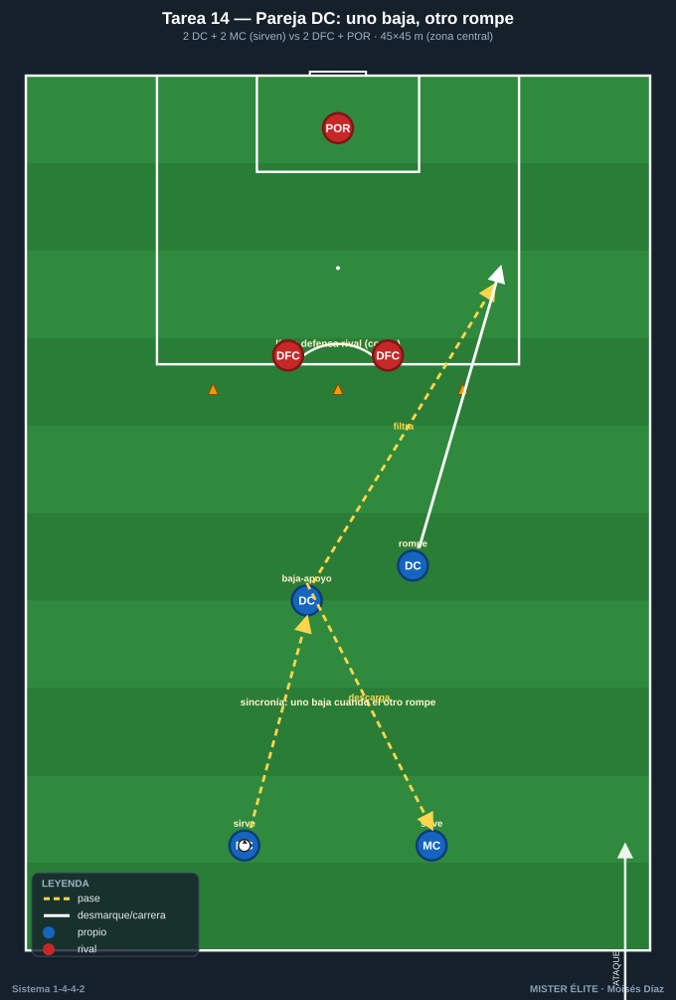
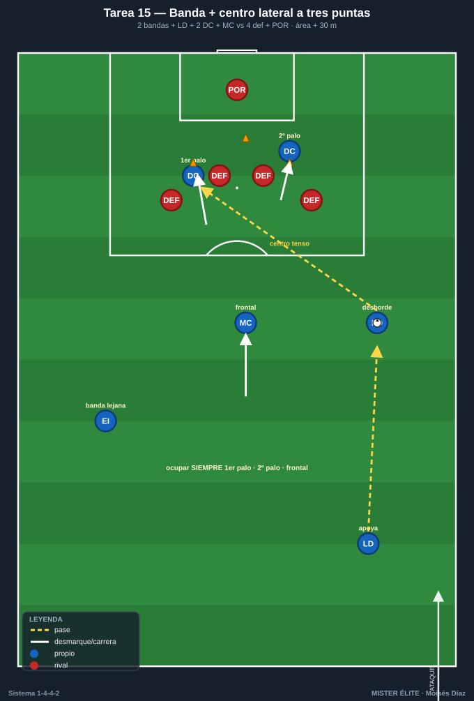
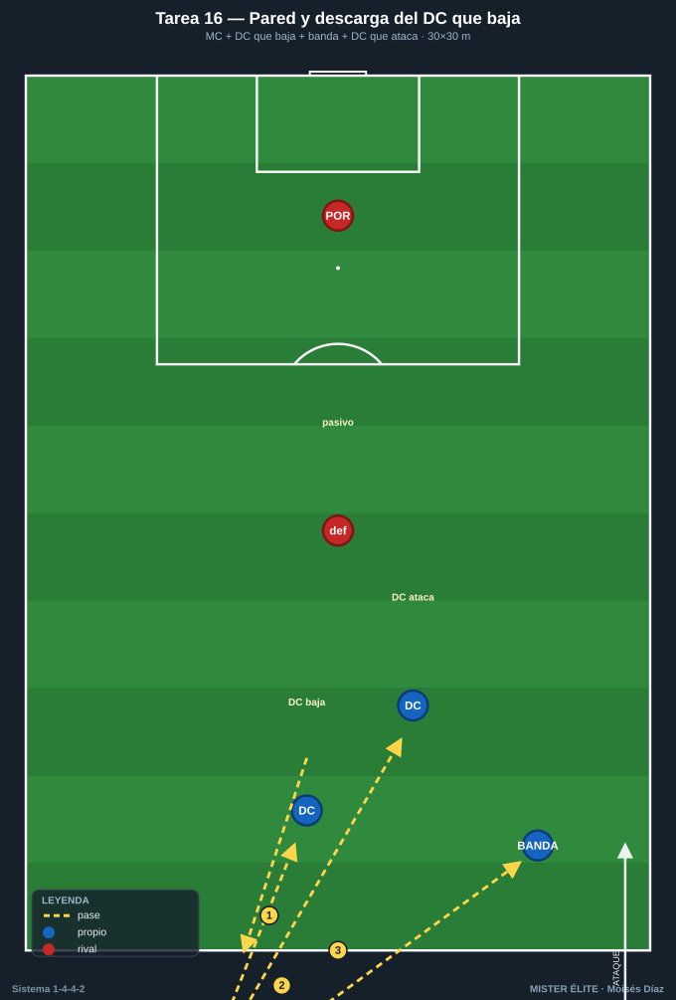
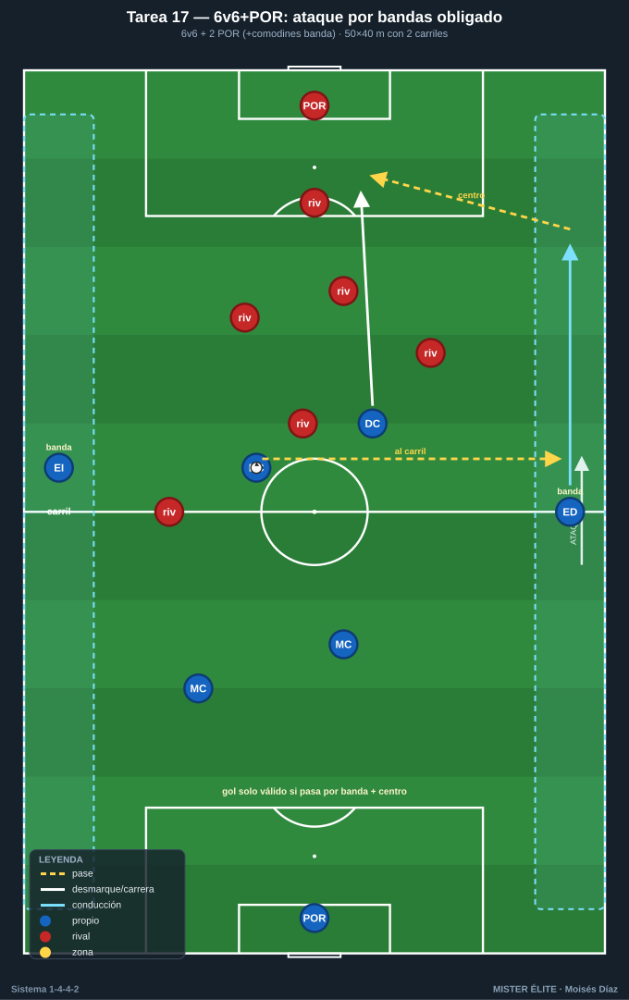
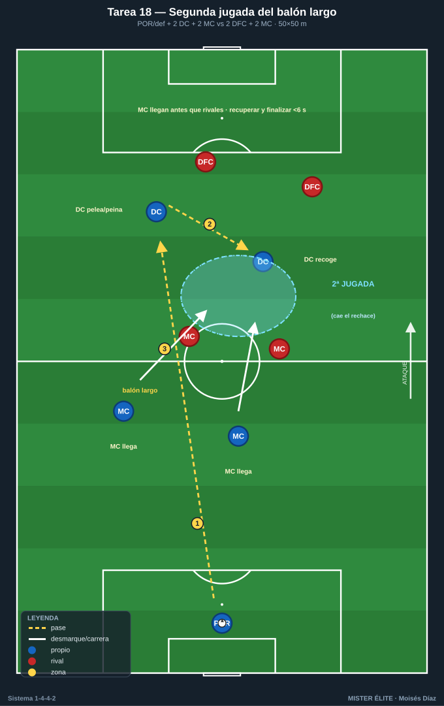

# Bloque 4 — Juego de los dos delanteros y centros laterales (Tareas 14–18)

> Marco teórico: [Módulo 03 — Fase ofensiva §3](../modulos/03-fase-ofensiva.md). Convención de posiciones y distancias en el [README](../README.md).

La pareja de delanteros del 1-4-4-2 vive de la complementariedad: uno baja a recibir/asociar (pivote ofensivo) y el otro ataca la profundidad; alternan roles. Y la vía de gol natural del sistema es la banda → centro lateral atacado por los 2 DC + el medio que llega. Estas tareas entrenan esos patrones.

> **Cómo leer las fichas.** Objetivo · Organización · Desarrollo · Provocaciones · Variantes · Coaching · Duración / Categoría. Categorías: **F / A / S**. "Provocación" = regla artificial que penaliza lo incorrecto y premia lo deseado.

---

## TAREA 14 — La pareja de delanteros: uno baja, otro rompe (situacional)

- **Objetivo:** automatizar la complementariedad de los 2 DC: cuando uno baja a recibir entre líneas, el otro ataca el espacio a la espalda de la defensa.
- **Tipo de tarea:** situacional ofensiva.
- **Organización:**
  - **Jugadores:** 2 DC + 2 MC (que sirven) vs 2 centrales + POR.
  - **Espacio:** medio campo, anchura central (45×45 m).
  - **Material:** portería con portero; conos marcando la línea de la defensa.
- **Desarrollo:** Los MC sirven balón a los delanteros. Un DC baja a recibir de espaldas/apoyo; al hacerlo, el otro DC ataca diagonal el espacio. El delantero que baja descarga, gira o filtra al que rompe. Finalización.
- **Provocaciones:**
  - Gol solo válido si ha habido el patrón "uno baja / uno rompe" (ningún gol de jugada individual cuenta): fuerza la asociación.
  - El que baja debe hacerlo cuando el otro inicia la ruptura, sincronizados (si bajan los dos o rompen los dos = secuencia nula).
  - 1 punto extra si el gol llega de un pase filtrado al espacio.
- **Variantes:** sin oposición (patrón) → 2v2+POR → añadir 1 medio que cubre (2v3) para mayor realismo.
- **Coaching:** comunicación y miradas entre la pareja; alternar roles (no siempre baja el mismo); timing de la ruptura (salir cuando el compañero recibe orientado); el que baja ofrece pie seguro.
- **Duración / categoría:** 4 series de 4 min (16–18 min). **A / S** (patrón válido para F).

---

## TAREA 15 — Banda + centro lateral: ataque del área a tres puntas (situacional)

- **Objetivo:** entrenar el centro desde banda y el ataque del área por los 2 DC + el medio que llega (primer palo / segundo palo / frontal).
- **Tipo de tarea:** situacional ofensiva de finalización.
- **Organización:**
  - **Jugadores:** 2 bandas (MD/MI) + 1 lateral que apoya + 2 DC + 1 MC que llega vs 4 defensas + POR.
  - **Espacio:** zona de finalización (área + 30 m), ambas bandas.
  - **Material:** portería; balones en banda; conos de zonas del área.

- **Desarrollo:** Combinación lateral-banda para llegar a fondo y centrar. Los 2 DC atacan primer y segundo palo; el MC ataca la frontal/rechace. Centro y remate. Defensa real opone.
- **Provocaciones:**
  - Deben ocuparse SIEMPRE los tres puntos del área (primer palo, segundo palo, frontal): si falta uno, el gol no cuenta.
  - Centro raso/al primer palo se premia (gol doble) para incentivar el centro tenso, no el globo cómodo.
  - Cronómetro: del último pase en banda al remate, máximo 4 segundos (atacar antes de que se organice la defensa).
- **Variantes:** sin defensa (ocupación) → con defensa pasiva → defensa activa + portero; añadir centro atrás a la frontal.
- **Coaching:** atacar los espacios, no esperarlos; cruces de los delanteros (uno al primero, otro al segundo) para desorientar marcas; el MC siempre a la frontal; calidad y tensión del centro.
- **Duración / categoría:** 20–24 centros (10–12 por banda) (18–20 min). **A / S**.

---

## TAREA 16 — Pared y descarga del delantero que baja (rondo de finalización)

- **Objetivo:** entrenar la asociación rápida de un delantero que baja a hacer pared con un medio para soltar al segundo delantero o a la banda.
- **Tipo de tarea:** rondo / circuito asociativo con finalización.
- **Organización:**
  - **Jugadores:** grupos de 4 (1 DC que baja + 1 MC + 1 banda + 1 DC que ataca) + 1–2 defensas pasivos.
  - **Espacio:** 30×30 m frente a portería.
  - **Material:** portería; conos.

- **Desarrollo:** MC con balón → pase al DC que baja → pared de primera → MC suelta a banda o al segundo DC en profundidad → centro/pase → remate. Circuito continuo desde ambos lados.
- **Provocaciones:**
  - La pared debe ser a un toque (define el ritmo de asociación).
  - Si el DC que baja controla en vez de paredear cuando tenía la pared disponible = repetición anulada.
- **Variantes:** pasivo → defensa semiactiva sobre el delantero que baja → añadir tercer hombre.
- **Coaching:** perfil del que baja; primer toque orientado o pared limpia; timing de la profundidad del segundo delantero; ritmo alto, sin pausas.
- **Duración / categoría:** 3 bloques de 4 min (14 min). **F / A / S**.

---

## TAREA 17 — 6v6+porteros: ataque por bandas obligado (juego de posición ofensivo)

- **Objetivo:** consolidar el uso de la anchura y el centro lateral del 1-4-4-2 en un juego dinámico con finalización a dos porterías.
- **Tipo de tarea:** juego de posición / juego condicionado.
- **Organización:**
  - **Jugadores:** 6v6 + 2 porteros (+ 2 comodines de banda fijos opcionales).
  - **Espacio:** 50×40 m con dos carriles de banda marcados (5 m a cada lado).
  - **Material:** 2 porterías grandes; conos de carriles.

- **Desarrollo:** Juego libre, pero el gol solo es válido si la jugada ha pasado por un carril de banda y ha habido un centro o pase desde banda antes del remate. Refuerza la vía lateral del sistema.
- **Provocaciones:**
  - Gol sin pasar por banda = no vale.
  - 2 toques en el carril central, libre en banda (favorece el desborde por fuera).
  - Centro que encuentra a un atacante en el área = punto aunque no sea gol (premia la ocupación del área).
- **Variantes:** comodines de banda fijos (más fácil generar centros) → sin comodines (la anchura la dan los propios jugadores) → exigir mínimo dos atacantes en el área al centrar.
- **Coaching:** dar amplitud constante; cambiar de orientación para encontrar la banda débil; llegada de segunda línea al área; calidad de centro.
- **Duración / categoría:** 4 series de 4 min (18 min). **A / S**.

---

## TAREA 18 — Segunda jugada del balón largo a los delanteros (situacional)

- **Objetivo:** entrenar el juego directo a la pareja de delanteros y la recogida de la segunda jugada por los medios, recurso típico del 1-4-4-2 ante presión alta rival.
- **Tipo de tarea:** situacional.
- **Organización:**
  - **Jugadores:** POR/defensa que envía + 2 DC (uno pelea, otro recoge) + 2 MC que llegan a la segunda jugada vs 2 centrales + 2 MC rivales.
  - **Espacio:** campo central, 50×50 m.
  - **Material:** portería; balones para reinicio rápido.

- **Desarrollo:** Balón largo a la pareja de delanteros. Un DC pelea/peina el balón, el otro DC ataca el rechace o la prolongación; los 2 MC llegan veloces a la segunda jugada. Quien recupere, ataca.
- **Provocaciones:**
  - El delantero que recibe el balón largo debe protegerlo o peinarlo, nunca controlar de cara estático (realismo del duelo).
  - Si los MC no llegan a la segunda jugada antes que los rivales, posesión rival (obliga a la llegada veloz).
  - Recuperar la segunda jugada y finalizar en <6 s = gol doble.
- **Variantes:** sin rivales (timing) → con rivales pasivos → duelo real.
- **Coaching:** uno pelea, otro vive del rechace; los medios anticipan la caída del balón; agresividad en la segunda jugada; saber cuándo recurrir al directo (presión alta rival).
- **Duración / categoría:** 4 series de 3 min (14 min). **A / S**.
