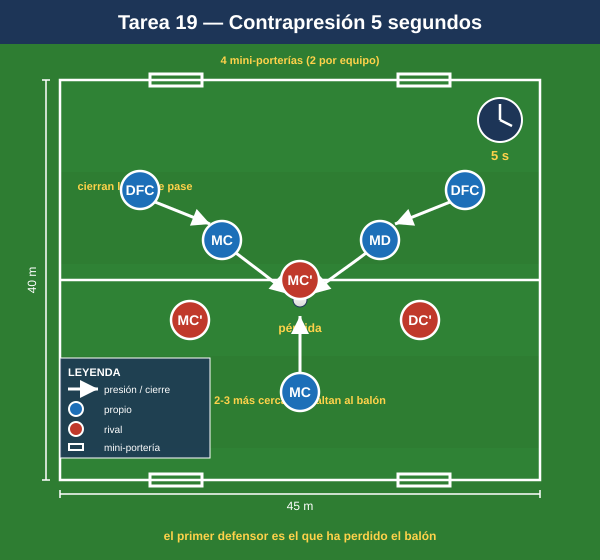
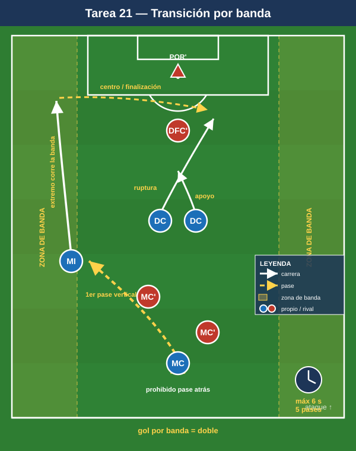

# Bloque 5 — Transiciones (Tareas 19–22)

> Marco teórico: [Módulo 04 — Transiciones y balón parado](../modulos/04-transiciones-y-balon-parado.md). Convención de posiciones y distancias en el [README](../README.md).

El 1-4-4-2, con sus dos bloques, es fuerte en transición defensiva si reacciona rápido (contrapresión inmediata o repliegue ordenado a las dos líneas) y letal en transición ofensiva por las bandas y los espacios a la espalda que dejan los rivales al perder el balón. Estas tareas entrenan el primer comportamiento tras la pérdida y tras el robo.

> **Cómo leer las fichas.** Objetivo · Organización · Desarrollo · Provocaciones · Variantes · Coaching · Duración / Categoría. Categorías: **F / A / S**. "Provocación" = regla artificial que penaliza lo incorrecto y premia lo deseado.

---

## TAREA 19 — Contrapresión inmediata tras pérdida (5 segundos) (juego condicionado)

- **Objetivo:** que el equipo presione de inmediato en el punto de la pérdida (los más cercanos saltan, el resto cierra líneas de pase) para recuperar arriba o ganar tiempo de repliegue.
- **Tipo de tarea:** juego condicionado de transición.
- **Organización:**
  - **Jugadores:** 7v7 / 8v8.
  - **Espacio:** 45×40 m con 4 mini-porterías (2 por equipo).
  - **Material:** mini-porterías; balones para reinicios continuos.
- **Desarrollo:** Posesión con objetivo de marcar en mini-porterías. En el momento de la pérdida, el equipo que pierde tiene 5 segundos para recuperar mediante contrapresión; si no lo logra, se repliega.
- **Provocaciones:**
  - Recuperar en <5 s tras perder = punto extra (premia la reacción inmediata).
  - Los 2–3 jugadores más cercanos a la pérdida DEBEN saltar; el resto cierra interiores (no todos a por el balón).
  - Si el rival supera la contrapresión, los jugadores lejanos deben replegar a su línea inmediatamente.
- **Variantes:** 3 s (más exigente) → ampliar el espacio → premiar también el repliegue ordenado además de la contrapresión.
- **Coaching:** reacción instantánea, no lamento; salta el más cercano; cerrar líneas de pase los demás; decisión rápida presionar/replegar; "el primer defensor es el que ha perdido el balón".
- **Duración / categoría:** 4 series de 4 min (18 min). **A / S**.

---

## TAREA 20 — Repliegue a las dos líneas tras pérdida (transición defensiva organizada)

- **Objetivo:** cuando no procede contrapresionar, replegar rápido y reconstruir las dos líneas de 4 compactas, frenando el contraataque rival.
- **Tipo de tarea:** situacional de transición ataque-defensa.
- **Organización:**
  - **Jugadores:** 8 (futuro bloque defensivo) atacan una portería; al perder, deben replegar y defender la suya contra 6 que contraatacan.
  - **Espacio:** campo completo o 3/4.
  - **Material:** 2 porterías; balones.
- **Desarrollo:** El equipo de 8 ataca; en el momento del robo rival suena una señal y deben replegar ordenadamente para formar las dos líneas de 4 antes de que el contraataque llegue. El equipo de 6 intenta finalizar rápido aprovechando el desorden.
- **Provocaciones:**
  - Si el rival finaliza antes de que el bloque esté formado (4+4 con líneas) = gol doble (castiga el repliegue lento).
  - El primer jugador en replegar debe ocupar el eje (frenar el balón por el centro), no perseguir por fuera (obliga a proteger el centro primero).
  - La defensa gana punto si obliga al rival a parar el contraataque (frenado) sin conceder.
- **Variantes:** menos atacantes en contra (más fácil) → contraataque con superioridad rival (peor escenario) → combinar con la tarea 19 (contrapresión y, si falla, repliegue).
- **Coaching:** frenar el balón central primero, recuperar posiciones después; replegar al carril, no perseguir; recomponer las dos líneas como prioridad; comunicación en el repliegue.
- **Duración / categoría:** 12–16 transiciones en bloques (16–18 min). **A / S**.

---

## TAREA 21 — Transición ofensiva por bandas tras robo (situacional D-A)

- **Objetivo:** tras recuperar, atacar rápido el espacio, preferentemente con los delanteros rompiendo y el balón saliendo a banda para correr al espacio que deja el rival.
- **Tipo de tarea:** situacional de transición defensa-ataque.
- **Organización:**
  - **Jugadores:** bloque que roba (4 defensas + 2 MC + 2 bandas + 2 DC) vs estructura rival; o versión reducida 6v6.
  - **Espacio:** campo completo o 3/4, con zonas de banda señaladas.
  - **Material:** 2 porterías.
- **Desarrollo:** Se provoca un robo (servidor o partido). Tras recuperar, el equipo tiene un número limitado de pases/segundos para finalizar, buscando el primer pase vertical o a banda y la ruptura de los delanteros.
- **Provocaciones:**
  - Tras robar, máximo 6 segundos / 5 pases para finalizar (ataque rápido).
  - El primer pase tras el robo debe ser hacia adelante o a banda (prohibido pase atrás en la primera acción): fuerza la verticalidad.
  - Gol nacido de transición por banda = vale doble.
- **Variantes:** más tiempo/pases (control de la transición) → menos (transición pura) → escenario de superioridad tras robo (3v2 en campo abierto).
- **Coaching:** primer pase de calidad y hacia adelante; los delanteros atacan el espacio de inmediato; aprovechar el desorden rival; saber decidir entre ataque rápido y posesión si no hay ventaja.
- **Duración / categoría:** 12–16 transiciones (16–18 min). **A / S**.

---

## TAREA 22 — Juego de las cuatro transiciones (juego condicionado integral)

- **Objetivo:** integrar las dos transiciones (D-A y A-D) en un mismo juego continuo que replica el caos real, con foco en la reacción del 1-4-4-2 en ambos sentidos.
- **Tipo de tarea:** juego condicionado de transiciones.
- **Organización:**
  - **Jugadores:** 8v8 + porteros.
  - **Espacio:** 60×50 m, dos porterías grandes.
  - **Material:** porteros; muchos balones en porterías para reinicios sin pausa.
- **Desarrollo:** Partido continuo. El foco del entrenador es exclusivamente el primer comportamiento tras cada cambio de posesión: contrapresión o repliegue al perder; ataque rápido o consolidación al ganar. Reinicios inmediatos para maximizar transiciones.
- **Provocaciones:**
  - Gol en los primeros 8 s tras un robo = doble (D-A).
  - Recuperación en los primeros 5 s tras la pérdida = punto (A-D).
  - Balón fuera → reinicio inmediato del portero (cero pausas, máximas transiciones).
- **Variantes:** acortar tiempos de bonificación; reducir el espacio; añadir comodines neutrales que cambian la igualdad numérica en cada transición.
- **Coaching:** mentalidad de reacción inmediata en ambos sentidos; los dos primeros segundos lo deciden todo; mantener las referencias del 1-4-4-2 incluso en el caos.
- **Duración / categoría:** 4 series de 4 min (18–20 min). **S** (versión reducida para A).
