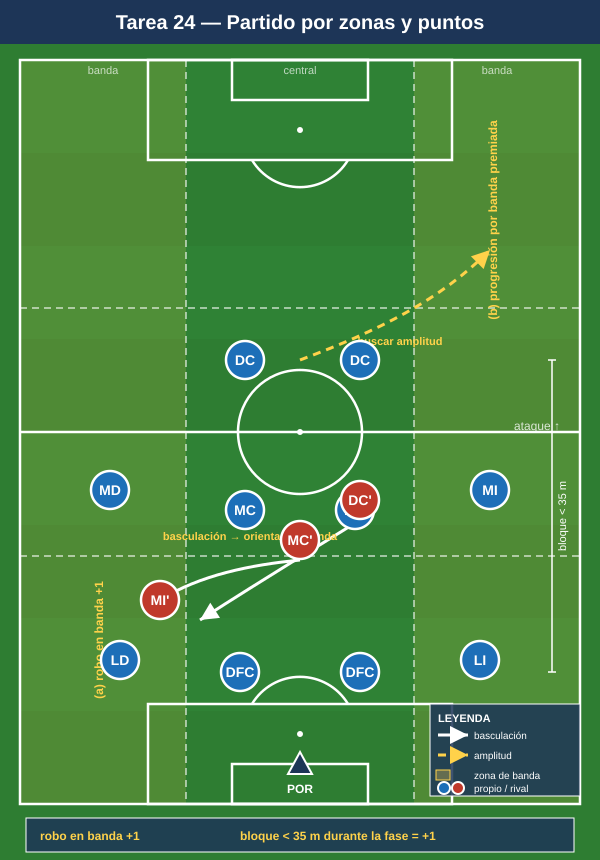

# Bloque 6 — Partido condicionado / juego real aplicado al sistema (Tareas 23–25)

> Marco teórico: integra todos los módulos ([01](../modulos/01-fundamentos.md) a [04](../modulos/04-transiciones-y-balon-parado.md)). Convención de posiciones y distancias en el [README](../README.md).

El cierre del proceso: tareas globales que integran todas las fases en formato partido, con condicionantes que mantienen el foco en los comportamientos del 1-4-4-2 sin perder el contexto competitivo real.

> **Cómo leer las fichas.** Objetivo · Organización · Desarrollo · Provocaciones · Variantes · Coaching · Duración / Categoría. Categorías: **F / A / S**. "Provocación" = regla artificial que penaliza lo incorrecto y premia lo deseado.

---

## TAREA 23 — 11v11 con bonificaciones por fase (partido condicionado global)

- **Objetivo:** integrar todas las conductas del 1-4-4-2 (salida, bloque, press, juego de delanteros, transiciones) en partido completo, premiando con puntos los comportamientos clave.
- **Tipo de tarea:** partido condicionado.
- **Organización:**
  - **Jugadores:** 11v11 (o el máximo disponible).
  - **Espacio:** campo completo.
  - **Material:** 2 porterías; sistema de puntuación visible (pizarra).
- **Desarrollo:** Partido real con un sistema de puntos que recompensa los patrones del sistema, no solo el gol.
- **Provocaciones (puntuación):**
  - Superar la primera línea de presión por suelo: **+1**.
  - Gol tras centro lateral con 3 atacantes en el área: **+2** sobre el valor del gol.
  - Gol con el patrón "uno baja / uno rompe" de los delanteros: **+2**.
  - Recuperación en press alto + finalización en <8 s: **+2**.
  - Conceder gol con el bloque desorganizado (líneas rotas): **-2** (auto-penalización).
  - Gol normal: **3**.
- **Variantes:** activar solo 2–3 bonificaciones por sesión (foco) → todas a la vez → cambiar las bonificaciones según el rival de la semana.
- **Coaching:** mantener distancias y referencias bajo fatiga; aplicar lo entrenado en contexto real; feedback breve en pausas, no detener constantemente.
- **Duración / categoría:** 2–3 partes de 10–12 min (30–36 min). **A / S**.

---

## TAREA 24 — Partido con zonas de puntos: inducir el comportamiento por el campo (juego real condicionado)

- **Objetivo:** reforzar la basculación y la elección de zonas, haciendo que el equipo defienda orientando al rival y ataque buscando las bandas, mediante un campo zonificado que da puntos por dónde se juega.
- **Tipo de tarea:** partido condicionado por zonas.
- **Organización:**
  - **Jugadores:** 9v9 a 11v11.
  - **Espacio:** campo completo dividido en carriles (2 bandas + 1 central) y 3 franjas horizontales.
  - **Material:** conos/cal de carriles y franjas; 2 porterías.
- **Desarrollo:** El campo está zonificado. El equipo en ataque gana puntos por progresar por bandas hacia el área; el equipo en defensa gana puntos por robar en banda (donde el bloque del 1-4-4-2 quiere encerrar) y por mantener la compacidad.
- **Provocaciones:**
  - Robo en carril de banda: **+1** (premia haber orientado al rival a la banda).
  - Ataque que progresa por el carril central forzando el bloque sin pasar por banda: muy difícil (penalización si pierde el balón ahí).
  - Mantener el bloque < 35 m entre la primera y la última línea durante toda una fase defensiva: **+1**.
- **Variantes:** énfasis defensivo (más puntos por robo) → énfasis ofensivo (más puntos por banda) → neutral competitivo.
- **Coaching:** orientar el juego rival; encerrar en banda; compacidad permanente; usar la anchura en ataque y atacar el área con llegadas.
- **Duración / categoría:** 2 partes de 12 min (26–30 min). **A / S**.

---

## TAREA 25 — Partido aplicado al rival: el 1-4-4-2 contra estructuras concretas (juego real táctico)

- **Objetivo:** preparar la semana de competición resolviendo con el 1-4-4-2 los problemas concretos que plantea la estructura del próximo rival (p. ej. salida de 3, mediapunta entre líneas, extremos por fuera).
- **Tipo de tarea:** partido condicionado táctico (sparring orientado al rival).
- **Organización:**
  - **Jugadores:** 11 (equipo, en 1-4-4-2) vs 11 (sparring instruido para jugar con la estructura del rival real).
  - **Espacio:** campo completo.
  - **Material:** 2 porterías; peto del sparring imitando al rival; pizarra.
- **Desarrollo:** El equipo juega su 1-4-4-2; el sparring reproduce los patrones del próximo rival. Se trabaja específicamente cómo presiona el 1-4-4-2 esa salida, cómo defiende a su mediapunta entre líneas (con la bajada del MC o el achique de la línea) y cómo le ataca.
- **Provocaciones:**
  - El sparring tiene "consignas obligatorias" del rival (p. ej. salida siempre de 3, buscar al 10 entre líneas): el equipo debe encontrar la respuesta del sistema.
  - Si el rival recibe entre líneas y progresa = parar la jugada y corregir el ajuste (momento de enseñanza dirigida).
  - Cada solución correcta repetida 3 veces = se libera esa fase y se pasa a la siguiente.
- **Variantes:** empezar con paradas frecuentes para corregir → reducir paradas → partido fluido aplicando lo ajustado.
- **Coaching:** ajustes específicos del 1-4-4-2 al problema del rival (quién salta a la salida de 3, quién vigila al 10, cómo basculan las líneas ante sus extremos); que los jugadores reconozcan los gatillos contra ESE rival.
- **Duración / categoría:** 2 partes de 12–15 min con paradas tácticas (30–35 min). **S** (adaptable a A).
