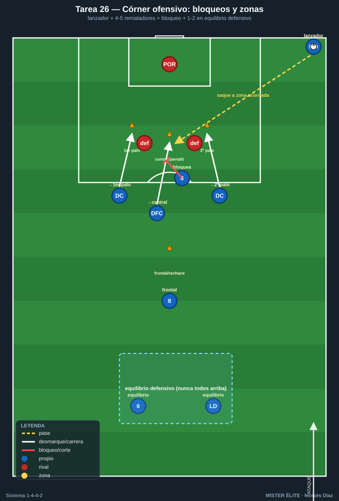
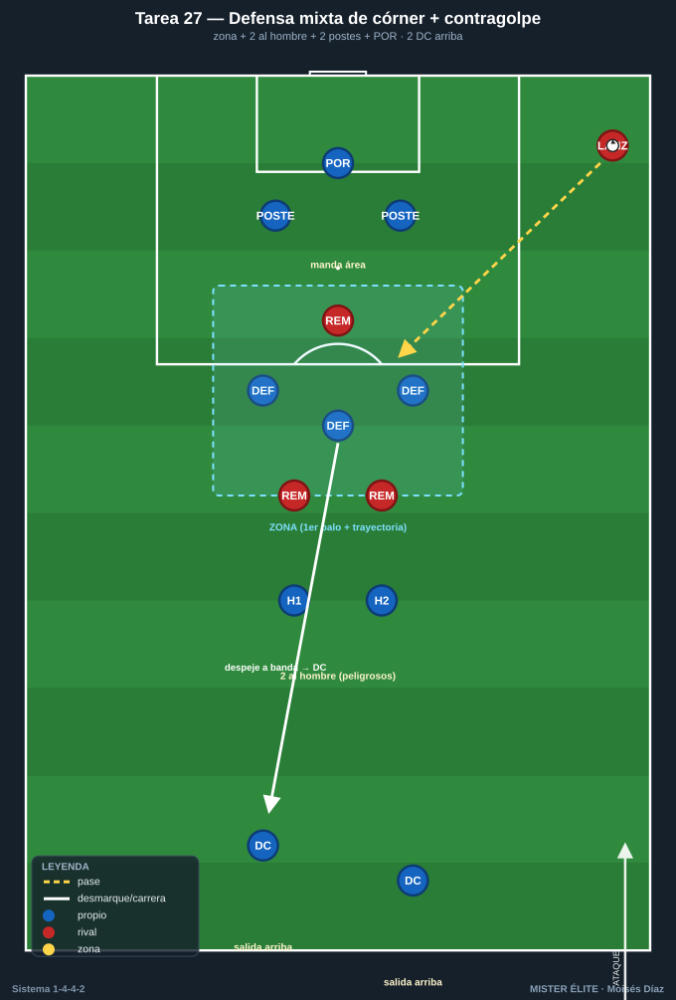

# Bloque 7 — Balón parado (Tareas 26–27)

> Marco teórico: [Módulo 04 — Transiciones y balón parado §3](../modulos/04-transiciones-y-balon-parado.md). Convención de posiciones y distancias en el [README](../README.md).

El balón parado decide partidos igualados y el 1-4-4-2 parte con ventaja a favor (masa de rematadores: dos DC + DFC ofensivos = 4-5 cabezas) y en contra (defensa mixta natural y delanteros arriba para la salida). Estas tareas trasladan al campo la referencia teórica del módulo 04 §3: el córner ofensivo ensayado con zonas y bloqueos, y la defensa mixta del córner con salida de contragolpe. En ambas, la idea rectora es no descuidar el **equilibrio defensivo / la salida** mientras se ataca o se defiende la jugada.

> **Cómo leer las fichas.** Objetivo · Organización · Desarrollo · Provocaciones · Variantes · Coaching · Duración / Categoría. Categorías: **F / A / S**. "Provocación" = regla artificial que penaliza lo incorrecto y premia lo deseado.

---

## TAREA 26 — Córner ofensivo ensayado con bloqueos y zonas de remate (analítica → situacional)

- **Objetivo:** ensayar el ataque de córner ocupando las cuatro zonas de remate (primer palo, zona central/penalti, segundo palo y rechace/frontal) y liberando al mejor rematador con un bloqueo/cortina, dejando siempre el equilibrio defensivo ante el contragolpe.
- **Tipo de tarea:** analítica de ABP que progresa a situacional con oposición.
- **Organización:**
  - **Jugadores:** lanzador (ED o EI según perfil de golpeo) + 4-5 rematadores (los 2 DC, 1-2 DFC y el MC "8") + 1-2 jugadores en equilibrio defensivo (el MC "6" y un LD/LI); en la fase situacional, defensa rival.
  - **Espacio:** un área completa, con las cuatro zonas de remate marcadas con discos (primer palo, central/punto de penalti, segundo palo, frontal/rechace).
  - **Material:** balones en la esquina para repeticiones sin pausa; discos para señalar zonas; petos para diferenciar bloqueadores y rematadores.

- **Desarrollo:** Primero sin oposición, se fija el patrón: el lanzador golpea a una zona acordada mientras los rematadores arrancan **desde fuera hacia dentro** (no estáticos). Un jugador hace **bloqueo/cortina** sobre el defensor del mejor rematador para liberarle el remate; las rutas atacan primer palo (prolongación), central (remate franco) y segundo palo (rechace). Un hombre queda a la frontal para el rechace, y 1-2 jugadores se mantienen en equilibrio defensivo por si el despeje genera contra. Después se añade defensa rival para ejecutar contra oposición real.
- **Provocaciones:**
  - El remate solo es válido si llega **en movimiento** (arranque desde fuera): penaliza la ocupación estática y fácil de marcar.
  - Cada córner debe ejecutar la **cortina/bloqueo** acordada antes del remate: sin bloqueo, gol no cuenta (obliga a sincronizar la liberación del rematador).
  - Si el rival despeja y supera a quien quedó en equilibrio, el ataque pierde 1 punto: castiga subir a todos y descuidar la contra.
- **Variantes:** sin oposición → con 2-3 defensores en zona → con defensa mixta completa (enlaza con la T27) → ensayar dos variantes de saque (cerrado al primer palo y abierto al segundo) para que el rival no las lea.
- **Coaching:** arrancar tarde y rápido, no esperar el balón parado; sincronizar bloqueo y remate; atacar el balón, no el punto; un hombre siempre a la frontal y 1-2 en equilibrio ("nunca todos arriba"); claridad en la señal del saque.
- **Duración / categoría:** 10-12 repeticiones analíticas + 8-10 con oposición (16-18 min). **A / S**.

---

## TAREA 27 — Defensa mixta de córner + salida de contragolpe (situacional)

- **Objetivo:** defender el córner con sistema mixto (zona en la zona de remate + 2 al hombre sobre los rematadores peligrosos + hombres en los postes) y, tras el despeje, transitar rápido a contraataque por los dos DC dejados arriba.
- **Tipo de tarea:** situacional de ABP defensiva con transición a contraataque.
- **Organización:**
  - **Jugadores:** bloque defensivo completo menos los 2 DC, que quedan arriba como salida; reparto típico: 3-4 en **zona** (primer palo y trayectoria central), **2 al hombre** sobre los rematadores rivales más peligrosos, **1 en cada poste**, POR mandando el área. Enfrente, un equipo atacante que ejecuta el córner.
  - **Espacio:** área completa + medio campo libre para correr el contraataque hacia la portería contraria.
  - **Material:** 2 porterías (la defendida y la del contragolpe); balones para reinicios rápidos.

- **Desarrollo:** El rival lanza el córner. La defensa ocupa la zona, marca al hombre a los peligrosos y cubre los postes; el POR sale o achica según trayectoria. Al despejar, **el primer pase busca a uno de los 2 DC arriba** y el equipo sale en contra: uno apoya y el otro rompe al espacio, sumándose el ED/EI por banda. La acción termina con finalización o con el rival frenando el contraataque.
- **Provocaciones:**
  - Despeje fuera de la zona de peligro (más allá de la frontal) = válido; rechace que cae dentro del área = punto para el atacante: premia el despeje **lejos y orientado**.
  - Si tras despejar el balón llega a un DC en **menos de X segundos**, el contraataque vale doble: fuerza la transición inmediata a la salida arriba.
  - Cada rematador peligroso (los 2 al hombre) debe tener marca **antes** de que el lanzador golpee: si queda libre, gol rival doble.
- **Variantes:** defensa solo zonal (más fácil de organizar) → mixta como la descrita → mixta con córner en corto del rival (obliga a reajustar) → exigir que el contraataque finalice en menos pases/segundos.
- **Coaching:** mando del POR y reparto claro de funciones (zona / hombre / postes) antes del saque; atacar el balón hacia fuera; despejar lejos y a banda, no al centro; "al despejar, ya estamos atacando"; los 2 DC listos para arrancar en el instante del despeje.
- **Duración / categoría:** 12-16 córners con transición en bloques (16-18 min). **A / S**.
