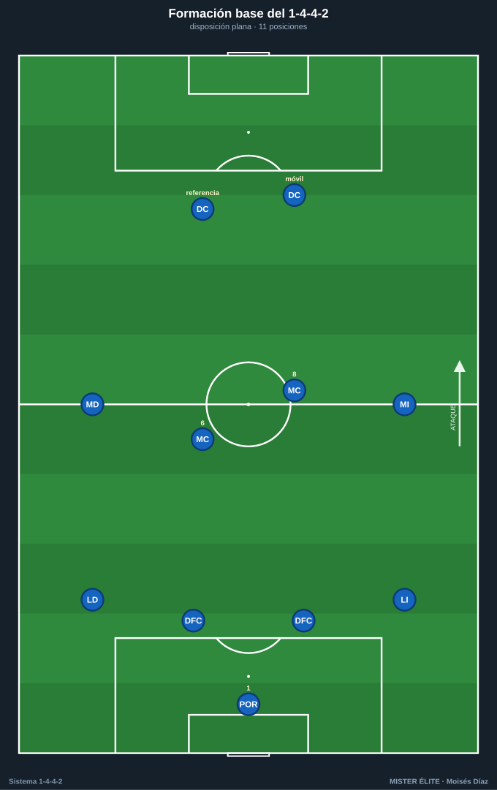
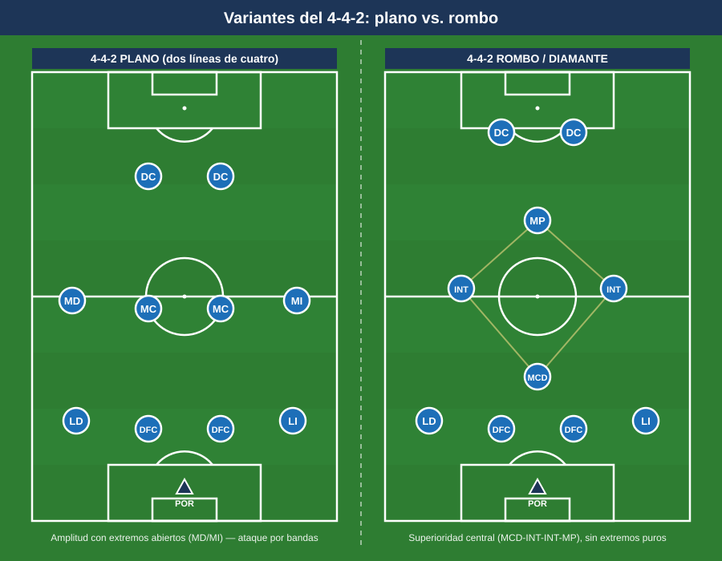

# Módulo 01 — Fundamentos del 1-4-4-2

> Marco conceptual mínimo e imprescindible. Aquí se fija el vocabulario y la estructura sobre los que se construye todo el curso. Para la convención de posiciones y las distancias de referencia, ver el [README](../README.md).

---

## 1. Qué es el 1-4-4-2

El 1-4-4-2 es un **sistema de juego** organizado en tres líneas de jugadores de campo más el portero, con distribución 4-4-2. Su rasgo identitario es la **doble línea de cuatro** (defensa y mediocampo), que genera un bloque ordenado, compacto y fácil de coordinar, con **dos puntas** de referencia ofensiva.

**Distribución de líneas (versión plana):**

- **POR (1):** organizador del último tercio, primer iniciador de la salida y hombre libre detrás de la defensa.
- **Línea defensiva (4):** dos DFC (centrales) y dos laterales (LD / LI).
- **Línea de medios (4):** dos MC (doble pivote) y dos extremos (MD / MI).
- **Línea de ataque (2):** dos DC con perfiles complementarios.

### Cómo se lee el campo

- **Carriles verticales (5):** lateral izq., interior izq. (medio espacio), central, interior der. (medio espacio), lateral der. Los **medios espacios** (entre lateral y central) son el punto que más explotan los rivales contra este sistema.
- **Franjas horizontales (3):** zona defensiva, zona media (creación), zona ofensiva (finalización).
- **Zona 14 / Maradona:** espacio interior por delante del área rival. El 4-4-2 plano no coloca a nadie fijo ahí (no hay mediapunta); la ocupa la llegada de un MC o la caída de un DC.

---

## 2. Contexto histórico (resumen)

El 4-4-2 hereda del 4-4-2 británico y del 4-2-4 brasileño de 1958. Su formulación moderna como sistema de presión y bloque se asocia a cuatro referencias:

- **Arrigo Sacchi (Milan, 1987–91):** padre del 4-4-2 moderno. Bloque compacto, presión alta, fuera de juego coordinado y zona pura. Su regla de compacidad (~25–30 m de la primera a la última línea) es el origen de la profundidad de bloque del curso.
- **Alex Ferguson (Manchester United):** extremos puros, amplitud, transiciones rápidas y dos delanteros complementarios.
- **Rafa Benítez (Valencia / Liverpool):** disciplina posicional, bloque medio-bajo, gran organización zonal.
- **Diego Simeone (Atlético de Madrid, desde 2011):** resurgimiento contemporáneo del 4-4-2 como bloque medio-bajo de élite, transiciones y juego directo a dos puntas.

**Idea para el aula:** el 4-4-2 no es "antiguo". Es **simple de enseñar y muy robusto defensivamente**, lo que lo hace ideal para formación y para equipos que priorizan orden, transición y solidez.

---

## 3. Principios de juego asociados

Los principios son las ideas rectoras que dan sentido a los movimientos.

**Ofensivos:**

- **Amplitud:** los extremos (y laterales) abren el campo para estirar al rival y generar espacios interiores.
- **Profundidad:** uno de los DC ataca el espacio a la espalda de la defensa rival.
- **Escalonamiento:** evitar dos compañeros a la misma altura del balón; crear triángulos y rombos de pase. Es lo que más sufre el 4-4-2 plano por sus líneas rectas, de ahí las **caídas** (un DC baja, un extremo pisa por dentro).
- **Movilidad / desmarques:** ruptura (a la espalda) y apoyo (al pie); los DC se reparten roles.
- **Líneas de pase:** el poseedor siempre con 2-3 opciones.
- **Temporización ofensiva:** ritmo de circulación para esperar la llegada de hombres.

**Defensivos:**

- **Basculación:** las dos líneas se mueven juntas hacia el lado del balón.
- **Reducción de espacios (compactar):** distancias cortas entre líneas.
- **Coberturas y permutas:** quien no presiona cubre la espalda del que sale.
- **Vigilancias:** preventiva (durante el ataque propio) y defensiva (sobre el hombre libre en zona).
- **Presión, repliegue y achique:** decisión colectiva sobre dónde defender.
- **Solidaridad defensiva:** en el 4-4-2 **los 10 de campo defienden**.

---

## 4. Variantes del sistema

### 4.1 4-4-2 plano (dos líneas de cuatro)

- **Estructura:** 4 defensas + 4 medios (2 extremos + 2 MC) + 2 DC, todos en línea.
- **Fortalezas:** máxima solidez y compacidad; cobertura natural de bandas; sencillez de coordinación; transiciones limpias a dos puntas.
- **Debilidades:** pocos efectivos en el centro (2 MC vs 3 rivales); ausencia de mediapunta en la zona 14.
- **Cuándo usarlo:** equipos que buscan orden; bloques medio/bajo (modelo Simeone); contra rivales que necesitan espacio para combinar; en formación, por su claridad.

### 4.2 4-4-2 en rombo / diamante

- **Estructura:** los cuatro centrocampistas en rombo: un MCD, dos interiores y un mediapunta (enganche) por detrás de los dos DC.
- **Fortalezas:** superioridad en el centro (4 por el eje); ocupa la zona 14; juego combinativo interior.
- **Debilidades:** renuncia a extremos → falta amplitud; las bandas quedan a cargo de los laterales (alto coste físico); vulnerable a los cambios de orientación.
- **Cuándo usarlo:** para dominar el centro con laterales muy resistentes y un enganche de calidad; contra rivales sin extremos puros.

### 4.3 4-4-2 en línea vs. asimétrico

- **En línea:** alturas y roles homogéneos (versión estándar plana).
- **Asimétrico:** se rompe la simetría según jugadores y rival. Ejemplos: banda fuerte/banda débil (un extremo abierto y ofensivo, otro que cierra por dentro); MC desdoblados en alturas (uno ancla, otro llegador); lateral-extremo coordinados (si el extremo pisa por dentro, el lateral da la amplitud).
- **Cuándo usarlo:** para adaptarse al rival, aprovechar perfiles concretos o resolver la inferioridad central transformando el plano en un 4-3-3 / 4-2-3-1 funcional en posesión.

---

## 5. Ventajas, desventajas y enfrentamientos

### Ventajas

- Solidez y compacidad defensiva (dos líneas de cuatro fáciles de mantener cortas).
- Cobertura natural de bandas y eje, con responsabilidades claras.
- Sencillez de aprendizaje y coordinación.
- Transiciones rápidas con dos referencias ofensivas.
- Sociedad de dos delanteros: combinaciones, segundas jugadas, presencia en el área.

### Desventajas

- Inferioridad en el centro (2 MC vs 3).
- Líneas rectas con pocas líneas de pase interiores sin movimientos de ruptura.
- Exigencia física y táctica enorme en extremos y MC.
- Espacios a la espalda de los laterales cuando suben.

### Enfrentamientos sistémicos

- **vs 1-4-3-3:** el rival gana el centro (3 vs 2). Respuesta: bloque compacto, presión a los pivotes con los dos DC (sombra), un MC que vigila al interior rival; en ataque, atacar la espalda de los laterales del 4-3-3.
- **vs 1-3-5-2 / 3-4-2-1:** rival con amplitud (carrileros) y superioridad central. Respuesta: replegar a bloque, extremos ayudando a laterales sobre los carrileros; en ataque, atacar los pasillos entre central y carrilero con los dos DC.
- **vs otro 1-4-4-2:** partido de espejos; lo deciden la mejor pareja de delanteros, los duelos de banda, las transiciones y las asimetrías.
- **vs 1-4-2-3-1:** el mediapunta ataca el espacio entre los dos MC y la defensa. Respuesta: un MC referencia al mediapunta o defensa muy compacta cerrando ese intervalo.

**Síntesis:** el 4-4-2 funciona **bien** contra sistemas que necesitan espacio para combinar y sin amplitud; funciona **peor** contra **tres mediocentros** o **mediapunta entre líneas**.

---

## 6. Perfil idóneo por línea

- **POR:** buen juego de pies, lectura de la profundidad (portero-líbero), seguridad aérea y en el 1×1.
- **DFC:** uno dominante en el duelo y el juego aéreo (defensa de área), otro rápido y con buena salida (cobertura de la profundidad y primer pase). Buena lectura del fuera de juego.
- **Laterales:** resistencia y recorrido; capacidad 1 vs 1 en banda; buen centro y/o llegada. Coordinación con el extremo de su lado.
- **MC:** complementarios. Uno organizador/posicional (el **6**, ancla, primer pase, vigila el eje) y otro box-to-box (el **8**, recorrido, llegada al área). Gran cobertura mutua.
- **Extremos (MD/MI):** doble función obligatoria. En ataque: amplitud, regate, centro o pisar por dentro. En defensa: replegar para ayudar al lateral y completar la línea de cuatro.
- **DC:** pareja complementaria. Un **referencia/pivote** (físico, juego de espaldas, fija centrales) y un **móvil/de ruptura** (ataca el espacio, asocia, finaliza). En presión, son la primera línea defensiva que orienta la salida rival.

---

## Ideas clave

- El 1-4-4-2 vive de **dos líneas de cuatro compactas** y de una **pareja de delanteros complementaria**.
- Es un sistema **simple de enseñar y robusto en defensa**; brilla en orden, solidez y transición.
- Su **debilidad estructural es el centro del campo** (2 vs 3) y el espacio entre líneas; su gestión es el hilo conductor del curso.
- Las **variantes** (plano, rombo, asimétrico) sirven para adaptarse al rival y a los perfiles disponibles.
- En este sistema **los 10 jugadores de campo defienden**: la solidaridad no es opcional.

## Errores comunes

- Confundir **sistema** (la foto inicial) con **modelo** (cómo se quiere jugar): un mismo 1-4-4-2 admite modelos muy distintos.
- Mantener las **líneas demasiado separadas**, regalando el espacio interior que más castiga al sistema.
- Colocar **dos delanteros idénticos** en vez de una pareja complementaria (referencia + móvil).
- Olvidar la **doble función de los extremos** y pedirles solo ataque.
- Pretender **ganar la posesión del centro** a un rival de tres mediocentros en lugar de neutralizarlo con compacidad y transición.
