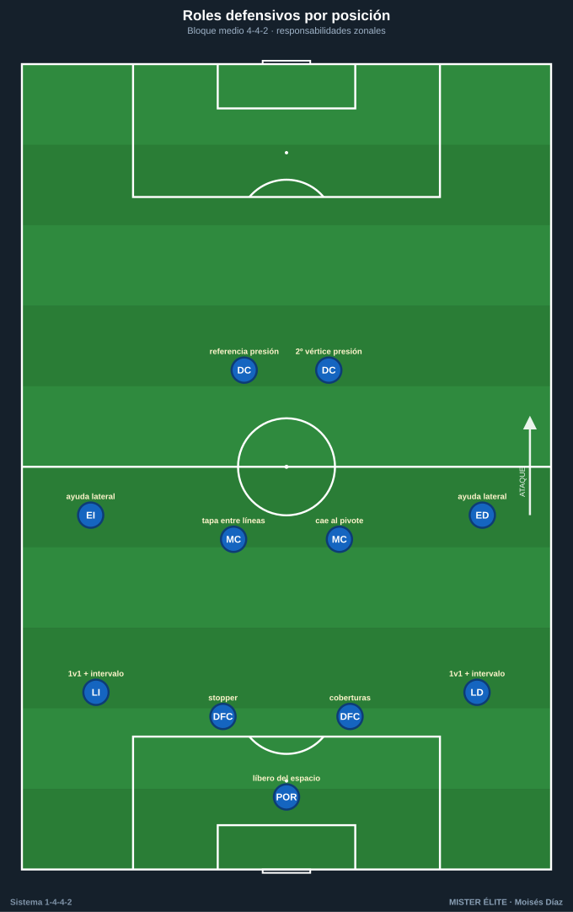
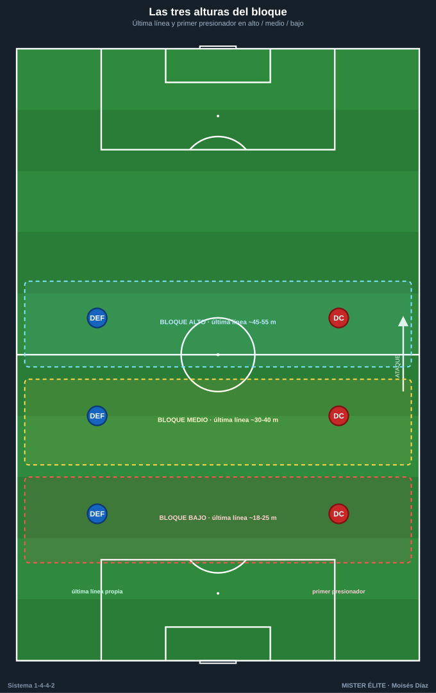
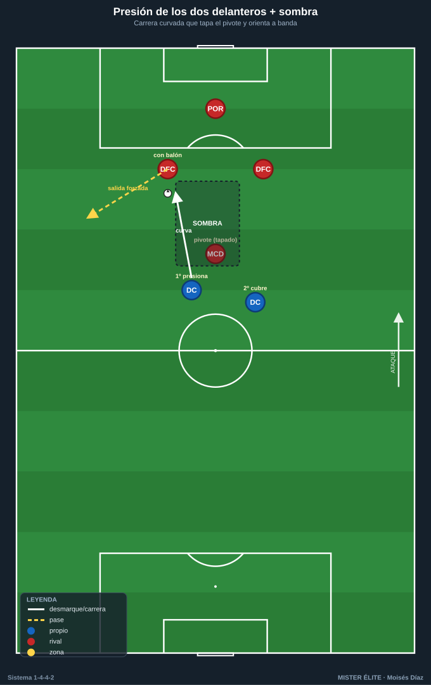
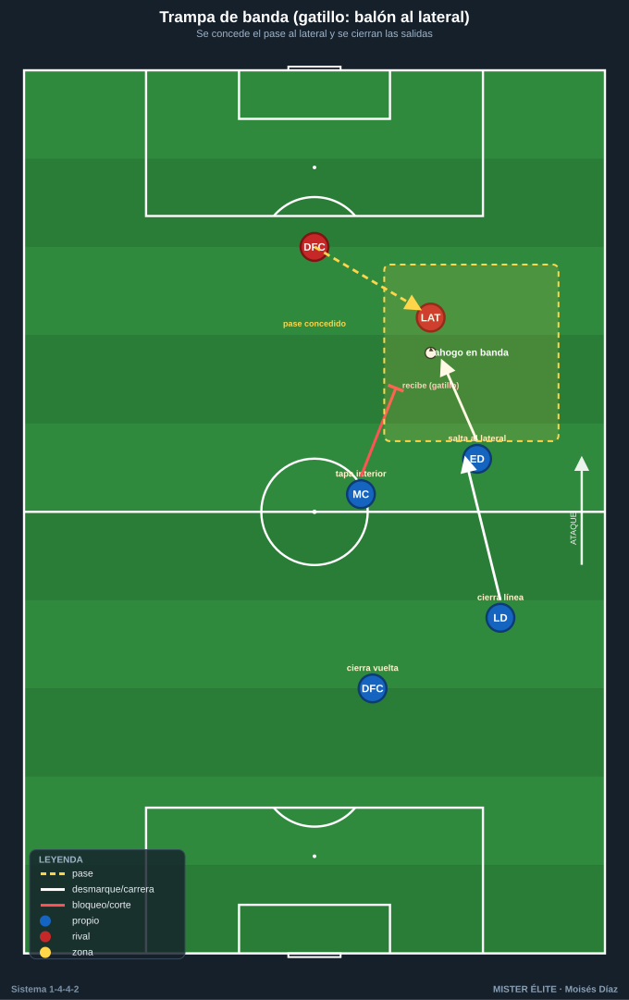
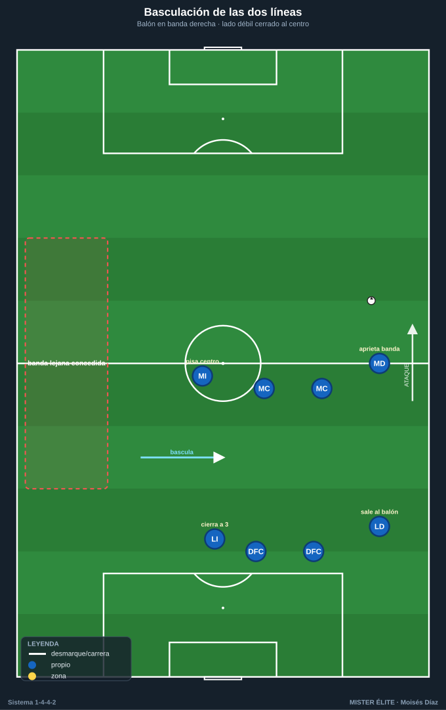
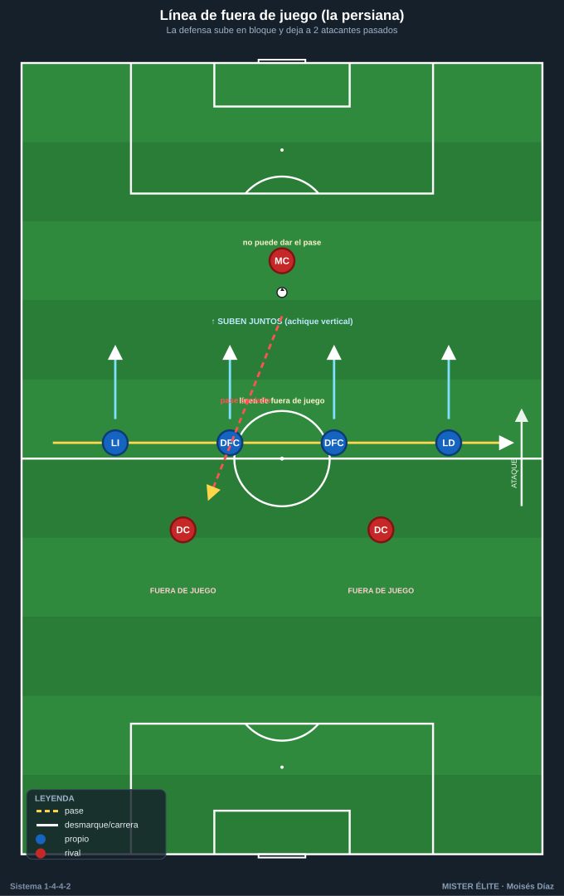
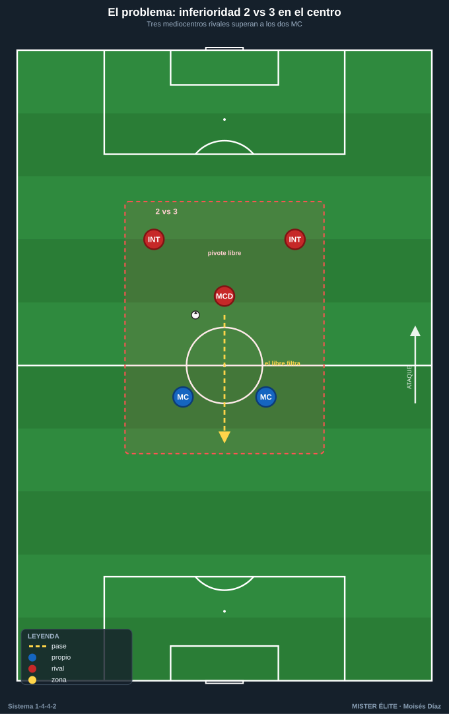
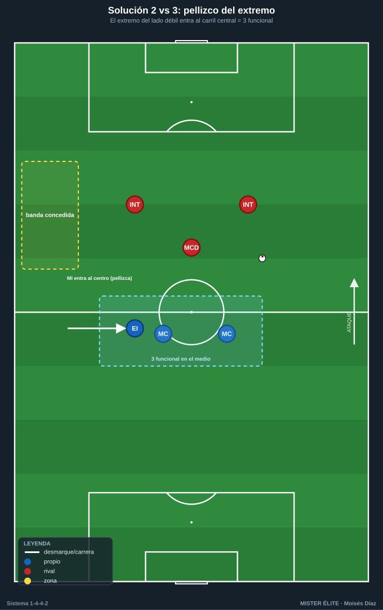

# Módulo 02 — Fase defensiva

> Organización defensiva colectiva del 1-4-4-2: roles, bloques, pressing, basculación y el problema clásico del 2 vs 3 en el centro. Convención de posiciones y distancias en el [README](../README.md).

La fortaleza del sistema es la **organización en bloque** con referencias zonales claras y simetría: cada jugador tiene un compañero de su demarcación en el lado opuesto, lo que facilita basculación y reparto de coberturas. Su debilidad estructural es el centro del campo (ver §6).

---

## 1. Roles defensivos por posición

**POR.** Última línea y portero-líbero: defiende el espacio a la espalda de la defensa cuando ésta sube (en bloque alto, sale a 18–25 m de su portería). Lee el balón en profundidad, organiza y ordena la línea (es el único que ve todo de frente), y domina su área en centros y balones largos.

**Laterales (LD/LI).** Defienden el carril en 1×1 contra el extremo rival, **orientando el regate** hacia fuera o hacia la cobertura. Vigilan el intervalo lateral-central (medio espacio), la zona más explotada contra el 4-4-2. En basculación, el lateral del lado débil se cierra junto al central (defensa de tres transitoria). Coberturas al central que sale y cierre del segundo palo en los centros.

**Centrales (DFC ×2).** Reparto habitual: uno **stopper/agresivo** (sale a achicar, gana duelos, anticipa) y otro **líbero/coberturas** (lee, tapa la espalda, dirige la línea y el fuera de juego). Defienden el carril central y, normalmente, a los dos delanteros rivales en 2 vs 2 (exige excelente defensa individual y coberturas). Mandan en las ABP.

**Doble pivote (MC ×2).** La posición más crítica. Protegen la zona delante de la defensa (tapar el pase entre líneas). **Reparto de marcaje:** uno presiona al hombre con balón, el otro vigila/cae sobre el pivote rival; **nunca salen los dos a la vez**. Basculan con los extremos y vigilan las llegadas de segunda línea.

**Extremos (MD/MI).** Medios de banda, **no extremos puros**: el trabajo defensivo es innegociable. Ayudan al lateral formando 2×1 / 2×2 en banda y repliegan hasta su tercio para defender en línea de cuatro. Cierran el intervalo lateral-central y vigilan al lateral rival cuando sube. En bloque medio/bajo, el extremo del lado débil pisa el carril central.

**Delanteros (DC ×2).** Primera línea de presión. El **referencia** fija al central con balón, orienta y tapa el carril central o la línea al pivote rival. El **móvil** es el otro vértice de la presión y salta sobre el segundo central o el pivote según la trampa. Trabajo escalonado, no en paralelo: uno presiona y el otro cubre.

---

## 2. Bloque alto, medio y bajo

Tres principios constantes del bloque: **compacidad** (poca distancia entre líneas), **basculación** (mover el bloque hacia el balón) y **densidad en zona de balón**.

### 2.1 Bloque alto (presión arriba)

- Última línea cerca del centro del campo (~45–55 m de la propia portería). POR muy adelantado como cobertura.
- **Objetivo:** robar cerca de la portería rival, reducir su tiempo, sumar superioridad en zona de balón.
- **Riesgo:** espacio enorme a la espalda; depende del fuera de juego coordinado y de un POR-líbero solvente.

### 2.2 Bloque medio (el más natural del 4-4-2)

- Última línea ~30–40 m; el primer presionador actúa en torno al círculo central.
- **Objetivo:** invitar al rival al medio campo y robar en zona controlada, con campo por delante para el contraataque.
- **Clave:** los dos extremos muy cerrados para tapar el centro.

### 2.3 Bloque bajo (repliegue)

- Las dos líneas juntas en el tercio defensivo (última línea ~18–25 m). Solo los dos DC quedan algo adelantados.
- **Objetivo:** cerrar los espacios interiores, defender el área, salir al contraataque con los dos puntas.
- **Riesgo:** conceder balón y tiro exterior; presión sostenida sobre el área.

---

## 3. Pressing

### 3.1 Cómo presionan los dos delanteros

La pareja es la primera línea de presión. Como son dos contra dos centrales + portero, presionan **con criterio de orientación**:

- **Uso de la sombra (cover shadow):** el DC que va al central con balón corre tapando con su cuerpo la línea de pase al pivote rival; con un jugador anula dos opciones.
- **Reparto:** uno presiona al poseedor, el otro vigila al pivote o se prepara para saltar al otro central.
- **Orientar a una banda:** atacar al central por su perfil exterior para empujar el balón a la banda elegida (la banda como "frontera"). Cuando el balón va al lateral, se activa la presión escalonada extremo + lateral + MC.
- **Gatillos (triggers):** pase atrás al POR, control orientado hacia su portería, pase a un jugador de espaldas o mal perfilado, pase lento/aéreo, primer toque malo, **balón al lateral en banda**.

### 3.2 Trampas de presión

- **Trampa de banda:** se deja "fácil" el pase al lateral rival; cuando llega, se cierran las salidas (extremo salta al lateral, MC y lateral propio tapan interior y línea, DC cierra el regreso). La banda y la línea de cal hacen de defensores extra.
- **Trampa interior:** invitar el pase al pivote rival y saltar sobre él (segundo DC o MC por la espalda) para robar de cara a portería.

### 3.3 Presión tras pérdida (contrapressing)

- **Reacción inmediata (≈3–5 s)** en zona de pérdida antes de replegar: el más cercano ataca el balón, los de alrededor tapan las líneas cortas para forzar un pase imposible o un balón largo que la línea de cuatro recupera.
- Si no se recupera en la primera reacción, **repliegue ordenado** a bloque medio/bajo. La decisión "presiono o replego" es colectiva y referida al primer presionador.

---

## 4. Basculación, coberturas y defensa de zonas

### 4.1 Basculación de las dos líneas

Ambas líneas se desplazan **en bloque hacia el lado del balón** manteniendo la diagonal: el lado fuerte se densifica, el lado débil se cierra hacia el centro. El **lateral del lado débil** se mete junto a los centrales (defensa de 3 transitoria) y el **extremo del lado débil** pisa el carril central. Así se concede solo el cambio largo de orientación (el pase más lento, el más defendible). Si las líneas basculan a distinto ritmo, se abre el pasillo entre líneas.

### 4.2 Coberturas y permutas

- **Cobertura:** ante cada jugador que sale a presionar, un compañero se coloca en diagonal por detrás (el central cubre al lateral; el pivote cubre al central que salta; el lateral cubre al extremo que aprieta).
- **Permuta:** si el que presiona es superado, el que cubría asume su marca y el primero ocupa el hueco.
- **Principio:** nunca dos jugadores a la misma altura sin cobertura en zona de balón.

### 4.3 Defensa de la banda y del carril central

- **Banda:** extremo + lateral cierran poseedor y carril; el MC tapa el pase interior; el central cubre por dentro. Objetivo: ahogar el balón en la "frontera" y evitar el pase de retorno al centro.
- **Carril central (prioridad absoluta):** densidad y escalonamiento (DC con sombra, doble pivote protegiendo, extremos pellizcando por dentro, centrales mandando). El pase entre líneas hacia el receptor que cae se combate con compacidad vertical y el salto del MC mientras el central decide acompañar o aguantar la línea.

---

## 5. Marcaje, achique y fuera de juego

- **Marcaje:** base **zonal** (referencias: balón, espacio, compañero), en la práctica **mixto** (zonal de bloque + marcas a diferenciales y en ABP). El individual es puntual.
- **Achique horizontal:** la basculación (reducir el ancho útil del rival).
- **Achique vertical:** subir la línea defensiva tras despeje, pase atrás del rival o balón controlado lejos, para mantener las líneas juntas y dejar al rival a la espalda (fuera de juego). Detonante: balón "muerto" o jugado hacia atrás/lateralmente sin amenaza de profundidad.
- **Línea de fuera de juego:** la línea de cuatro actúa en bloque, dirigida por el central de coberturas o el POR. **Subir juntos** cuando el poseedor no puede dar el pase a la espalda (mira abajo, está presionado, controla mal). El último hombre marca la línea; nadie regala el fuera de juego. Comunicación constante ("¡arriba!", "¡aguanta!"). En bloque alto, el fuera de juego + el POR-líbero hacen viable el riesgo del espacio a la espalda.

---

## 6. El problema clásico: inferioridad en el centro (2 vs 3)

**El problema.** Ante rivales con tres en el centro (4-3-3, 4-1-4-1, 3-5-2, o un mediapunta que se suma), los dos MC quedan en inferioridad. El rival puede: (a) superar líneas con el hombre libre, (b) atraer a un MC y filtrar al espacio que deja, (c) usar al pivote libre para orientar.

**Repertorio de soluciones:**

1. **Pellizco de los extremos hacia dentro:** el extremo del lado débil entra al carril central, convirtiendo el 2 del medio en un 3 funcional. Se concede la banda lejana (defendible con basculación).
2. **Presión de los DC con sombras:** si la primera línea tapa los pivotes, la inferioridad del medio no se explota porque el balón no llega limpio.
3. **Salto de un MC + cobertura del compañero:** uno presiona al tercer hombre, el otro tapa el espacio. Nunca los dos juntos.
4. **Ayuda del segundo punta** cayendo sobre el pivote rival (transforma momentáneamente en 4-4-1-1 / 4-1-3-2 defensivo).
5. **Vigilancias preventivas:** dejar a un punta o a un MC como ancla sobre el organizador rival.
6. **Asimetría / repliegue selectivo:** aceptar el balón en zonas inofensivas y robar en transición.

**La idea de fondo:** el 4-4-2 no necesita **ganar** la posesión del centro; necesita que **el centro no le haga daño**.

---

## Ideas clave

- Defender es un acto **colectivo**: compacidad (8–12 m entre líneas), basculación hacia el balón y densidad en zona de balón.
- Los **delanteros presionan con sombra y orientación**, nunca a la carrera sin criterio.
- En basculación, el **lado débil se cierra al centro** (lateral a 3, extremo al carril central): se concede la banda lejana.
- **Coberturas y permutas sistemáticas:** nadie presiona sin alguien que cubra su espalda en diagonal.
- El **2 vs 3** se resuelve con pellizco de extremos, sombras de los puntas y saltos escalonados de los MC.
- Achique vertical y **fuera de juego** coordinados por el central de coberturas / POR.

## Errores comunes

- **Separar las dos líneas:** abre el espacio interior que más castiga al sistema.
- **Saltar dos jugadores a la vez** al mismo balón rompiendo la línea (sin cobertura).
- **Presionar sin gatillo** o a destiempo: la presión debe activarse por una señal común.
- **Bascular a distinto ritmo** las dos líneas, abriendo el pasillo entre ellas.
- Dejar al **extremo del lado débil pegado a su banda** en vez de cerrarlo al centro.
- **Subir la línea de fuera de juego descoordinada:** un solo defensa descolocado deja activo al atacante.
- Pretender **igualar el centro** en vez de neutralizarlo y vivir de la transición.
