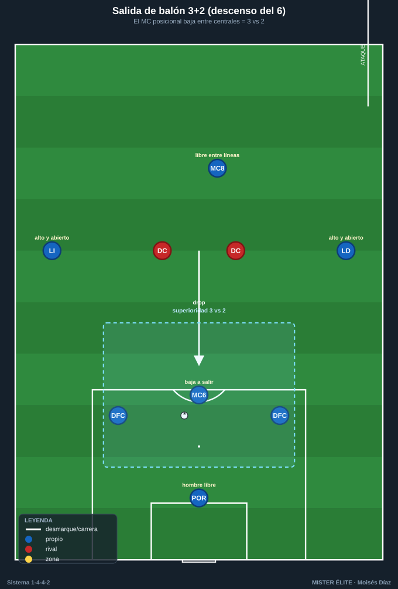
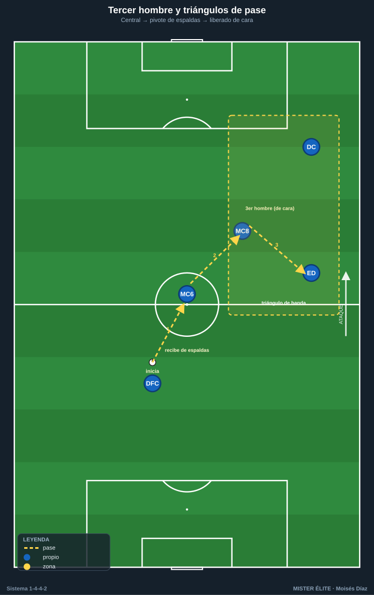
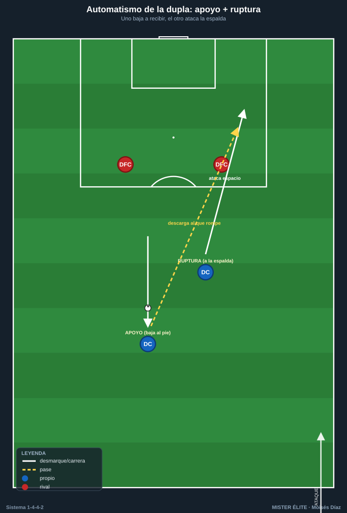
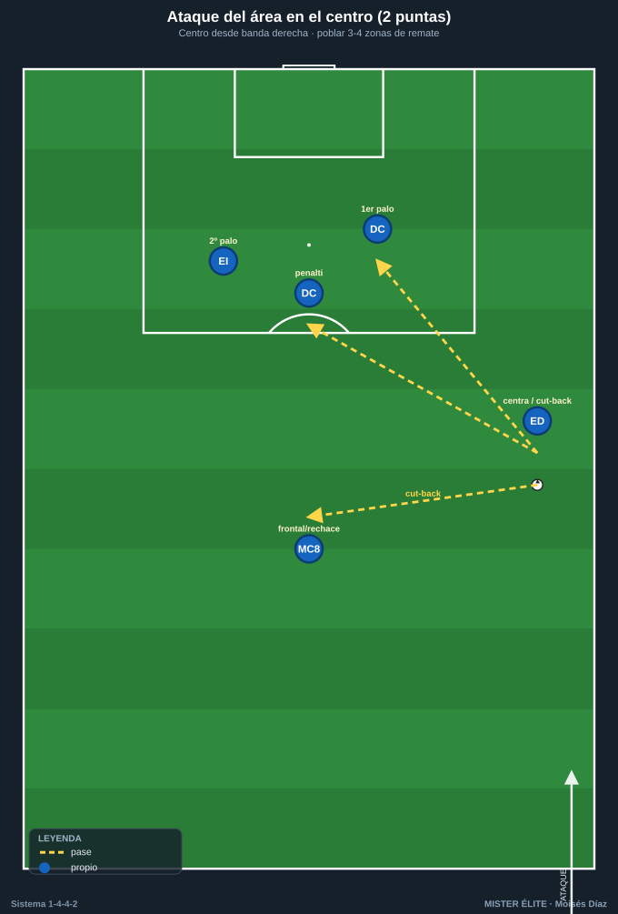
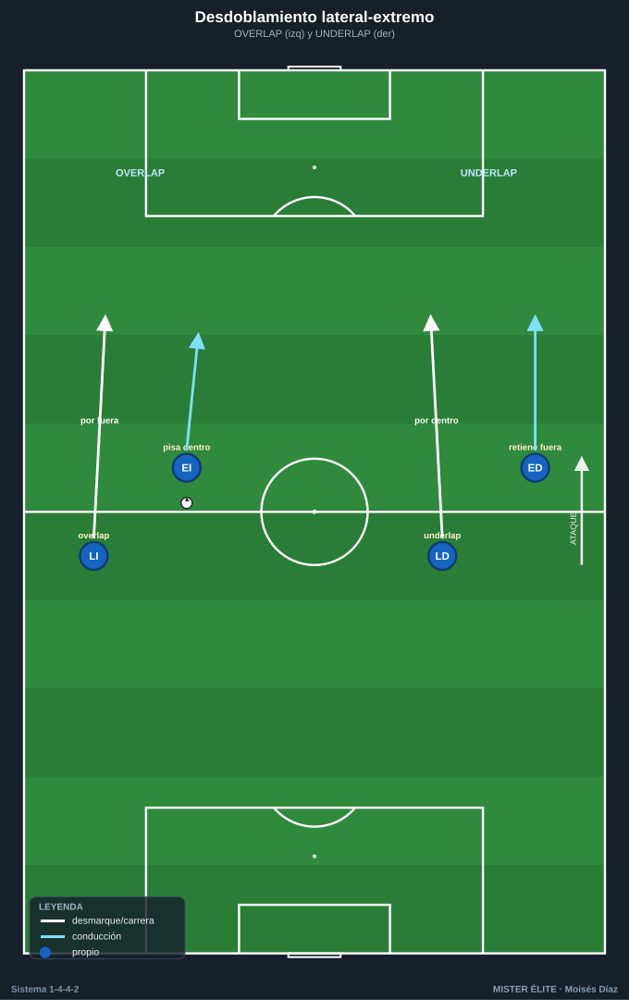

# Módulo 03 — Fase ofensiva

> Salida de balón, construcción en zona media, último tercio y automatismos del 1-4-4-2. Convención de posiciones y distancias en el [README](../README.md).

---

## 1. Salida de balón desde atrás

### 1.1 Estructura base

El 1-4-4-2 sale habitualmente en **+1 sobre la primera presión** apoyándose en el portero. La estructura más estable es la **salida en 4 + 1**: dos centrales abiertos a la anchura del área, dos laterales subidos a la altura del primer pivote, POR como hombre libre. Frente a un rival con dos puntas (caso simétrico 4-4-2 vs 4-4-2), los centrales quedan en 2 vs 2 si no se genera superioridad. Tres soluciones canónicas:

- **Descenso de un pivote (salida "3+2"):** el MC más posicional (el **6**) baja entre o al costado de los centrales, creando un **3 vs 2** y liberando al otro MC entre líneas. Patrones: drop entre centrales (rombo con POR, útil contra marcaje hombre a hombre), drop al costado de un central ("La Volpiana" lateralizada, para salir por fuera) y drop falso (amago que arrastra a un MC rival y abre la línea interior).
- **Portero como jugador de campo:** con POR hábil con pie, no baja ningún MC; el POR juega de tercer central virtual y los dos pivotes permanecen altos. Adelanta la estructura, pero exige POR solvente bajo presión.
- **Laterales como primera salida (por fuera):** centrales abiertos y altos atraen a las puntas; el balón se libera al lateral, que recibe orientado con el extremo dándole profundidad o cayendo a apoyar.

### 1.2 Superar la primera línea de presión

- **Orientar al rival y jugar al lado contrario** (cambio de orientación de central a central).
- **Pase entre líneas** a un MC que recibe de cara (recepción orientada) o a un DC que baja a apoyar de espaldas para descargar a tercer hombre.
- **Provocar y saltar la presión:** conducción del central para fijar al delantero rival y, en el momento del salto, soltar al hombre libre que ese delantero abandona.
- **Salida en largo dirigida:** ante presión asfixiante, balón directo a la zona de uno de los **dos puntas** para disputar y atacar el segundo balón con el MC y el extremo de ese lado. La presencia de dos delanteros hace este recurso más rentable que con un solo 9.

### 1.3 Por dentro vs. por fuera

- **Por dentro:** preferida si el rival presiona con extremos cerrados o defiende en bloque medio; se busca el pivote libre y la recepción entre líneas.
- **Por fuera:** preferida contra presión orientada al centro; lateral + extremo + delantero del lado forman un triángulo de salida que progresa por banda.

---

## 2. Construcción en zona media

### 2.1 Roles de los dos MC

El reparto óptimo es **asimétrico y complementario**:

- **Pivote posicional (el "6"):** ancla, línea de pase de seguridad por detrás del balón, equilibrio ante pérdidas, el que baja en la salida. Recibe de espaldas y descarga a un toque.
- **Pivote llegador (el "8" / box-to-box):** ataca el espacio entre líneas, llega a zona de remate, da el pase de ruptura. Es el enlace con los dos delanteros.

Cuando uno avanza, el otro cubre (**principio de balancín/relevos**): nunca suben los dos a la vez. La debilidad en construcción es el espacio interior entre líneas, por lo que basculación y comunicación de marcas son críticas.

### 2.2 Recepción entre líneas y circulación

- **Caída de un delantero a recibir entre líneas:** como no hay mediapunta nominal, la recepción entre líneas la genera un DC que baja (perfil enlace/falso 9 puntual) o el pivote llegador. Crea momentáneamente un 4-4-1-1.
- **Tercer hombre:** central → pivote que descarga de espaldas → pase liberado a delantero/extremo girado. Mecanismo nuclear para progresar limpio.
- **Cambio de orientación:** ante bloque medio compacto, mover de banda a banda buscando el lado débil; el extremo lejano se queda alto y abierto.
- **Apoyos en triángulo permanentes:** cada poseedor con mínimo dos líneas de pase. Lateral-extremo-pivote forman el triángulo de banda; central-pivote-delantero el triángulo interior.

---

## 3. Último tercio

### 3.1 Amplitud de los extremos

La gran fortaleza ofensiva es la **doble amplitud** de los extremos pegados a banda:

- **Dar anchura máxima** para estirar la última línea rival y abrir corredores interiores.
- **Encarar 1v1** contra el lateral en aislamiento (situación buscada tras cambio de orientación).
- Dos perfiles: extremo clásico (desborda por fuera y centra) y extremo a pierna cambiada (se mete a recibir entre líneas y libera la banda para el desdoblamiento del lateral).

### 3.2 Desmarques de los dos delanteros

La ventaja distintiva del sistema es la **pareja con movimientos coordinados y opuestos**:

- **Apoyo + ruptura (movimientos opuestos):** cuando uno baja a recibir, el otro ataca el espacio a la espalda. Es **el automatismo madre de la dupla**: nunca caen los dos al mismo tiempo. El que baja descarga al primer toque para el que rompe, o fija a un central y abre el carril.
- **Juego de espaldas y descarga:** el DC referencia recibe de espaldas, protege y descarga a la llegada del MC, el extremo o el segundo punta.
- **Desmarques cruzados:** los dos DC cruzan trayectorias para desorganizar a los centrales (uno arrastra fuera, el otro ataca el hueco central).
- **Ataque a los medios espacios:** desmarque diagonal de ruptura al corredor que deja el lateral rival al subir.
- **Coordinación con la línea rival:** el que rompe temporiza para no caer en fuera de juego (salir desde detrás del defensor, atacar el espacio en el momento del pase).

### 3.3 Llegada desde segunda línea

- **Pivote llegador (el "8")** entra al área por el carril central o al segundo palo: goleador "fantasma" difícil de marcar.
- **Lateral que se incorpora** sumando hombre en banda o llegando al segundo palo en el centro del lado contrario.
- **Regla de equilibrio:** por cada llegada de segunda línea, un MC y los centrales sostienen el resto defensivo para la transición.

### 3.4 Centros laterales y remate — la ventaja de los dos puntas

El sistema está diseñado para **poblar el área**. Reparto canónico de zonas de remate en un centro desde banda derecha:

- **Primer palo:** un DC (ataque al primer palo, desvío/prolongación).
- **Punto de penalti / zona central:** el segundo DC (remate principal).
- **Segundo palo:** el extremo del lado contrario o el pivote llegador (rechaces y centros pasados).
- **Frontal / borde del área:** el otro MC para el rechace y el primer equilibrio defensivo.

Esto da **3–4 atacantes en zona de remate** sin descomponer el equipo. Tipos de centro a entrenar: raso al primer palo, tenso a la zona de penalti y **centro atrás (cut-back)** desde línea de fondo a la frontal (la zona más rentable). El cut-back combina especialmente bien con el extremo que llega a fondo y el DC/MC que ataca la frontal.

---

## 4. Mecanismos y automatismos

- **Pared (one-two):** el DC que baja de espaldas devuelve de primeras al MC/extremo que ataca el espacio. Supera líneas en zona media y entra al área.
- **Tercer hombre:** el primer receptor (de espaldas) no progresa; lo hace el tercero que recibe de cara. Aplicable en salida, construcción y entrada al área.
- **Cambio de orientación:** circular fijando un lado y soltar al extremo aislado del lado contrario. Rentabiliza la doble amplitud. Variantes: cambio aéreo largo central→extremo lejano; cambio escalonado por dentro.
- **Desdoblamiento lateral-extremo** (automatismo de banda más característico): si el extremo abre y fija al lateral rival, el lateral propio se incorpora por dentro o ataca la espalda; si el extremo se mete a pierna cambiada, el lateral sube por fuera (overlap); underlap = el lateral entra por el carril interior mientras el extremo retiene por fuera.
- **Combinaciones de banda en triángulo:** lateral-extremo-delantero generan pared + tercer hombre para llegar a fondo y centrar.
- **Rotación de los puntas con el pivote llegador:** cuando un DC cae a recibir, el "8" ataca el espacio que ese DC libera.

---

## Ideas clave

- La salida genera **+1** con descenso de un MC o con el POR como jugador; ante presión asfixiante, balón directo a los dos puntas y ataque del segundo balón.
- Los **dos MC son complementarios** (uno ancla, uno llegador) y se relevan: nunca suben los dos a la vez.
- Se progresa con **tercer hombre** y recepción entre líneas del delantero que baja.
- El último tercio explota la **doble amplitud**, los **cambios de orientación** y los **movimientos opuestos** de los delanteros (apoyo/ruptura).
- En los centros se puebla el área con **3–4 rematadores** y se prioriza el **cut-back**.

## Errores comunes

- **Centrales juntos** en la salida (deben abrirse a la anchura del área).
- **Pivote que recibe de espaldas plano** en vez de en perfil orientado.
- Que **bajen los dos delanteros** o **rompan los dos a la vez**: rompe el automatismo apoyo/ruptura.
- Abusar del **pase lateral cómodo** en vez del primer pase que rompe una línea.
- **Subir los dos MC** simultáneamente, dejando sin resto defensivo la transición.
- **Centros en globo cómodos** al área en lugar de centro tenso / cut-back, y atacar el área sin ocupar los tres puntos (primer palo, penalti, frontal).
