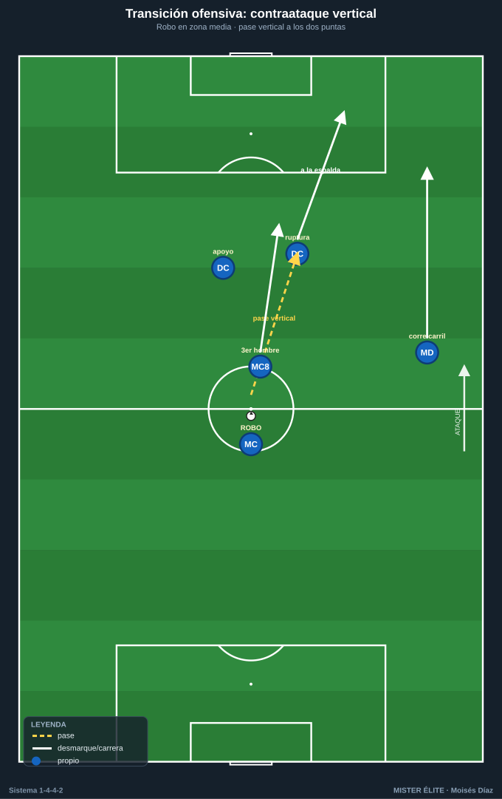
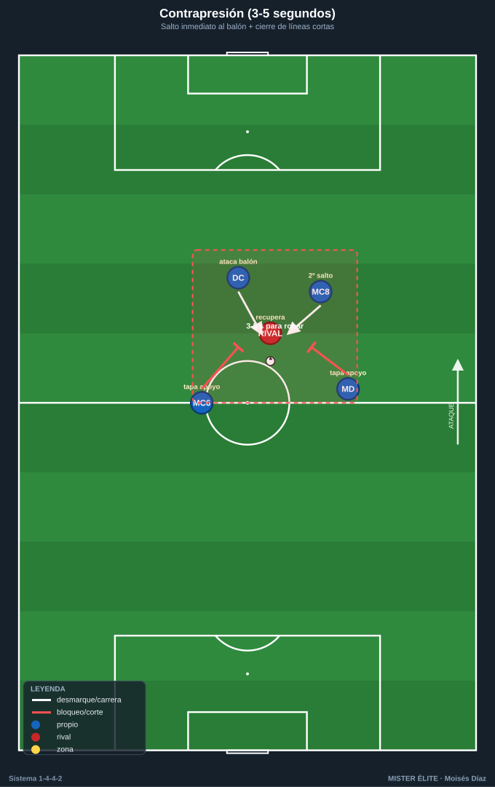
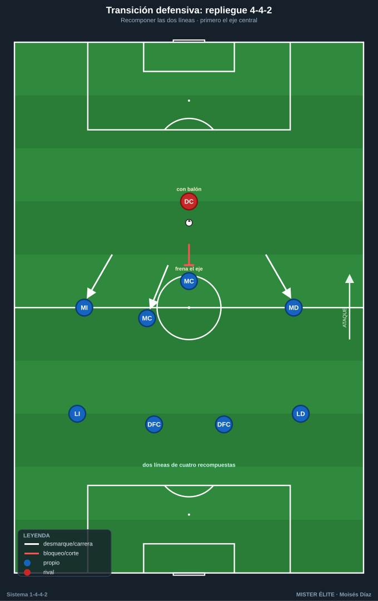
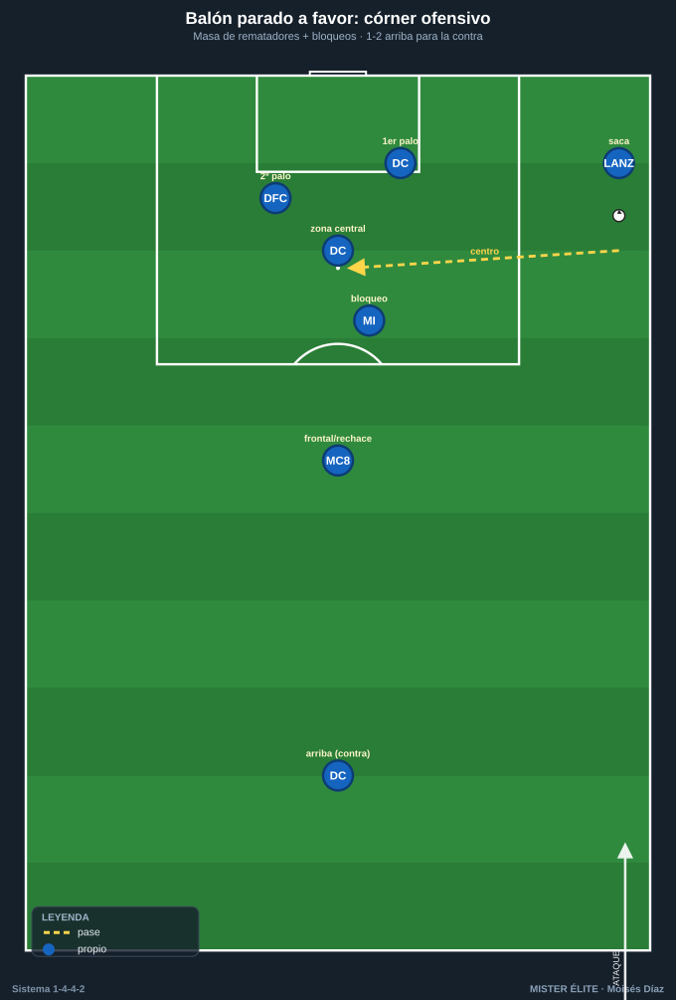

# Módulo 04 — Transiciones y balón parado

> Las transiciones son la gran virtud del 1-4-4-2. Este módulo cubre la transición defensa-ataque (contraataque), la transición ataque-defensa (pérdida) y una referencia breve de balón parado. Convención de posiciones en el [README](../README.md).

---

## 1. Transición defensa-ataque (contraataque) — el gran punto fuerte

El 1-4-4-2 es **el sistema de referencia del contragolpe moderno** (Atlético de Simeone; Leicester 2015-16 con Vardy-Mahrez-Kanté). Razones y mecanismos:

- **Dos delanteros ya arriba como salida inmediata:** al recuperar hay dos referencias de ataque sin subir hombres. Uno ofrece **apoyo** (pie, descarga) y el otro **profundidad** (carrera a la espalda) — la misma dualidad apoyo/ruptura del [Módulo 03](03-fase-ofensiva.md), ahora en velocidad.
- **Extremos rápidos en transición:** atacan los carriles exteriores corriendo al espacio; extremo + delantero al área es un patrón muy rentable.
- **Pase de transición:** primera opción = **pase vertical y rápido** al delantero (al espacio para el que rompe, al pie para el que apoya). Evitar el toque lateral lento que permite al rival reordenarse.
- **Llegada de un MC (el "8")** como tercer hombre del contraataque; el "6" y los centrales sostienen el equilibrio.
- **Tipos:** directo (3-4 pases, máxima velocidad al espacio) o indirecto/sostenido (asegurar y atacar con orden si no hay carril claro). Hace falta criterio para decidir cuándo lanzar y cuándo frenar.

---

## 2. Transición ataque-defensa (pérdida)

Dos modelos, viables y a menudo combinados:

- **Repliegue organizado (modelo Simeone/Atlético):** tras la pérdida, prioridad a **recomponer el bloque medio-bajo en 4-4-2** rápido y compacto, frenar el balón y obligar al rival a atacar un muro de dos líneas de cuatro. Es el modelo más natural del sistema por la facilidad para formar las dos líneas.
- **Contrapresión ("3-5 segundos"):** presión inmediata en el lugar de la pérdida con el más cercano + apoyos, buscando recuperar arriba antes de que el rival progrese. Funciona si la estructura ofensiva estaba compacta; el riesgo es el espacio a la espalda de los pivotes si se rompe la presión. (Misma regla descrita en el [Módulo 02 §3.3](02-fase-defensiva.md).)

- **Riesgo estructural a vigilar:** las pérdidas en construcción dejan a los dos centrales en inferioridad; de ahí la importancia del **resto defensivo** (un MC + centrales por detrás del balón) durante el ataque. La zona crítica al defender en transición es el **espacio entre líneas** y los **medios espacios**.

**Decisión "contrapresiono o replego":** colectiva y referida al primer defensor (el que ha perdido el balón). Si la estructura estaba compacta y hay apoyos cerca, contrapresión; si el equipo estaba estirado o el rival ya progresa, repliegue.

---

## 3. Balón parado (referencia breve)

### 3.1 A favor — córners

- **Aprovechar la masa de rematadores:** dos delanteros + central(es) ofensivos dan 4-5 cabezas. Combinar **marcaje al hombre y bloqueos** (cortinas para liberar al mejor rematador).
- **Zonas:** rematadores al primer palo (prolongación), zona central (remate), segundo palo (rechace); un hombre a la frontal para el rechace y el equilibrio. Dejar **1-2 arriba** (uno de los puntas) para el contragolpe.

### 3.2 A favor — faltas y saques

- **Falta lateral:** tratarla como un centro (mismas zonas de remate del [Módulo 03 §3.4](03-fase-ofensiva.md)).
- **Falta directa frontal:** especialista al disparo; rematadores atacando el rechace y vigilando la barrera.
- **Saque de banda en campo rival:** recurso de finalización (lanzador largo al área) o para combinar y mantener.

### 3.3 En contra (defensa de estrategia)

- El 1-4-4-2 suele defender córners con **mixto (zona + hombre):** zona en primer palo y trayectoria del balón, marcaje individual a los rematadores peligrosos.
- Dejar **un delantero arriba** condiciona al rival a dejar un defensor atrás, restándole rematadores y dando salida de contragolpe.

---

## Ideas clave

- La transición ofensiva es **vertical y rápida a los dos delanteros** (uno apoya, otro rompe) + extremos al espacio; el "8" llega de tercero.
- En la transición defensiva, elegir entre **contrapresión de 3-5 s** o **repliegue compacto en 4-4-2**, siempre con criterio colectivo.
- El **resto defensivo** durante el ataque (un MC + centrales) es lo que hace seguras las dos transiciones.
- En balón parado a favor, se explota la **masa de rematadores** con bloqueos; en contra, **mixto** y un punta arriba para equilibrio.

## Errores comunes

- **Tocar en lateral lento** tras recuperar, dando tiempo al rival a reordenarse.
- **Atacar sin resto defensivo:** subir demasiados hombres y quedar expuesto a la contra rival.
- **Perseguir por fuera** en el repliegue en vez de ocupar primero el eje para frenar el balón central.
- **Contrapresionar desordenado** desde una estructura estirada, regalando la espalda de los pivotes.
- En ABP, **no dejar a nadie arriba** (se pierde el equilibrio y la salida de contragolpe).
