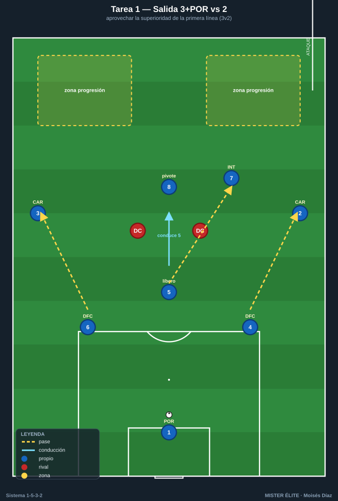
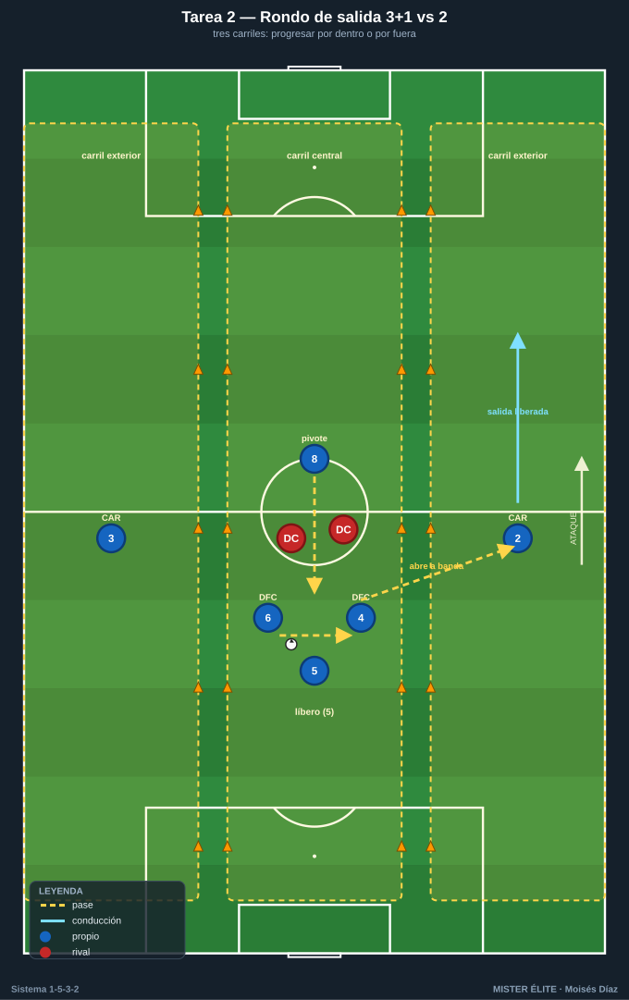
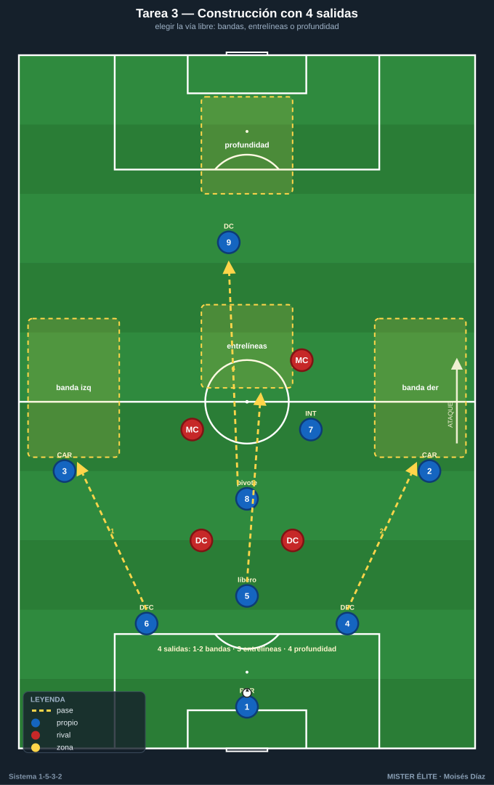
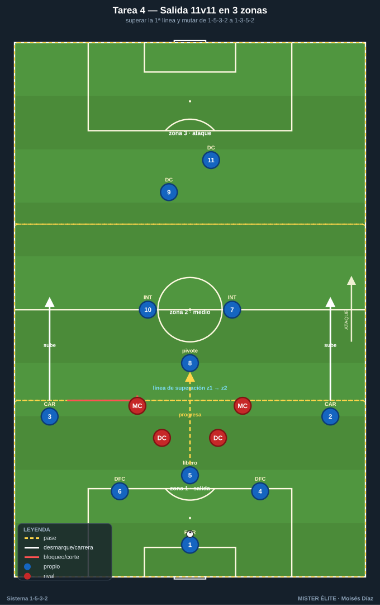

# Bloque 1 · Salida de balón con 3 centrales + pivote

> Tareas T1–T4. La gran ventaja estructural del 1-5-3-2 en salida es la superioridad de la primera línea: 3 centrales + portero frente a 2 delanteros (3v2 / 4v2). El pivote (8) crea el rombo y los carrileros se abren altísimos. Se entrena el mecanismo y la decisión: progresar por dentro (8 o interior) o por fuera (carrilero).

---

## TAREA 1 — Salida 3+POR vs 2: aprovechar la superioridad de la primera línea

- **Objetivo:** construir desde atrás aprovechando el 3v2, con el líbero (5) conduciendo para fijar y el pivote (8) ofreciéndose entre líneas, orientando la salida al carril que el rival deja libre.
- **Organización:**
  - **Jugadores:** 6 construyen (POR + DFC1/DFC2/DFC3 + pivote 8 + 1 interior que aparece) vs 2 DC. Ideal: añadir 2 MC rivales que saltan al pivote (3+POR+8 vs 2+2).
  - **Espacio:** ancho completo (68 m) × 40 m de fondo desde portería.
  - **Material:** 1 portería grande con portero; 2 mini-porterías o "zonas de progresión" a 40 m; petos, balones en portería.

- **Desarrollo:** inicio siempre en el portero. Los 3 centrales se abren (4 y 6 a la altura del área, 5 por el centro). El líbero (5) puede conducir para fijar a un DC y liberar a un compañero o al pivote. Objetivo: progresar el balón controlado a una zona de superación. Si los DC roban, finalizan a la portería grande.
- **Provocaciones:**
  - Prohibido el pase largo del portero (obliga a usar la superioridad por suelo).
  - El líbero (5) debe **conducir al menos 3 m hacia el rival** antes del pase clave de cada secuencia.
  - Si el pivote (8) recibe entre líneas y gira de cara con control = 2 puntos.
  - 2 toques máximo para los centrales de los lados (4 y 6); el 5 libre.
- **Variantes (fácil → difícil):**
  1. 3+POR vs 2 sin medios rivales.
  2. Añadir 2 MC rivales que saltan al pivote (3+POR+8 vs 2+2).
  3. Rival presiona 2 DC + 2 MC + saltos; construcción a 1-2 toques.
  4. Portero obligado a participar (mín. 1 contacto) y prohibido jugar dos veces seguidas por el mismo carril.
- **Coaching:** 3 centrales abiertos y escalonados, NO en línea plana (el 5 un paso por delante); pivote en perfil, medio cuerpo abierto, fuera de la sombra de pase; usar la conducción del líbero como arma; primer pase que rompa una línea, no horizontal cómodo.
- **Duración / categoría:** 4 series de 4 min, 90 s descanso (16–20 min). **A / S** (versión fácil para F sub-14).

---

## TAREA 2 — Rondo de salida 3v2 + carriles: progresar por dentro o por fuera

- **Objetivo:** automatizar la decisión de la salida —jugar corto al pivote (carril interior) o abrir al carrilero (carril exterior)— según dónde cierre la presión, manteniendo la superioridad de los 3 centrales.
- **Organización:**
  - **Jugadores:** 3 centrales + pivote (8) vs 2 DC, con 2 carrileros como apoyos fijos en los carriles exteriores (3+1 vs 2 con 2 apoyos de banda).
  - **Espacio:** 30×24 m dividido en 3 carriles verticales (conos/cinta).
  - **Material:** conos de carriles, petos, balones.

- **Desarrollo:** los 3 centrales + pivote conservan ante 2 DC. Los carrileros son receptores fijos exteriores. El balón alterna carril central ↔ exterior simulando la circulación de la salida. Cada vez que llega limpio a un carrilero, "salida liberada": el carrilero conduce a una línea-meta y se reinicia.
- **Provocaciones:**
  - Los 2 DC eligen qué carril cerrar; el equipo sale por el opuesto (lectura, no fórmula).
  - El pase al carrilero solo vale si **antes** un central ha fijado a un DC con conducción.
  - Si los 3 centrales quedan en línea plana sin escalonar = pierden la posesión.
  - Máximo 2 toques en el carril central.
- **Variantes:**
  1. 3+1 vs 2, carrileros libres.
  2. 3+1 vs 2+1 (un MC rival salta al pivote).
  3. El carrilero que recibe debe superar a un defensor que le sale (suma el 1v1).
- **Coaching:** fijar antes de pasar; cuerpo orientado al carril de salida; el pivote ofrece línea constantemente; el carrilero recibe de cara y en carrera, no parado.
- **Duración / categoría:** 3 bloques de 3 min por lado (12–14 min). **F / A**.

---

## TAREA 3 — Construcción dirigida con cuatro salidas (situacional)

- **Objetivo:** entrenar las vías de salida —corta al pivote por dentro, abierta al carrilero, conducción del líbero, o directa al delantero que baja— eligiendo según la presión rival.
- **Organización:**
  - **Jugadores:** bloque de construcción (POR + 3 DFC + 8 + 2 CAR) + 2 DC + 2 MC rivales. 10–11 jugadores.
  - **Espacio:** 3/4 de campo a lo ancho completo.
  - **Material:** portería grande; 4 zonas-meta (banda derecha, banda izquierda, carril central entrelíneas, zona de profundidad para el delantero que cae).

- **Desarrollo:** el entrenador condiciona la presión rival con una señal (presión a un central del lado, al pivote, o bloque medio que tapa al carrilero). El equipo elige la salida correcta y conduce/pasa a la zona-meta libre. Reinicio constante desde portero.
- **Provocaciones:**
  - Cada secuencia se resuelve por la vía que el rival deja libre; usar la vía cerrada = secuencia anulada.
  - Si el rival tapa a los dos carrileros, la salida DEBE ir por dentro: el pivote recibe y un interior aparece en su espalda.
  - Si la presión es muy alta sobre la primera línea, se habilita la directa al DC que baja, y el otro DC ataca el espacio que deja.
- **Variantes:** pasiva → semiactiva → activa con robo y finalización rival.
- **Coaching:** ver antes de recibir; jerarquía de decisión (primero por dentro con superioridad; si lo tapan, abrir al carrilero; si presionan todo, directo); los carrileros dan la primera anchura aunque no reciban.
- **Duración / categoría:** 20 min (bloques de 5 min cambiando la condición de presión). **A / S**.

---

## TAREA 4 — Salida 11v11 con zonas de presión (partido condicionado de construcción)

- **Objetivo:** transferir la salida a contexto real, superando la primera línea con la superioridad de los 3 centrales y conectando con el medio de 3 y los carrileros, dando el salto de 1-5-3-2 a 1-3-5-2.
- **Organización:**
  - **Jugadores:** 10–11 vs 10–11.
  - **Espacio:** campo completo dividido en 3 zonas horizontales (defensa-medio-ataque) por líneas de cal.
  - **Material:** 2 porterías, balones en cada portería para reinicios rápidos.

- **Desarrollo:** partido normal, pero el equipo en posesión suma 1 punto cada vez que **supera la primera línea de presión con balón controlado** pasando de zona 1 a zona 2 mediante pase progresivo (no despeje). Gol vale 3.
- **Provocaciones:**
  - El equipo sin balón solo presiona con 2 DC + 2 MC en zona 1 (replica la presión típica y respeta la superioridad de 3 centrales).
  - Para sumar el punto, los **dos carrileros deben haber subido** por encima de la línea de medios (obliga a la mutación de 3 a 5 ofensivos).
  - Prohibido superar la primera línea con pase aéreo directo los primeros 6 min de cada bloque; luego se libera.
- **Variantes:** reducir zona de salida; obligar mínimo de pases; permitir presión de 3 en zona 1 (mayor exigencia).
- **Coaching:** centrales con paciencia y amplitud; pivote siempre disponible y orientado; carrileros altos para estirar; el líbero conduce si tiene espacio.
- **Duración / categoría:** 3 bloques de 8 min (24–28 min). **A / S**.
