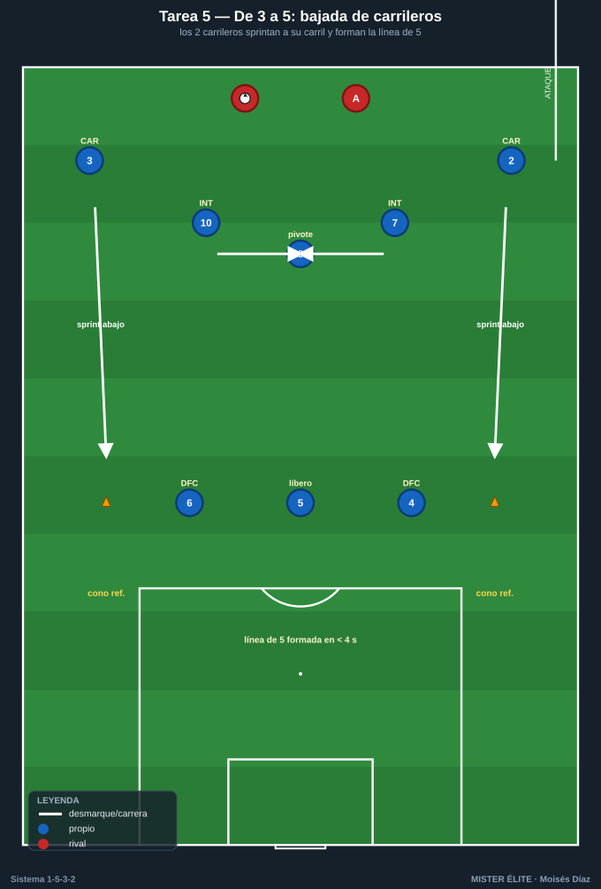
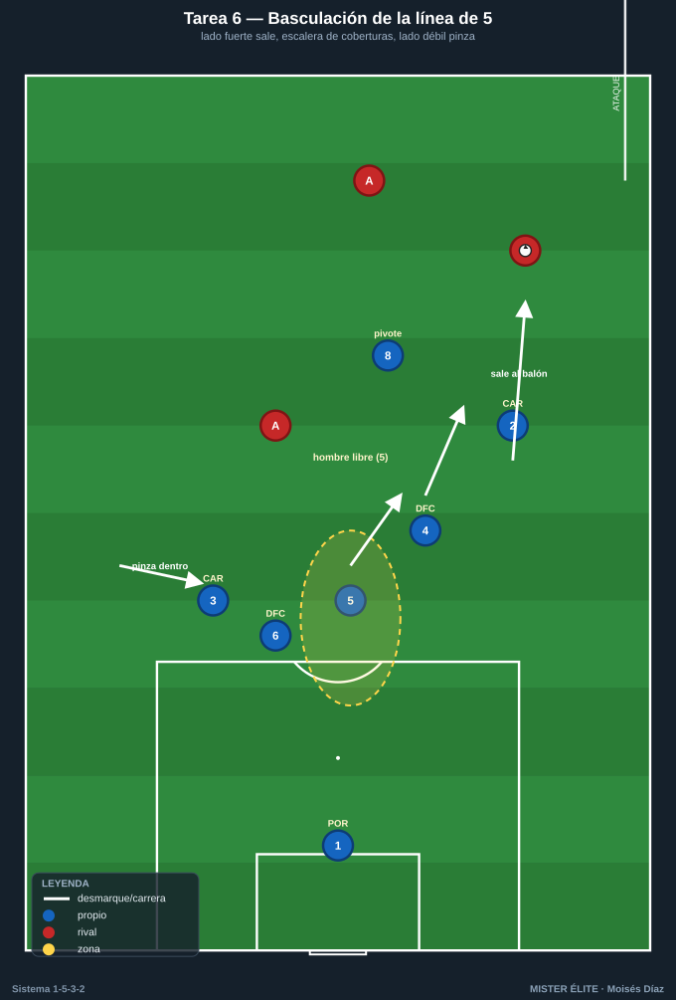
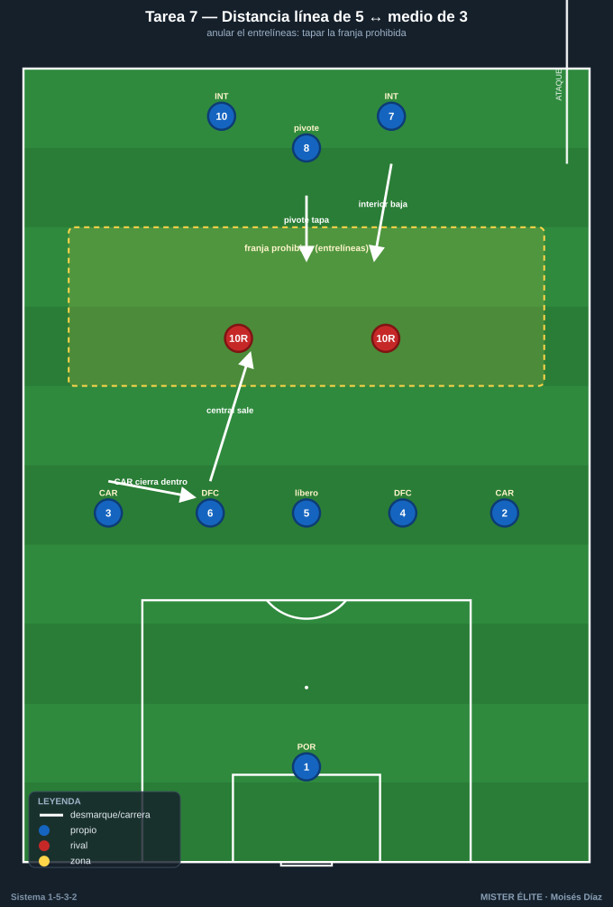
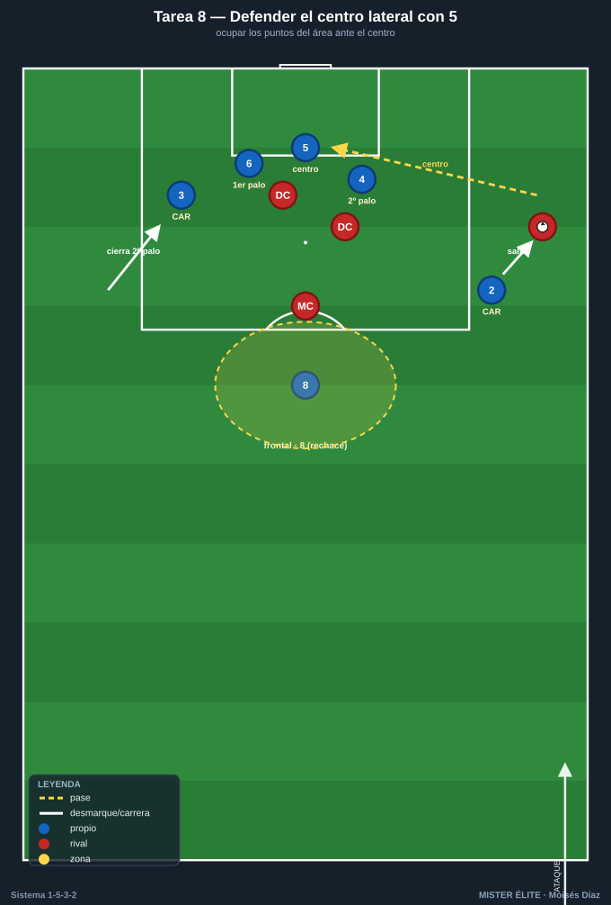
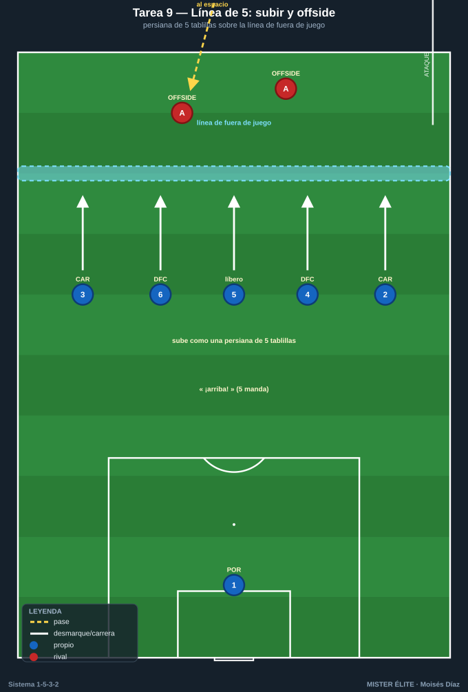

# Bloque 2 · Organización y basculación de la línea de 5 + medio de 3

> Tareas T5–T9. El sello defensivo del 1-5-3-2 es la transformación constante: con balón los carrileros están altos (3 atrás); al perder, ambos bajan y formamos una **línea de 5** con un **medio de 3** delante. Se entrena el "pasar de 3 a 5", la basculación, las coberturas internas y el fuera de juego de los cinco.

---

## TAREA 5 — De 3 a 5: bajada coordinada de los carrileros (analítica de transformación)

- **Objetivo:** automatizar el gesto base del sistema: cuando el equipo pierde el balón o lo recula el rival, los **dos carrileros bajan al unísono** para formar la línea de 5 a la altura de los centrales.
- **Organización:**
  - **Jugadores:** la futura línea de 5 (3 DFC + 2 CAR) + el medio de 3 (8, 7, 10) = 8 piezas; + 4–6 atacantes que circulan el balón.
  - **Espacio:** medio campo a lo ancho (68×45 m).
  - **Material:** conos de referencia que marcan dónde cierra cada carrilero al bajar; petos; un balón guía.

- **Desarrollo:** con balón propio los carrileros están altos. A una señal (silbato o pase que recupera el rival), los carrileros sprintan a sus conos y el equipo aparece en 1-5-3-2 compacto. Repetir 3→5 y, a la inversa, 5→3 cuando el equipo "recupera".
- **Provocaciones:**
  - Tras la señal, la línea de 5 debe estar formada en **menos de 4 segundos** (cronometrado): carrilero tarde = repetición.
  - El carrilero baja a **su carril**, no en diagonal al centro (cierra su banda).
  - El medio de 3 reajusta a la vez: si el 8 deja libre el centro = punto para los atacantes.
- **Variantes:**
  1. Gesto sin oposición, a la voz del entrenador.
  2. El rival circula y la señal es natural (recupera la posesión).
  3. Alternar 3→5 y 5→3 varias veces seguidas (transformación continua).
- **Coaching:** "bajar a tu carril, no al centro"; sprint al recular, no trote; la línea se forma a la altura, no escalonada por pereza; comunicación ("¡abajo, abajo!" del 5).
- **Duración / categoría:** 4 series de 3 min (14–16 min). **F / A / S** (base imprescindible).

---

## TAREA 6 — Basculación de la línea de 5: cerrar lado fuerte con central que sale (situacional)

- **Objetivo:** sincronizar el desplazamiento lateral de la línea de 5, con el central/carrilero del lado del balón saliendo al duelo y el resto cubriendo en diagonal, manteniendo siempre un hombre libre.
- **Organización:**
  - **Jugadores:** línea de 5 (3 DFC + 2 CAR) + pivote (8) + POR, vs 5–6 atacantes que circulan y buscan recibir en banda o entre líneas.
  - **Espacio:** medio campo a lo ancho (68×40 m).
  - **Material:** 3 carriles marcados; portería; mini-porterías para contraatacar al robar.

- **Desarrollo:** los atacantes circulan de banda a banda buscando filtrar. La línea de 5 bascula: el carrilero o central del lado del balón presiona al receptor; el central contiguo cubre; el líbero (5) reparte; el carrilero del lado débil **pinza hacia dentro**. Al robar, salida a mini-portería.
- **Provocaciones:**
  - Cada cambio de orientación = reajuste completo de la línea antes de 3 s; si no, los atacantes reciben libres y suman.
  - Prohibido que el carrilero del lado del balón salte sin cobertura del central contiguo (hueco a su espalda = punto atacante).
  - El carrilero del lado débil NO puede quedarse pegado a su banda: debe entrar al carril del central.
- **Variantes:**
  1. Balón guiado lento, sin robo, foco en el desplazamiento.
  2. Circulación a ritmo real, la defensa roba si hay pase malo.
  3. Cambio de orientación largo de banda a banda + un atacante entre líneas para el pivote.
- **Coaching:** mover la línea como una unidad; el del lado fuerte sale, los demás cubren en escalera; el lado débil pinza; el hombre libre es la red de seguridad; ojos en balón y referencias.
- **Duración / categoría:** 4 series de 4 min, cambiando lado de inicio (18 min). **A / S** (base válida para F).

---

## TAREA 7 — Distancia entre la línea de 5 y el medio de 3: anular el entrelíneas (situacional)

- **Objetivo:** mantener la distancia correcta entre la línea de 5 y el medio de 3 para que nadie reciba cómodo en el espacio intermedio, repartiendo la vigilancia entre el pivote y la salida de un central.
- **Organización:**
  - **Jugadores:** línea de 5 + medio de 3 (8 piezas) + POR vs 2 "enganches" rivales que buscan recibir entre líneas + 2 DC + 4 exteriores que dan el balón.
  - **Espacio:** 60×50 m con una franja central pintada (la "zona prohibida" entrelíneas, ~10 m de fondo).
  - **Material:** cal/conos de la franja, portería, petos.

- **Desarrollo:** los servidores intentan filtrar al jugador entre líneas dentro de la franja. El medio de 3 achica hacia atrás o el interior más cercano baja a tapar; la línea de 5 sube coordinada para reducir la franja. Decisión: ¿lo coge un interior bajando, el pivote, o sale un central rompiendo la línea de 5?
- **Provocaciones:**
  - Cada vez que un rival recibe **orientado** dentro de la franja = 2 puntos atacantes.
  - Si un central sale a por el receptor, un carrilero debe **cerrar por dentro** para que la línea siga siendo de 5; si no se cubre, punto atacante.
  - El pivote (8) no puede abandonar el carril central (es el ancla).
- **Variantes:** ampliar la franja → añadir un delantero que se apoya y descarga al entrelíneas (cadena de decisiones).
- **Coaching:** decisión clara de quién coge al del entrelíneas (interior baja > pivote > central sale con cobertura); cuando un central sube, el carrilero tapa el hueco; achicar cuando el balón va atrás/lateral; comunicación constante.
- **Duración / categoría:** 4 series de 4 min (16–18 min). **A / S**.

---

## TAREA 8 — Defender el centro lateral con línea de 5: ocupar los puntos del área (situacional)

- **Objetivo:** organizar la línea de 5 ante el balón en banda y el centro, con los 3 centrales protegiendo los puntos del área, los carrileros ajustando al hombre de banda y los interiores replegando a la segunda jugada.
- **Organización:**
  - **Jugadores:** 3 DFC + 2 CAR + 2 interiores que repliegan + POR, vs 2 DC + 2 hombres de banda que centran + 1 que llega de segunda línea.
  - **Espacio:** zona de finalización (área grande + 25 m), ambas bandas.
  - **Material:** portería grande, balones en las bandas, conos marcando primer palo / centro / segundo palo / punto de penalti / frontal.

- **Desarrollo:** balón en banda rival que llega al fondo y centra. El carrilero del lado salta al que centra; los 3 centrales reparten primer palo, centro y segundo palo; el carrilero del lado contrario cierra el segundo palo entrando; un interior vigila la frontal.
- **Provocaciones:**
  - Gol de rechace en la frontal sin vigilancia = doble.
  - El carrilero del lado contrario **debe entrar a cerrar el segundo palo**; gol por el segundo palo descuidado = doble.
  - Cada central marca su zona/hombre: si abandona su punto sin necesidad = posesión rival.
  - Defensa gana punto si despeja fuera del área grande (despeje útil).
- **Variantes:** centro raso vs al área vs atrás a la frontal → añadir un segundo atacante al área.
- **Coaching:** la ventaja del 5 es tener cuerpos para todos los puntos del área; el carrilero lejano es "tercer/cuarto central" cerrando el segundo palo; interior SIEMPRE a la frontal; portero manda su zona; nadie mira el balón sin sentir a su par.
- **Duración / categoría:** 20 repeticiones (10 por banda) en bloques (16–18 min). **A / S**.

---

## TAREA 9 — Línea de 5: subir, bajar y trampa de fuera de juego (analítica)

- **Objetivo:** coordinar el ascenso/descenso de la línea de 5 y la temporización del fuera de juego, con el líbero (5) como director.
- **Organización:**
  - **Jugadores:** línea de 5 (3 DFC + 2 CAR) + POR vs 4–5 atacantes (2 DC + 2–3 que llegan) + 1–2 pasadores.
  - **Espacio:** medio campo, anchura completa, con línea de fuera de juego de referencia pintada.
  - **Material:** línea pintada/conos móviles, banderines.

- **Desarrollo:** los pasadores buscan el pase al espacio a la espalda. La línea de 5 sube al unísono cuando el líbero (5) lo ordena, dejando en fuera de juego; o baja temporizando si el balón va a la espalda con ventaja del atacante.
- **Provocaciones:**
  - La línea sube/baja "como una persiana de cinco tablillas": si un jugador (incluidos los carrileros) queda 1 m descolocado y deja activo a un atacante = punto atacante.
  - El líbero (5) ordena con voz ("¡arriba!" / "¡basta!"); los carrileros suben con la línea, no se quedan retrasados por inercia de banda.
- **Variantes:** ritmo lento → real → conducción del pasador (decisión de subir o aguantar) → un carrilero rival por fuera (probar que la línea de 5 incluye a los carrileros en el offside).
- **Coaching:** el 5 manda la línea; subir cuando el rival no puede jugar al espacio (balón de espaldas/atrás); bajar y temporizar cuando encara con campo; los carrileros son parte de la línea, no satélites; mirada dividida balón-línea.
- **Duración / categoría:** 4 series de 3 min (14 min). **A / S** (con cuidado en F).
