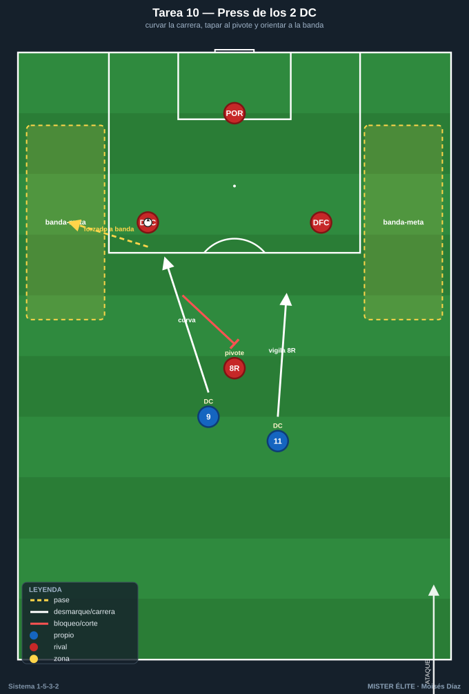
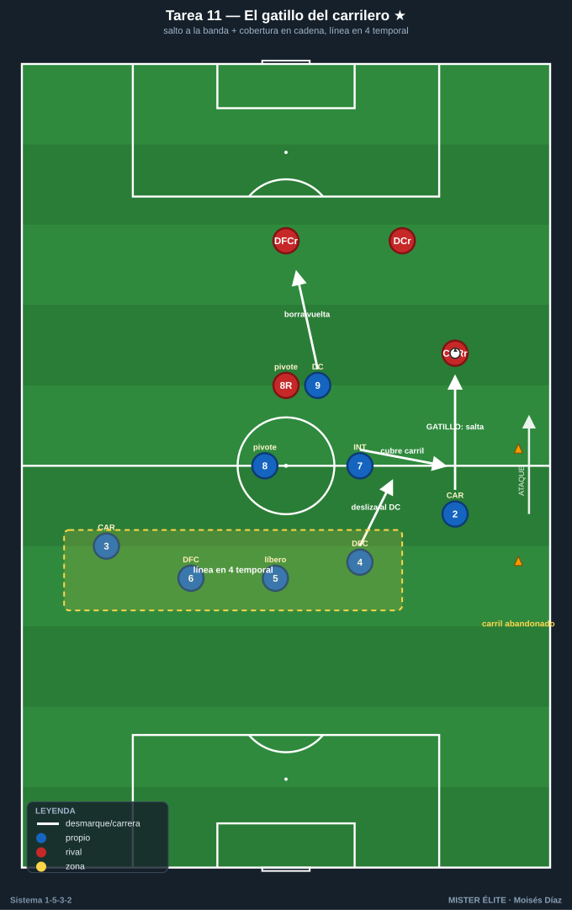
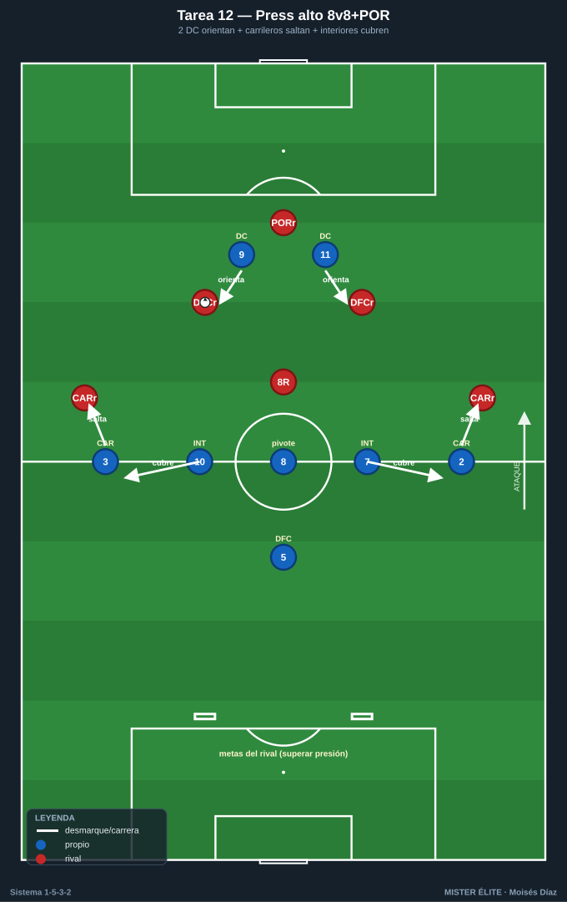
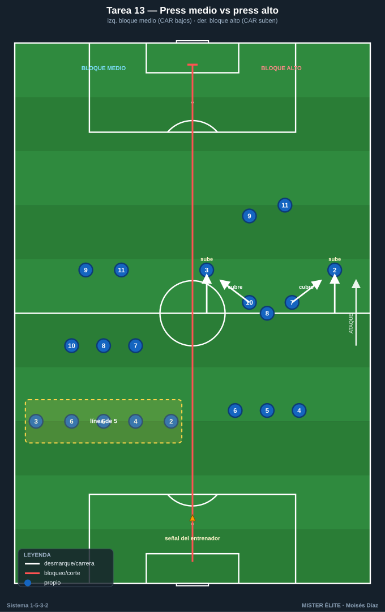

# Bloque 3 · Press de los 2 DC y gatillo del carrilero

> Tareas T10–T13. El 1-5-3-2 presiona arriba con sus 2 DC orientando la salida rival (curvando la carrera para tapar al pivote rival y obligar el pase a banda), y el **gatillo característico**: cuando el balón va al lateral/carrilero rival, el carrilero propio salta desde la línea de 5 hasta la banda, mientras el interior baja a cubrir la espalda. Es el momento más delicado del sistema y exige coberturas en cadena muy entrenadas.

---

## TAREA 10 — Press de los 2 DC: curvar carrera y tapar al pivote rival (analítica)

- **Objetivo:** que los 2 DC presionen en pareja curvando la carrera para tapar la línea de pase al pivote rival y orientar la salida del rival hacia una banda concreta (donde saltará nuestro carrilero).
- **Organización:**
  - **Jugadores:** 2 DC presionan vs 2 centrales + 1 pivote + portero rivales (salida 3+POR rival).
  - **Espacio:** ancho completo × 35 m de fondo.
  - **Material:** portería; 2 zonas-meta en bandas (donde queremos "empujar" la salida rival).

- **Desarrollo:** el rival inicia desde portero. Los 2 DC impiden la progresión por dentro (al pivote) y fuerzan la salida a una banda. Llevar la salida rival a la banda-meta = éxito del press (señal para el gatillo del carrilero, que se entrena en T11).
- **Provocaciones:**
  - El primer DC corre en curva tapando la sombra de pase al pivote (si presiona en recta dejando el carril interior = secuencia anulada).
  - El segundo DC vigila al pivote o al central libre según orientación (saltos alternos).
  - Pase rival al pivote orientado = punto rival.
  - Bonus: si entre los dos obligan a que el rival juegue a la banda predeterminada, +1.
- **Variantes:** rival pasivo → activo → añadir un carrilero rival (3+1) para encadenar con el salto del carrilero propio.
- **Coaching:** "tapar con la carrera, no con la pierna"; presionar en pareja, nunca uno suelto; cuerpo orientado para que el rival solo pueda jugar al lado que queremos; comunicación entre la pareja para elegir lado.
- **Duración / categoría:** 4 series de 3 min (14 min). **A / S**.

---

## TAREA 11 — El gatillo del carrilero: salto a la banda y cobertura en cadena (situacional) ★

- **Objetivo:** entrenar el gatillo de presión más característico del 1-5-3-2: cuando el balón va al lateral/carrilero rival, el carrilero propio salta desde la línea hasta la banda, y detrás se ejecuta la cobertura en cadena (interior baja a tapar la espalda, línea a 4, central del lado vigila al delantero).
- **Organización:**
  - **Jugadores:** medio bloque del lado (CAR + 2 DFC + 8 + 1 interior + 1 DC) vs línea de salida rival (2 centrales + 1 lateral/carrilero + 1 pivote + 1 que se ofrece en banda).
  - **Espacio:** ancho completo × 45 m.
  - **Material:** zonas-meta en banda y centro; conos marcando el carril que el carrilero abandona al saltar.

- **Desarrollo:** el rival circula entre centrales y su carrilero. En cuanto el balón llega al carrilero rival, **nuestro carrilero salta agresivo a la banda**. Simultáneamente: el interior (7 o 10) de ese lado baja a cubrir el carril; el central del lado se desliza a vigilar al delantero que cae; el pivote y la línea se reordenan. El DC cierra la vuelta atrás al central rival.
- **Provocaciones:**
  - El carrilero debe llegar al rival **antes de su segundo toque** (gatillo veloz): tarde = punto rival.
  - **Provocación nuclear:** en cuanto el carrilero salta, el interior de su lado DEBE bajar a tapar el carril abandonado; si el rival juega a la espalda del carrilero y nadie cubre = punto doble.
  - Robo en banda tras el salto = 2 puntos.
  - Prohibido al rival jugar de vuelta cómoda al central: el DC debe "borrar" esa vuelta.
- **Variantes:**
  1. Un lado, rival semiactivo, foco en el salto + cobertura del interior.
  2. Rival activo que explota la espalda del carrilero (cobertura real).
  3. Ambos lados con cambio de orientación: deshacer un gatillo y montar el del otro lado (carrilero vuelve a la línea, salta el otro).
- **Coaching:** saltar a la señal (balón al carrilero rival), no antes; presionar por dentro para cerrar el centro; **la cobertura del interior es obligatoria y simultánea al salto**; el central del lado pendiente del delantero; coberturas en cadena, no individuales.
- **Duración / categoría:** 4 series de 4 min, alternando lados (18–20 min). **A / S**. *(Tarea clave del sistema.)*

---

## TAREA 12 — Press alto 8v8+POR con gatillo de carrileros (juego condicionado)

- **Objetivo:** integrar el press alto del 1-5-3-2 (2 DC orientan + medio de 3 + salto de carrileros) con sus gatillos y coberturas, recuperando arriba para finalizar rápido.
- **Organización:**
  - **Jugadores:** 8 presionan (2 DC + 8/7/10 + 2 CAR + 1 DFC) vs 8 + portero que intentan salir.
  - **Espacio:** 2/3 de campo, ancho completo.
  - **Material:** portería grande que defiende el rival + 2 mini-porterías en el centro del campo (meta del rival: superar la presión).

- **Desarrollo:** el rival intenta superar la presión y llegar a las mini-porterías. El equipo que presiona roba y finaliza en la portería grande. Se entrena el press alto con el salto de carrileros a las bandas y la cobertura de los interiores.
- **Provocaciones:**
  - Activación del press solo cuando el portero rival juega corto a un central (gatillo de inicio).
  - Cuando un carrilero salta, el interior de ese lado debe bascular a cubrir; si el rival escapa por la espalda del carrilero y llega a mini-portería, penalización física (sprint).
  - Gol del equipo que presiona en <8 s tras el robo = doble.
- **Variantes:** reducir tiempo de finalización; comodín de salida al rival; ampliar el espacio (más exigencia física al carrilero).
- **Coaching:** presión en bloque, señal común; el carrilero es el "extremo defensivo-ofensivo": presiona arriba pero con cobertura detrás; tras robar, atacar de inmediato; no presionar en desorden (el sistema descubre carriles).
- **Duración / categoría:** 4 series de 4 min (18–20 min). **S** (versión reducida para A).

---

## TAREA 13 — Press medio vs press alto: cambiar altura y el rol del carrilero por señal (situacional avanzada)

- **Objetivo:** alternar la altura del bloque (medio ↔ alto), decidiendo cuándo los carrileros se mantienen en la línea de 5 (bloque medio) y cuándo saltan a presionar arriba (bloque alto): la decisión de cuándo descubrir el carril.
- **Organización:**
  - **Jugadores:** bloque completo 10 vs 10–11 atacando.
  - **Espacio:** 3/4 de campo.
  - **Material:** 2 porterías, petos de 2 colores para el equipo defensivo (un color = alto, otro = medio).

- **Desarrollo:** el equipo defensivo está en bloque medio por defecto (línea de 5 + 3, carrileros bajos). A la señal del entrenador salta a press alto coordinado (carrileros suben, interiores cubren); vuelve a bloque medio si no roba en X segundos.
- **Provocaciones:**
  - El press alto debe activarse por toda la unidad antes de 2 s de la señal (sincronía): carrileros suben e interiores bajan simultáneamente.
  - Si el equipo salta a press alto y el rival lo supera por la espalda de un carrilero, concede campo gratis (consecuencia real).
  - Recuperación en bloque medio compacto = punto; recuperación en press alto = 2 puntos.
- **Variantes:** señales fijas → gatillos naturales (pase atrás del rival, control malo) sin señal → el equipo decide solo cuándo merece la pena descubrir el carril.
- **Coaching:** unidad en la decisión; el carrilero solo salta si hay cobertura asegurada; el delantero líder activa con su voz; en bloque medio la línea de 5 es la fortaleza; subir tiene un coste (carril descubierto) y se hace con criterio.
- **Duración / categoría:** 3 bloques de 6 min (18 min). **S**.
