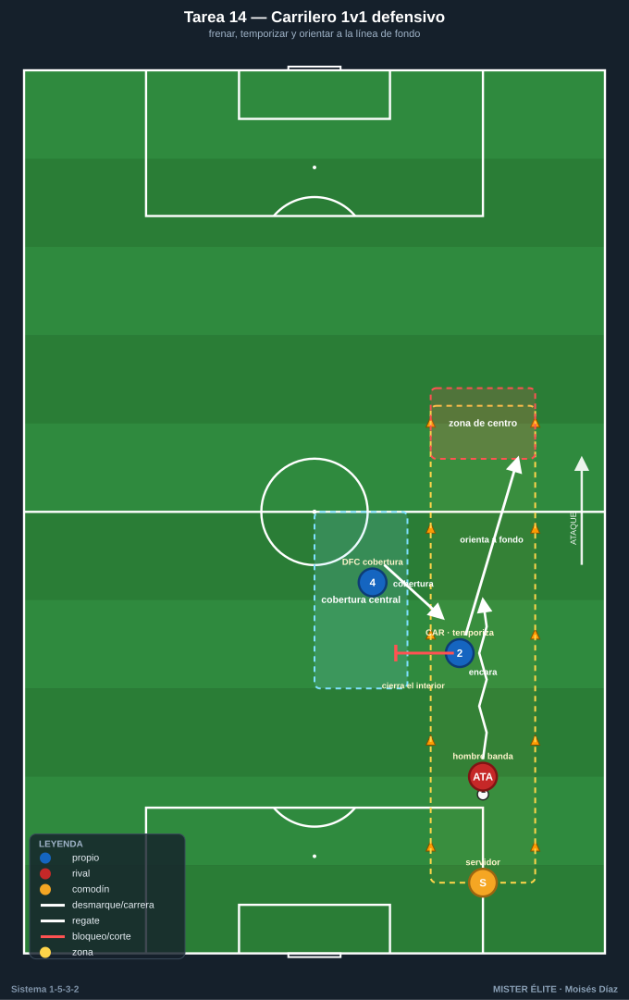
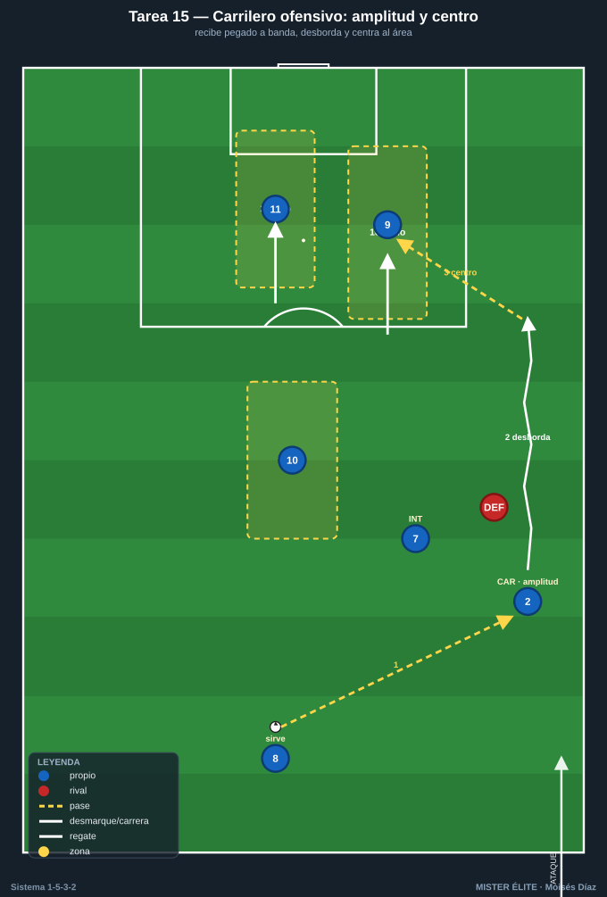
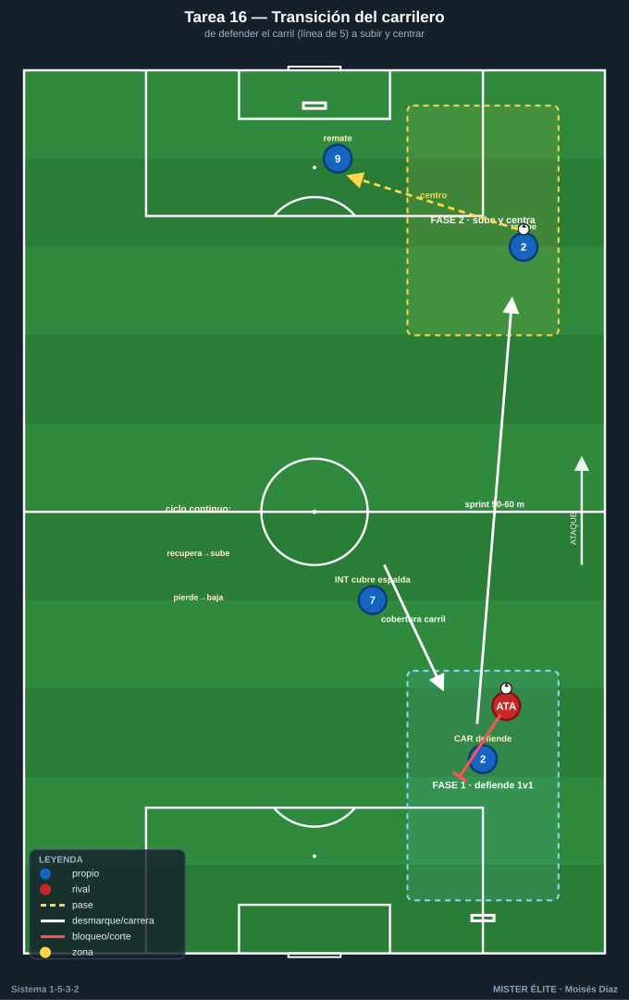
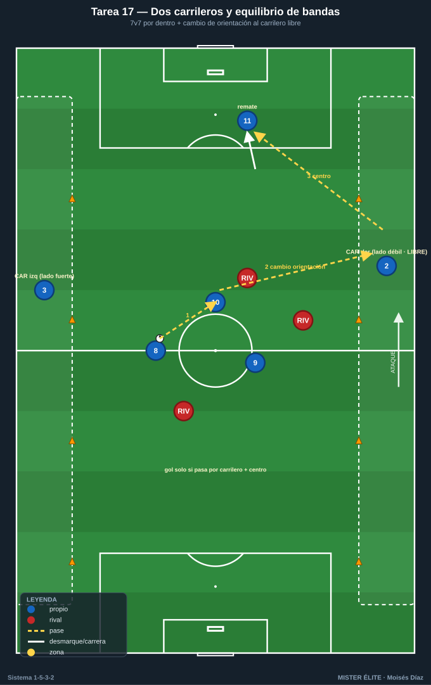
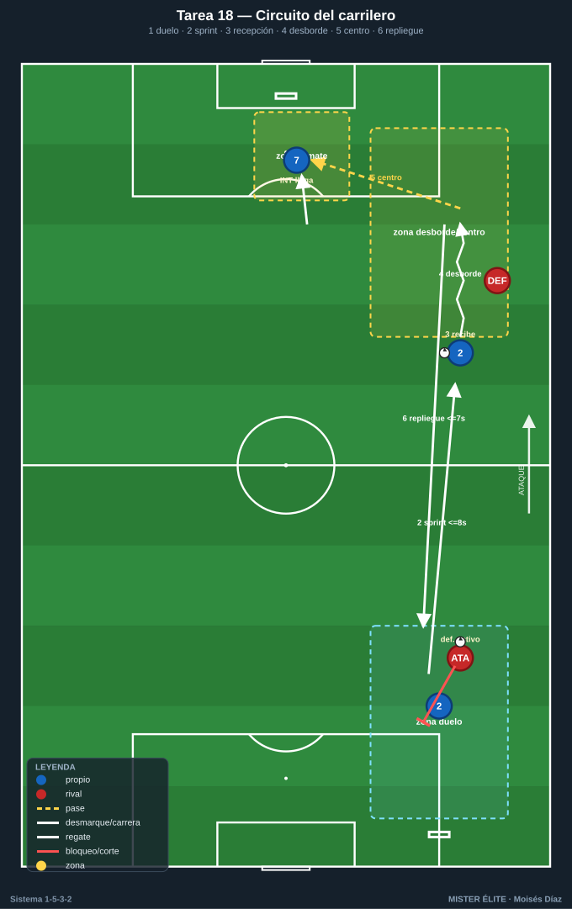

# Bloque 4 · Doble función de los carrileros *(bloque central del sistema)* ★

> Tareas T14–T18. El carrilero (CAR) es la pieza que define el 1-5-3-2. Debe resolver dos trabajos opuestos en la misma banda: **defender su carril 1v1** (bajar a la línea de 5, frenar al hombre de banda, proteger el segundo palo) y **dar amplitud y centrar** (subir como un extremo, desbordar, poner el balón al área). Cubre 60–70 m de banda una y otra vez. Estas cinco tareas —el peso del banco— entrenan ambas caras y la transición entre ellas.

---

## TAREA 14 — El carrilero 1v1 defensivo: frenar y orientar a la línea (analítica/situacional) ★

- **Objetivo:** entrenar la cara defensiva del carrilero: defender su carril en 1v1 contra el hombre de banda rival, frenar el desborde, orientarlo a la línea de fondo o hacia dentro (donde está la cobertura del central), sin dejarse superar por dentro.
- **Organización:**
  - **Jugadores:** parejas CAR (defensor) vs atacante de banda; con 1 DFC contiguo que da cobertura por dentro y 1 servidor.
  - **Espacio:** un carril de banda de 12–15 m de ancho × 25 m de fondo, repetido en ambas bandas.
  - **Material:** conos del carril, una zona de fondo (línea de centro) que el atacante intenta alcanzar para centrar, otra zona interior (que el carrilero protege orientando al central).

- **Desarrollo:** el servidor da el balón al atacante de banda. El carrilero defiende el 1v1: frena, retrocede temporizando, no se lanza, y orienta al atacante hacia la zona de cobertura del central, o lo manda a línea de fondo sin centro útil. Si llega a la zona de centro, centra; si lo orienta al central, robo/ayuda.
- **Provocaciones:**
  - El carrilero **no puede ser superado por dentro**: si lo gana por el carril interior = punto doble (descubre el centro).
  - El carrilero gana punto si **manda al atacante a línea de fondo** sin permitir centro al área.
  - El central contiguo debe dar cobertura visible (diagonal por dentro): defender sin cobertura = repetición.
- **Variantes:**
  1. 1v1 puro, atacante a media intensidad.
  2. 1v1 real con opción de centro; el central cubre.
  3. 2v2 (carrilero + central vs hombre de banda + delantero que ataca el centro).
- **Coaching:** temporizar, no lanzarse; cuerpo orientado para cerrar el interior y ofrecer la línea de fondo; "que centre desde donde no hace daño"; relación constante con el central; paciencia del defensor.
- **Duración / categoría:** 16–20 duelos por carrilero, en bloques (16–18 min). **A / S** (versión fácil para F).

---

## TAREA 15 — El carrilero ofensivo: amplitud, desborde y centro (situacional ofensiva) ★

- **Objetivo:** entrenar la cara ofensiva del carrilero: recibir alto y abierto dando la máxima amplitud (transformando el 3 atrás en 5 ofensivos), encarar, desbordar y poner un centro de calidad para los 2 delanteros + el interior que llega.
- **Organización:**
  - **Jugadores:** por banda: 1 CAR + 1 interior que se asocia + 2 DC que atacan el área + 1 que llega a la frontal, vs 1 defensor de banda + línea defensiva + POR.
  - **Espacio:** media banda + zona de finalización (área grande + 30 m), ambos lados.
  - **Material:** portería, balones en origen (central/pivote que sirve), conos de zonas del área (1er palo / 2º palo / frontal).

- **Desarrollo:** el balón sale del central/pivote al carrilero abierto y alto. El carrilero encara: desborda por fuera para centro tenso, o juega una pared con el interior para llegar al fondo. Centra; los 2 DC atacan primer y segundo palo, el interior llega a la frontal/rechace. Remate.
- **Provocaciones:**
  - El carrilero debe recibir **pegado a la banda**: si recibe metido por dentro, secuencia anulada.
  - Centro raso/al primer palo se premia (gol doble) frente al globo cómodo.
  - Cronómetro: del desborde al remate, máximo 4 s.
  - Deben ocuparse siempre los 3 puntos del área (1er palo, 2º palo, frontal): si falta uno, gol no cuenta.
- **Variantes:** sin defensa (técnica + ocupación) → defensor pasivo → 1v1 real → añadir que el carrilero del lado contrario llegue al segundo palo (la "llegada del carrilero ciego").
- **Coaching:** amplitud máxima al recibir; encarar con ritmo; calidad y tensión del centro; cruces de los delanteros; el carrilero contrario ataca el segundo palo como un delantero más.
- **Duración / categoría:** 20–24 centros (10–12 por banda) (18–20 min). **A / S**.

---

## TAREA 16 — La transición del carrilero: de defender el carril a centrar (situacional de doble función) ★

- **Objetivo:** entrenar el gesto que define al carrilero: pasar de la fase defensiva (en la línea de 5) a la ofensiva (subir 50–60 m a dar amplitud y centrar) en cuanto el equipo recupera, y a la inversa.
- **Organización:**
  - **Jugadores:** bloque por banda: CAR + 2 DFC + interior + DC, vs un equipo rival que ataca esa banda y luego pierde el balón.
  - **Espacio:** una banda completa a lo largo (medio campo de longitud × 30 m de ancho), con portería en cada extremo (la propia que el carrilero defiende y la rival a la que llega para centrar).
  - **Material:** 2 porterías, balones para reinicios.

- **Desarrollo:** Fase 1: el rival ataca la banda; el carrilero defiende su carril 1v1. Fase 2 (al recuperar): señal, y el carrilero **sprinta hacia arriba** por su banda a recibir y centrar; el interior cubre temporalmente su espalda. Si el equipo vuelve a perder, el carrilero **vuelve a bajar** a la línea de 5. Ciclo continuo.
- **Provocaciones:**
  - Al recuperar, el carrilero tiene un tiempo límite (p. ej. 6 s) para llegar a zona de centro.
  - Mientras el carrilero está arriba, si el rival recupera y ataca su carril vacío, el **interior debe estar cubriendo**: si nadie cubre y el rival progresa = punto rival.
  - El carrilero no puede quedarse arriba si el equipo ha perdido el balón más de 3 s: debe iniciar el regreso a la línea de 5.
- **Variantes:** ritmos controlados → transición real continua → añadir el otro carrilero para ver el equilibrio (uno sube, el otro se queda).
- **Coaching:** condición física y mentalidad de ida y vuelta; "subo cuando recuperamos, bajo cuando perdemos, sin discutir"; el interior es el socio del carrilero; leer cuándo merece la pena subir; equilibrio entre los dos carrileros.
- **Duración / categoría:** 4 series de 4 min por banda (18–20 min). **A / S**. *(Tarea clave del sistema.)*

---

## TAREA 17 — Los dos carrileros y el equilibrio de bandas (juego de posición ofensivo)

- **Objetivo:** consolidar el uso simultáneo de ambos carrileros para dar la amplitud del 1-3-5-2, cambiando de orientación de una banda a otra para encontrar al carrilero libre y centrar, manteniendo el equilibrio defensivo.
- **Organización:**
  - **Jugadores:** 7v7 + 2 porteros, con los 2 carrileros como piezas fijas en los carriles exteriores (o comodines de amplitud).
  - **Espacio:** 55×45 m con dos carriles de banda marcados (6–7 m a cada lado).
  - **Material:** 2 porterías grandes, conos de carriles.

- **Desarrollo:** juego libre por dentro, pero la amplitud la dan exclusivamente los dos carrileros en sus carriles. El gol solo vale si la jugada ha pasado por un carrilero y ha habido centro o pase desde banda antes del remate. Se premia cambiar de orientación para encontrar al carrilero del lado débil.
- **Provocaciones:**
  - Gol sin pasar por un carrilero = no vale (la anchura es de los carrileros, no hay extremos).
  - Cambio de orientación de banda a banda que termina en centro del carrilero libre = punto doble.
  - 2 toques por dentro, libre para el carrilero en su carril.
  - Solo un carrilero puede subir al ataque por posesión; el otro mantiene equilibrio.
- **Variantes:** carrileros como comodines fijos → carrileros que también defienden (bajan al perder) → exigir 2 atacantes en el área al centro.
- **Coaching:** amplitud permanente de ambos carrileros; cambiar de orientación para activar el lado débil; llegada de interiores y delanteros; un carrilero sube, el otro equilibra; calidad del centro.
- **Duración / categoría:** 4 series de 4 min (18 min). **A / S**.

---

## TAREA 18 — Circuito del carrilero: ida y vuelta con finalización (físico-técnico aplicado)

- **Objetivo:** preparar la exigencia física y técnica del carrilero (recorrer la banda en ataque y defensa) mediante un circuito que reproduce la doble función con **duelo real**, no contra conos.
- **Organización:**
  - **Jugadores:** 2–4 carrileros rotando + 1 atacante de banda y 1 defensor de desborde (ambos **activos**, rotan) + servidores + 1 rematador y 1 llegador interior por estación.
  - **Espacio:** banda completa (medio campo de longitud × 20 m de ancho), con zonas de duelo defensivo (abajo) y de desborde/centro (arriba) marcadas con cal.
  - **Material:** conos de zonas, balones, portería, mini-portería defensiva para el atacante de banda.

- **Desarrollo:** circuito continuo por la banda: (1) el carrilero defiende un **1v1 real** abajo, orientando a línea de fondo o robando; (2) al recuperar/despejar, sprinta 40–50 m por su carril; (3) recibe en carrera; (4) **encara y desborda a un defensor activo**; (5) centra al rematador con el interior llegando a la frontal; (6) repliegue inmediato a la zona de inicio. Cronometrado para simular el esfuerzo real.
- **Provocaciones (medibles):**
  - Tramo de subida (zona defensiva → recepción) **≤ 8 s** a intensidad máxima; fuera de tiempo = repetición.
  - En el 1v1 defensivo, mandar a línea de fondo o robar = válido; ser superado por dentro = penalización (repetir tramo).
  - El centro tras el desborde debe caer en una zona marcada (1er palo / 2º palo / frontal) **con el interior llegando**: centro a zona vacía o fallado = repetición.
  - Repliegue tras centrar **≤ 7 s** a la zona defensiva.
- **Variantes:** oponentes a media intensidad y menos volumen (formativo) → oponentes activos y más densidad (sénior) → un segundo carrilero en paralelo en la otra banda.
- **Coaching:** ritmo de carrera; resolver duelos reales arriba y abajo (no fintar a un cono); técnica de centro bajo fatiga; gestionar el esfuerzo; este es el coste físico del rol; calidad en la última acción aunque llegue cansado.
- **Duración / categoría:** 6–8 repeticiones por carrilero, ratio trabajo:descanso ~1:3 (16–20 min). **A / S** (volumen y oposición ajustados en F).
