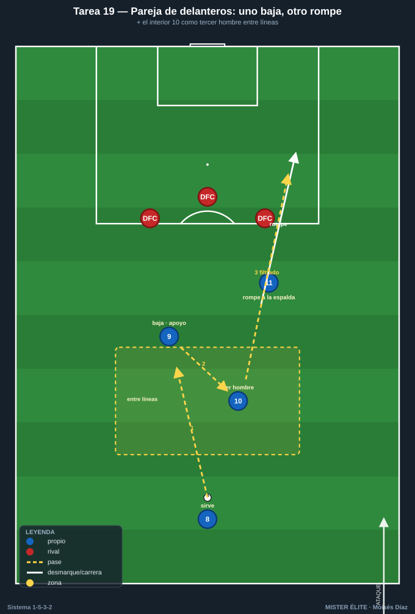
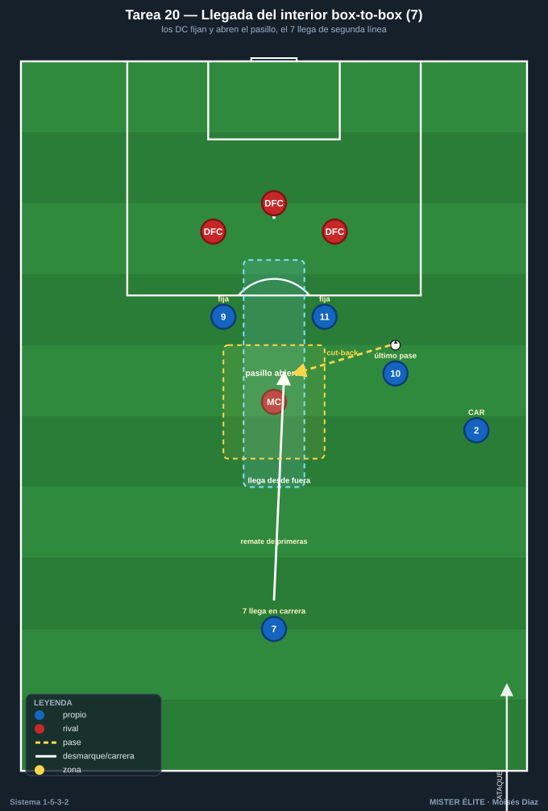
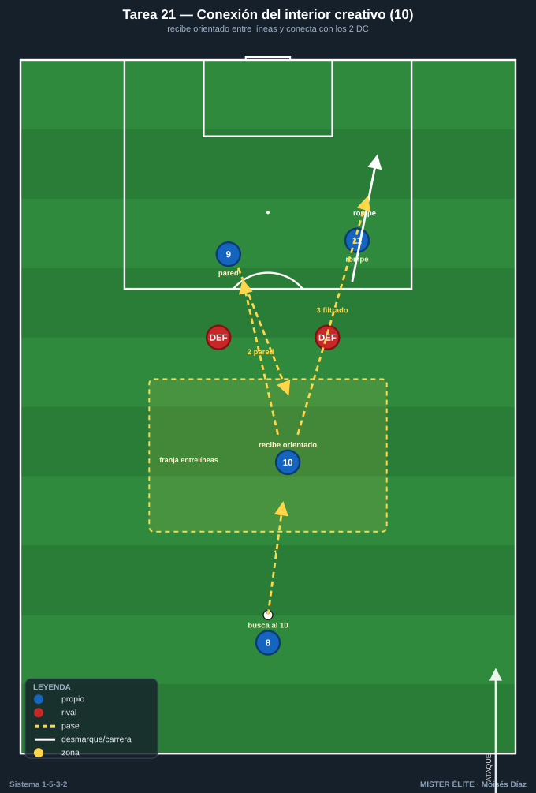
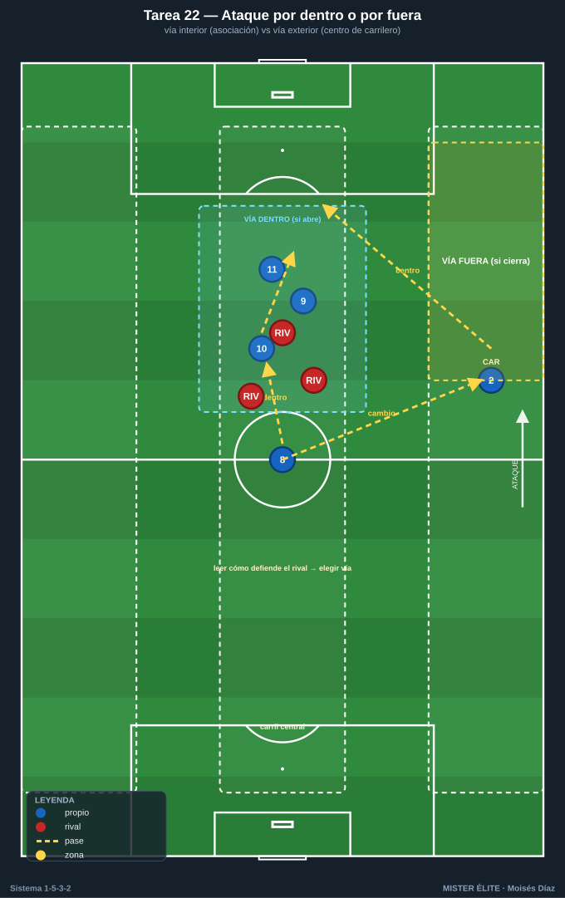

# Bloque 5 · Juego de los 2 delanteros + llegada de interiores

> Tareas T19–T22. La pareja de delanteros funciona por complementariedad (uno baja a asociar, otro ataca la profundidad; el 9 referencia, el 11 móvil) y se nutre del medio de 3, sobre todo del interior creativo (10) entre líneas y de la llegada del box-to-box (7). Como no hay extremos, la conexión delanteros-interiores y la llegada de segunda línea son la principal fuente de gol por dentro.

---

## TAREA 19 — La pareja de delanteros: uno baja, otro rompe + apoyo del interior (situacional)

- **Objetivo:** automatizar la complementariedad de los 2 DC (uno baja a recibir/asociar entre líneas, el otro ataca el espacio a la espalda) conectada con el interior creativo (10) que aparece como tercer hombre.
- **Organización:**
  - **Jugadores:** 2 DC + interior (10) + pivote (8) que sirve, vs 3 centrales + POR (replica la línea de 3 rival).
  - **Espacio:** medio campo, anchura central (50×45 m).
  - **Material:** portería con portero, conos marcando la línea de los centrales.

- **Desarrollo:** el pivote sirve. Un DC baja a recibir de espaldas/apoyo; al hacerlo, el otro DC ataca diagonal el espacio a la espalda; el interior (10) aparece entre líneas como apoyo o para recibir la descarga y filtrar al que rompe. Finalización.
- **Provocaciones:**
  - Gol solo válido si ha habido el patrón "uno baja / uno rompe" o "descarga al interior + ruptura" (ningún gol individual cuenta).
  - El que baja debe sincronizar con la ruptura del compañero (si bajan los dos o rompen los dos = secuencia nula).
  - +1 si el gol nace de un pase filtrado entre dos de los tres centrales rivales.
- **Variantes:** sin oposición (patrón) → 3v3+POR → añadir el interior 7 que llega de segunda línea (2 DC + 2 interiores).
- **Coaching:** miradas y comunicación entre la pareja; alternar roles (el 9 referencia más, el 11 rompe más, intercambiables); timing de la ruptura; el 10 como tercer hombre que rompe la línea de 3 con el pase filtrado.
- **Duración / categoría:** 4 series de 4 min (16–18 min). **A / S** (patrón válido para F).

---

## TAREA 20 — Llegada del interior box-to-box al área (situacional de finalización)

- **Objetivo:** entrenar la llegada al área del interior (7, box-to-box) desde segunda línea, aprovechando que los 2 delanteros fijan a los centrales y abren el pasillo para la incorporación del medio.
- **Organización:**
  - **Jugadores:** 2 DC (fijan/descargan) + interior 7 (que llega) + interior 10 (que asocia) + carrilero (que centra o juega por dentro), vs 3 DFC + 1 MC rival + POR.
  - **Espacio:** 50×50 m frente a portería.
  - **Material:** portería, balones, conos marcando la zona de llegada (frontal y media luna).

- **Desarrollo:** el balón circula por el medio o llega de un carrilero. Los 2 DC fijan a los centrales y dejan/descargan; el interior 7 llega lanzado a la frontal o al área a rematar la descarga, el centro raso atrás o el rechace. El interior 10 da el último pase.
- **Provocaciones:**
  - Gol del interior llegando **desde fuera del área** = doble.
  - El interior 7 debe llegar **desde atrás en carrera** (no estar ya dentro esperando): remate estático no cuenta.
  - Los 2 DC deben fijar a los centrales antes del último pase: si no fijan, el interior llega marcado.
- **Variantes:** sin defensa (timing) → defensa pasiva → defensa activa + portero → centro atrás del carrilero a la frontal para el interior.
- **Coaching:** timing de la llegada (salir cuando el balón está a punto de descargarse); los delanteros fijan y abren el pasillo; el centro atrás a la media luna es oro para el interior; remate de primeras del que llega.
- **Duración / categoría:** 4 series de 4 min (16–18 min). **A / S**.

---

## TAREA 21 — Conexión interior creativo (10) entre líneas → delanteros (rondo de finalización)

- **Objetivo:** entrenar la recepción orientada del interior creativo (10) entre la línea de medios y la defensa rival, y su conexión rápida (pared, descarga o filtrado) con los 2 delanteros.
- **Organización:**
  - **Jugadores:** grupos de 4 (pivote 8 + interior 10 que recibe entre líneas + 2 DC) + 1–2 defensas pasivos/semiactivos que vigilan el entrelíneas.
  - **Espacio:** 30×30 m frente a portería.
  - **Material:** portería, conos marcando la franja entrelíneas.

- **Desarrollo:** el pivote (8) busca al interior 10 entre líneas. El 10 recibe de perfil, gira o paredea, y conecta con un DC que baja a la pared o con el otro DC que rompe. Finalización. Circuito continuo.
- **Provocaciones:**
  - El 10 debe recibir **orientado** (medio giro de cara): recibir de espaldas plano y tener que jugar atrás = repetición.
  - La conexión 10 → delantero debe ser a 1–2 toques.
  - Si el defensa pasivo cierra el entrelíneas, el 10 debe ofrecerse fuera de la sombra reposicionándose.
- **Variantes:** defensa pasiva → semiactiva sobre el 10 → añadir que el pivote también pueda filtrar directo (decisión: ¿al 10 o directo al delantero?).
- **Coaching:** perfil y primer toque orientado del 10; recibir entre líneas, no detrás del defensa; ritmo alto de asociación; el delantero que ofrece la pared y el que rompe a la vez.
- **Duración / categoría:** 3 bloques de 4 min (14 min). **F / A / S**.

---

## TAREA 22 — Ataque organizado 8v8: por dentro con interiores o por fuera con carrileros (juego de posición)

- **Objetivo:** integrar las dos vías de gol del 1-5-3-2 sin extremos —por dentro (delanteros + interiores) o por fuera (carrileros + centro)— eligiendo según cómo defienda el rival.
- **Organización:**
  - **Jugadores:** 8v8 + porteros (3 DFC + 8 + 7/10 + 2 DC + 2 CAR según disponibilidad), o reducido a 6v6 + comodines.
  - **Espacio:** 60×50 m con carriles de banda y carril central marcados.
  - **Material:** 2 porterías, conos de carriles.

- **Desarrollo:** juego con finalización a dos porterías. El equipo debe alternar el ataque por dentro (asociación delanteros-interiores) y por fuera (carrileros que centran). Las reglas premian la vía libre según cómo se cierre la defensa rival.
- **Provocaciones:**
  - Si el rival defiende muy junto por dentro, el gol por fuera (centro de carrilero) vale doble; si defiende abierto, el gol por dentro (asociación) vale doble.
  - Mínimo 1 cambio de orientación antes de finalizar por banda.
  - Prohibido finalizar por la misma vía dos posesiones seguidas.
- **Variantes:** vías por turnos fijos (aprendizaje) → libre con premio a la vía correcta → comodín defensivo que cambia la igualdad.
- **Coaching:** leer cómo defiende el rival; dentro y fuera son complementarios; los interiores deciden la vía con su movimiento; los carrileros siempre dan la opción de fuera; variar para ser imprevisible sin extremos.
- **Duración / categoría:** 4 series de 4 min (18 min). **A / S**.
