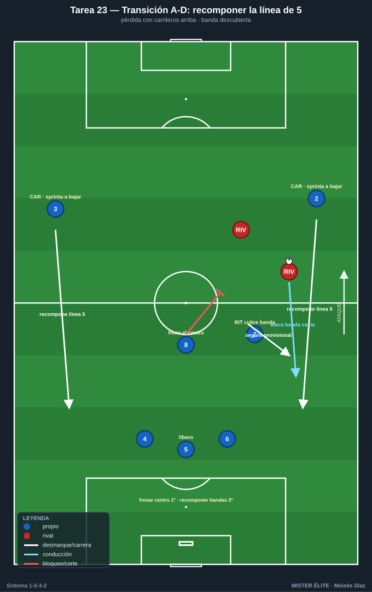
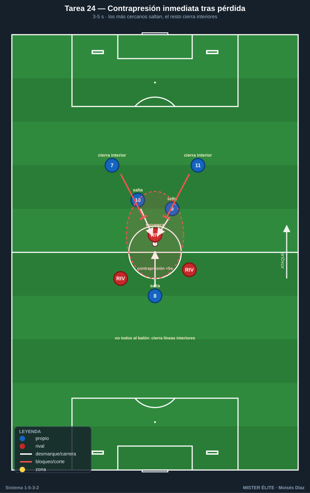
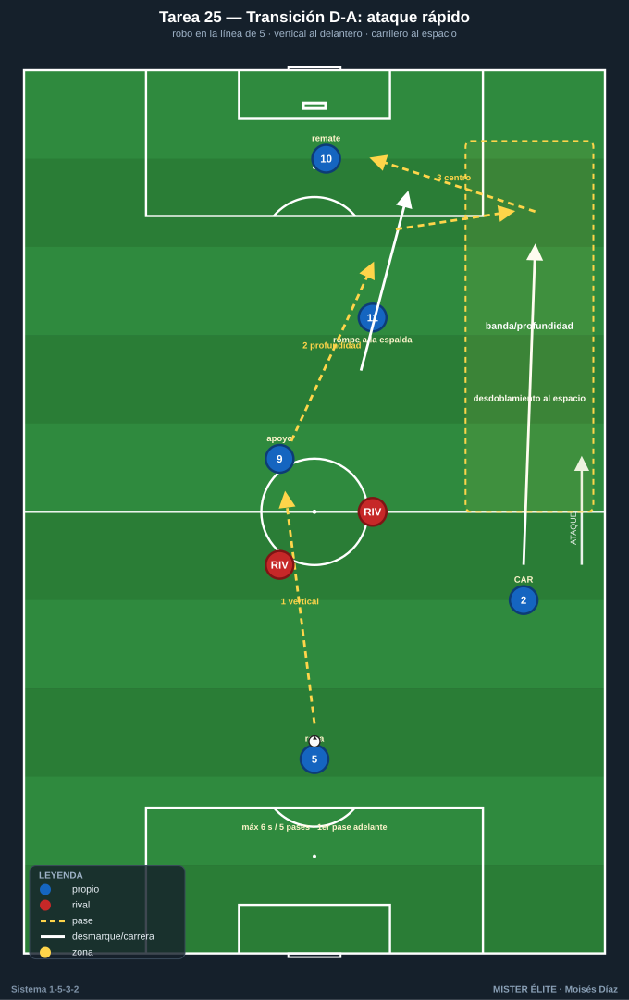
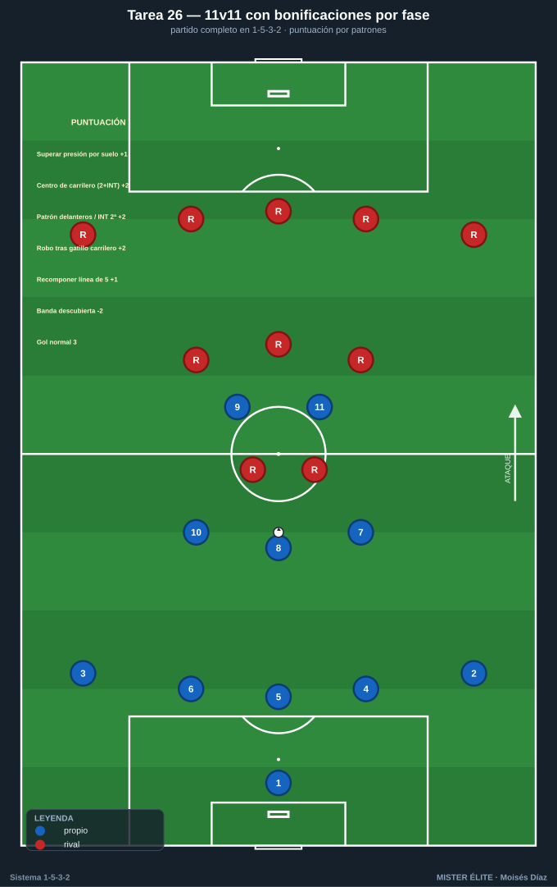

# Bloque 6 · Transiciones (A-D y D-A) y partido condicionado

> Tareas T23–T26. El 1-5-3-2 es sólido en transición defensiva si los carrileros bajan rápido a recomponer la línea de 5 y el medio de 3 frena el balón central; peligroso en transición ofensiva por la profundidad de sus dos delanteros y el desdoblamiento de carrileros. El riesgo específico: perder con los carrileros arriba. Estas tareas entrenan el primer comportamiento tras la pérdida y el robo, y cierran con el partido condicionado global.

---

## TAREA 23 — Transición A-D: recomponer la línea de 5 con los carrileros descubiertos (situacional)

- **Objetivo:** entrenar el peor escenario del 1-5-3-2 —perder el balón con los carrileros arriba— resolviéndolo con repliegue veloz de los carrileros a la línea de 5, mientras el medio de 3 frena el balón central y temporiza.
- **Organización:**
  - **Jugadores:** estructura propia atacando (3 DFC + 8 + 7/10 + 2 CAR altos + 2 DC) que pierde el balón; el rival contraataca aprovechando las bandas descubiertas.
  - **Espacio:** 3/4 de campo o completo.
  - **Material:** 2 porterías, balones para reinicios.

- **Desarrollo:** el equipo ataca con los carrileros arriba (1-3-5-2). Se provoca la pérdida (señal o robo). El rival ataca rápido buscando las bandas vacías. El equipo debe: el medio de 3 frena el balón central, los centrales se reparten, y los **carrileros sprintan a recomponer la línea de 5**. El interior del lado tapa provisionalmente mientras el carrilero llega.
- **Provocaciones:**
  - Si el rival finaliza por una banda descubierta antes de que el carrilero la recupere = gol doble.
  - El primer jugador del medio de 3 en replegar debe frenar el balón por el **centro** (no perseguir por fuera).
  - El interior del lado del balón cubre la banda hasta que el carrilero recompone: si no cubre, punto rival.
- **Variantes:** rival con menos atacantes → contraataque con superioridad rival (peor caso) → encadenar con contrapresión inmediata (T24).
- **Coaching:** frenar el centro primero, recomponer bandas después; el carrilero asume que debe sprintar; el interior es el seguro provisional; comunicación en el repliegue; perder con los carrileros arriba exige reacción inmediata.
- **Duración / categoría:** 12–16 transiciones en bloques (16–18 min). **A / S**.

---

## TAREA 24 — Contrapresión inmediata tras pérdida (3–5 s) aplicada al sistema (juego condicionado)

- **Objetivo:** que, al perder el balón en zonas altas/medias, los más cercanos (delanteros e interiores) salten de inmediato a contrapresionar para recuperar arriba o dar tiempo a que los carrileros recompongan la línea de 5.
- **Organización:**
  - **Jugadores:** 7v7 / 8v8.
  - **Espacio:** 45×40 m con 4 mini-porterías (2 por equipo).
  - **Material:** mini-porterías, balones para reinicios continuos.

- **Desarrollo:** posesión con objetivo de marcar en mini-porterías. Al perder, el equipo tiene 5 s para recuperar mediante contrapresión de los más cercanos; si no, se repliega ordenadamente (los carrileros bajarían a la línea de 5 en contexto 11).
- **Provocaciones:**
  - Recuperar en <5 s tras perder = punto extra.
  - Los 2–3 más cercanos DEBEN saltar; el resto cierra líneas de pase interiores (no todos al balón).
  - Si el rival supera la contrapresión, los lejanos replegan de inmediato a su línea (carrileros a la de 5).
- **Variantes:** 3 s (más exigente) → ampliar espacio → premiar también el repliegue ordenado tras contrapresión fallida.
- **Coaching:** reacción instantánea, no lamento; salta el más cercano; los demás cierran interiores; "el primer defensor es quien ha perdido el balón"; la contrapresión compra tiempo para recomponer.
- **Duración / categoría:** 4 series de 4 min (18 min). **A / S**.

---

## TAREA 25 — Transición D-A: ataque rápido por la profundidad de los delanteros y el carrilero (situacional)

- **Objetivo:** tras recuperar (a menudo en la línea de 5), atacar rápido buscando la profundidad de los 2 delanteros y el desdoblamiento del carrilero al espacio, aprovechando el desorden rival.
- **Organización:**
  - **Jugadores:** bloque que roba (línea de 5 + medio de 3 + 2 DC) vs estructura rival; o versión reducida 6v6.
  - **Espacio:** campo completo o 3/4, con zonas de banda y de profundidad señaladas.
  - **Material:** 2 porterías.

- **Desarrollo:** se provoca un robo (servidor o partido). Tras recuperar, el equipo tiene un límite de pases/segundos para finalizar, buscando el primer pase vertical a un delantero que rompe o el lanzamiento del carrilero al espacio.
- **Provocaciones:**
  - Tras robar, máximo 6 s / 5 pases para finalizar.
  - El primer pase tras el robo debe ir hacia adelante o al espacio (prohibido pase atrás en la primera acción).
  - Gol nacido del desdoblamiento de un carrilero al espacio en transición = doble.
- **Variantes:** más tiempo/pases (transición controlada) → menos (transición pura) → superioridad tras robo (3v2 en campo abierto con un delantero y un carrilero lanzados).
- **Coaching:** primer pase de calidad y hacia adelante; los delanteros atacan la profundidad de inmediato; el carrilero lanza su carrera al espacio; decidir entre ataque rápido y consolidación si no hay ventaja.
- **Duración / categoría:** 12–16 transiciones (16–18 min). **A / S**.

---

## TAREA 26 — 11v11 con bonificaciones por fase: el 1-5-3-2 aplicado (partido condicionado global)

- **Objetivo:** integrar todas las conductas del 1-5-3-2 (salida con 3 centrales, línea de 5 y paso de 3 a 5, press con gatillo de carrilero, doble función de carrileros, juego de delanteros e interiores, transiciones) en partido completo, premiando los comportamientos clave del sistema.
- **Organización:**
  - **Jugadores:** 11v11 (o el máximo disponible, ambos en 1-5-3-2 o el rival como sparring del próximo adversario).
  - **Espacio:** campo completo.
  - **Material:** 2 porterías, sistema de puntuación visible (pizarra).

- **Desarrollo:** partido real con un sistema de puntos que recompensa los patrones propios del sistema, no solo el gol. El entrenador puede activar 2–3 bonificaciones por sesión para mantener el foco.
- **Provocaciones (puntuación):**
  - Superar la primera línea por suelo aprovechando la superioridad de los 3 centrales: **+1**.
  - Gol tras centro de un carrilero con 2 atacantes + interior en el área: **+2** sobre el valor del gol.
  - Gol con el patrón "uno baja / uno rompe" o con llegada del interior desde segunda línea: **+2**.
  - Robo tras el gatillo del carrilero saltando a la banda con cobertura del interior: **+2**.
  - Recomponer la línea de 5 antes de que el rival finalice tras una pérdida con carrileros arriba: **+1**.
  - Conceder gol por banda descubierta (carrilero arriba sin cobertura) o con la línea de 5 rota: **-2** (auto-penalización).
  - Gol normal: **3**.
- **Variantes:** activar solo 2–3 bonificaciones por sesión (foco) → todas a la vez → adaptar las bonificaciones al rival de la semana.
- **Coaching:** mantener las distancias y las transformaciones (3↔5) bajo fatiga; los carrileros sostienen su doble función todo el partido; aplicar lo entrenado en contexto real; feedback breve en pausas, no detener constantemente.
- **Duración / categoría:** 2–3 partes de 10–12 min (30–36 min). **A / S**.
