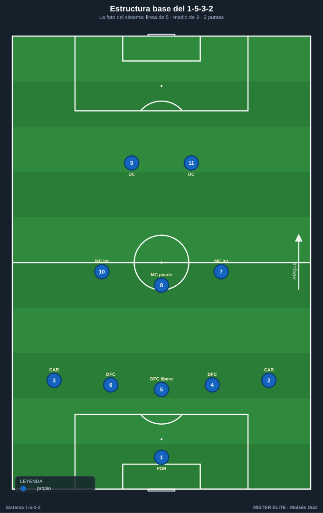
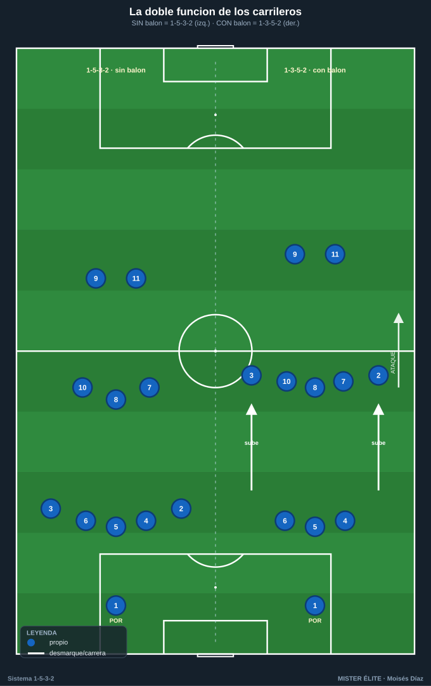
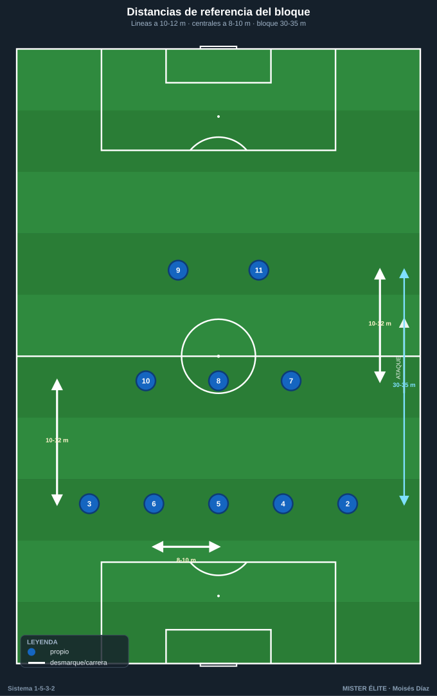
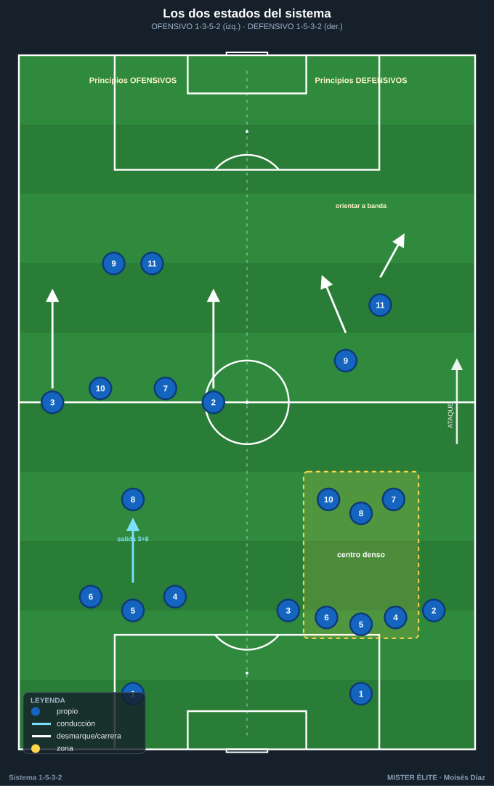
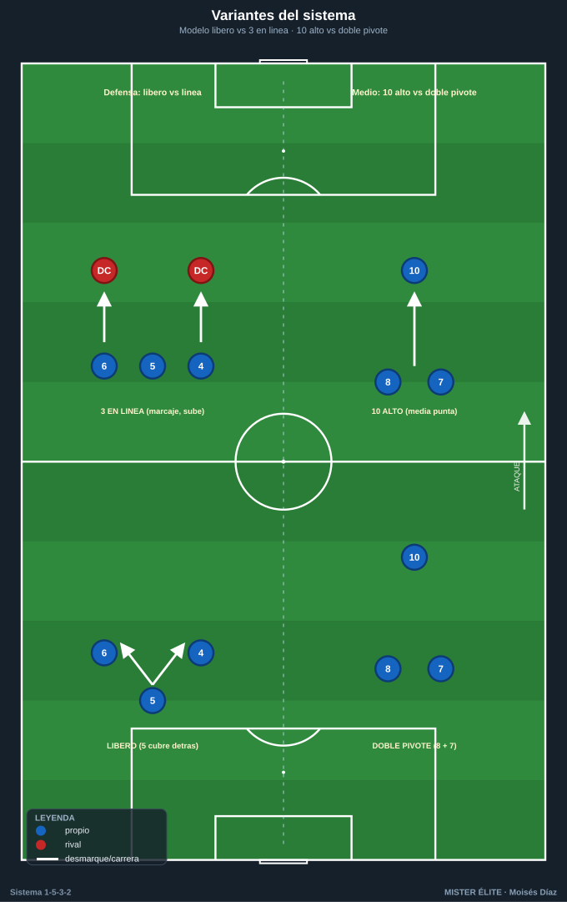

# Módulo 01 · Fundamentos y estructura del 1-5-3-2

> Con balón el equipo es un **1-3-5-2**; sin balón, un **1-5-3-2**. Esa mutación —y quién la ejecuta— es lo primero que hay que enseñar.

El 1-5-3-2 es un sistema con **línea defensiva de 5** (3 centrales + 2 carrileros), **medio de 3** (1 pivote + 2 interiores) y **2 puntas**. Su rasgo identitario no es el número de defensas, sino la **doble función de los carrileros**: el sistema *respira* entre dos formas según quién tiene el balón.

---

## 1. Las cuatro unidades

| Unidad | Jugadores (dorsal) | Función base |
|---|---|---|
| **Línea de 3 centrales (DFC)** | 4 (dcho.), 5 (central/líbero), 6 (izdo.) | Construcción + coberturas escalonadas. El 5 organiza la línea. |
| **2 carrileros (CAR)** | 2 (dcho.), 3 (izdo.) | Anchura en ataque / 4.º y 5.º defensa sin balón. La pieza clave. |
| **Medio de 3 (MC)** | 8 (pivote), 7 y 10 (interiores) | Control del centro, superioridad, llegada. |
| **2 puntas (DC)** | 9 (referencia), 11 (ruptura/móvil) | Presión, fijación de centrales y finalización. |

---

## 2. La clave del sistema: la DOBLE FUNCIÓN de los carrileros

Es el concepto que hay que enseñar **primero**, porque de él depende todo lo demás. Una sola transición —la subida o bajada de los carrileros 2 y 3— transforma un sistema ofensivo de tres atrás en un bloque defensivo de cinco.

- **CON balón → 1-3-5-2:** los carrileros (2 y 3) **suben** y dan la amplitud máxima. Atrás quedan **3 centrales**; en la zona media se forma una **línea de 5** (los 2 CAR altos + los 3 MC) que ocupa los cinco carriles. El equipo ataca como si tuviera tres defensas y cinco hombres por delante.
- **SIN balón → 1-5-3-2:** los carrileros **bajan** a la línea, que se convierte en **5 defensas**. Quedan 3 medios por delante y las 2 puntas arriba. Bloque cerrado, sin huecos en banda.

> Por eso **5-3-2 y 3-5-2 son la misma base**: cambia el momento del partido que se nombra. No son dos sistemas, son dos fotos del mismo.

---

## 3. Distancias y alturas de referencia (aplicado)

La regla de oro: **mínima distancia entre líneas y entre jugadores** para que el rival no pueda jugar entre líneas.

- **Bloque (del último defensa al delantero más alto):** ~30–35 m en bloque medio. Por encima de ~40 m aparecen los espacios entre líneas que matan al sistema.
- **Distancia entre líneas:** ~10–12 m de referencia (rango 8–15 m según altura: 8–12 en bloque bajo, 10–12 en alto, hasta 15 en medio cuando se busca presionar).
- **Anchura de la línea de 3 centrales:** ~8–10 m entre centrales adyacentes → la línea abarca ~18–22 m. Estrecha cuando el balón está lejos; se desliza al lado del balón.
- **Anchura total con balón:** la dan los carrileros pegados a la cal (~64–68 m).
- **Altura del bloque:** flexible. Alto (presión desde medio campo, tipo Gasperini) o medio-bajo replegado (tipo Conte/Simeone defensivo). El sistema admite ambos.

---

## 4. Breve historia y vigencia

- **Raíz italiana / catenaccio.** La línea con un central libre (líbero) hunde sus raíces en el *catenaccio*: dos centrales marcan, uno queda libre como cobertura. El catenaccio moderno añade contraataque eficaz y posesión sin perder el principio del hombre libre.
- **Antonio Conte** es el gran revitalizador contemporáneo. Su Juventus (2011–14) se construyó sobre un 3-5-2 compacto (muro Barzagli–Bonucci–Chiellini), defendiendo como 5-3-2 y atacando con versatilidad: tres Scudetti seguidos. Repitió título con el Inter (2020-21), ganó la Premier con el Chelsea (2016-17, con un giro al 3-4-3) y llevó a Italia a cuartos de la Euro 2016. Demostró que un sistema reputado "conservador" puede dominar y ser ofensivo.
- **Gian Piero Gasperini (Atalanta).** Versión vertical y agresiva: tres centrales con **marcaje al hombre** por todo el campo, presión altísima y transiciones eléctricas. Para él, los tres centrales responden a un criterio **ofensivo** (superioridad desde el inicio), no solo defensivo.
- **Diego Simeone (Atlético).** Su sello es el 4-4-2, pero encarna los **principios defensivos** trasladables al 5-3-2: bloque compacto, líneas juntas, repliegue ordenado, zona. Muchos equipos pasan a línea de 5 con su filosofía para cerrar partidos.
- **Selecciones.** El 3-5-2 / 5-3-2 reaparece con fuerza en torneos cortos (control del centro, solidez, transiciones): una defensa de cinco que es, en realidad, un arma ofensiva encubierta vía carrileros y doble punta.

---

## 5. Principios de juego diferenciados

### Principios OFENSIVOS (estado 1-3-5-2)

1. **Salida con 3 + pivote.** Los 3 DFC abren y el pivote (8) se ofrece: superioridad ante 1–2 puntas. El 5 conduce y rompe líneas.
2. **Amplitud por los carrileros.** 2 y 3 fijan la última línea rival y estiran el campo.
3. **Superioridad e interiores que llegan.** 7 (de llegada) y 10 (asociativo entre líneas) atacan el área.
4. **Dupla de puntas complementaria.** El 9 fija/aguanta de espaldas; el 11 ataca la espalda.
5. **Carriles interiores ocupados.** Con los carrileros en banda, interiores y una punta caen al medio espacio: ataque por dentro, centro desde fuera.

### Principios DEFENSIVOS (estado 1-5-3-2)

1. **Repliegue de carrileros = línea de 5.** Al perder, 2 y 3 bajan; banda cerrada, sin espacio a la espalda.
2. **El hombre libre / coberturas.** Dos centrales marcan, el tercero cubre (modelo líbero); o los tres marcan al hombre (modelo Gasperini).
3. **Compacidad y bloque junto.** Líneas a 10–12 m; defender el centro por densidad.
4. **Orientar al exterior y emboscar.** Se concede el pase a banda y se embosca al receptor (carrilero + interior + central del lado).
5. **Salto de presión coordinado.** Las 2 puntas orientan; el medio bascula; el carrilero del lado lejano se cierra como casi-central.

---

## 6. Variantes

- **5-3-2 puro vs 3-5-2.** Misma estructura, distinto acento: **5-3-2** cuando se arranca/defiende con carrileros bajos (bloque, contragolpe); **3-5-2** cuando se arranca con carrileros altos (iniciativa). En partido real, un equipo bien entrenado **es las dos cosas** según la fase.
- **Con líbero vs 3 centrales en línea.** *Líbero* (Conte): dos marcan, el 5 cubre escalonado. *Tres en línea / marcaje al hombre* (Gasperini): los tres defienden al hombre y la línea sube; más agresivo, exige centrales rápidos.
- **Media punta (10) más alto vs doble pivote.** Con el 10 adelantado → tiende a 3-4-1-2 (más creación). Con doble pivote → 3-4-2-1 / 5-2-2-1 defensivo (más control). El 8 es ancla fija; 7/10 deciden el matiz.
- **Acento por carrilero.** Un carrilero muy ofensivo (casi extremo) y el otro más contenido (casi 4.º central): asimetría útil contra rivales que cargan una banda.

---

## 7. Ventajas, desventajas y enfrentamientos

### Ventajas

- **Superioridad central** permanente (5 hombres en el eje: 3 DFC + pivote + un interior).
- **Solidez sin balón:** la línea de 5 cierra el ancho y la espalda.
- **Transición rápida** con 2 puntas siempre arriba.
- **Fija a los laterales rivales:** los carrileros los obligan a quedarse.

### Desventajas

- **Dependencia del perfil de los carrileros:** si un CAR no llega, se rompe el sistema.
- **Amplitud propia limitada:** con un solo hombre por banda, el rival puede aislar y doblar al carrilero.
- **Concesión del exterior del medio al replegar.**
- **Vulnerable a cambios de orientación rápidos** si la línea de 5 no desliza a tiempo.

### Enfrentamientos (resumen)

- **vs 1-4-3-3:** el 4-3-3 sufre para hacer llegar el balón a sus puntas y sus laterales quedan neutralizados; riesgo propio: los extremos atacan 1c1 al carrilero (defender con carrilero + central del lado + interior que dobla).
- **vs 1-4-4-2:** escenario favorable: 3 centrales generan superioridad indefendible ante 2 puntas y el medio de 3 gana al doble pivote.
- **vs 1-4-2-3-1:** vigilar al 10 rival (pivote 8 o central que sale) y explotar las bandas (los carrileros atacan la espalda de los laterales).

> Patrón común para defender los carriles: el sistema **invita al rival a la banda** y ahí **embosca**. La superioridad de 3 centrales permite que un central salte al carril sin desproteger el centro.

---

## 8. Perfiles idóneos por línea

| Línea | Dorsal | Perfil ideal |
|---|---|---|
| **Carrileros (CAR)** | 2, 3 | Motor inagotable (ida y vuelta toda la banda), 1c1 ofensivo y defensivo, buen centro y lectura para entrar de 5.º defensa. La posición más exigente físicamente. |
| **Central-líbero (DFC)** | 5 | Saca el balón jugado, lee coberturas, manda la línea, conduce y rompe la primera presión. El cerebro defensivo. |
| **Centrales laterales (DFC)** | 4, 6 | Rápidos y agresivos para saltar al carril y seguir al hombre; valientes en defensa adelantada. |
| **Pivote (MC)** | 8 | Ancla posicional: equilibrio, primer pase, intercepción, tapar el carril central. No abandona su sitio. |
| **Interiores (MC)** | 7, 10 | Llegada y recorrido. El 7 de carrera/llegada; el 10 más creativo, recibe entre líneas. Ambos doblan al carrilero. |
| **Dupla de puntas (DC)** | 9, 11 | Complementaria: el 9 referencia que fija y aguanta; el 11 móvil/de ruptura que ataca la espalda. |
| **Portero (POR)** | 1 | Portero-líbero: juego de pies para iniciar con 3, salidas a la espalda, manda la línea. |

---

## Ideas clave

- El 1-5-3-2 **defiende estrecho y ataca ancho**; el interruptor son los carrileros.
- **5-3-2 y 3-5-2 son la misma base**: dos fotos del mismo sistema según la fase.
- La **superioridad de 3 centrales** (3v2 ante dos puntas) es la ventaja estructural permanente.
- Los **carrileros** son la pieza que define el sistema y su mayor exigencia física.
- Las **distancias cortas entre líneas** (10–12 m) son la condición para que el rival no juegue entre líneas.

## Errores comunes

- Enseñar la formación como "cinco defensas fijos" en lugar de un sistema que **muta**.
- Olvidar entrenar la **subida/bajada coordinada** de los dos carrileros (el latido del sistema).
- Estirar el bloque por encima de ~40 m y regalar el espacio entre líneas.
- Pedir a los carrileros amplitud sin **cobertura del interior** detrás (descubre la banda).
- Colocar a los 3 centrales en línea plana y pegados: el 5 debe ir un paso por delante para conducir y cubrir.
