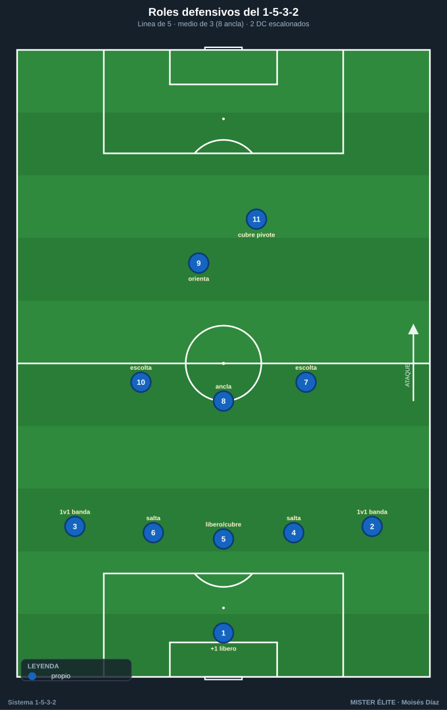
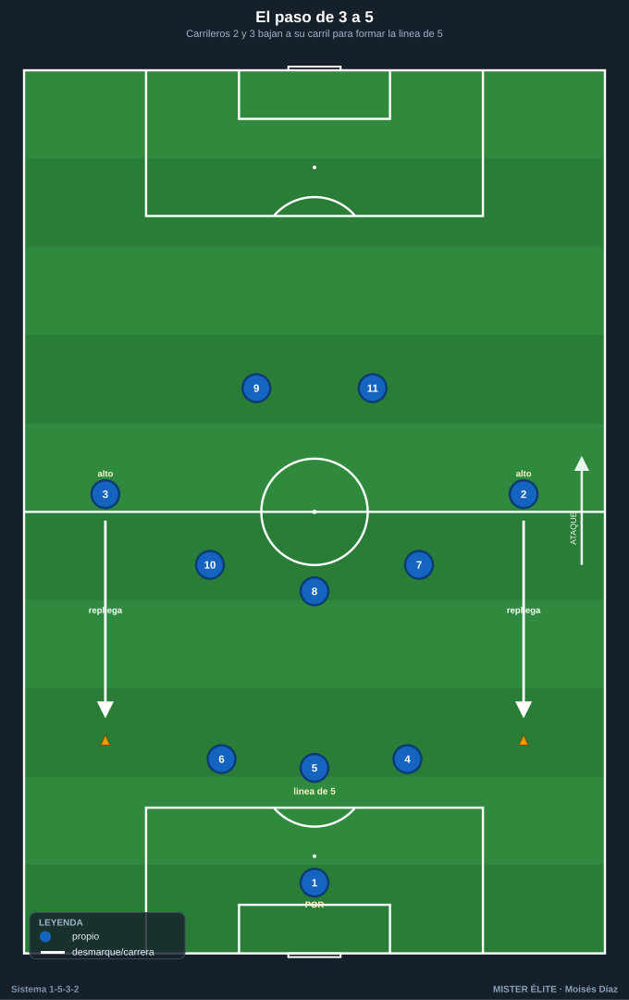
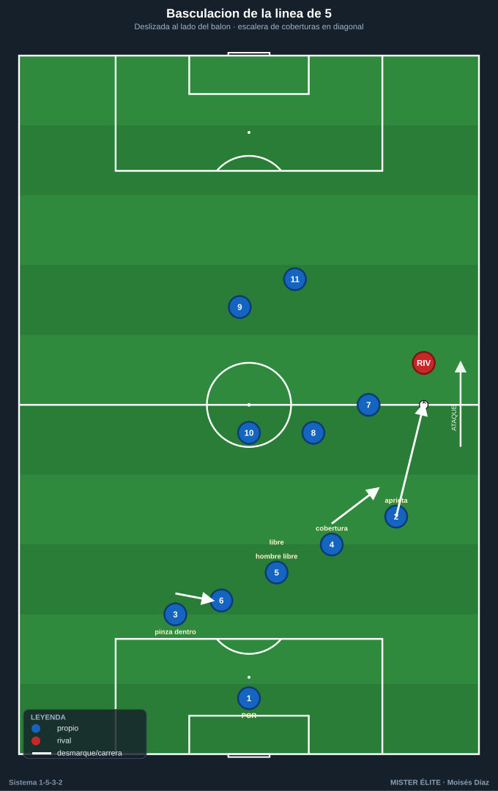

# Módulo 02 · Fase defensiva

> Sin balón el equipo es un **1-5-3-2**: los carrileros bajan a la línea de 5, quedan 3 medios y 2 puntas. El centro es la fortaleza; la amplitud, el riesgo a gestionar.

---

## 1. Roles por demarcación (sin balón)

- **Portero-líbero (1):** el +1 detrás de la línea de 3. Manda la línea (sube/baja, achique, fuera de juego con la voz), barre los pases a la espalda y defiende los centros.
- **Central-líbero (5):** no salta; es la referencia. Cubre las salidas de 4 y 6, barre la espalda, dirige el fuera de juego.
- **Centrales laterales (4 y 6) — "los que saltan":** marca de proximidad al delantero que cae a su lado; saltan a presionar al que recibe entre líneas. Cuando uno salta, el 5 y el otro central bascula y cubre.
- **Carrileros (2 y 3):** su bajada forma la línea de 5. Responsables del 1v1 con el hombre de banda rival; basculan hacia dentro cuando el balón está en la banda contraria (cuarto/quinto defensa interior).
- **Pivote (8):** ancla por delante de los 3 centrales. Tapa el carril central y el espacio entre líneas, achica al mediapunta rival, primer hombre del contrapressing.
- **Interiores (7 y 10):** doble función. Presionan arriba con los DC **y** repliegan a cubrir el carril de su lado, doblando al carrilero cuando salta.
- **Dos delanteros (9 y 11):** sociedad escalonada. Uno presiona orientando, el otro cubre el pivote rival o el pase al central libre. **Nunca en paralelo.**

---

## 2. El paso de 3 a 5

El gesto base del sistema sin balón.

- **Disparador:** el equipo pierde el balón o el rival progresa estable → los **dos carrileros bajan simultáneamente** al lado de los centrales.
- **Resultado:** 5 defensas (CAR-DFC-DFC-DFC-CAR) + 3 medios + 2 DC.
- **Detalle clave:** los carrileros bajan **antes** de que el balón llegue a la banda. Si llegan tarde, el hombre de banda recibe ya encarado (el 1v1 desventajoso).
- Cada carrilero baja **a su carril**, no en diagonal al centro: cierra su banda, no abandona el espacio exterior.

---

## 3. Bloques: alto, medio y bajo

| Bloque | Línea def. | Zona de presión | Entre líneas | Ancho |
|---|---|---|---|---|
| **Alto** | 45–55 m | inicio rival / 3/4 de campo | 10–12 m | comprimido (~30–35 m) |
| **Medio** | 30–40 m | eje central, frontal del bloque | 12–15 m | ~35–40 m |
| **Bajo** | 18–25 m | borde del área, defensa de carriles | 8–12 m (muy junto) | cerrado (~40 m) |

- **Compacidad:** las tres líneas no deben superar **30–35 m de profundidad** en bloque medio. Si se estira por encima de ~15 m entre líneas, aparece el espacio que el 10 rival ataca → recortar.

---

## 4. Pressing con gatillo del carrilero

### Presión orientada de los 2 DC

- El DC más cercano presiona al central poseedor **cerrando el carril interior** (presión "de curva", por fuera del cuerpo), empujándolo a la banda.
- El segundo DC **tapa al pivote rival** (sombra) para que la salida no pase por el centro.
- Señal de salto: pase lento/atrás, control orientado malo, o balón a la banda.

### El gatillo: salto del carrilero a la banda

Cuando el balón sale al **lateral/hombre de banda rival**, el **carrilero de ese lado salta** a presionarlo arriba. Es el momento más delicado del sistema (se descubre un carril) y exige **cobertura en cadena**:

- El **interior de ese lado (7 o 10)** baja a **cubrir la espalda del carrilero**.
- El **central lateral (4 o 6)** se desliza a vigilar al delantero que cae al hueco; salta a marcarlo si se ofrece en banda.
- El **líbero (5)** y el central contrario **basculan** y cierran el centro; el carrilero del lado débil **pinza hacia dentro y entra a la línea**, que queda transitoriamente en **4** (3 DFC + ese CAR) mientras el carrilero del lado fuerte presiona arriba.
- El **pivote (8)** cubre el carril central y el espacio que dejó el interior.
- Si el rival escapa del salto → **repliegue inmediato** del carrilero y reconstrucción del 5.

### Contrapressing (tras pérdida)

- **Reacción 3–5 s:** los más cercanos (2 DC + interior + pivote) saltan al balón para recuperar o forzar el pase erróneo hacia la cobertura.
- El **pivote (8)** es el ancla: tapa el pase interior de salida del rival.
- Si no se recupera en el primer impulso → **caída ordenada** a bloque medio (no perseguir individualmente).

---

## 5. Basculación, coberturas y permutas

- **Basculación:** el bloque se desplaza **hacia el lado del balón**, superpoblando el lado fuerte. La línea de 5 bascula como un acordeón: el carrilero del lado fuerte aprieta, el del lado débil **se mete dentro** (casi central). El medio de 3 bascula al unísono 8–12 m por delante.
- **Central salta → líbero cubre:** si 4 o 6 salta, el 5 asegura la espalda y el central contrario estrecha.
- **Carrilero salta arriba → interior + central cubren** (cadena del §4).
- **Permuta CAR–DFC:** si el carrilero es desbordado, el central lateral sale a la banda a tapar y el carrilero cae a ocupar el hueco del central.
- **Regla de oro:** **un hombre cubre por cada hombre que salta**; nunca dos saltos simultáneos del mismo lado sin cobertura por detrás.

---

## 6. El problema de la amplitud y sus soluciones

### El punto débil

Cuando el rival juega ancho con dos extremos abiertos y **cambia rápido de banda**, el bloque (que ha basculado) llega tarde y el **carrilero queda 1v1 o 2v1** en el lado débil. El espacio a la espalda del carrilero que ha saltado es la zona de mayor peligro.

### Soluciones aplicables

1. **Basculación rápida y anticipada:** desplazar al primer pase, no al recibir. El carrilero del lado débil entra a la línea antes del cambio.
2. **Ayuda del interior (doble esfuerzo):** el 7/10 del lado débil repliega a doblar al carrilero → 2v1 propio en banda.
3. **Salto del central lateral (4/6) a la banda:** ante el 2v1, el central tapa al desbordador mientras el 5 y el central contrario estrechan (mantienen 2 centrales en el área).
4. **Repliegue del DC del lado del cambio:** el delantero cercano persigue el balón en su trayectoria, ralentizando el cambio.
5. **No bascular en exceso:** dejar al carrilero del lado débil algo más alto/abierto para reducir la distancia del cambio.
6. **Orientar la presión hacia dentro:** cerrar el carril de cambio (sombra al pase diagonal) para que el rival circule por dentro, donde el bloque es fuerte.

---

## 7. Achique, fuera de juego y defensa de carriles

- **Achique:** las 3 líneas suben juntas 5–10 m a la orden del líbero (5) y el portero (1) ante pase atrás / control malo / despeje. Balón cubierto por delante → subir; balón encarado → no subir.
- **Fuera de juego:** la línea (incluidos los carrileros) sube coordinada para dejar al delantero en fuera de juego cuando el poseedor está presionado y de espaldas. Manda el 5, corrige el 1. Riesgo: los carrileros suelen ir un paso por detrás → entrenar el "sube/para" a una sola voz.
- **Defensa de carriles:** carril exterior = responsabilidad del carrilero, con cobertura del interior por detrás y del central lateral por dentro. Defender **de dentro hacia fuera**. Prioridad: no conceder el centro del centro ni la diagonal al segundo palo.
- **Defensa del centro:** el pivote (8) tapa el carril central y al 10 rival; los 3 centrales controlan el área. El centro es la fortaleza: forzar al rival a jugar por fuera.

---

## Ideas clave

- **Los carrileros forman la línea de 5 a tiempo:** bajan antes de que el balón llegue a banda.
- **Un hombre cubre por cada hombre que salta:** sin doble salto sin cobertura.
- El **gatillo del carrilero** exige cobertura simultánea del interior; sin ella, no se salta.
- El **centro es la fortaleza** (pivote + 3 centrales); se obliga al rival a jugar por fuera y se le embosca.
- La **amplitud** es el punto débil: se compensa con basculación anticipada y la ayuda del interior.

## Errores comunes

- Carrileros que bajan **tarde** o en diagonal al centro (dejan la banda abierta).
- Los 2 DC presionando **en paralelo** (un solo pase los supera).
- Saltar al carril sin cobertura del interior → carril descubierto a la espalda.
- Bascular tan cerrado al lado del balón que el cambio de orientación al lado débil llega gratis.
- Estirar el bloque y conceder el espacio entre la línea de 5 y la de 3 para el 10 rival.
